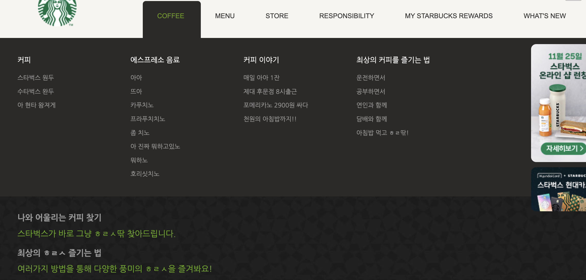
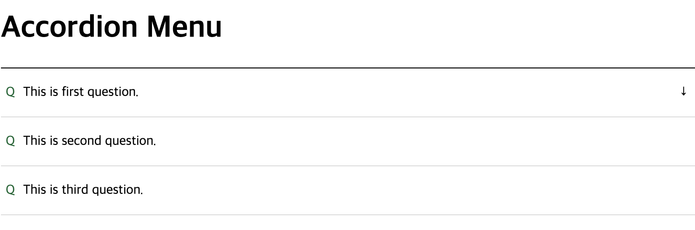

## Dropdown(pulldown) menu

- 어떠한 버튼과 상호작용(hover, click)했을 때 그 하위 메뉴가 나오는 방식의 메뉴를 [dropdown(pulldown) menu](https://namu.wiki/w/%EB%93%9C%EB%A1%AD%EB%8B%A4%EC%9A%B4%20%EB%A9%94%EB%89%B4)라고 한다.

- 보통 dropdown menu는 GNB(Global Navigation Bar)의 하위 메뉴를 보여주고 싶을 때 많이 사용한다.

- 모바일 환경같이 공간이 협소한 경우는 GNB를 햄버거 메뉴로 구현한다.

## Accordian menu

- 특정 정보들을 그룹화(grouping) 구조화(structuring)해 각 그룹을 개별적으로 접근할 수 있는 Section으로 나눈 매뉴 구조

- 화면 공간을 절약하며, 사용자 관점에서 한 번에 많은 정보를 접하지 않게 함으로 써 [이탈률(bounce rate)](https://en.wikipedia.org/wiki/Bounce_rate)증가를 예방할 수 있다.
