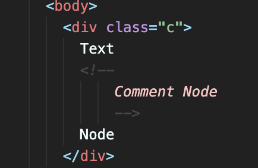

# DOM - Document Object Model

- DOM은 **노드** 객체로 구성된 트리 자료구조다. 이를 **DOM Tree** 라고도 부른다.

  - DOM의 구성요소인 노드(Node)는 웹 문서(document) 요소의 정보를 담고 있으며, 프로토타입 기반 계층 구조로 이루어져 있다.

  - Node 계층 구조는 ECMA Script 표준 사양에 정의된 Standard Built-in Object가 아닌, **Host Object** 이다.

## Host Object Prototype Chain

- Node를 생성하는 생성자 함수로써 Host Object는 프로토타입 기반 상속 구조로 이루어져 있다.

- Node는 크게 Document Node, Element Node, Attribute Node, Text Node 네 종류로 구분할 수 있다.

  - **Document Node:** Object -> EventTarget -> Node -> Document -> HTMLDocument

  - **Element Node:** Object -> EventTarget -> Node -> Element -> HTMLElement -> HTML...Element

  - **Attribute Node:** Object -> EventTarget -> Node -> Attr

  - **Text Node:** Object -> EventTarget -> CharacterData -> Text / Comment

- 모든 Node 객체는 반드시 **Node** 객체를 상속받으며, Node 객체는 Object 객체를 상속받는 EventTarget 객체를 상속받는다.

- 즉 모든 Node 요소는 Node 객체가 구현하는, Node 객체가 상속받는 프로퍼티와 메서드를 사용할 수 있고, 각 노드가 상속받는 객체에 따라 구현하는 프로퍼티와 메서드를 사용할 수 있다. 이를 `DOM API` 라고 한다.

  - DOM API를 통해 노드가 지닌 특정한 값들을 수정함으로써 동적인 브라우저상의 문서 표현이 가능하다.



## Element Node

```js
const divEl = document.querySelector('.c');

// Element Node
// div 태그는 Element Node 계층에서 HTMLDivElement 호스트 객체를 상속받는다.
console.log(
	divEl.constructor, // HTMLDivElement
	Object.getPrototypeOf(divEl) === HTMLDivElement.prototype, // HTMLElement.prototype
	Object.getPrototypeOf(HTMLElement.prototype) === Element.prototype,
	Object.getPrototypeOf(Element.prototype) === Node.prototype,
	Object.getPrototypeOf(Node.prototype) === EventTarget.prototype,
	Object.getPrototypeOf(EventTarget.prototype) === Object.prototype
);
```

## Text Node

- Text Node는 직접적으로 DOM API를 통해 접근할 수 없다. DOM 구조상 Text node는 Element Node의 자식요소로써만 존재할 수 있다. 따라서 Element Node를 통해 접근한다.

- [Node.ChildNodes](https://developer.mozilla.org/en-US/docs/Web/API/Node/childNodes) 프로퍼티를 통해 Node를 상속받는 요소의 자식 Node를 참조한다. 반환타입은 read-only인 NodeList 타입이다.

```js
// Text Node

// HTML 요소의 구조를 보았을 때 텍스트 사이에 주석(Comment)가 포함된다. 따라서 ChildNodes의 구조는 [#text, #comment, #text] 이다.
console.log(
	// Node.childNodes
	Object.getPrototypeOf(divEl.childNodes[0]) === Text.prototype,
	Object.getPrototypeOf(divEl.childNodes[1]) === Comment.prototype,
	// Text, Comment 객체의 프로토타입은 CharacterData 프로토타입을 상속받고, CharacterData 프로토타입은 Node 프로토타입을 상속받는다.
	Object.getPrototypeOf(Text.prototype) === CharacterData.prototype,
	Object.getPrototypeOf(Comment.prototype) === CharacterData.prototype,
	Object.getPrototypeOf(CharacterData.prototype) === Node.prototype
);

// 텍스트 편집기에 의해 자동완성된 공백에 대해서도 모두 포함한다. 따라서 Comment Node를 만나기 전의 값인 "\n\t\t\t\tText\n\t\t\t" 정도가 되겠다.
console.log(divEl.childNodes[0].textContent);

// Comment노드의 텍스트가 포함된다.
console.log(divEl.childNodes[1].textContent);
```

## Attribute Node

- Attribute Node 또한 Element Node의 자식 노드로써 존재할 수 있기 때문에 Element Node를 통해서 `(attributes 프로퍼티를 통해)` 접근할 수 있다.

- [MDN 문서](https://developer.mozilla.org/en-US/docs/Web/API/Attr)를 보았을 때 대부분의 프로퍼티는 read-only이며, 활용성이 부족하다.

- [Attr.value](https://developer.mozilla.org/en-US/docs/Web/API/Attr/value) 속성은 접근할 수 있지만, 속성 값에 직접 접근할 수 있는 경우가 있을지 모르겠다.

```js
// class 또한 attribute 이며, divEl 요소에는 class 속성만 존재하기 때문에 class속성에 대한 Attr 객체를 반환한다.
console.log(Object.getPrototypeOf(divEl.attributes[0]) === Attr.prototype);
// Attr 객체 또한 Node 객체를 상속받는다.
console.log(Object.getPrototypeOf(Attr.prototype) === Node.prototype);

divEl.attributes[0].value = 'new-value'; // 속성값을 동적으로 변화시킨다.
```

## Document Node

- Document Node는 JS의 전역환경의 document 프로퍼티에 바인딩 된다.

- 모든 하위 요소들은 Document Node의 자식요소가 되며, 즉 DOM API를 통한 모든 접근은 하나의 Document 전역 환경을 통한 접근이라고 볼 수 있다. 즉 모든 요소 접근의 진입점(entry point)이 된다.

- [MDN 문서](https://developer.mozilla.org/en-US/docs/Web/API/HTMLDocument)에 따르면, HTMLDocument 객체는 Document 객채와 같은 값을 가지는데, 역사적인 이유로 전역 window 객체는 Document 객체를 상속받는 HTMLDocument 객체를 가진다고 한다.

  - 즉 Document 객체와 HTMLDocument 객체는 같다 생각해도 무방하다.

  - VSC 편집기를 통해 HTMLDocument 객체에 접근 했을 때 **deprecated** 처리된 것을 확인할 수 있었다.

```js
// document 프로퍼티는 HTMLDocument 객체를 상속 받는다.
// HTMLDocument 객체는 Document 객체를 상속받고 Node객체를 상속받는다.
console.log(
	Object.getPrototypeOf(document) === HTMLDocument.prototype,
	Object.getPrototypeOf(HTMLDocument.prototype) === Document.prototype,
	Object.getPrototypeOf(Document.prototype) === Node.prototype
);
```

## 요소 노드 취득

- Document Node를 제외한 모든 노드의 접근을 위해 반드시 요소 노드(Element Node)의 접근이 필요하다.

- document 객체가 제공하는 `getElementBy...` 또는 `querySelector` DOM API를 사용해서 Element Node 취득을 할 수 있다.