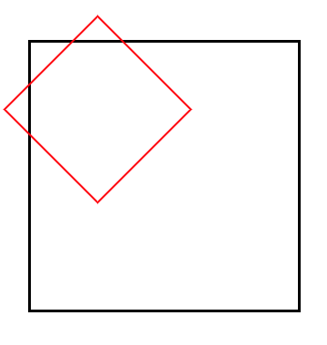

# Fastcampus - Apple ipad app Project

### Overview

- fastcampus 강의에서 진행하는 애플 아이패드 웹 사이트 클론코딩 프로젝트를 수행했다.

- 먼저 만들어보고 강의에서 제시하는 구현 방법과 나의 구현 방법을 비교하고, 새로 배우고 개선한 점을 기록한다.

## word-break: keep-all

- width 제한이 있는 container에 text를 입력할 때 줄 바꿈이 단어별로 발생시키기 위해 [word-break: keep-all](https://developer.mozilla.org/en-US/docs/Web/CSS/word-break#keep-all)옵션을 사용한다.

- 기본 옵션은 `word-break: normal`인데, 이는 영어 텍스트를 입력할 때 단어를 기준으로, 즉 띄어쓰기 기준으로 줄 바꿈이 잘 발생하지만, 한국어는 단어를 구분하지 못해 띄어쓰기 기준으로 줄 바꿈이 발생하지 않고, 문자마다 줄 바꿈이 발생한다.

- keep-all 속성값은 `CJK(Chinese/Japanese/Korean) text`를 위한 속성이라고 한다. 알파벳 순으로 나열해서 우리나라가 마지막에 온 것이라고 하더라 **(중국, 일본이 우월하다는 것이 아님.)**

## background-image - alternate text

- 이미지를 삽입할 때 스크린 리더를 사용하는 경우를 생각해 접근성을 강화하는 `IR(image replacement)`기법을 사용한다.

- 보통 img tag에는 alt속성이 있기 때문에 대체 택스트를 입력함으로써 [accessibility](https://developer.mozilla.org/en-US/docs/Web/HTML/Element/img#accessibility)를 보장할 수 있다.

- 하지만 div같은 태그에 background-image로 이미지를 지정한 경우 **alt**를 배치할 수 없는데, 그 대신 해당 태그 안에 alt를 배치하고 `text-indent`속성을 활용해 숨긴다.

```css
header ul.menu > li.apple-logo > a,
header ul.menu > li.search-starter > a,
header ul.menu > li.basket-starter > a {
  text-indent: -9999px;
}

header ul.menu > li.apple-logo {
  background-image: url('../images/header_apple.svg');
  background-repeat: no-repeat;
  background-position: 0 13px;
}

header ul.menu > li.search-starter {
  background-image: url('../images/header_search.svg');
  background-repeat: no-repeat;
  background-position: 0 13px;
}

header ul.menu > li.basket-starter {
  background-image: url('../images/header_bag.svg');
  background-repeat: no-repeat;
  background-position: 0 13px;
}
```

- `9999px`은 일종의 관습이라고 한다. 이 방식으로 텍스트를 숨김으로 써 접근성을 강화할 수 있다.

- 하지만 이 방식은 브라우저의 랜더링 시간을 증가시켜 좋지 않다고 한다.

- `overflow`를 활용해 필요한 만큼만 택스트를 밀어 넣는 방법도 있었다.

```css
.ir-text {
  text-indent: 100%;
  white-space: nowrap;
  overflow: hidden;
}
```

- `white-space: nowrap`으로 줄바꿈을 방지하고 container의 width 크기만큼 text를 밀어내고 숨기는 기법이다.

- 이것 말고 여러 방법이 있기 떄문에 -9999px을 사용하는 방법이 정답은 아닌 것 같다.

## shorthand property - override

- [shorthand property](https://developer.mozilla.org/en-US/docs/Web/CSS/Shorthand_properties)를 사용하는 경우 해당 속성이 override되는 것을 잘 봐야 한다.

- shorthand property에서 설정해주지 않은 값들은 지정하지 않는 것이 아니라 해당 shorthand property에서 default 값으로 자동 설정해주기 때문이다.

```css
header ul.menu > li.search-starter {
  background-image: url('../images/header_search.svg');
  background: 0 13px no-repeat;
}
```

- 이 경우 background shorthand property의 background-image의 default값은 `none`이기 때문에 이미지가 보이지 않게 된다.

```css
header ul.menu > li.search-starter {
  background: url('../images/header_search.svg') 0 13px no-repeat;
}
```

- 따라서 이런 방식으로 한 번에 묶어 주던가 `shorthand property를 가장 상위에 두어야 한다`.

```css
.box {
  border-color: red;
  border: 10px solid;
}
```

- 이 경우도 shorthand property에 의해 border-color 속성이 **override**되어 default값인 `black`으로 설정된다.

- 결론적으로 shorthand property를 사용할 때 신중해야 한다.

## dropdown menu - arrow

- dropdown menu에 arrow 모양을 추가하기 위해 [pseudo-element](https://developer.mozilla.org/en-US/docs/Web/CSS/Pseudo-elements)의 ::before을 사용한다.

- dropdown menu의 content와 별개로 arrow를 위한 box를 생성한다.

```html
<div class="basket">
  <div class="arrow"></div>
  <div class="message">장바구니가 비어 있습니다.</div>
  <ul>
    <li><a href="javascript:void(0)">장바구니</a></li>
    <li><a href="javascript:void(0)">저장된 항목</a></li>
    <li><a href="javascript:void(0)">주문</a></li>
    <li><a href="javascript:void(0)">계정</a></li>
    <li><a href="javascript:void(0)">로그인</a></li>
  </ul>
</div>
```

```css
header .basket > .arrow::before {
  content: '';
  position: absolute;
  top: 8px;
  left: 50%;
  width: 20px;
  height: 20px;
  transform: rotateZ(45deg);
  transform-origin: 0 0;
  background-color: #fff;
  border: 1px solid #d2d2d2;
}
```

- arrow의 ::before element를 rotate로 회전시킨 후 위치 조정을 한다.

- arrow의 가장자리 길이를 정확하게 계산하기 위해서 `box-sizing: border-box`값을 설정했다.

- `transform-origin: 0 0`으로 하고 **top, left**속성으로 정확한 위치를 조정한다. 그렇지 않으면 회전한 사각형을 정확한 위치에 배치하기 위해선 `sqrt` 기능이 필요하게 되며 수학적으로 계산이 필요하기 때문에 복잡하다.



- 빨간 사각형 변의 길이를 a라고 하면 transform-origin값은 `a/2 a/2`다.

- 여기서 `transform-origin: 0 0`처럼 이동을 하려면 sqrt를 사용한 결과의 값이 필요하다.

  - 검은 사각형 변으로부터 빨간 사각형 꼭지점 까지의 거리 **sqrt(a<sup>2</sup>/2) - (a/2)**

- 결과적으로 두 경우의 수는 같은 결과를 보여준다

  - transform-origin: 0 0

  - top: sqrt(a<sup>2</sup>/2) - (a/2); left: -(a/2); `a = 빨간 사각형의 width라 가정`

- 이는 매우 비효율적이기 때문에 `transform-origin: 0 0`을 사용하는 것이 맞다.

