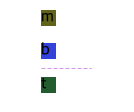

# Fastcampus - Apple ipad app Project

### Overview

- fastcampus 강의에서 진행하는 애플 아이패드 웹 사이트 클론코딩 프로젝트를 수행했다.

- 먼저 만들어보고 강의에서 제시하는 구현 방법과 나의 구현 방법을 비교하고, 새로 배우고 개선한 점을 기록한다.

### Table of contents

- [word-break: keep-all](#word-break-keep-all)

- [background-image - alternate text](#background-image---alternate-text)

- [shorthand property - override](#shorthand-property---override)

- [dropdown menu - arrow](#dropdown-menu---arrow)

- [Event.stopPropagation](#eventstoppropagation)

- [visibility - interpolation](#visibility---interpolation)

- [html - fixed](#html---fixed)

- [figure - figcaption alternate text](#figure---figcaption-alternate-text)

- [vender prefix - 공급업체 접두사](#vender-prefix---공급업체-접두사)

- [Declaring global CSS variables](#declaring-global-css-variables)

- [margin positioning - absolutely positioned box](#margin-positioning---absolutely-positioned-box)

- [animation-fill-mode](#animation-fill-mode)

- [animation-timing-function](#animation-timing-function)

- [mask image](#mask-image)

- [textContent - innerHTML / innerText](#textcontent---innerhtml--innertext)

- [toLocaleString vs Intl](#tolocalestring-vs-intl)

- [footnotes](#footnotes)

- [breadcrumb](#breadcrumb)

- [flex-box - remaining space(positive free space)](#flex-box---remaining-spacepositive-free-space)

## word-break: keep-all

- width 제한이 있는 container에 text를 입력할 때 줄 바꿈(wrap)을 단어별로 발생시키기 위해 [word-break: keep-all](https://developer.mozilla.org/en-US/docs/Web/CSS/word-break#keep-all) 스타일을 사용한다.

- 기본 옵션은 `word-break: normal` 스타일이다. 이는 영어를 입력할 때 단어를 기준으로, 즉 **띄어쓰기(공백 - whitespace)** 를 기준으로 줄 바꿈이 잘 발생하지만, 한국어는 단어를 구분하지 못해 띄어쓰기 기준으로 줄 바꿈이 발생하지 않고, 문자마다 줄 바꿈이 발생한다.

- keep-all 속성값은 `CJK(Chinese/Japanese/Korean) text`를 위한 값이라고 한다. 각 나라의 첫 문자를 알파벳 순으로 나열해서 우리나라 이름이 마지막에 쓰인 것이라고 한다. **(중국, 일본이 우리나라보다 우월하다는 의미가 아님.)**

## background-image - alternate text

- 이미지를 브라우저에 삽입할 때 스크린 리더를 사용하는 경우를 고려해 접근성을 강화하는 `IR(image replacement)`기법을 사용한다.

- 보통 img tag에는 alt속성이 있기 때문에 해당 속성에 대체 택스트를 입력함으로써 [접근성(accessibility)](https://developer.mozilla.org/en-US/docs/Web/HTML/Element/img#accessibility) 을 보장할 수 있다.

- 하지만 div같이 img 태그가 아닌 요소에 background-image 스타일로 이미지를 입력한 경우 **alt** 속성처럼 대체 택스트를 입력할 수 있는 속성이 지원되지 않는다.

- 해당 태그 안에 text를 입력하고 `text-indent` 속성을 활용해 alt 속성값처럼 유사하게 대체 택스트를 구현할 수 있다.

```css
header ul.menu > li.apple-logo > a,
header ul.menu > li.search-starter > a,
header ul.menu > li.basket-starter > a {
  text-indent: -9999px;
}

header ul.menu > li.apple-logo {
  background-image: url('../images/header_apple.svg');
  background-repeat: no-repeat;
  background-position: 0 13px;
}

header ul.menu > li.search-starter {
  background-image: url('../images/header_search.svg');
  background-repeat: no-repeat;
  background-position: 0 13px;
}

header ul.menu > li.basket-starter {
  background-image: url('../images/header_bag.svg');
  background-repeat: no-repeat;
  background-position: 0 13px;
}
```

- `9999px` 값은 일종의 관습(convention)이라고 한다. 이 방식으로 대체 텍스트를 구현하고 숨김으로 써 접근성을 강화할 수 있다.

- 하지만 이 방식은 브라우저의 랜더링 시간을 증가시켜 효율적이지 않다고 한다.

- `overflow`를 활용해 필요한 만큼만 택스트를 밀어서 숨기는 방법도 있었다.

```css
.ir-text {
  text-indent: 100%;
  white-space: nowrap;
  overflow: hidden;
}
```

- `white-space: nowrap`으로 줄바꿈을 방지하고 container의 width 크기만큼 text를 밀어내고 숨기는 기법이다.

  - **white-space** 속성 외에 `text-wrap: nowrap` 설정으로 같은 결과를 볼 수 있다.

  - [mdn문서](https://developer.mozilla.org/en-US/docs/Web/CSS/white-space)를 보면 white-space 속성에 white-space-collapse, text-wrap 두 속성에 대한 값을 shorthand property로써 한 번에 설정 할 수 있다고 한다. 결과적으로 **nowrap** 에 대해서 같은 기능을 수행하는 것 같다.

- 여러 방법이 있기 떄문에 -9999px을 사용하는 방법이 정답은 아닌 것 같다.

## shorthand property - override

- [shorthand property](https://developer.mozilla.org/en-US/docs/Web/CSS/Shorthand_properties)를 사용하는 경우 해당 속성이 override되는 것을 잘 검토해야 한다.

- shorthand property에서 설정해주지 않은 값들은 값을 설정하지 않는 것이 아니라 해당 `shorthand property에서 제공하는 default 값으로 스타일을 자동으로 설정해주기 때문이다.`

```css
header ul.menu > li.search-starter {
  background-image: url('../images/header_search.svg');
  background: 0 13px no-repeat;
}
```

- 이 경우 background 속성에 대한 shorthand property 에서 background-image의 default값은 `none`이기 때문에 background-image 스타일이 override되어 이미지가 보이지 않게 된다.

```css
header ul.menu > li.search-starter {
  background: url('../images/header_search.svg') 0 13px no-repeat;
}
```

- 따라서 이런 방식으로 값을 최대한 명시해야 하고, 가능한 `shorthand property를 사용하는 속성을 사용할 땐 가장 상위에 두어야 한다`.

```css
.box {
  border-color: red;
  border: 10px solid;
}
```

- 이 경우도 border 속성의 shorthand property에 의해 border-color 속성이 **override** 되어 default값인 `black`으로 설정된다.

- 결론적으로 shorthand property를 사용할 때 스타일의 override를 고려해야 한다.

## dropdown menu - arrow


- dropdown menu box 요소에 arrow 모양을 추가하기 위해 [pseudo-element](https://developer.mozilla.org/en-US/docs/Web/CSS/Pseudo-elements)의 ::before 가상 요소 선택자를 사용한다.

- dropdown menu의 content와 별개로 arrow를 위한 box를 생성한다.

```html
<div class="basket">
  <div class="arrow"></div>
  <div class="message">장바구니가 비어 있습니다.</div>
  <ul>
    <li><a href="javascript:void(0)">장바구니</a></li>
    <li><a href="javascript:void(0)">저장된 항목</a></li>
    <li><a href="javascript:void(0)">주문</a></li>
    <li><a href="javascript:void(0)">계정</a></li>
    <li><a href="javascript:void(0)">로그인</a></li>
  </ul>
</div>
```

```css
header .basket > .arrow::before {
  content: '';
  position: absolute;
  top: 8px;
  left: 50%;
  width: 20px;
  height: 20px;
  transform: rotateZ(45deg);
  transform-origin: 0 0;
  background-color: #fff;
  border: 1px solid #d2d2d2;
}
```

- arrow를 위한 ::before 가상 요소를 rotate css 함수로 회전시킨 후 위치 조정을 한다.

- arrow의 가장자리 길이를 정확하게 계산하기 위해서 `box-sizing: border-box` 스타일을 적용했다.

- `transform-origin: 0 0` 스타일로 설정하고 **top, left** 속성을 활용해 정확한 위치를 조정한다. 그렇지 않으면 회전된 사각형을 원하는 위치에 배치하기 위해서 `sqrt(제곱근)` 기능이 필요하게 되며, 이는 수학적인 계산이 필요하기 때문에 계산 과정이 복잡하다.

### Example

`빨간 사각형의 transform-origin 속성을 각각 default(Initial value), 0 0 값을 적용시킨 결과`

 

- 빨간 사각형 변의 길이를 `a` 라고 가정하면, transform-origin 스타일의 속성값은 `a/2 a/2(initial value - 50% 50% 0)` 다.

- 여기서 `transform-origin: 0 0` 스타일을 적용한 것처럼 사각형을 이동시키려면 sqrt를 사용한 결과의 값이 필요하다.

  - 검은 사각형의 윗변으로부터 빨간 사각형의 윗꼭짓점(vertex)사이 최단 거리 **sqrt(2a<sup>2</sup>)/2 - (a/2)**

- 결과적으로 두 경우의 수는 같은 결과를 보여준다

  1. transform-origin: 0 0;

  1. top: **sqrt**(2a<sup>2</sup>)/2 - (a/2); left: -(a/2); `a = 빨간 사각형의 width라 가정`

- 이는 매우 비효율적인 방법이기 때문에 `transform-origin: 0 0`을 사용하는 것이 적절하다.

## Event.stopPropagation

- dropdown menu의 특정 아이콘 매뉴가 활성화 될 경우, 이를 비활성화 하기 위해 아무 곳이나 클릭 할 수 있는 기능을 추가 하려면 [event bubbling](https://developer.mozilla.org/en-US/docs/Learn/JavaScript/Building_blocks/Event_bubbling)을 막아야 한다.

```javascript
searchStarterEl.addEventListener('click', showSearch)
searchCloserEl.addEventListener('click', hideSearch)
window.addEventListener('click', hideSearch)
```

- 하위요소인 dropdown container를 클릭하더라도 **event bubbling** 에 의해 event가 하위요소로부터 최상위(window)까지 전파되어 window에 등록된 이벤트 핸들러가 호출된다.

- 즉 구조상 showSearch 핸들러가 실행되면 hideSearch 핸들러는 실행되지 않아야 하므로 showSearch 로직에서 Event전파를 막아주는 `stopPropagation` 메서드 적용이 필요하다.

```javascript
const showSearch = (e) => {
  headerEl.classList.add('searching')
  // ... 기능 구현부
  e.stopPropagation()
}
```

- 이러한 방식으로 Event bubbling을 방지하기 위해선 하나의 기능을 목적으로 묶인 모든 요소에 대해 bubbling을 방지해 주어야 한다.

```html
<div class="search-wrap">
  <div class="search">
    <div class="shadow"></div>
    <div class="textfield">
      <div class="search-icon"></div>
      <input type="text" placeholder="apple.com 검색" />
      <div class="search-closer"></div>
    </div>
    <div class="autocompletes">
      <h3>빠른 링크</h3>
      <ul>
        <li>
          <a href="javascript:void(0)"
            >Apple Store 임시 휴무 관련 자주하는 질문</a
          >
        </li>
        <li>
          <a href="javascript:void(0)">Apple Store Online에서 쇼핑하기</a>
        </li>
        <li><a href="javascript:void(0)">액세서리</a></li>
        <li><a href="javascript:void(0)">AirPods</a></li>
        <li><a href="javascript:void(0)">AirTag</a></li>
      </ul>
    </div>
  </div>
</div>
```

- search와 관련된 기능은 해당 기능의 최상위 container인 .search-wrap container에 모두 포함되어 있으므로 .search-wrap을 벗어나지 않은 클릭에 대해서는 bubbling이 발생해서는 안된다.

- 따라서 해당 container에 대한 bubbling도 막아준다.

```javascript
searchWrapEl.addEventListener('click', (e) => {
  e.stopPropagation()
})
```

- 하지만 이러한 방식은 코드의 유연성을 떨어뜨리는 단점이 있다.

- 이 경우 search-wrap - window 사이에 다른 section이 끼어 있거나 같은 event action에 대한 window만의 고유 event handling이 필요한 경우 이 방법은 옳지 않다.

- 이러한 문제점을 해결하기 위해 고안한 다른 방법은 `e.target` 에서 특정 element를 구분하는 것이다.

- `e.target.classList.contains()`, `e.target.nodeName`등을 활용한 구별 방법도 있지만, 이로 인해 코드가 길어져 가독성이 떨어지고 예외 상황이 많았다.

- 여기서 가장 효율적인 [Element.closest()](https://developer.mozilla.org/en-US/docs/Web/API/Element/closest) 메서드를 사용하는 방법을 알 수 있었다.

```javascript
window.addEventListener((e) => {
  if (!e.target.closest('.search-wrap')) {
    hideSearch()
  }
})
```

- `Element.closest` 메서드는 CSS Selector와 일치하는 가장 가까운 조상 element를 찾는데(자신포함) 여기서 만약 window를 클릭한다면 결과 값은 null이 나오기 때문에 숨기는 로직을 실행할 수 있고, 또한 window로 전파된 이벤트를 이어서 handling할 수 있어 확장성이 좋다.

## visibility - interpolation

- 특정 조건에 따라 DOM element가 화면에 표시되어야 하는 경우, 화면에 표시되지 않을 때 browser에 접근성을 보장해주어야 한다.

- 만약 opacity만 변화를 주어 element를 보이지 않게 할 경우 보여지지 않을 뿐 해당 element의 모든 속성은 유지되어 클릭 등 `focus` 접근을 할 때 방해를 줄 수 있다.

- [visibility hidden 특성](https://developer.mozilla.org/en-US/docs/Web/CSS/visibility#hidden)상 **hidden** 값을 가지게 되면 `focus` 를 받을 수 없는 상태가 되므로 사용자와 상호작용 할 수 없는 상태가 된다.

- 또한 hidden 옵션은 [accessibility tree](https://developer.mozilla.org/en-US/docs/Learn/Accessibility/What_is_accessibility#accessibility_apis)로부터 제거된다.

  - 접근성 트리에서 제거되면 접근성 측면에 관한 요소 접근이 불가능해진다 **(e.g., 스크린 리더 접근)**

  - accessbility tree에서 요소가 제거되지만, DOM tree(render tree)에는 남아있어 해당 요소의 크기만큼 layout이 유지된다(occupying space).

- `transition`을 활용해서 특정 element의 opacity를 자연스럽게 변환시키는 동시에 focus를 받을 수 없는 상태로 만들기 위해 `visibility` 속성을 사용한다.

```css
header .search-wrap {
  opacity: 0;
  visibility: hidden;
  transition: 0.6s;
  /* ... */
}

header.searching .search-wrap {
  opacity: 1;
  visibility: visible;
}
```

- 요소 변화에 animation이 있다면, visibility 의 [interpolation](https://developer.mozilla.org/en-US/docs/Web/CSS/visibility#interpolation) 특성에 의해 애니메이션이 모두 처리된 후 visible / not-visible 처리가 된다.

### display - block / none animating display

- 이 경우 opacity의 변환의 의도한 대로 보여지지 않는다.

```css
header .search-wrap {
  opacity: 0;
  display: none;
  transition: 0.6s;
  /* ... */
}

header.searching .search-wrap {
  opacity: 1;
  display: block;
}
```

- transition을 활용해 display 속성을 none에서 block으로 연속적인 전환을 이끌어낼 수 없지만 `animation` 으로 일부 효과는 이끌어낼 수 있다.

```css
.box {
  display: none;
  /* ... */
}

.box.show {
  display: block;
  animation: showBox 1s;
}

@keyframes showBox {
  0%: {
    opacity: 0;
  }
  100% {
    opacity: 1;
  }
}
```

### difference between 'display: none'

- [visibility: hidden](https://developer.mozilla.org/en-US/docs/Web/CSS/visibility#hidden)은 'display:none' 과 달리 layout에는 자신의 크기만큼 영향을 미친다(occupying space).

- selector에 'display: none' 스타일을 그대로 적용하는 경우 애니메이션 보다 우선적으로 적용되기 때문에 요소가 바로 사라지게 된다. 따라서 이 경우 fade-out은 이끌어 낼 수 없다.

- display속성의 [animating display](https://developer.mozilla.org/en-US/docs/Web/CSS/display#animating_display) 특성상 block -> none으로 변환은 `animation duration` 진행이 100%가 되었을때 이산(discrete)적으로 변한다.

- 반대로 none -> block으로 변환에서 `display: block` 스타일은 `animation duration` 진행이 0%부터 바로 적용되기 때문에 fade-in효과를 구현할 수 있다.

- 여기서 animation 진행 자체에 display를 설정함으로 써 원하는 fade-out 모션도 구현할 수 있었다.

```css
.hide {
  animation: hideBox 1s;
  display: none;
}

@keyframes hideBox {
  0% {
    /* animation duration 진행도가 0%일 때부터 display: block 적용 */
    display: block;
    opacity: 1;
  }
  100% {
    /* 100% 진행도가 되었을 때 display: block 속성을 제거해 기존에 있던 display: none 스타일을 적용 */
    opacity: 0;
  }
}
```

- hideBox keyframes의 '0% keyframe' 에 'display: block' 스타일을 설정하면 기존 'display: none' 스타일과 관계 없이 animation이 진행되는 것을 볼 수 있었다.

- 즉 show와 hide를 모두 구현한 후 이 둘을 js로 toggle하는 방식으로 DOM을 조작하면 구현할 수 있다.

- 하지만 이 방식은 매우 비효율적이기 때문에 `visibility` 속성을 사용한다.

## html - fixed

- 특정 section이 활성화 될 때 전체 document 페이지가 고정되어야 할 필요가 있다.

- html 자체에 `position: fixed` 스타일을 설정해 페이지를 고정시키고 `overflow-y: scroll` 설정으로 스크롤바가 표시 되도록 한다.

```css
html.fixed {
  position: fixed;
  wtdth: 100%;
  overflow-y: scroll;
}
```

- 'overflow-y: scroll' 스타일을 적용하지 않으면 기존에 있던 스크롤바가 사라져 레이아웃에 영향을 미쳐 reflow가 발생할 수 있고, 화면이 움직이는 현상이 발생한다.

### 'wheel' event

- 다른 방법으로는 `wheel` event를 제어하는 것이다.

```javascript
document.body.addEventListener(
  'wheel',
  (e) => {
    e.preventDefault()
  },
  { passive: false }
)
```

- 스크롤 동작에 대한 브라우저 기본 동작을 취소함으로써 스크롤을 제어한다.

- **event bubbling** 에 의해 **wheel event** 가 최상위 element인 body / window까지 전파시킬 수 있으므로, 전파된 event에 대한 기본 동작을 취소시켜 scroll이 되지 않게 할 수 있다.

- 만약 하위 element의 이벤트 핸들러에서 **stopPropagation** 메서드를 통해 이벤트 전파를 막은 경우, 상위 요소까지 이벤트 전파가 되지 않아 해당 요소에서 기본 동작이 수행되어 스크롤이 동작하게 된다.

- 따라서 wheel 이벤트를 제어함으로써 스크롤을 방지하기 위해 하위 요소에 대해서 기본 동작을 고려해야 하는 상황이 발생한다. 이는 요소간 의존성을 형성하게 되어 복잡하므로 `position: fixed` 스타일을 html에 직접 설정 해주는 것이 효율적이다.

### [Using passive listeners](https://developer.mozilla.org/en-US/docs/Web/API/EventTarget/addEventListener#using_passive_listeners)

- `window`, `document.body`에 대해서 특정 이벤트에 대해 preventDefault를 적용시키기 위해 `passive: false` 옵션이 필요하다

- 브라우저는 기본적으로 **이벤트 핸들러에 대한 내용을 모두 실행 후 기본 동작을 실행한다.** 이는 이벤트 핸들러에서 preventDefault 메서드를 호출함으로써 기본 동작을 취소할 수 있기 때문이다.

  - 이벤트 핸들러가 수행되고 기본 동작을 취하는 옵션으로 대부분의 이벤트 리스너에 대해 `{passive: false}` 옵션이 설정된다.

- 하지만 스크롤 이벤트와 같이 자주 발생하는 이벤트에 대해서 비용이 큰 이벤트 핸들러를 등록하게 되면 브라우저 동작이 완만하지 않아 [Jank](https://developer.mozilla.org/en-US/docs/Glossary/Jank) 현상이 발생할 수 있다.

- 따라서 브라우저는 최상위 요소(window, document)에 대해 'wheel', 'touchmove' 등 특정 이벤트에 대해서는 `{passive: true}` 옵션을 기본값으로 가지고 있다.

- '{passive: true}' 옵션을 가지면 이벤트 핸들러가 수행되기 전 기본 동작을 수행한다. 따라서 preventDefault 메서드를 호출해도 아무런 효과가 나타나지 않게 된다.

## figure - figcaption alternate text

- figure 태그에 포함된 이미지를 설명하는 figcaption 부분이 image text인 경우 background-url로 이미지 텍스트를 삽입하고, text는 숨긴다.

```html
<figure>
  
  <figcaption>
    <div class="bgtext caption-camera">
      센터 스테이지 기술이 적용된 새로운 울트라 와이드 전면 카메라
    </div>
    <div class="bgtext caption-chip">A13 BIONIC 칩 전격 탑재</div>
    <div class="bgtext caption-storage">저장 용량은 64GB부터</div>
  </figcaption>
</figure>
```

```css
.bgtext {
  text-indent: 100%;
  white-space: nowrap;
  overflow: hidden;
}
```

[**text-indent: 9999px를 사용하게 되는 경우**](#background-image---alternate-text)

```html
<figure class="bgtext">
  
  <figcaption>
    <div class="caption-camera">
      센터 스테이지 기술이 적용된 새로운 울트라 와이드 전면 카메라
    </div>
    <div class="caption-chip">A13 BIONIC 칩 전격 탑재</div>
    <div class="caption-storage">저장 용량은 64GB부터</div>
  </figcaption>
</figure>
```

```css
.bgtext {
  text-indent: -9999px;
}
```

- 최상위 element(figure)에 class를 설정하면 하위 요소에 모두 들여쓰기가 적용되어 코드가 간결해지는 결과를 볼 수 있지만, render과정에서 자원소모가 비교적 크다 하고 **(간단히 측정해 봤는데 거의 차이가 없다고 봐도 될 정도)** , `-9999px` 값이 관습적인 표현이라고는 하지만 논리적인 측면에서 부적절한 면이 있다고 생각이든다.

- 따라서 `text-indent: 100%; overflow:hidden` 스타일을 적용하는 방식으로 대체 택스트를 구현하는 것이 목적이 더욱 명확해 보인다.

## vender prefix - 공급업체 접두사

- css 속성에서 모든 브라우저에서 지원되지 않고, 개발 진행중인 속성이 있다.

- 이러한 속성은 부분적으로 기능을 제공하는데, `vender prefix` 를 추가함으로써 스타일을 적용할 수 있다.

```css
img {
  display: block;
  user-select: none;
  -webkit-user-drag: none;
}
```

- **user-drag** 속성은 현재 Chrome browser에서 기능 개발이 완료되지 않은 속성(partial support)이기 때문에 `-webkit-` vender prefix를 추가해 스타일을 적용할 수 있다.

- 브라우저 지원 현황은 [caniuse 사이트](https://caniuse.com/?search=user-drag)에서 확인 할 수 있다.

## Declaring global CSS variables

- CSS 속성에 2개의 dash(--)를 접두사로 추가함으로써 [custom property](https://developer.mozilla.org/en-US/docs/Web/CSS/Using_CSS_custom_properties)를 선언할 수 있다.

- 보통 **최상위 element** 에 global variables로써 선언하는데, html에 선언 하는 것 보다 `:root` 가상 클래스 안에 선언 한다.

```css
:root {
  /* declaring in :root instead of html */
  --color-white: #fff;
  --color-black: #000;
  --color-font: #1d1d1d;
  --color-font-darkgray: #6e6e6e;
  --color-font-middlegray: #b7b7b7;
  --color-font-lightgray: #f5f5f5;
  --color-link: #0071e3;
  --color-link-focus: #81b9f1;
  --color-border: #d2d2d2;
  --color-header: #3a3a3a;
  --color-section: #f5f5f5;
  --color-shadow: rgba(0, 0, 0, 0.4);
}
```

- [:root pseudo-class](https://developer.mozilla.org/en-US/docs/Web/CSS/:root)는 `<html>` 태그를 지정하는 것과 같다.

- 차이점은 브라우저가 CSS 스타일을 결정할 때 스타일 선택의 우선순위, 즉 [specificity](https://developer.mozilla.org/en-US/docs/Web/CSS/Specificity)가 다르다.

- 가장 연관있는 CSS 스타일을 선택하는 알고리즘인 **specificity** 에 의해 `<html> 보다 :root 가상 클래스의 스타일이 우선 적용 된다.`

- specificity algorithm에서 사용되는 [selector weight](https://developer.mozilla.org/en-US/docs/Web/CSS/Specificity#selector_weight_categories)규칙에 의해 html은 **type column** 에 해당하므로 0-0-1의 **무게 값(weight value)** 을 가지고, :root는 가상 클래스이기 때문에 **class column**에 해당한다. 따라서 :root는 0-1-0의 weight value를 가진다.

## margin positioning - absolutely positioned box

- top, left등의 속성으로 위치를 조정을 할 수 있지만, margin을 사용해 2차적으로 세부적인 위치 조정을 할 수 있다.

  - [absolutely positioned box](https://developer.mozilla.org/en-US/docs/Web/CSS/position#absolute) 특성상 margin은 서로 겹치지(collapse) 않는다.

```css
.box {
  position: absolute;
  top: 100px;
  left: 100px;
  margin-left: -100px;
  margin-top: -100px;
}
```

- 이 경우 `top:0; left: 0;` 스타일을 적용했을때와 같은 결과가 보여진다.

- margin 속성에 음수, 양수값을 자유롭게 사용하며 positioning이 가능하다.

### padding을 이용하는 것은 어떨까

- 결론적으로 padding을 활용한 positioning은 불가능하다.

- `box-sizing: content-box(default)` 스타일인 경우 padding 값을 적용했을때 요소의 크기가 늘어나며, top, left같은 기준 위치를 벗어나지 않는다.

- [css padding syntax](https://developer.mozilla.org/en-US/docs/Web/CSS/padding#syntax) 규칙에서 padding 값에 negative value는 입력할 수 없다.

```css
.box1 {
  position: absolute;
  top: 100px;
  left: 100px;
  padding-top: 100px;
}

.box2 {
  position: absolute;
  top: 100px;
  left: 100px;
  padding-bottom: 100px;
}
```

- 이 경우 각 box안에 content가 없다면 같은 결과를 볼 수 있다.

- padding-top 속성을 적용하게 되면 box가 위쪽으로 100px이 늘어나는 것이 아닌 현재 위치에서 밑으로 padding 공간이 발생한다. 결과적으로 height가 밑으로 커지는 효과를 볼 수 있다.

- `box-sizing: border;` 인 경우, 지정된 width, height 크기를 초과한 padding에 대해서만 box의 크기가 커진다.

```css
.box1 {
  position: absolute;
  width: 100px;
  height: 100px
  padding: 50px;
}

.box2 {
  position: absolute;
  box-sizing: border-box;
  width: 100px;
  height: 100px;
  padding: 50px;
}
```

- **box1** 의 크기는 padding에 의해 width, height 크기가 각각 100px씩 증가될 것이다.

- **box2** 는 크기가 커지지 않는다. padding이 가로 세로로 100px씩 증가했지만 box의 기존 크기와 일치하기 때문이다.

## animation-fill-mode

- [animation-fill-mode](https://developer.mozilla.org/en-US/docs/Web/CSS/animation-fill-mode) 속성을 활용해서 animation 실행 전후 스타일을 제어할수 있다.

- 보통 이 속성은 animation-delay와 함께 상호작용을 할 수 있고, 또한 animation 완료 이후 상태를 유지할 수 있게 해준다는 점이 매력적인 것 같다.

- 일반적으로 backward, forwards, both 옵션을 사용한다.

  - forwards 옵션은 애니매이션 진행이 종료되어도 마지막 keyframe에 있는 스타일을 유지한다.

  - backward 옵션은 animation-delay 속성이 있는 경우, delay 기간 동안에도, 애니매이션의 처음 스타일을 적용한다.

    - 보통 애니매이션 시작 전 딜레이 기간때 애니매이션 스타일이 적용되지 않는다.

  - both 옵션은 forwards, backward 옵션을 모두 포함한다.

- animation-fill-mode 속성을 통해 fade-in, fade-out을 더욱 간략히 구현 할 수 있었다.

```css
.box {
  width: 100px;
  height: 100px;
  background-color: black;
  animation: show 1s both; /* animation-fill-mode: both - shorthand property */
}

.hide {
  animation: hide 1s both; /* animation-fill-mode: both - shorthand property */
}

@keyframes show {
  from {
    opacity: 0;
  }
  to {
    opacity: 1;
  }
}

@keyframes hide {
  from {
    opacity: 1;
  }
  to {
    display: none;
    opacity: 0;
  }
}
```

- `animation-fill-mode: both` 스타일을 적용해서 애니매이션 시작 전, 후 상태를 항상 animation keyframe에 의존하도록 했다. **(사실상 animation-delay 속성이 없기 때문에 forwards옵션을 적용해도 결과는 같다.)**

- box에 show animation을 default로 두어 '.hide' 클래스 적용시 override될 수 있도록 한다.

```javascript
btnEl.addEventListener('click', () => {
  boxEl.classList.toggle('hide')
})
```

- toggle을 사용함으로써 간단히 override를 적용시킬 수 있었고, if-else 문을 사용하지 않아 코드가 간결해졌다.

- 하지만 처음 페이지 랜더링 완료시 초기에 show 애니메이션이 실행되어 요소 표현이 어색하다.

## animation-timing-function

- CSS animation 진행 과정을 제어하기 위해 [animaion-timing-function](https://developer.mozilla.org/en-US/docs/Web/CSS/animation-timing-function) 속성을 설정한다.


- sprite에 포함된 여러 이미지를 차례대로 보여주기 위해 translate속성을 변환시키는데, animaion은 기본적으로 linear속성을 가지므로 이미지의 위치가 변하는 과정이 연속적으로 보여 sprite 이미지가 전체적으로 움직이는 것을 볼 수 있다. 이는 자연스럽지 않다.

- sprite image의 여러 이미지를 각각 순차적으로 보여주는데, 연속적이 아닌 이산적으로 보여줌으로써 하나의 작은 애니메이션을 형성하려 할 때 `steps()` 를 활용할 수 있다.

  - **steps()** 함수는 **animation-timing-function** 속성에 설정할 수 있는 [easing function](https://developer.mozilla.org/en-US/docs/Web/CSS/easing-function) 함수 타입중 [step-easing-function](https://developer.mozilla.org/en-US/docs/Web/CSS/easing-function#step-easing-function) 함수의 하위 옵션이다.

  - 즉, `step-easing-function` 함수를 통해 이미지 위치가 연속적(linear)으로 변하는 모션을 보여주지 않고 **이산적(discrete)으로** 변환하는 모션을 보여줄 수 있다.

- `step-easing-function` 함수는 animation의 각 step, 즉 animation에서 설정한 이전과 이후, 두 keyframes 스타일 사이에 대해 `스타일 상태를 몇 번에 걸쳐 변환할 것인가` 에 대해 결정한다.

```css
.box1 {
  animation: sample_animation 1s steps(2);
}

@keyframes sample_animation {
  from: {
    width: 100px;
  }
  to: {
    width: 200px;
  }
}
```

- 이 경우 animation의 스타일 변화는 두 개의 steps(keyframes) 사이 한 번 일어나므로, 1개의 변화 과정을 두 개의 steps 로 표현한다. `i. e., (100px -> 150px -> 200px)`

- 하지만 `애니메이션의 진행도가 100%에 도달했다는 것은 시각적으로 0% 진행도에 도달했다는 의미` 와 같으므로, **두 진행도(0% duration / 100% duration)는 시각적으로 겹치게 된다.**

- 따라서 0% 진행도의 상태와 100% 진행도의 keyframe 스타일이 다르다면 두 keyframes 중 하나의 스타일을 적용시켜야 한다.


- 각 스타일 변환 기준점(step)에서 다음 기준점으로 애니메이션을 진행하는 동안 이전 기준점(from)의 스타일을 사용할지, 다음 기준점(to)의 스타일을 사용할 지 결정해야 한다.

- 결국 2개의 keyframes를 가진 애니메이션에 'steps(1)' 값을 설정할 경우, 이는 'step-end'와 같은 효과를 내므로 from keyframe 스타일만 지속적으로 보여주게 될 것이다.

- 결론적으로 step-easing-function을 사용할 경우, **처음 keyframe(from)** 의 스타일과 **마지막 keyframe(to)** 의 스타일이 일치하지 않다면, `두 keyframes 스타일 중 하나는 포기해야 한다.`

## mask image

- css의 [mask-image](https://developer.mozilla.org/en-US/docs/Web/CSS/mask-image) 속성으로 `mask layer` 에 사용될 이미지를 설정함으로써 요소의 표현 범위를 설정할 수 있다.

  - mask image는 다른 이미지와 alpha channel(opacity)에 대해 상호작용(multiplied)함으로써 요소의 표현 범위를 제한할 수 있다.

- video의 기울기 표현을 디자인 하기 위해 기울어진 video source와, 기울어진 video 요소에서 출력되는 영역만을 포함할 크기의 mask image가 필요하다.

---

  

- 기본 이미지로 아이패드 화면의 모서리(edge)를 표현하고, 마스크 이미지, 동영상, 세 이미지 요소를 겹쳐 아이패드의 기울어진 각도에 자연스럽게 맞추어 배치할 수 있다.

  - css의 **transform** 속성으로 기울기를 조절한 것이 아닌, 이미지 자체가 기본적으로 기울어져 디자인 되어 있어 추가적인 작업이 필요하지 않았다.

  - 또한 해상도가 같은 크기로 되어 있기 때문에 이미지를 겹쳐 표현하기도 매우 수월했다.

---

### Lab - mask-image속성을 js를 통해 조작함으로써 화면 스크롤에 따른 인터렉티브한 이미지 표현도 구현해볼 수 있었다.

```html
<!DOCTYPE html>
<html lang="en">
  <head>
    <meta charset="UTF-8" />
    <meta name="viewport" content="width=device-width, initial-scale=1.0" />
    <title>Document</title>
    <style>
      body {
        height: 300vh;
        margin: 0;
        padding: 0;
      }

      .bg {
        position: sticky;
        top: 0;
        height: 100vh;
        background: url('./sample.png') center/cover no-repeat;
        mask-image: linear-gradient(black, black);
        mask-size: 100% 100%;
        mask-position: -100vw 0;
        mask-repeat: no-repeat;
      }
    </style>
  </head>
  <body>
    <div class="bg"></div>
    <script>
      const bgEl = document.querySelector('.bg')
      window.onload = () => {
        window.addEventListener('scroll', () => {
          const scrollRatio = 3 * (scrollY / document.body.offsetHeight)
          bgEl.style.maskPosition = `${(scrollRatio - 1) * 100}vw`
        })
      }
    </script>
  </body>
</html>
```

- `position: sticky` 옵션과 scroll 비율에 따른 `mask-position` 값 제어를 통해 이미지를 원하는 부분만큼 표현할 수 있다.

- 'transform-origin' 속성처럼 [mask-origin](https://developer.mozilla.org/en-US/docs/Web/CSS/mask-origin) 속성은 숫자 값을 사용할 수 없다. 따라서 mask image 위치를 임의로 설정하고, mask-size 크기를 줄이는 방법을 사용할 수 없기 때문에, position을 사용하지 않으면 box의 왼쪽 위 모서리의 mask-image 시작점이 고정되어버린다.

- `따라서 이런 기법을 위해 background-attachment: fixed 옵션을 사용하는 것이 더욱 수월해 보인다.`

## textContent - innerHTML / innerText

- 요소의 text 부분을 수정할 때 [Node.textContent](https://developer.mozilla.org/en-US/docs/Web/API/Node/textContent) 프로퍼티를 사용하는 것이 효율적이다.

### Node.textContent

- Node interface에서 제공하는 프로퍼티로, 요소의 text를 그대로 설정한다.

- setter로 사용할 때 HTML문법에 맞추어 설정해도 브라우저에는 그대로 text로써 표현된다. 따라서 `XSS` 공격에 안전하다.

### innerHTML

- Element interface에서 제공하는 innerHTML 프로퍼티로, 요소의 HTML 구조를 설정할 수 있다.

- setter로 사용할 때 데이터 입력시, 브라우저는 입력 데이터를 HTML 문법에 따라 parsing 과정을 거치며, CSS, JS 부분이 포함될시, 해당 기능을 모두 수행할 수 있다. 따라서 `XSS` 공격에 취약하다.

```javascript
const divEl = document.createElement('div')

divEl.innerHTML = ''
```

- 이 경우 divEl 요소가 브라우저에 삽입이 될 경우 img 요소가 parsing 되어 onerror 이벤트 핸들러가 실행된다.

#### textContent vs innerHTML

- textContent 프로퍼티는 브라우저에서 [HTML parsing 등 어떠한 해석 과정도 거치지 않고 표현하기 때문에](https://developer.mozilla.org/en-US/docs/Web/API/Node/textContent#differences_from_innerhtml) innerHTML 프로퍼티와 비교해서 매우 효율적이다.

- innerHTML 프로퍼티는 요소의 text부분을 설정하는 것이 아닌, JS에서 동적으로 HTML요소를 삽입할 때 사용하는 것이 목적에 맞다.

### innerText

- HTMLElement interface에서 제공하는 innerText 프로퍼티는 브라우저 상에 표현된 텍스트, 즉 `브라우저상에서 표현된(rendered) 텍스트 값만을 포함한다.`

- 또한 innerText는 `style` 에 영향을 받는다. 요소의 스타일이 'display: none', 'visibility: hidden' 스타일처럼 브라우저에서 보이지 않게하는 스타일을 적용받는 요소의 텍스트는 포함하지 않는다. `('opacity: 0' 스타일을 적용받은 경우 innerText에 포함된다)`

  - [요소 자체가 render되지 않은 경우는 textContent와 같은 값을 포함하고 있다.](https://developer.mozilla.org/en-US/docs/Web/API/HTMLElement/innerText#value)

- [또한 요소안에 style이 포함된 경우 이를 parsing하며 text에 적용시켜 포함한다.](https://developer.mozilla.org/en-US/docs/Web/API/HTMLElement/innerText#html)

#### textContent vs innerText

- innerText는 style 부분을 해석(parsing) 한다. 이로 인해 컴퓨팅적 비용 소모와, 스타일로 인한 layout 해석 및 reflow 발생 가능성이 있다. 따라서 textContent와 비교했을 때 성능적인 차이가 있기 때문에 이를 고려해야 한다. `(물론 요소 안에 style을 삽입하는 경우는 없을 것이다.)`

## toLocaleString vs Intl

- 각 나라마다 숫자를 표현하는데 자릿수 구분 등 표현 방식이 다르기 때문에 이를 **국제화(internationalization)** 할 필요가 있다.

- 숫자 데이터를 가격 표시를 위한 형태로 변경하기 위해 [Number.prototype.toLocaleString](https://developer.mozilla.org/en-US/docs/Web/JavaScript/Reference/Global_Objects/Number/toLocaleString) 메서드를 사용한다.

  - toLocaleString 메서드에 인수로 입력되는 값은 [IETF BCP 47 language tag](https://en.wikipedia.org/wiki/IETF_language_tag) 표준을 따른다.

- Number.prototype.toLocaleString 메서드는 [Intl.NumberFormat](https://developer.mozilla.org/en-US/docs/Web/JavaScript/Reference/Global_Objects/Intl/NumberFormat) 객체의 구현여부에 따라 기능을 의존한다.

  - Intl.NumberFormat API가 구현되어 있다면, toLocaleString 메서드의 인수로 입력되는 **BCP 47 language tag** 값은 유효하게 사용되며, `결과적으로 Intl.NumberFormat의 기능을 사용하게 된다.`

  - 만약 Intl.NumberFormat API가 구현되어 있지 않으면 시스템에서 내부적으로 설정된 값에 따라 의존하는 지역에 맞추어 설정된 형태의 값을 반환한다.

  - **현재 모든 최신 브라우저는 Intl 인터페이스가 구현되어 있으므로, 이 부분에 대해선 걱정하지 않아도 된다.**

### Date.prototype.toLocaleString

- Number.prototype.toLocaleString 메서드 외에 **Date** 타입을 위한 toLocaleString 메서드도 존재한다.

- **Date.prototype.toLocaleString** 메서드는 [Intl.DateTimeFormat](https://developer.mozilla.org/en-US/docs/Web/JavaScript/Reference/Global_Objects/Intl/DateTimeFormat) 객체 구현에 의존하여 **Number.prototype.toLocaleString** 과 같은 메커니즘으로 동작한다.

### 성능 최적화

```text/plain

Every time toLocaleString is called, it has to perform a search in a big database of localization strings, which is potentially inefficient. When the method is called many times with the same arguments, it is better to create a Intl.NumberFormat object and use its format() method, because a NumberFormat object remembers the arguments passed to it and may decide to cache a slice of the database, so future format calls can search for localization strings within a more constrained context.

- https://developer.mozilla.org/en-US/docs/Web/JavaScript/Reference/Global_Objects/Number/toLocaleString
```

- 문서에 따르면 Number.prototype.toLocaleString 기준으로 보았을 때, toLocaleString과 Intl.NumberFormat().format()은 같은 값을 반환하더라도, 성능면에서 차이가 있다.

- toLocaleString 메서드 호출마다 브라우저 JS엔진 내에 구현되어 있는 `big database of localization strings`, 즉 CLDR(Common Locale Data Repository) 데이터베이스에 접근하고, 탐색하여 formatting 기능을 수행한다. 따라서 반복 호출시 성능 저하가 발생할 수 있다.

- 하지만 Intl.NumberFormat 객체는 `인수값을 내부적으로 기억(cache)한다.`, 따라서 제한된 데이터베이스 범위만을 탐색하기 때문에 최적화된 기능을 제공한다.

- 따라서 Intl.NumberFormat 객체를 생성해서 재사용 하는것이 성능면에서 유리하다.

`이 외에도 Intl.ListFormat / DurationFormat 객체 등 다양한 표준화를 위한 format 객체들이 존재한다.`

## footnotes

- 제품 설명의 부가적인 설명을 덧붙이기 위해 [footnote](<https://en.wikipedia.org/wiki/Note_(typography)>) 를 사용한다.

### sup tag로 윗 첨자 추가

- `sup(superscript)` 태그로 윗 첨자를 추가하고 `a` 태그의 href속성을 설정해 해당 부분을 클릭시 footnote로 이동할 수 있게 한다.

- sup 태그가 문장에서 글씨 윗 부분에 고정될 수 있는 이유는 브라우저에서 제공하는 기본 스타일(user-agent style)중 `vertical-align: super` 스타일이 설정되어있는데, reset.css 등 커스텀 스타일을 적용한 경우, 스타일을 재설정해야 한다.

```css
sup {
  vertical-align: super;
  font-size: 0.8em;
}
```

- font-size 크기도 조절해 footnote를 구현한다.

- pixel 단위처럼 정적인 값 보단 em 등 상대단위를 사용하는 것이 반응형 디자인에 더욱 유리하다.

### ol tag로 순서 정렬


- 가장 마지막에 표현된 footnote의 순서를 부여하기 위해 ol 태그를 사용한다.

- ol태그 또한 reset.css 스타일이 적용된 경우 기본 스타일이 적용되지 않았으므로 `list-style` 속성을 설정해야 한다.

```css
ol {
  list-style: decimal;
}

ol li::marker {
  font-size: 5px;
}
```

- `list-style: decimal` 스타일을 적용함으로써 해당 리스트에 포함된 li 요소들은 `marker` 가상 요소를 가지게 되며, `li::marker`로써 가상 요소가 기본적으로 생성된다.

- marker는 각 li 요소안에 자식요소로써 생성 되기 때문에 ol 또는 li 태그의 font 관련 스타일 변경시 상속 관계를 통해 marker에도 같은 스타일이 적용되지만, marker 가상요소에 한정된 스타일을 적용하고 싶을 땐, li::marker 가상 요소를 선택하여 따로 스타일을 변경할 수 있다.

- ::marker는 가상 요소이지만, '::after', '::before' 요소와 다르게 스타일을 적용시킬 수 있는 범위가 한정되어있다. 즉 '::marker' 가상요소는 스타일 적용 범위가 제한적이다.

## breadcrumb


- breadcrumb은 웹 서비스 내에서 자신이 현재 어느 페이지 경로에 있는지 알려주는 역할을 한다.

- 또한 검색 엔진에도 노출될 수 있기 때문에 [SEO(Search Enging Optimization)](https://en.wikipedia.org/wiki/Search_engine_optimization) 관점에서도 중요한 요소다.

- breadcrumb은 웹 페이지상 자신의 경로를 알려주기 때문에 사용자 관점에서 페이지를 바로 나가지 않고 뒤로가기를 유도해 페이지 [이탈률(bounce rate)](https://en.wikipedia.org/wiki/Bounce_rate)을 줄일 수 있다.

- breadcrumb item 요소 사이에 간격을 두고 separator 요소를 삽입하기 위해 flex 속성과 gap 속성을 활용할 수 있다.

```css
.footer .breadcrumbs {
  display: flex;
  align-items: center;
  gap: 30px;
}

.breadcrumbs::after {
  content: '';
  position: absolute;
  width: 8px;
  height: 18px;
  top: 0;
  bottom: 0;
  right: -19px;
  margin: auto;
  background-image: url('../images/path_div.svg');
}
```

- separator를 이미지로써 사용하는 경우 이미지의 width크기와 breadcrumb items 사이 gap 크기를 계산해 중앙에 배치하도록 한다.

  - **separator 이미지의 left / right 각 여백 = gap(30px) - width(8px) / 2 = 11px**

  - 즉 right값을 separator의 width 크기의 절반(4px)을 포함해 총 -19px만큼 이동시키면 separator를 중앙에 배치할 수 있다.

## flex-box - remaining space(positive free space)

- flex container의 height 크기가 고정되어 있고, `flex-wrap: wrap` 스타일이 적용된 경우 cross-axis line이 나누어진다.

- 나누어진 각 cross-axis의 높이 크기는 유효한 content 크기를 제외한 positive free space 크기를 분배하여 결정 된다.

  - cross-axis line 높이 = (remaining space 크기 / cross-axis line 총 개수) + 자신의 **content** 크기

  - **content** 에 포함되는 속성 - width / height(cross-axis 방향에 따라 다름), padding, height, text 등 size 값을 가지는 모든 요소

```css
.flex-box {
  display: flex;
  flex-wrap: wrap;
  height: 600px;
  width: 1000px;
}

.box {
  width: 400px;
}

.b1 {
  background-color: #222222;
}

.b2 {
  background-color: #444444;
}

.b3 {
  background-color: #666666;
}

.b4 {
  background-color: #888888;
}

.b5 {
  background-color: #aaaaaa;
}
```

`주축(main-axis)의 크기가 1000px인 flex-box 안에 '.b1' ~ '.b5' 스타일이 각각 적용된 400 x 200 크기의 box요소 5개가 포함되어 있다 가정`

### content영역이 없는 box가 포함된 경우


- box요소가 5개 있다면, cross-axis는 3개의 line으로 나누어지고, 각 box에는 content가 없으므로 각 cross-axis line의 높이는 200px 영역만큼 가지게 된다.

### box에 margin, padding 영역이 있다면


```css
.b1 {
  background-color: #222222;
  margin-top: 20px;
}

.b3 {
  background-color: #666666;
  padding-top: 40px;
}
```

- 첫 번째 cross-axis line 영역에 포함된 b1의 'margin-top: 20px' 크기와, 두 번째 cross-axis line 영역에 포함된 b3의 'padding-top: 40px' 크기는 content영역이 된다.

  - remaining space = 600px - (20px(margin) + 40px(padding)) = 540px

- 540px 크기의 remaining space 공간은 각 cross-axis 높이(height) 값에 정확히 분배 된다.

  - 첫 번째 cross-axis line 높이 = 20px(margin) + 540/3px(remaining space) = 200px

  - 두 번째 cross-axis line 높이 = 40px(padding) + 540/3px(remaining space) = 220px

  - 세 번째 cross-axis line 높이 = 540/3px(remaining space) = 180px

### box요소 자체가 크기를 가지는 경우


```css
.b3 {
  background-color: #666666;
  height: 200px;
}

.b5 {
  background-color: #aaaaaa;
  height: 300px;
}
```

- cross-axis 방향으로 요소 자체가 크기를 가지는 경우, content 영역 크기에 포함되어 remaining space 공간의 크기가 줄어든다.

  - remaining space = 600px - (200px(b2-height) + 300px(b5-height)) = 100px

- remaining space 100px 크기는 각 cross-axis line 높이 값에 정확히 분배된다.

  - 첫 번째 cross-axis line 높이 = 100/3px(remaining space) = 33.33px

  - 두 번째 cross-axis line 높이 = 200px(b2-height) + 100/3px(remaining space) = 233.33px

  - 세 번째 cross-axis line 높이 = 300px(b5-height) + 100/3px(remaining space) = 333.33px

### align-items - align-contents

- `align-items` 속성은 각각의 cross-axis line 안에서 배치된 요소의 정렬 방식을 결정하므로, 결과적으로 `cross-axis 자체의 크기, 레이아웃`은 유지된다.

  ```css
  .flex-box {
    display: flex;
    flex-wrap: wrap;
    height: 600px;
    width: 1000px;
    border: 1px solid;
    align-items: flex-start;
  }
  ```

  - [위 예시](#box요소-자체가-크기를-가지는-경우)에서 추가적으로 .flex-box 요소 스타일의 `align-items: flex-start` 스타일을 추가해준다.

  

  - 첫 번째 cross-axis line의 box는 아무런 content도 없으므로 box 자체 크기를 가지지 않아 보이지 않지만, remaining space 분배에 의한 cross-axis크기는 유지가 되는 것을 확인 할 수 있다.

  - 즉 기존의 `align-items: stretch` 값에 의해 교차축의 remaining space 공간을 각 line 마다 flex item 요소가 모두 차지했었는데, 'flex-start' 값에 의해 차지할 수 없게 된 것이다.

- `align-contents` 속성은 각 cross-axis line들을 배치하는 방법을 결정한다. 즉 `flex-wrap: wrap`스타일이 적용되어 wrap이 발생해 cross axis가 여러개의 line으로 나누어 졌을 때 유효한 속성이다.

## appendChild - append

### appendChild

- [Node interface의 appendChild 메서드](https://developer.mozilla.org/en-US/docs/Web/API/Node/appendChild)는 요소의 맨 마지막 자식 요소로써 `Node` 를 추가한다.

- **appendChild(aChild)**

  - [aChild](https://developer.mozilla.org/en-US/docs/Web/API/Node/appendChild#achild) parameter를 받아 자식 요소로써 추가한다.

  - argument는 `Node interface`를 상속받는 DocumentFragment, Element, CharacterData, DocumentType 을 상속하는 타입의 값이어야 한다. - `즉 일반적인 String, Number 같은 데이터는 text node로 써 입력할 수 없다.`

- appendChild는 삽입된 자신의 Node를 반환하므로 method chaining 기법을 통해 반복 호출함으로써 [nested DOM structure](https://developer.mozilla.org/en-US/docs/Web/API/Node/appendChild#creating_a_nested_dom_structure)를 생성할 수 있다.

```javascript
// main.js - Compare Item Group - ipad item render

ipadDataList.forEach((data) => {
  const compareIpadItemEl = document.createElement('div')
  compareIpadItemEl.classList.add('item')
  let compareColorElHTML = ''

  data.colors.forEach((color) => {
    compareColorElHTML += /* html */ `
            <li style="background-color: ${color}"></li>
        `
  })

  compareIpadItemEl.innerHTML = /* html */ `
            <div class="thumbnail">
                
            </div>
            <ul class="color-group">
                ${compareColorElHTML}
            </ul>
            <h3 class="name">${data.name}</h3>
            <p class="tagline">${data.tagline}</p>
            <p class="price">₩${data.price.toLocaleString('en-US')}부터</p>
            <button class="btn">구입하기</button>
            <a href="${data.url}" class="link">더 알아보기</a>
    `

  compareItemGroupEl.append(compareIpadItemEl)
})
```

- 기존의 `comment tagged templates` 로 작성된 HTML 구조를 innerHTML 속성에 getter로 주입해 동적으로 요소를 생성한 코드를 appendChild를 활용한 코드로 리팩토링 해보았다.

```javascript
// main.js - Compare Item Group - ipad item render

ipadDataList.forEach((data) => {
  const compareIpadItemEl = document.createElement('div')
  compareIpadItemEl.classList.add('item')
  const compareColorElHTML = document.createDocumentFragment()

  data.colors.forEach((color) => {
    const liEl = document.createElement('li')
    liEl.style.backgroundColor = color
    compareColorElHTML.appendChild(liEl)
  })

  const thumbnailEl = document.createElement('div')
  thumbnailEl.classList.add('thumbnail')

  const imgEl = new Image()
  imgEl.src = data.thumbnail
  thumbnailEl.appendChild(imgEl)

  const ulEl = document.createElement('ul')
  ulEl.classList.add('color-group')
  ulEl.appendChild(compareColorElHTML)

  const h3El = document.createElement('h3')
  h3El.classList.add('name')
  h3El.textContent = data.name

  const tagLineEl = document.createElement('p')
  tagLineEl.classList.add('tagline')
  tagLineEl.textContent = data.tagline

  const priceEl = document.createElement('p')
  priceEl.textContent = `₩${data.price.toLocaleString('en-US')}부터`

  const buttonEl = document.createElement('button')
  buttonEl.classList.add('btn')
  buttonEl.textContent = '구입하기'

  const anchorEl = document.createElement('a')
  anchorEl.href = data.url
  anchorEl.classList.add('link')
  anchorEl.textContent = '더 알아보기'

  compareIpadItemEl.appendchild(thumbnailEl)
  compareIpadItemEl.appendchild(ulEl)
  compareIpadItemEl.appendchild(h3El)
  compareIpadItemEl.appendchild(tagLineEl)
  compareIpadItemEl.appendchild(priceEl)
  compareIpadItemEl.appendchild(buttonEl)
  compareIpadItemEl.appendchild(anchorEl)

  compareItemGroupEl.appendChild(compareIpadItemEl)
})
```

- comment tagged template로 작성된 HTML구조를 appendChild를 사용한 형식으로 변경해보았다.

- 코드가 길어지고, 가독성 측면에서 React문법과 유사한 comment tagged template와 비교해서 비효율적이다.

- 해당 HTML 구조 생성은 nested DOM structure 생성에 유리한 appendChild의 장점을 살리지 못한것 같아 아쉽다.

### append

- Element interface의 메서드인 append는 appendChild 메서드보다 이후에 표준화된 메서드다.

- appendChild와 달리 `여러개의 arguments`를 입력할 수 있고, `String type value` 또한 입력할 수 있다. 이는 내부적으로 textNode로 변경되어 삽입된다고 한다. 대신 반환값은 없다.

- 위에 appendChild 메서드를 사용한 HTML구조를 append 메서드를 사용한 구조로 변경해보았다.

```javascript
ipadDataList.forEach((data) => {
  const compareIpadItemEl = document.createElement('div')
  compareIpadItemEl.classList.add('item')
  const compareColorElHTML = document.createDocumentFragment()

  data.colors.forEach((color) => {
    const liEl = document.createElement('li')
    liEl.style.backgroundColor = color
    compareColorElHTML.append(liEl)
  })

  const thumbnailEl = document.createElement('div')
  thumbnailEl.classList.add('thumbnail')

  const imgEl = new Image()
  imgEl.src = data.thumbnail
  thumbnailEl.append(imgEl)

  const ulEl = document.createElement('ul')
  ulEl.classList.add('color-group')
  ulEl.append(compareColorElHTML)

  const h3El = document.createElement('h3')
  h3El.classList.add('name')
  h3El.textContent = data.name

  const tagLineEl = document.createElement('p')
  tagLineEl.classList.add('tagline')
  tagLineEl.textContent = data.tagline

  const priceEl = document.createElement('p')
  priceEl.textContent = `₩${data.price.toLocaleString('en-US')}부터`

  const buttonEl = document.createElement('button')
  buttonEl.classList.add('btn')
  buttonEl.textContent = '구입하기'

  const anchorEl = document.createElement('a')
  anchorEl.href = data.url
  anchorEl.classList.add('link')
  anchorEl.textContent = '더 알아보기'

  compareIpadItemEl.append(
    thumbnailEl,
    ulEl,
    h3El,
    tagLineEl,
    priceEl,
    buttonEl,
    anchorEl
  )

  compareItemGroupEl.append(compareIpadItemEl)
})
```

- 여러개의 arguments를 입력할 수 있는 장점 외엔 별 차이가 없어보인다. 이 마저도 가독성 측면에서 보면 장점이라고 보여지지 않는다.

- `결론적으로 복잡한 HTML구조를 javascript상에서 동적으로 생성할 때 comment tagged template를 사용하는 것이 가장 효율적이라 판단.`

## image positioning - figure

- 이미지를 배치하기 위해 figcaption 태그와 함께 [figure tag](https://developer.mozilla.org/en-US/docs/Web/HTML/Element/figure) 안에 배치한다.


- 이미지를 자유롭게 배치하는데, 웹 페이지의 [normal flow](https://developer.mozilla.org/en-US/docs/Learn/CSS/CSS_layout/Normal_Flow)를 고려하여 적절히 배치해야 한다

```html
<div class="inner">
  <div class="info-box">
    <div class="info">
      <div class="info__icon">ICON</div>
      <div class="info__text">info description</div>
    </div>
    <div class="info">
      <div class="info__icon">ICON</div>
      <div class="info__text">info description</div>
    </div>
  </div>
  <div class="figure-box">
    <div class="figure-1">
      <figure>
        
        <figcaption></figcaption>
      </figure>
    </div>
    <div class="figure-2">
      <figure>
        
        <figcaption></figcaption>
      </figure>
    </div>
    <div class="figure-3">
      <figure>
        
        <figcaption></figcaption>
      </figure>
    </div>
  </div>
</div>
```

- 각 info-box와 figure-box는 normal flow에 영향을 주는, 공간을 가지는 element로 배치한다.

### info-box


```css
/* CSS - info-box */

.info-box {
  display: flex;
  gap: 30px;
  flex-direction: column;
  align-items: flex-end;
  background-color: rgba(241, 101, 124, 0.2);
  border: 5px solid rgb(241, 101, 124);
}

.info-box .info__text {
  font-size: 30px;
  line-height: 1.4;
}
```

- info-box 요소 안에 있는 info 정보들은 세로 축으로 공간을 차지하며 flex를 통해 오른쪽으로 밀어냄으로 써 배치될 수 있다.

- flex를 배치를 통해 왼쪽에 remaining space 공간을 두어 viewport 크기가 줄어들었을 때 유연하게 브라우저 상에 요소가 표현될 수 있게 한다.

### figure-box


```css
/* CSS - figure-box */

.figure-box {
  display: flex;
  height: 800px;
  box-sizing: border-box;
  border: 5px solid rgb(141, 141, 255);
  background-color: rgba(141, 141, 255, 0.2);
}

.figure-box > div {
  flex-grow: 1;
  position: relative;
  border: 2px solid black;
}

.figure-box figure {
  position: absolute;
  top: 0;
  left: 0;
}

.figure-box figure img {
  width: 400px;
}
```

- 이미지 요소들은 absolutely positioned element로써 위치를 변경하고 자유로운 위치에 배치되어야 하므로, 이미지 요소의 크기가 최상위 요소인 figure-box의 크기에 영향을 미치게 되면 레이아웃 계산이 힘들어진다.

- 따라서 이미지 요소 배치를 위한 최상위 요소는 css 스타일상 height 크기를 임의로 주어서 normal flow에 영향을 주어야 한다.

- figure 요소를 wrapper요소(figure-1, figure-2, figure-3)를 정의하여 한 번 더 감싸줌으로써 대략적인 배치를 먼저 해준다.

  - 대략적으로 설정된 초기 위치를 기준으로, 하위 요소인 figure 요소의 위치를 더욱 간편하게 설정할 수 있다.

  - figure wrapper 요소는 상위 요소인 figure-box의 flex 속성 영향을 받아 cross-axis 방향 공간을 모두 차지하는 것을 볼 수 있다. 큰 의미는 없다.

  - 각각 wrapper 요소의 class이름을 다르게 주어 구분할 수 있게 한다. CSS selector에서 각각의 wrapper 요소의 클래스를 선택하고, 하위 요소로 figure 요소를 선택하고, 위치를 변경할 수 있다.

```css
.figure-1 figure {
  transform: translate(40px, -160px);
}

.figure-2 figure {
  transform: translate(-239px, 138px);
}

.figure-3 figure {
  transform: translate(-50px, 0);
}
```

---

**Result**


---

- `figure` 요소는 img 요소와 figcaption 요소를 포함하고, 해당 요소들을 함께 움직여야 하기 때문에 absolute position 속성을 가진다.

- `figcaption` 요소는 `img` 요소 주변에 적절히 배치 되어야 하므로 absolute position 속성을 가지고, img 요소는 부모 요소인 figure 요소가 위치를 이동함으로 써 자연스럽게 배치될 것이기 때문에 absolute position 속성을 가지지 않아도 무관하다.

- 만약 figcaption 요소와 img 요소 모두 absolute position 속성을 가지게 되면 부모 요소인 figure 요소의 height값이 0px 크기를 가지게 되지만, 최상위 요소인 **figure-box의 height 크기가 정해져있기 때문에** layout 배치에 영향을 주진 않는다.

- 현재 디자인에서 figure-box는 normal flow에 영향을 주는 크기를 가지지만, 상황에 따라 height를 직접 지정하지 않고, normal flow에 영향을 주지 않아도 된다. 최상위 요소의 height 크기가 변해도 이미지의 위치는 변하지 않는다.

## flex - negative margin

- flex container안에서 flex item의 negative margin 크기에 의해 flex container의 크기가 0이 된 이후 작용하는 positioning에 대해 알아보았다.

- 결과적으로 negative margin값으로 인해 flex container의 크기가 0이 된 이후 flex item의 positioning 규칙과 style상 위치 값에 의해 요소의 위치가 결정된다.

### justify-content: space-between

```css
/* Flex contatiner styles */

.p {
  width: 50px;
  height: 50px;
  background-color: #8022ad;
  height: auto;
  margin-bottom: 0;
  margin-top: 0;
  max-height: 60px;
  display: flex;
  flex-direction: column;
  justify-content: space-between;
}
```


- flex contatiner(p)는 space-between 분배 스타일을 가지고 있어 첫 요소와 마지막 요소는 각각 flex container의 각 끝 모서리에 위치한다.

#### top 요소의 margin-top을 줄였을 때

 

- margin-top 속성은 요소 자신의 위치까지 이동시키므로 flex container 공간을 overflow하게 된다.

- flex container의 크기가 완전히 줄어들기 전까지는 negative margin 여백에 의해 flex container의 크기 감소로 인한 요소들의 `상대적인 이동` 이 발생하고 그 이후 flex 정렬 방식에 의한 특성, 요소들의 style상 위치값 계산에 의한 레이아웃이 결정된다.

- top 요소는 margin-top 크기를 줄이고, `justify-content: space-between` 특성상 첫 가장자리에 위치하려 하기 때문에 계속해서 위로 이동 할 수 있다.

- middle 요소는 top 요소의 위치값에 따라 bottom요소 사이에 위치하려 하므로 이동이 가능하다.

- bottom 요소는 맨 끝 가장자리에 위치하려 하기 때문에 flex container의 크기가 모두 즐어든 후 이동하지 않는다.

#### top 요소의 margin-bottom을 줄였을 때

 

- margin-bottom 속성은 일반적으로 자신보다 밑에 쌓인 요소의 위치를 변경한다.

- negative margin 크기를 두어 flex container의 크기를 최대한 줄인 경우 예상한 대로 overflow가 발생한다.

- flex container의 크기를 없앤 후 margin-bottom 크기를 계속해서 줄여 나가면 middle 요소의 위치만 위로 가게 된다.

- `justify-content: space-between` 스타일 특성상 top요소는 첫 가장자리에 위치하려하고, bottom요소는 끝 가장자리에 위치하려 한다.

- bottom, middle요소가 top요소보다 위로 가게 된 것은 negative margin으로 flex container의 크기 감소로 인한 요소들의 `상대적인 이동`이며, container가 완전히 사라진 후 다른 메커니즘으로 계산이 되어 middle 요소만 위로 이동하게 된다.

- `상대적인 요소의 이동` 이 끝난후 브라우저는 요소의 style상 크기, positioning(flex positioning) 조건을 따져 요소를 배치하게 된다.

- top 요소의 음수값의 margin-bottom 으로 인해 layout상 top의 가장자리는 top요소보다 위쪽에 위치하게 된다.

- margin-bottom 값을 감소시키면 레이아웃상 top - middle - bottom요소 사이 공간이 넓어져야 한다. (space-between 특성상)

- top 요소는 margin-bottom으로 인해 자신이 이동하지 않으므로 자신의 위치를 그대로 지킨다.

- bottom 요소는 가상의 top 위치 값이 위로 이동했지만 space-between 스타일 특성상 밑 가장자리에 위치하려 하므로 더이상 이동하지 않는다.

- middle 요소는 가상의 top 위치 값이 위로 이동했으므로 이에 맞추어 위로 이동하게 된다.

### 중간 결과

- flex contatiner의 크기가 모두 없는 경우 negative margin 값에 의해서

  - flex 정렬 특성상 **각각 맨 끝 가장자리에 위치할 요소** 는 특성에 따라 위, 또는 밑 방향으로 더이상 이동하지 않는다.

  - 맨 끝 가장자리에 위치하는 특성이 없는, 중간 위치에 있는 요소들은 이동한다.

- 그렇다면 모든 요소의 위치가 어정쩡한, 중간에 위치하는 `justify-content: space around` 스타일이 적용되면 어떨까?

### justify-content: space-around

- `justify-content: space-around` 스타일 특성상 모든 요소는 고정된 위치를 가지지 않고, remaining space를 일정한 크기만큼 분배해 배치한다.

#### top 요소의 margin-top을 줄였을 때

 

- margin-top 속성은 해당 속성을 가지는 요소의 위치까지 변경시키기 때문에 flex container의 크기가 0이 된 후 **space-around** 스타일에 따라 요소들 사이의 간격이 예상대로 잘 멀어진다.

- **space-around** 특성상 양 끝에 remaining space 공간이 있으므로, bottom 요소도 천천히 위로 이동하는 것을 볼 수 있다.

#### top 요소의 margin-bottom을 줄였을 때

 

- margin-bottom 속성은 요소의 위치를 변경시키지 않고, normal flow상 밑에 위치하는 요소의 위치를 변경시킨다.

- flex container 요소의 크기가 0이 된 후 하위 요소들은 top의 margin-bottom 값의 관점으로 top 요소가 윗방향에 위치하고 위쪽으로 이동하기 때문에 이에 맞추어 middle 요소와 bottom요소는 이동하게 된다.

- top 요소는 margin-bottom 속성으로 자신이 이동할 수 없지만, flex container 크기가 0이 된 후 `줄어들 크기가 없어 결국 자신이 이동하게 된다`.

- space around 특성상 모든 요소가 이동 가능하고, 위치에 따라 이동 비율이 다르기 떄문에 가장자리에 존재하는 top요소는 비교척 천천히 이동한다.

### 최종 결과

- negative margin으로 인한 flex container의 layout 방식과 관련된 문서를 찾을 수 없어 각종 경우의 수를 두고 실험을 해서 margin과 layout의 관계에 대해 깊게 생각해 볼 수 있었다.

- 이는 flex container의 목적에 맞는 사용방법이 아니기 때문에, 이와 관련된 명확히 정의된 사용 방법이 존재하지 않았고, 목적에 어긋난 방법으로 flex를 사용한 결과로써 `undefined behavior` 와 같은 개념이라 판단, 즉 브라우저마다 작동 방식이 다를 수 있고, 크로스 브라우징, 동등성 측면에서 매우 비효율적인 접근, 활용 방식이라고 생각한다.

- 그래도 결과를 내보자면

  1. flex 정렬방식(justify-content)에 의도된 메커니즘으로 요소들이 이동하려고 한다.

  1. margin에 의해 이동하는 요소들은 margin크기 변경에 일치된 방향으로 이동한다.

  1. margin에 의해 이동하지 않는 요소들(normal flow / layout상 상위 / 이전 위치에 있는 요소들)은 margin으로 인해 축소되는 방향과 반대로 이동한다.
