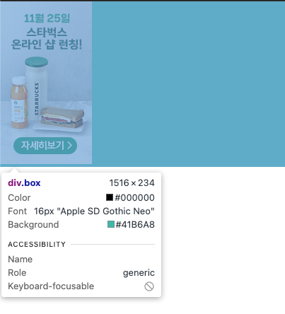
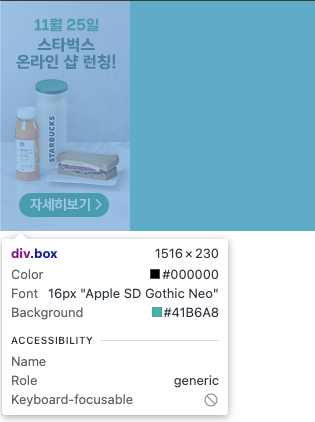
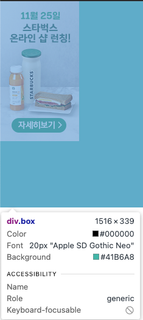
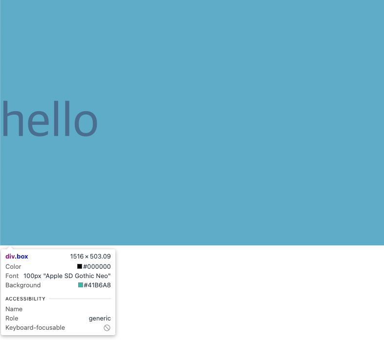
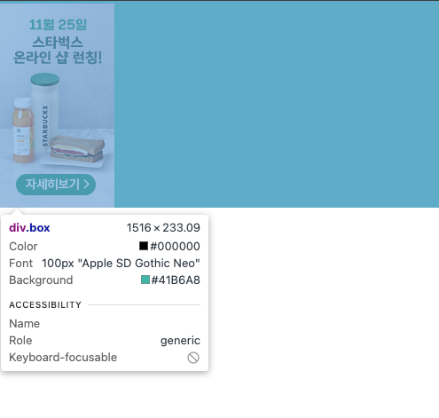
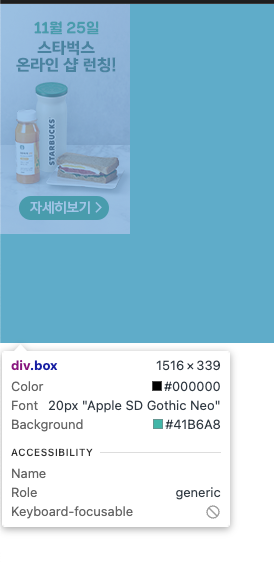
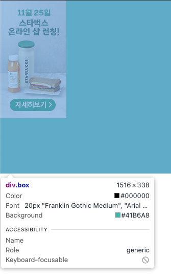
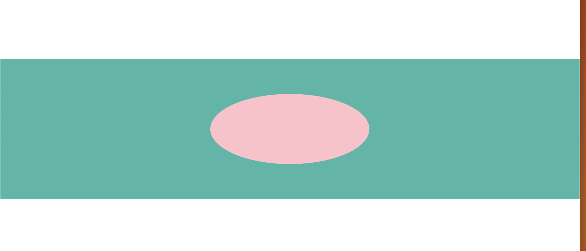
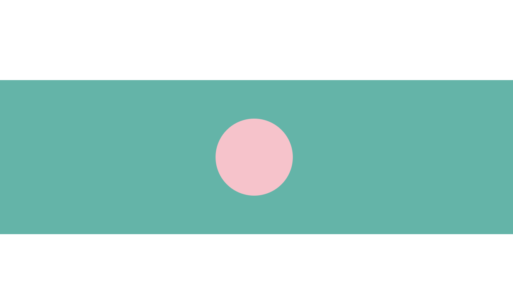

# Fastcampus - Starbucks clone Project

## Overview

- fastcampus 강의에서 진행하는 스타벅스 웹 사이트 클론코딩 프로젝트를 수행했다.

- 먼저 만들어보고 강의에서 제시하는 구현 방법과 나의 구현 방법을 비교하고, 새로 배우고 개선한 점을 기록한다.

### head - meta tag

- social media에서 정보를 공유할 때 간략한 정보를 미리 보여주기 위해 meta태그를 배치한다.

- meta tag는 검색앤진, 크롤러가 사이트 정보를 빠르게 해석하기 위해 head태그에서도 가능한 상단에 배치하는 것이 유리하다고 한다.

```html
<head>
  <meta charset="UTF-8" />
  <meta name="viewport" content="width=device-width, initial-scale=1.0" />
  <title>Starbucks Project</title>

  <meta property="og:type" content="website" />
  <meta property="og:site_name" content="Starbucks" />
  <meta property="og:title" content="Starbucks Coffee Korea" />
  <meta
    property="og:description"
    content="스타벅스는 세계에서 가장 큰 커피숍이다."
  />
  <meta property="og:image" content="./images/starbucks_seo.jpg" />
  <meta property="og:url" content="http://localhost:8080" />

  <meta property="twitter:card" content="summary" />
  <meta property="twitter:stie" content="Starbucks" />
  <meta property="twitter:title" content="Starbucks Coffee Korea" />
  <meta
    property="twitter:description"
    content="스타벅스는 세계에서 가장 큰 커피숍이다."
  />
  <meta property="twitter:image" content="./images/starbucks_seo.jpg" />
  <meta property="twitter:url" content="http://localhost:8080" />
</head>

<!-- ... -->
```

- 카카오톡을 위한 `Open Graph Protocol`과 트위터를 위한 `Tweet Card` meta tag를 사용한다.

- 각 Protocol은 항상 카카오톡, 트위터에서만 사용되는 것 뿐만이 아닌, 다양한 소셜미디어에서 공통적으로 사용된다고 한다.

### CSS - nth-of-child / nth-of-type

- CSS에서 n번째 자식 요소를 선택하기 위해 :nth-of-child, :last-child 같은 `child selector`를 사용했는데 적용되지 않은 상황을 겪었다.

```css
.content > .item:nth-child(2) {
  /* ... */
}
```

- 이 경우 content의 자식요소중 2번째 요소가 item이 아니면 스타일은 적용되지 않는다.

- 알아보니 child selector는 해당 자식요소의 위치가 선택자의 태그 유형이 일치해야만 적용된다는 것을 알았다.

- 그래서 :nth-child 대신 :nth-of-type을 사용했다.

```css
.pick-your-favorite > .content > img:first-of-type {
  transition-delay: 0.3s;
}
.pick-your-favorite > .content > img:nth-of-type(2) {
  transition-delay: 0.6s;
}
```

- 자식 요소가 여러 유형의 태그로 섞여있을 때 지정된 유형의 요소들 중 순서를 기준으로 스타일을 지정할 수 있다.

### img sizing

- 이미지를 적절히 배치하는 과정에서 배치가 예상대로 안되었던 상황을 겪었다.

- block element안에서 img태그를 배치해 디자인 했는데, block element의 사이즈가 예상과 달라서 당황했었다.

- 그 이유는 잘 모르겠지만 [img태그는 기본적으로 replaced elements라는 것도 이유중 하나다.](https://developer.mozilla.org/en-US/docs/Web/CSS/Replaced_element)

- replaced element는 `외부 컨텐츠`를 끌어와 자동으로 크기를 조정하기 때문에 css 스타일과는 독립적으로 의도되지 않은 결과가 나올 수 있는 요소라고 한다.

- 각 브라우저마다 스펙이 다르기 때문에 이 차이점을 잘 파악해야 한다.

- img 태그가 box element size에 영향을 주는 요소는 3가지로 보인다.

  1. font-size

  1. line-height

  1. vertical-align

  1. font-family

- 다른 속성도 있지만, height조정 문제에 대한 속성은 이것이 전부라 생각한다.

- 해당 속성은 inline element에 대한 속성이며, 즉 [img 태그는 inline element로 취급된다](https://developer.mozilla.org/en-US/docs/Web/HTML/Element/img#styling_with_css).

- `case1: default 상태 - font-size: 16px; line-height:1 vertical-align: baseline`

  - 

    - 이미지의 높이는 230px인데 모든 속성이 기본 값일 때`(reset.css)` 어떤 이유인지 몰라도 14px만큼의 여백이 생겼다.

- `case2: vertical-align 조정`

  - vertical-align 속성을 조정해서 inline element의 line기준을 바꿔서 배치함으로 써 여백을 줄일 수 있다.

  - font(img)의 수직 정렬 기준점을 box의가운데로 맞추기 위해 `vertical-align: middle`을 적용한다.

  - 

    - vertical-align을 조정해준 경우 높이 값이 의도했던 크기로 잘 맞춰지는 것을 확인할 수 있다.

- `case3: font-size / line-height 조정`

  - font-size, line-height속성을 조정해서 box의 높이를 조정한다.

  - 사실상 두 속성은 `font`에 대해 직접적인 영향을 미치기 때문에 img태그에는 간접적으로 영향을 미친다고 봐야 한다.

  - **font-size: 20px \* line-height: 11.5 = 230px**

  - 

    - 예상과는 달리 339px로 측정 된다.

    - 이는 img의 vertical-align속성이 baseline(default)값이기 때문에 보정이 발생한 것 같다.

    - baseline에 맞추어 이미지를 맞추려 하니 밑으로의 보정이 생긴 것 같다.

  - 이러한효과는 span tag에서도 볼 수 있었다.

  - **font-size: 100px \* line-height: 5 + vertical-align: middle**

  - 

    - span 태그는 vertical-align: baseline인 경우 의도했던 높이가 측정이 되었지만, middle로 준 경우 약간의 오차가 발생했다. 이 또한 기존보다 글자를 밑으로 정렬하려 해서 약간의 보정이 발생한 것 같다.

    - mdn 문서에는 replaced elements에서 span태그가 없는데, 이 또한 img태그와 같은 원리 또는 `font 자체 문제`라고 생각한다.

  - **font-size: 50px \* line-height: 2.3 = 230px**

  - 

    - vertical-align: center로 조정을 했지만 약간의 오차가 발생했다.

    - 여기서 두 가지 예측을 할 수 있었다.

      1. 이미지의 사이즈가 정확하게 230px이 아니기 때문에 소수점 크기 계산의 한계. 개발자 도구로 크기를 측정했을 때 정수 값을 보여주고, 소수점이면 소수라고 보여지기 때문에 해당 가능성은 매우 작다.

      1. line-height값이 소수점이기 때문에 높이 연산의 한계 - 이 부분은 img 대신 기본 span으로 실험했을 때 정확히 box의 높이가 230px이 나와서 아닌것으로 판단.

    - 결과적으로 img가 replaced element라서 의도한 값이 나오지 않는다고 판단.

  - 해결책은 line-height 또는 font-size크기를 0으로 지정하는 것이다. 애매하게 낮은값으로 설정하면 약간의 오차가 발생한다.

- `case3: font-family`

  - 각 font마다 모양이 다르기 때문에 어떤 문자는 기준점 밑을 초과하기 때문에, 최대 여백을 설정하는 것 일 수도 있다.

  -  

  - font만 바꿔줬을 뿐인데 높이가 변하는 것을 보아 의도치 않은 하단 여백의 주인공은 `font-family`에 의한 가능성이 매우 높다.

**Conclusion**

- 의도치 않았던 여백은 요소가 `inline element`라는 것에서 기반.

- inline은 text를 위한 요소이므로 font-family의 스타일에 영향을 받는다.

- 그리고 수직 정렬 라인을 정하는 vertical-align에 영향을 받는다.

- `확실하게 하려면 img를 flex box로 감싸거나 display: block으로 지정해줌으로써 문제를 해결할 수 있다.`

### position: absolute - center align

- 요소를 중앙 정렬 하기 위해서 flex container만 사용해왔다.

- flex box를 사용해서 정렬을 하는 경우 전체 레이아웃 구조를 고려해야 하기 때문 wrapper요소를 그만큼 많이 사용하게 된다.

- position: absolute를 적절히 사용해서 정렬을 하면서 html / css코드가 간결해지는 효과를 볼 수 있었다.

- `position: absolute - positioning`

  - [position 속성이 absolute, fixed인 경우 해당 요소는 normal document flow에서 제외되고, 해당 요소를 위한 어떠한 크기도 주어지지 않는다고 한다.](https://developer.mozilla.org/en-US/docs/Web/CSS/position#absolute)

  - 즉 width, height 값을 속성을 통해 직접 지정해주어야 한다.

  - 여러 실험을 통해 [normal document flow](https://developer.mozilla.org/en-US/docs/Learn/CSS/CSS_layout/Normal_Flow)`에 영향을 받지 않는 요소(absolute, fixed element)`를 배치하기 위한 두 가지 경우의 수에 대해서 중앙으로 정렬하는 방법을 도출해볼 수 있었다.

  1. ### **`크기(width or height)를 지정하지 않은 경우`**

  - top, bottom같은 속성은 positioning type에 따라 동작하는 방식이 다른데, [absolutely positioned element](https://developer.mozilla.org/en-US/docs/Web/CSS/position#types_of_positioning)는 [containing block](https://developer.mozilla.org/en-US/docs/Web/CSS/Containing_block)의 edge에서 떨어져 있는 거리를 나타낸다.

  - 요소의 크기를 지정하지 않은 경우, 요소는 크기에 대한 제한(constraint)이 없는 상태이다.

  - 이 경우 top - bottom / left - right 반대의 개념을 가진 속성을 모두 지정하면 지정한 거리만큼 떨어지려 하기 때문에, absolutely positioned element의 크기가 자동으로 조절된다.

  ```css
  .box {
    position: relative;
    background-color: #41b6a8;
    height: 200px;
    margin-top: 200px;
    overflow: scroll;
  }

  .child {
    position: absolute;
    border-radius: 50%;
    top: 50px;
    bottom: 50px;
    left: 300px;
    right: 300px;
    min-width: 100px;
    background-color: pink;
  }
  ```

  **result**

  

  - 중앙 정렬이 잘 되는 것을 확인할 수 있다.

  - 하지만 min-width가 없는 경우, viewport가 작아지면 요소 자체가 사라지게 된다.

  - 또한 min-width 이하로 요소가 작아지는 경우 중앙 정렬이 되지 않는 것을 확인 할 수 있었다

  - 그래서 이 방법은 실용성이 없어 보였다.

  2. ### **`크기(width / height)가 있는 경우`**

  - 요소의 크기가 있는 경우 `margin`을 활용해서 중앙 정렬을 할 수 있다.

  - 요소 크기에 제한이 있는 경우 top, bottom이 있을 때, `top`이 우선으로 적용되고, left / right또한 `left`가 우선으로 적용이 된다.

  - 하지만 상반된 두 속성이 지정된 경우, 지정된 크기만큼 edge에서 떨어져 있어야 한다는 본질은 사라지지 않는다. 이 특징을 `margin`으로 커버할 수 있다.

  - 즉 크기를 제외한 나머지 여백은 normal document flow와 유사하게 사용될 수 있게 된다.

  ```css
  .child {
    position: absolute;
    width: 100px;
    height: 100px;
    top: 0;
    bottom: 0;
    left: 0;
    right: 0;
    margin: auto;

    border-radius: 50%;
    background-color: pink;
  }
  ```

  **result**

  

  - 현재 top, bottom, left, right 모두 0으로해서 margin이 균일한 크기로 적용이 되었지만, 상황에 따라 위치 값을 바꿔서 정렬 위치를 바꿀 수 있다.

### inner container

- html layout을 디자인 할 때 viewport의 가로 너비에 따른 요소 배치를 하는 방법에 대해 여러 방법을 사용해왔다.

- 가로 너비가 너무 넓으면 요소들이 너무 퍼지기 때문에 background를 위한 공간과, element들을 적절하게 중앙으로 정렬하기 위한 공간이 필요했다.

- 여러 방법을 비교해보았는데, inner container와 block요소의 margin특성을 이용해 flex container없이 간단히 할 수 있었다.

- 모든 요소를 감싸는 wrapper container 없이, layout의 각 section마다 요소들이 배치되야 하는 width크기가 다르므로, 각 section마다 inner container를 두어 요구사항에 맞게 viewport 여백을 두는 것이 가장 효율적이었다.

```css
.inner {
  width: 1100px;
  margin: 0 auto;
  position: relative;
}
```

- 이런 방식으로 공통적으로 사용할 수 있는 class selector를 두어 사용하면 매우 간편하다.

- width: 1100px으로 지정했지만, 필요에 따라 스타일을 override해서 사용하면 된다.

- 가장 좋은 장점은, flex container를 사용하지 않기 때문에 size를 보장받을 수 있다.

- flex container를 사용하게 되면, flex container안에 있는 flex item들의 길이 합이 container의 길이를 초과하면, `flex-wrap: nowrap`특성상 flex item들의 길이가 줄어든다.

- 이러한 특성은 html 레이아웃 구조가 복잡해지는 경우, 그 레이아웃에 flex box가 포함되어 있을 때, flex의 특성을 고려해 설계하지 않은 layout인 경우, 예상치 못한 배치가 나와버릴 수 있기 때문에 굉장히 조심해야 한다.

  - 이 또한 min / max-width같은 특성으로 해결할 수 있지만, 코드가 길어지고 min / max의 특성을 남용하는 느낌이 있어보인다.
