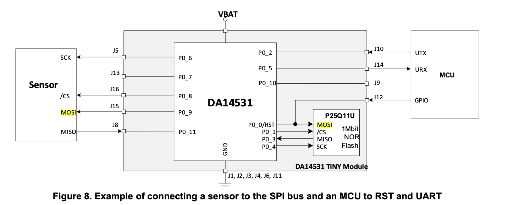

# da14531MOD

## Table of Contents

**[user_callback_config.h](#user_callback_configh)**

- [user_app_main_loop_callbacks](#user_app_main_loop_callbacks)

- [user_app_callbacks (`#if BLE_APP_SEC`)](#user_app_callbacks-if-ble_app_sec)

- [user_app_callbacks (`#if !defined(__DA14531_01__) && !defined(__DA14535__)`)](#user_app_callbacks-if-defined__da14531_01__--defined__da14535__)

**[da14531_config_advanced.h](#da14531_config_advancedh)**

- [CFG_LP_CLK(Low Power Clock)](#cfg_lp_clklow-power-clock)

**[Memory](#memory)**

- [메모리 구조](#메모리-구조)

- [SPI Flash Memory](#spi-flash-memory)

- [RAM](#ram)

- [ROM](#rom)

- [OTP](#otp)

**[SPI(Serial Peripheral Interface)](#spiserial-peripheral-interface)**

**[Advertisememt](#advertisement)**

- [광고 데이터 초기화 - BLE gapm 할당](#광고-데이터-초기화---ble-gapm-할당)

- [광고 데이터 초기화 - 데이터 추가](#광고-데이터-초기화---데이터-추가)

- [광고 송출](#광고-송출)

## user_callback_config.h

매인 로직을 다루는 모듈에 관한 함수 사용 여부를 결정한다.

### user_app_main_loop_callbacks

매인 루프시 실행할 함수를 결정한다.

구조체 좌항(.app*...) 부분은 SDK에서 미리 정의된 조건이며, 우항(user_on*...)은 매인 모듈에 정의할 메서드 이름을 명시한다.

- 네이밍 컨벤션에 따라 관례적으로 user\_...으로 정의한다.

사용하지 않는 기능에 대해선 NULL을 입력한다.

```c
static const struct arch_main_loop_callbacks user_app_main_loop_callbacks = {
    .app_on_init            = user_app_init,

    // By default the watchdog timer is reloaded and resumed when the system wakes up.
    // The user has to take into account the watchdog timer handling (keep it running,
    // freeze it, reload it, resume it, etc), when the app_on_ble_powered() is being
    // called and may potentially affect the main loop.
    .app_on_ble_powered     = user_on_ble_powered,

    // By default the watchdog timer is reloaded and resumed when the system wakes up.
    // The user has to take into account the watchdog timer handling (keep it running,
    // freeze it, reload it, resume it, etc), when the app_on_system_powered() is being
    // called and may potentially affect the main loop.
    .app_on_system_powered  = user_on_system_powered,

    .app_before_sleep       = NULL,
    .app_validate_sleep     = user_app_validate_sleep,
    .app_going_to_sleep     = NULL,
    .app_resume_from_sleep  = NULL,
};
```

**`app_on_init`**

시스템 초기화 시 한 번 실행된다.

애플리케이션 모듈 초기화, 하드웨어 설정, 타이머 등록 등 부팅 시 필요한 초기 설정을 수행한다.

**`app_on_ble_powered`**

BLE 블록이 활성화된 상태(광고, 스캔, 연결 등)에서 매 루프마다 실행된다.

- 시스템이 sleep에서 깨어날 때 Watchdog 타이머가 기본적으로 재로드(reload) 및 재시작(resume)된다. 이 콜백 내에서 Watchdog 타이머 처리 방식(유지, 정지, 재로드, 재시작 등)을 고려해야 하며, 이는 메인 루프 동작에 영향을 줄 수 있다.

**`app_on_system_powered`**

시스템이 wake up 상태인 경우 매 루프마다 실행된다.

- sleep 상태인 경우 실행하지 않는다.

- `app_on_ble_powered`와 마찬가지로 Watchdog 타이머 처리를 고려해야 한다.

**`app_before_sleep`**

모듈이 sleep 모드에 들어가기 직전에 실행된다.

**`app_validate_sleep`**

sleep 모드 진입 조건이 만족될 때 호출된다. 실제로 sleep에 들어갈지 여부를 결정한다.

- 반환값: `GOTO_SLEEP` (sleep 진입 허용) 또는 `DO_NOT_SLEEP` (sleep 진입 거부)

**`app_going_to_sleep`**

시스템이 sleep 진입을 결정한 후, 실제로 sleep 상태로 전환되기 직전에 실행된다.

**`app_resume_from_sleep`**

모듈이 sleep 상태에서 wake up 상태로 전환된 후에 실행된다.

### user_app_callbacks

BLE 연결, 광고, 보안 등 BLE 이벤트에 대한 콜백 함수를 결정한다.

구조체 좌항(.app\_...) 부분은 SDK에서 미리 정의된 조건이며, 우항은 해당 이벤트 발생 시 호출할 함수를 명시한다.

- SDK 기본 동작을 사용하는 경우 `default_app_...` 함수를 그대로 지정한다.
- 사용자 정의 동작이 필요한 경우 `user_app_...` 형태로 직접 구현한다.
- 사용하지 않는 기능에 대해선 NULL을 입력한다.

```c
static const struct app_callbacks user_app_callbacks = {
    .app_on_connection                  = user_app_connection,
    .app_on_disconnect                  = user_app_disconnect,
    .app_on_update_params_rejected      = NULL,
    .app_on_update_params_complete      = NULL,
    .app_on_set_dev_config_complete     = default_app_on_set_dev_config_complete,
    .app_on_adv_nonconn_complete        = NULL,
    .app_on_adv_undirect_complete       = user_app_adv_undirect_complete,
    .app_on_adv_direct_complete         = NULL,
    .app_on_db_init_complete            = default_app_on_db_init_complete,
    .app_on_scanning_completed          = NULL,
    .app_on_adv_report_ind              = NULL,
    .app_on_get_dev_name                = default_app_on_get_dev_name,
    .app_on_get_dev_appearance          = default_app_on_get_dev_appearance,
    .app_on_get_dev_slv_pref_params     = default_app_on_get_dev_slv_pref_params,
    .app_on_set_dev_info                = default_app_on_set_dev_info,
    .app_on_data_length_change          = NULL,
    .app_on_update_params_request       = default_app_update_params_request,
    .app_on_generate_static_random_addr = default_app_generate_static_random_addr,
    .app_on_svc_changed_cfg_ind         = NULL,
    .app_on_get_peer_features           = NULL,
#if (BLE_APP_SEC)
    .app_on_pairing_request             = NULL,
    .app_on_tk_exch                     = NULL,
    .app_on_irk_exch                    = NULL,
    .app_on_csrk_exch                   = NULL,
    .app_on_ltk_exch                    = NULL,
    .app_on_pairing_succeeded           = NULL,
    .app_on_encrypt_ind                 = NULL,
    .app_on_encrypt_req_ind             = NULL,
    .app_on_security_req_ind            = NULL,
    .app_on_addr_solved_ind             = NULL,
    .app_on_addr_resolve_failed         = NULL,
#if !defined (__DA14531_01__) && !defined (__DA14535__)
    .app_on_ral_cmp_evt                 = NULL,
    .app_on_ral_size_ind                = NULL,
    .app_on_ral_addr_ind                = NULL,
#endif // not for DA14531-01, DA14535
#endif // (BLE_APP_SEC)
};
```

#### 연결 관련 콜백

**`app_on_connection`**

BLE 연결이 수립될 때 호출된다.

연결 인덱스(connection index)와 연결 파라미터가 전달된다.

**`app_on_disconnect`**

BLE 연결이 끊어질 때 호출된다.

연결 해제 이후 재광고 시작 여부, 데이터 초기화 등을 처리한다.

**`app_on_update_params_rejected`**

연결 파라미터 업데이트 요청이 peer에 의해 거부됐을 때 호출된다.

**`app_on_update_params_complete`**

연결 파라미터 업데이트가 성공적으로 완료됐을 때 호출된다.

**`app_on_set_dev_config_complete`**

디바이스 설정이 완료됐을 때 호출된다.

- `default_app_on_set_dev_config_complete`: 설정 완료 후 광고를 시작한다.

#### 광고 완료 후 콜백

**`app_on_adv_nonconn_complete`**

Non-connectable 광고가 완료(종료)됐을 때 호출된다.

**`app_on_adv_undirect_complete`**

Undirected connectable 광고가 완료(종료)됐을 때 호출된다.

광고 타임아웃 또는 중지 후 재광고 처리 등에 활용된다.

**`app_on_adv_direct_complete`**

Directed 광고가 완료(종료)됐을 때 호출된다.

#### 광고 종류

| 항목           | non-connectable | undirected | directed                     |
| -------------- | --------------- | ---------- | ---------------------------- |
| 연결 가능 여부 | X               | O          | O (지정된 peer 한정)         |
| 대상           | broadcast       | broadcast  | unicast                      |
| 전력 소모      | 낮음            | 중간       | 매우 높음 (HDC) / 보통 (LDC) |

- **HDC(High Duty Cycle)** (`GAPM_ADV_DIRECT`): 3.75ms 간격으로 최대 1.28초간 광고. 연결 실패 시 자동 종료.
- **LDC(Low Duty Cycle)** (`GAPM_ADV_DIRECT_LDC`): 일반 undirected와 유사한 광고 간격. 전력 소모 낮음.

#### 기타 콜백

**`app_on_db_init_complete`**

GATT 데이터베이스 초기화가 완료됐을 때 호출된다.

- `default_app_on_db_init_complete`: DB 초기화 완료 후 광고를 시작한다.

**`app_on_scanning_completed`**

스캔이 완료됐을 때 호출된다.

**`app_on_adv_report_ind`**

스캔 중 광고 패킷이 수신됐을 때 호출된다.

**`app_on_get_dev_name`**

peer가 디바이스 이름을 요청했을 때 호출된다.

- `default_app_on_get_dev_name`: 설정된 디바이스 이름을 반환한다.

**`app_on_get_dev_appearance`**

peer가 디바이스 외형(Appearance) 값을 요청했을 때 호출된다.

- `default_app_on_get_dev_appearance`: 설정된 Appearance 값을 반환한다.

**`app_on_get_dev_slv_pref_params`**

peer가 슬레이브 선호 연결 파라미터(Slave Preferred Connection Parameters)를 요청했을 때 호출된다.

- `default_app_on_get_dev_slv_pref_params`: 설정된 파라미터를 반환한다.

**`app_on_set_dev_info`**

peer가 디바이스 정보를 변경하려 할 때 호출된다.

**`app_on_data_length_change`**

Data Length Extension(DLE) 파라미터가 변경됐을 때 호출된다.

- DLE는 BLE 4.2 이후 도입된 기능으로, 한 번에 전송 가능한 패킷 길이를 최대 251바이트까지 늘린다.

**`app_on_update_params_request`**

peer가 연결 파라미터 업데이트를 요청했을 때 호출된다.

- `default_app_update_params_request`: 요청을 수락한다.

**`app_on_generate_static_random_addr`**

정적 랜덤 주소(Static Random Address)를 생성/제공해야 할 때 호출된다.

- `default_app_generate_static_random_addr`: SDK 기본 방식으로 주소를 생성한다.

**`app_on_svc_changed_cfg_ind`**

Service Changed 특성의 CCCD(Client Characteristic Configuration Descriptor) 설정이 변경됐을 때 호출된다.

**`app_on_get_peer_features`**

peer의 BLE 기능(Feature) 정보가 수신됐을 때 호출된다.

### user_app_callbacks (`#if BLE_APP_SEC`)

**BLE_APP_SEC(Security)** 가 활성화된 경우에만 컴파일되는 보안 관련 콜백이다.

**`app_on_pairing_request`**

peer로부터 페어링 요청이 수신됐을 때 호출된다.

**`app_on_tk_exch`**

TK(Temporary Key) 교환이 필요할 때 호출된다.

Passkey 입력 또는 OOB(Out-Of-Band) 방식 페어링 시 사용된다.

**`app_on_irk_exch`**

IRK(Identity Resolving Key) 교환이 필요할 때 호출된다.

프라이버시 기능 사용 시 peer의 주소를 해석하기 위한 키다.

**`app_on_csrk_exch`**

CSRK(Connection Signature Resolving Key) 교환이 필요할 때 호출된다.

데이터 서명(Signing) 기능 사용 시 활용된다.

**`app_on_ltk_exch`**

LTK(Long Term Key) 교환이 필요할 때 호출된다.

재연결 시 암호화에 사용할 키로, NVDS에 저장하여 재사용할 수 있다.

**`app_on_pairing_succeeded`**

페어링이 성공적으로 완료됐을 때 호출된다.

**`app_on_encrypt_ind`**

링크 암호화가 완료됐을 때 호출된다 (암호화 활성화 표시).

**`app_on_encrypt_req_ind`**

peer가 암호화를 요청했을 때 호출된다.

**`app_on_security_req_ind`**

peer로부터 보안 요청 표시(Security Request Indication)가 수신됐을 때 호출된다.

**`app_on_addr_solved_ind`**

RPA(Resolvable Private Address) 해석이 완료됐을 때 호출된다.

**`app_on_addr_resolve_failed`**

RPA 주소 해석에 실패했을 때 호출된다.

### user_app_callbacks (`#if !defined(__DA14531_01__) && !defined(__DA14535__)`)

DA14531-01, DA14535 제외 모델에서만 컴파일되는 RAL(Resolving Address List) 관련 콜백이다.

- RAL(Resolving Address List)은 BLE 컨트롤러에 저장된 리스트로, IRK(Identity Resolving Key)와 BD 주소 쌍을 보관한다. RPA(Resolvable Private Address)가 수신됐을 때 해당 주소가 알려진 장치인지 해석(resolve)하는 데 사용된다. 주소를 변경하는 것은 RPA 메커니즘이며, RAL은 그 변경된 주소를 해석하는 역할을 한다.

**`app_on_ral_cmp_evt`**

RAL 관련 작업이 완료됐을 때 호출된다.

**`app_on_ral_size_ind`**

RAL 크기 표시(Size Indication)가 수신됐을 때 호출된다.

**`app_on_ral_addr_ind`**

RAL 주소 표시(Address Indication)가 수신됐을 때 호출된다.

---

## da14531_config_advanced.h

### CFG_LP_CLK(Low Power Clock)

```c
/****************************************************************************************************************/
/* Low Power clock selection.                                                                                   */
/*      -LP_CLK_XTAL32      External XTAL32K oscillator                                                         */
/*      -LP_CLK_RCX20       Internal RCX clock                                                                  */
/*      -LP_CLK_FROM_OTP    Use the selection in the corresponding field of OTP Header                          */
/****************************************************************************************************************/
#define CFG_LP_CLK              LP_CLK_RCX20
```

모듈이 **sleep** 모드에서 사용하는 클럭.

**`LP_CLK_XTAL32`**

수정(Crystal) 진동자로부터 생성된 클럭을 사용한다.

주파수(클럭)는 32.768kHz로 약 30.5µs 주기를 가진다. 크리스탈 발진 방식이므로 주파수가 매우 정확하다.

외부에 크리스탈 부품이 추가된 경우 사용할 수 있다.

크리스탈은 물리적으로 매우 안정적이므로, 주변 온도와 같은 환경에 영향을 잘 받지 않는다. 따라서 주파수가 일정하다.

**`LP_CLK_RCX20`**

모듈에 내장된 RC Oscillator로부터 생성된 클럭을 사용한다.

- RCX는 저항과 커패시터를 조합해서 만든 발진회로를 의미한다.

- RC는 저항(Resistor) 축전기(Capacitor)를 의미하며, X는 별도의 의미가 없다.

- 커패시터가 충전되어 전압이 임계값에 도달하면 방전하고, 방전이 완료되면 다시 충전을 시작하는 과정에서 방출된 전기 신호를 클럭으로 사용한다.

주파수는 약 20kHz 정도로, 50µs 주기를 가진다.

내장된 RCX의 저항(R)과 커패시터(C) 모두 온도에 따라 특성이 변하기 때문에 주파수가 일정하지 않다. 따라서 정확도(ppm, parts per million)가 떨어진다.

**`LP_CLK_FROM_OTP`**

OTP(One Time Programmable Memory) Header에서 값을 읽어와 적용.

- DA14531의 CFG_LP_CLK 설정의 속성은 LP_CLK_XTAL32(0x00), LP_CLK_RCX20(0x01)중에 결정해야 한다.

- CFG_LP_CLK 설정을 LP_CLK_FROM_OTP로 설정하는 경우 초기 부팅시 모듈은 OTP Header에서 값을 가져와 적용한다.

해당 속성으로 하는 경우 따로 SDK환경에서 OTP Header값을 설정해야 한다.

---

## Memory

### 메모리 구조

DA14531 메모리 구조는 다음과 같다.

```text
Processing and memories
- 16 MHz 32-bit Arm® Cortex® M0+ with SWD
interface
- 128 kB SPI Flash (외부 탑재, 1Mbit = 128KB, P25Q11U)
- 48 kB RAM
- 144 kB ROM
- 32 kB OTP

* REN_DA14531MOD_Datasheet_3v5_DST_20250514 - 1. key feature 참조
```

_SPI: Serial Peripheral Interface_

### SPI Flash Memory

flash 메모리 장치

**`펌웨어 코드(~30KB)`**

SDK 빌드 결과물 (.text / .data / .bss 세그먼트)

Flash 시작 주소(0x00)부터 적재

**`NVDS(Non-volatile Data Storage)`**

비휘발성 데이터, 전원 차단되어도 데이터가 유지되는 영역

Flash 끝부분에 위치 (펌웨어 영역과 분리)

저장 예: BLE 페어링 키, 연결 파라미터, 애플리케이션 설정값

### RAM

| RAM (48KB)                  |
| --------------------------- |
| Retention Memory(~32KB)     |
| BLE Stack 상태 데이터       |
| Message Heap(BLE 메시지 큐) |
| DB Heap(GATT DB)            |
| ENV Heap(연결 상태)         |
| NON_RET Heap(임시 데이터)   |

**`Retention RAM (최대 32KB, 설정으로 조절 가능)`**

Sleep 중에도 유지되는 영역 (Deep Sleep 포함)

전원 차단시 데이터 초기화

stored_adv_data[], accel_check_timer, app_connection_idx와 같이 sleep 상태에서도 유지가 필요한 변수를 저장

사용하는 Retention RAM 크기를 최소화할수록 Sleep 전력 소모 감소

**`일반 RAM`**

지역 변수, 임시 계산값 저장

Heap (DB, ENV, MSG, NON_RET), 함수 내 지역변수 등

Sleep 진입 시 데이터 소멸

### ROM

| ROM (144KB)                          |
| ------------------------------------ |
| BLE Stack 코드(GAP, GATT, L2CAP, LL) |
| 드라이버                             |

읽기 전용(Read Only), 데이터 변경 불가

공장에서 Renesas가 구워놓은 BLE 스택

사용자 코드 절대 못 들어감

**`BLE Stack`**

| BLE Stack                        | 역할                                                              |
| -------------------------------- | ----------------------------------------------------------------- |
| GAP (Generic Access Profile)     | 광고, 스캔, 연결 관리                                             |
| GATT (Generic Attribute Profile) | 서비스, 특성 관리                                                 |
| ATT (Attribute Protocol)         | GATT 데이터 읽기/쓰기 프로토콜                                    |
| SMP (Security Manager Protocol)  | 페어링/암호화/보안 관리                                           |
| L2CAP (Logical Link Control)     | 패킷 분할/조합                                                    |
| HCI (Host Controller Interface)  | Host-Controller 통신                                              |
| LL (Link Layer)                  | BLE 링크 제어 및 패킷 송수신 관리                                 |
| PHY (Physical Layer) 제어 일부   | RF modulation/demodulation 제어(실제 RF 아날로그 회로는 하드웨어) |

**`Boot ROM / Bootloader`**

전원 인가 후 boot mode를 확인하고 외부 SPI Flash, OTP, UART 등에서 코드를 RAM으로 로드

**`시스템 드라이버`**

- ROM에는 low-level library가 일부 존재한다.

| 저수준 시스템 드라이버 / 라이브러리 일부 |
| ---------------------------------------- |
| GPIO driver                              |
| UART driver                              |
| SPI driver                               |
| I2C(Inter Integrated Circuit) driver     |
| Timer driver                             |
| Clock driver                             |

- SDK에 driver source 상당수 존재, 즉 상위 peripheral 설정 코드는 주로 SDK source에 포함된다.

**`수학/유틸리티 라이브러리`**

TRNG(True Random Number Generator)

암호화 함수

### OTP

**`OTP Header (설정값 영역)`**

BD Address (Bluetooth Device Address, BLE MAC 주소)

- 공장에서 기록되는 값

LP_CLK 설정 (RCX20/XTAL32)

XTAL Trim (클럭 보정값)

디버거 비활성화 플래그

기타 하드웨어 설정값

**`OTP Code (펌웨어 영역)`**

양산용 firmware 저장 영역.

부팅 시 OTP의 코드를 RAM으로 복사한 뒤 실행한다.

---

## SPI(Serial Peripheral Interface)



1Mbit SPI메모리(P25Q11U)는 내부적으로 정해진 핀과 연결되어 있다.

### SPI 통신 특징

**`동기식(Synchronous) 직렬 통신`**

Master가 공급하는 SCLK에 맞춰 데이터 송수신.

**`전이중(Full-Duplex) 구조`**

MOSI/MISO가 동시에 존재하지만 Flash와의 통신은 명령 전송 후 응답을 받는 구조이므로 실질적으로 반이중(Half-Duplex)처럼 동작.

**`클럭 제한`**

P25Q11U Flash 자체는 최대 50MHz 클럭을 지원하나, DA14531 SPI 컨트롤러의 설정에 따라 실제 클럭은 제한됨.

### SPI 통신 구조

**Master(DA14531)**

- MOSI (Master Out Slave In): 데이터 송신

- MISO (Master In Slave Out): 데이터 수신

- SCLK (Serial Clock): 클럭 신호

- CS/SS (Chip Select): 슬레이브 선택

**Slave(SPI Flash, 센서 등)**

- DO (Data Out = MISO): 데이터 송신

- DI (Data In = MOSI): 데이터 수신

- CLK: 클럭 수신

- /CS (Chip Select, Active Low): 선택 신호 수신

### CPOL, CPHA

**CPOL(Clock Polarity, 클럭 극성)**

- 클럭 신호의 기본(Idle) 상태가 어떤 레벨인지 결정

```text
CPOL = 0 -> Idle 시 클럭이 LOW (0)
CPOL = 1 -> Idle 시 클럭이 HIGH (1)
```

**CPHA(Clock Phase, 클럭 위상)**

- 데이터를 언제 샘플링하는지 결정

```text
CPHA = 0 -> 클럭의 첫 번째 엣지에서 샘플링
CPHA = 1 -> 클럭의 두 번째 엣지에서 샘플링
```

### SPI Mode

| 모드   | CPOL | CPHA | Idle 클럭 | 샘플링 시점 |
| ------ | ---- | ---- | --------- | ----------- |
| Mode 0 | 0    | 0    | LOW       | 상승 엣지   |
| Mode 1 | 0    | 1    | LOW       | 하강 엣지   |
| Mode 2 | 1    | 0    | HIGH      | 하강 엣지   |
| Mode 3 | 1    | 1    | HIGH      | 상승 엣지   |

da14531에서 SPI flash(P25Q11U)는 Mode 0, Mode 3을 지원한다.

대부분의 센서/Flash가 상승엣지를 지원하고 호환성이 높기 때문에 일반적으로 **상승엣지** 를 기반으로 하는 Mode 0, Mode 3을 사용한다.

---

## Advertisement

DA14531 광고 송출을 위해 매인 모듈에 송출 메서드를 정의한다.

```c
void user_app_adv_start(void)
{
    struct gapm_start_advertise_cmd* cmd;
    cmd = app_easy_gap_undirected_advertise_get_active();


    if (cmd == NULL)
    {
        return;
    }
    memcpy(cmd->info.host.adv_data, stored_adv_data, stored_adv_data_len);
    cmd->info.host.adv_data_len = stored_adv_data_len;

    memcpy(cmd->info.host.scan_rsp_data, stored_scan_rsp_data, stored_scan_rsp_data_len);
    cmd->info.host.scan_rsp_data_len = stored_scan_rsp_data_len;

    app_easy_gap_undirected_advertise_start();
    is_advertising = 1;

    if (accel_check_timer == EASY_TIMER_INVALID_TIMER)
    {
        accel_check_timer = app_easy_timer(ACCEL_CHECK_INTERVAL, accel_check_timer_cb);
    }
}
```

### 광고 데이터 초기화 - BLE gapm 할당

SDK 내부에서 정의된 **app_easy_gap_undirected_advertise_get_active()** 메서드를 호출하여 SDK 내부에 미리 선언된 gapm 구조체를 가져온다.

**`선언 부분`**

```c
// app.c

static struct gapm_start_advertise_cmd *adv_cmd                                     __SECTION_ZERO("retention_mem_area0"); // @RETENTION MEMORY

struct gapm_start_advertise_cmd* app_easy_gap_undirected_advertise_get_active(void)
{
    return(app_easy_gap_undirected_advertise_start_create_msg());
}

static struct gapm_start_advertise_cmd* app_easy_gap_undirected_advertise_start_create_msg(void)
{
    // Allocate a message for GAP
    if (adv_cmd == NULL)  // Lazy Initialization: 최초 호출 시에만 메모리 할당
    {
        ASSERT_ERROR(USER_ADVERTISE_DATA_LEN <= (ADV_DATA_LEN - 3)); // The Flags data type are added by the ROM
        ASSERT_ERROR(USER_ADVERTISE_SCAN_RESPONSE_DATA_LEN <= SCAN_RSP_DATA_LEN);

        struct gapm_start_advertise_cmd *cmd;
        cmd = app_advertise_start_msg_create();
        adv_cmd = cmd; // 전역 포인터에 할당하여 이후 호출 시 재사용
        // ... (이하 gapm 구조체 필드 초기화 생략)
    }
    return adv_cmd;
}
```

- 내부적으로 전역 포인터 \*adv_cmd가 선언된 부분을 확인할 수 있다.

- **Lazy Initialization 패턴**: get_active() 메서드를 호출하면 `adv_cmd == NULL`인 경우(최초 호출 시)에만 메모리를 할당하고, 이후 호출에서는 기존에 할당된 구조체를 그대로 반환한다.

```text
app_easy_gap_undirected_advertise_get_active()
=> app_easy_gap_undirected_advertise_start_create_msg()
=> app_advertise_start_msg_create()
=> [KE_MSG 호출]
```

**`초기화(할당) 부분 - KE_MSG`**

gapm 구조체 메모리 영역은 **KE_MSG(Kernel Message)** 시스템을 기반으로 할당된다.

- KE_MSG는 [Message Passing](https://en.wikipedia.org/wiki/Message_passing)이론을 기반으로 구현된 시스템이다.

- 커널 메시지 시스템이 메시지를 등록하면 메인 루프에서 메시지 큐를 확인하여 처리한다.
  - 실제 message passing은 두 주체가 직접적으로 통신하지 않고 메시지 전달, 수신으로 각자의 역할을 하여 멀티쓰레드 기반으로 동작해야 하지만, DA14531모듈 내부에서는 개념적으로 message passing을 사용하고, 실제로는 단일 쓰레드 방식으로 프로세스가 진행된다.

**동작 방식**

```c
// main loop
...
while(1) {
    ├── 이벤트 확인
    ├── 메시지 큐 확인
    │     ├── TASK_GAPM 메시지 있음? → gapm 핸들러 실행
    │     ├── TASK_APP 메시지 있음?  → app 핸들러 실행
    │     └── ...
    └── 처리 끝나면 sleep
}
```

**KE MSG 위치**

```c
// app_mid.h
/**
 ****************************************************************************************
 * @brief Create a start advertise message.
 * @return The pointer to the created message.
 ****************************************************************************************
 */
__STATIC_FORCEINLINE struct gapm_start_advertise_cmd* app_advertise_start_msg_create(void)
{
    struct gapm_start_advertise_cmd* cmd = KE_MSG_ALLOC(GAPM_START_ADVERTISE_CMD,
                                                        TASK_GAPM,   // 목적지: GAPM 태스크
                                                        TASK_APP,    // 송신자: APP 태스크
                                                        gapm_start_advertise_cmd);

    return cmd;
}


// ke_msg.h

#define KE_MSG_ALLOC(id, dest, src, param_str) \
    (struct param_str*) ke_msg_alloc(id, dest, src, sizeof(struct param_str))

```

- `TASK_GAPM`: 메시지의 목적지. 커널이 메시지를 GAPM 태스크 핸들러로 라우팅한다.
- `TASK_APP`: 메시지 송신자. 응답 메시지가 돌아올 경우 어느 태스크로 보낼지를 나타낸다.
- `KE_MSG_ALLOC`은 메모리만 할당하며, 실제 메시지 전송(광고 시작)은 이후 `app_easy_gap_undirected_advertise_start()` 호출 시 이루어진다.

```text
KE_MSG_ALLOC(매크로)
-> ke_msg_alloc
-> gapm 구조체 크기만큼 커널 힙 메모리 할당
```

**gapm 할당을 담당하는 커널 메시지 함수 ke_msg_alloc의 구현 로직은 lib파일에 인코딩되어있어 확인이 불가능하다.**

**`advertise gapm(Generic Access Profile Manager) 구조체`**

**gapm_start_advertise_cmd** 구조체는 BLE 광고 시작을 위한 명령을 포함한다.

- 광고 데이터, 스캔 응답 데이터, 광고 타입, 광고 간격 등 광고에 필요한 모든 설정값을 포함한다.

```c
/***
 gapm_task.h /
* */
/// Set advertising mode Command
struct gapm_start_advertise_cmd
{
    /// GAPM requested operation:
    /// - GAPM_ADV_NON_CONN: Start non connectable advertising
    /// - GAPM_ADV_UNDIRECT: Start undirected connectable advertising
    /// - GAPM_ADV_DIRECT: Start directed connectable advertising
    /// - GAPM_ADV_DIRECT_LDC: Start directed connectable advertising using Low Duty Cycle
    struct gapm_air_operation op;

    /// Minimum interval for advertising
    uint16_t             intv_min;
    /// Maximum interval for advertising
    uint16_t             intv_max;

    ///Advertising channel map
    uint8_t              channel_map;

    /// Advertising information
    union gapm_adv_info
    {
        /// Host information advertising data (GAPM_ADV_NON_CONN and GAPM_ADV_UNDIRECT)
        struct gapm_adv_host host;
        ///  Direct address information (GAPM_ADV_DIRECT)
        /// (used only if reconnection address isn't set or host privacy is disabled)
        struct gap_bdaddr direct;
    } info;
};
```

gapm_task.h 헤더파일은 광고 시작을 위한 gapm 외에도 다양한 기능을 위한 gapm 구조체들이 정의되어 있다.

### 광고 데이터 초기화 - 데이터 추가

라이브러리 함수 **memcpy** 를 활용하여 gapm 구조체(cmd)의 광고 데이터를 추가한다.

`stored_adv_data` / `stored_scan_rsp_data` 는 user_app_callbacks 등에서 미리 구성된 광고 페이로드 배열로, `memcpy`를 통해 gapm 구조체로 복사된다.

**구현 코드**

```c
void user_app_adv_start(void)
{
    struct gapm_start_advertise_cmd* cmd;
    cmd = app_easy_gap_undirected_advertise_get_active();

    if (cmd == NULL)
    {
        return;
    }
    memcpy(cmd->info.host.adv_data, stored_adv_data, stored_adv_data_len);
    cmd->info.host.adv_data_len = stored_adv_data_len;

    memcpy(cmd->info.host.scan_rsp_data, stored_scan_rsp_data, stored_scan_rsp_data_len);
    cmd->info.host.scan_rsp_data_len = stored_scan_rsp_data_len;

    app_easy_gap_undirected_advertise_start();  // 위에서 구성한 cmd를 GAPM에 전송
}
```

광고 데이터는 gapm 구조체의 info.host 부분에서 정의할 수 있다.

**cmd->info.host 구조**

```c
// gapm_task.h

/// Advertising data that contains information set by host.
struct gapm_adv_host
{
    /// Advertising mode :
    /// - GAP_NON_DISCOVERABLE: Non discoverable mode
    /// - GAP_GEN_DISCOVERABLE: General discoverable mode
    /// - GAP_LIM_DISCOVERABLE: Limited discoverable mode
    /// - GAP_BROADCASTER_MODE: Broadcaster mode
    uint8_t              mode;

    /// Advertising filter policy:
    /// - ADV_ALLOW_SCAN_ANY_CON_ANY: Allow both scan and connection requests from anyone
    /// - ADV_ALLOW_SCAN_WLST_CON_ANY: Allow both scan req from White List devices only and
    ///   connection req from anyone
    /// - ADV_ALLOW_SCAN_ANY_CON_WLST: Allow both scan req from anyone and connection req
    ///   from White List devices only
    /// - ADV_ALLOW_SCAN_WLST_CON_WLST: Allow scan and connection requests from White List
    ///   devices only
    uint8_t              adv_filt_policy;

    /// Advertising data length - maximum 28 bytes, 3 bytes are reserved to set
    /// Advertising AD type flags, shall not be set in advertising data
    uint8_t              adv_data_len;
    /// Advertising data
    uint8_t              adv_data[ADV_DATA_LEN];
    /// Scan response data length- maximum 31 bytes
    uint8_t              scan_rsp_data_len;
    /// Scan response data
    uint8_t              scan_rsp_data[SCAN_RSP_DATA_LEN];
    /// Peer Info - bdaddr
    struct gap_bdaddr peer_info;
};
```

**`광고 데이터`**

광고 데이터는 총 두 파트로 구분되어 있다.

**BLE AD(Advertising Data) 기본 구조**

BLE 광고 페이로드는 하나 이상의 AD 구조체로 구성된다. 각 AD 구조체는 다음 형식을 따른다.

| Length (1B)      | AD Type (1B) | AD Data (Length-1 B) |
| ---------------- | ------------ | -------------------- |
| Type + Data 길이 | 데이터 종류  | 실제 데이터          |

여러 AD 구조체를 이어 붙여 하나의 adv_data 버퍼를 채운다.

**ADV data 코드 구조**

```c
#define USER_ADVERTISE_DATA         ("\x06"\
                                    ADV_TYPE_COMPLETE_LOCAL_NAME\
                                    "Parke"\
                                    "\x03"\
                                    ADV_TYPE_COMPLETE_LIST_16BIT_SERVICE_IDS\
                                    "\x00\xFF"\
                                    "\x0C"\
                                    ADV_TYPE_MANUFACTURER_SPECIFIC_DATA\
                                    "\xFF\xFF"\
                                    "UNSET000"\
                                    "\x00") // Tx Power Level
```

- adv데이터는 28바이트 내로 각 필드마다 데이터 크기를 명시하여 나누어 설정할 수 있다.

- 데이터를 구분하는 형식은 다음과 같다(e.g. Local name 속성 정의)

| 필드(u_int8)                 | 의미                                      |
| ---------------------------- | ----------------------------------------- |
| "\x06"\|                     | 속성 총 크기(자신 제외) - 6byte 사용 명시 |
| ADV_TYPE_COMPLETE_LOCAL_NAME | 속성 유형(예약된 값 사용) - 1byte         |
| "Parke"                      | 속성 값 - 5byte                           |

**ADV data 내부 구조**

- 최대 31바이트 크기를 가지지만, 앞 3바이트는 SDK가 자동으로 Advertising Flags AD를 채우기 때문에 사용자가 설정할 수 있는 공간은 최대 28바이트이다.

- 헤더에 Flags AD가 자동으로 포함되는 구조이다.

| Length  | Type    | Flags   |
| ------- | ------- | ------- |
| 1바이트 | 1바이트 | 1바이트 |
| 0x02    | 0x01    | 값      |

Flags의 각 비트는 다음과 같은 설정값을 포함한다.

| Bit     | 의미                                                |
| ------- | --------------------------------------------------- |
| Bit 0   | LE Limited Discoverable Mode                        |
| Bit 1   | LE General Discoverable Mode (GAP_GEN_DISCOVERABLE) |
| Bit 2   | BR/EDR Not Supported (BLE only 장치면 1)            |
| Bit 3   | Simultaneous LE and BR/EDR (Controller)             |
| Bit 4   | Simultaneous LE and BR/EDR (Host)                   |
| Bit 5~7 | Reserved                                            |

**rsp(response) data**

- 최대 31바이트까지 설정할 수 있으며, ADV data와 동일한 AD 구조체 포맷을 따른다.
- 일반적으로 장치 이름(Complete Local Name, AD Type `0x09`), TX Power Level 등의 부가 정보를 담는다.
- ADV data와 달리 SDK가 자동으로 삽입하는 예약 바이트가 없으므로 31바이트를 온전히 사용할 수 있다.

### 광고 송출

이후 **app_easy_gap_undirected_advertise_start()** 메서드를 통해 gapm 구조체를 참조하여 메시지 송출을 시작한다.

광고 타입은 총 세가지 방식이 있는데 기본적으로 undirected 방식을 사용한다.

- [광고 종류(non-connectable, undirected, directed)](#광고-종류)

**`광고 송수신 (undirected)`**

```text
nRF Scanner                         DA14531
    │                                  │
    │<── ADV_IND (adv_data) ────────── │  DA14531이 주기적으로 broadcast
    │                                  │
    │─── SCAN_REQ ────────────────────>│  스캐너가 추가 정보 요청
    │                                  │
    │<── SCAN_RSP (scan_rsp_data) ──── │  DA14531이 응답 데이터 전송
    │                                  │
    │─── CONNECT_REQ ────────────────> │  스캐너가 연결 요청
```

- **ADV_IND**: DA14531이 `intv_min`~`intv_max` 범위의 주기로 광고 패킷을 broadcast한다. connectable undirected 타입으로, 누구든 연결 요청을 보낼 수 있다.
- **SCAN_REQ / SCAN_RSP**: 스캐너(nRF)가 ADV_IND 수신 후 추가 정보를 원할 경우 SCAN_REQ를 전송한다. 이 과정은 스캐너 BLE 스택이 자동으로 처리하며, 앱 레벨에서는 인지하지 못한다. DA14531은 scan_rsp_data를 응답으로 돌려준다.
- **CONNECT_REQ**: 스캐너가 연결을 원할 경우 전송한다. DA14531이 수락하면 GAP 연결이 수립되고 광고가 중단된다.

**`내부 동작`**

```text
--- DA14531 내부 ----
advertise_start() -> KE_MSG_SEND()
-> GAPM 태스크가 메시지 Pop
-> GAPM이 LL(Link Layer)에게 광고 설정 전달
-> LL이 광고 설정값(채널, 간격, 페이로드 등)을 내부 레지스터에 저장
-> RF Transceiver를 통해 신호 생성(PA 증폭, GFSK 변조)
-> RFIO 핀을 통해 외부로 신호를 전달
--- DA14531 외부 ----
-> 매칭 네트워크(임피던스 정합)
-> 안테나를 통한 송출 (GAPM/앱 개입 없이 자동 반복 송출)
```

BLE 스택의 LL(Link Layer)에서 광고 데이터를 내부 레지스터에 저장하기 때문에 GAPM 개입 없이 반복해서 같은 광고를 송출할 수 있다.

광고 주기는 `gapm_start_advertise_cmd`의 `intv_min` / `intv_max` 필드로 설정하며, 실제 타이머 정밀도는 [CFG_LP_CLK](#cfg_lp_clklow-power-clock) 설정값에 의존한다.

**RF Transceiver Block**

| RF Transceiver                                                                                                                       |
| ------------------------------------------------------------------------------------------------------------------------------------ |
| PA(Power Amplifier)                                                                                                                  |
| [GFSK(Gaussian Frequency Shift Keying)](https://en.wikipedia.org/wiki/Frequency-shift_keying#Gaussian_frequency-shift_keying) 변조기 |
| RFIO (칩셋 내부와 외부를 연결하는 인터페이스)                                                                                        |
