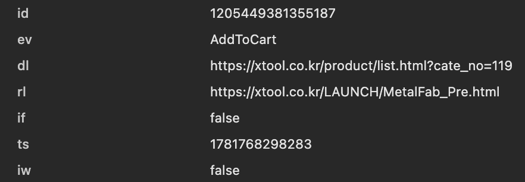

# Meta ads

## Parameters

**`id(Pixel id)`**

| 분류 | 설명                                                                   |
| ---- | ---------------------------------------------------------------------- |
| 목적 | 이벤트 데이터를 어느 광고 계정 및 픽셀로 귀속시킬지 식별하는 고유 번호 |

**`ev(Event Name)`**

| 분류      | 설명                                                                 |
| --------- | -------------------------------------------------------------------- |
| 목적      | Meta 서버에 어떤 행동이 발생했는지 알려주는 이벤트 분류자            |
| 생성 경로 | fbq('track', ...) 또는 fbq('trackSingle', ...) 형태로 직접 지정한 값 |

**`dl(Document location)`**

| 분류      | 설명                                                                                                                                                            |
| --------- | --------------------------------------------------------------------------------------------------------------------------------------------------------------- |
| 목적      | 이벤트가 실제로 발생한 URL을 기록, meta측에서 이벤트를 특정 URL과 연결하여, 어떤 페이지에서 행동이 발생했는지 추적하고, custom audience의 URL필터링에도 활용됨. |
| 생성 경로 | 픽셀 베이스 코드가 실행될 때 브라우저의 **window.location.href** 값을 자동으로 수집하여 전송                                                                    |

- 픽셀 베이스 코드(Pixel Base Code)는 html **head** 태그 안에 삽입되는 코드다.

**`rl(Referrer Location)`**

| 분류      | 설명                                                                                                                                               |
| --------- | -------------------------------------------------------------------------------------------------------------------------------------------------- |
| 목적      | 사용자가 직전에 어디서 왔는지 기록, 유입 경로 분석에 쓰이며, Meta 내부에서 광고 클릭 &rarr; 랜딩 &rarr; 행동으로 이어지는 여정을 추적하는데 활용됨 |
| 생성 경로 | 픽셀 베이스 코드 실행시 자동으로 **document.referrer** 를 읽어서 수집                                                                              |

**`if(iFrame)`**

| 분류      | 설명                                                                                                                                                       |
| --------- | ---------------------------------------------------------------------------------------------------------------------------------------------------------- |
| 목적      | 픽셀이 iFrame 내부에서 실행되었는지 여부 구분 플래그, Meta측에서 데이터 신뢰도 판단에 사용하며, iFrame 내부에서 발생한 이벤트는 일부 기능이 제한될 수 있음 |
| 생성 경로 | 픽셀 베이스 코드 로드시 **window.self === window.top** 조건으로 판별하여 자동 전송                                                                         |

iFrame 내부 픽셀 실행이 신뢰도 측면에서 문제가 될 수 있는 이유는 다음과 같다.

**1. 쿠키 접근 제한**

- iFrame 내부 코드는 메인 페이지의 **_fbp** 쿠키에 접근하지 못하는 경우가 많다. 즉, 브라우저 보안 정책으로 인해 도메인이 다른 iFrame은 상위 페이지의 쿠키를 읽을 수 없어서, 사용자 식별 정보를 파악할 수 없다.

**2. URL 맥락 왜곡**

- iFrame에서 실행되는 베이스코드는 해당 iFrame의 URL(window.location.href)을 읽게되어 해당 값이 dl값으로 잡힌다. 따라서 사용자 방문 추적에 혼란을 줄 수 있다.

**3. 이벤트 중복**

- 메인 페이지와 iFrame 동시에 픽셀이 있는 경우 이벤트가 중복 집계될 가능성이 있다.

**`ts(Timestamp)`**

| 분류      | 설명                                                                                                                                                                                                    |
| --------- | ------------------------------------------------------------------------------------------------------------------------------------------------------------------------------------------------------- |
| 목적      | 이벤트가 언제 발생했는지 기록   광고 노출, 클릭과 전환 사이의 시간 간격을 계산하여 기여(attribution)를 판단하는 핵심 값 CAPI와 Pixel 이벤트 중복 제거(deduplication)시에도 시간 기준으로 활용됨 |
| 생성 경로 | **Date.now()** 로 밀리초를 얻은 뒤 1000으로 나눠 초 단위 Unix timestamp로 변환하여 전송                                                                                                                |

**`iw(Is Wrapper)`**

| 분류      | 설명                                                                                                                                                                        |
| --------- | --------------------------------------------------------------------------------------------------------------------------------------------------------------------------- |
| 목적      | 픽셀이 Meta의 공식 래퍼 라이브러리를 통해 실행되었는지 여부를 나타내는 플래그  서드파티 또는 커스텀 래퍼를 통해 픽셀이 감싸져 실행되는 경우를 구분하기 위한 내부 진단값 |
| 생성 경로 | 픽셀 로드 환경을 자동 감지해서 설정됨, false 값은 래퍼없이 실행되었다는 의미로, 정상 상태를 의미                                                                            |

wrapper 라이브러리로 실행된 코드를 구분하는 이유는 다음과 같다.

**1. 동의 관리(CMP, Consent Management Platform)**

- 메타 픽셀은 쿠키를 기반으로 정보를 수집하므로, 개인정보보호법 등에 의하여 사용자가 동의하지 않으면 픽셀이 실행되면 안된다.

- CMP는 래퍼 역할을 하여 동의한 사용자에게만 픽셀을 실행 하도록 제어할 수 있다.

**2. 커스텀 데이터 가공**

- 픽셀이 실행되기 전에 커스텀 래퍼를 통해 데이터를 가공, 필터링 등 하는 경우가 있다.

- 커스텀 래퍼를 거치는 경우 일부 파라미터가 누락되는 경우가 있어 **iw=true** 인 경우 Meta 내부적으로 신뢰도 가중치를 보정할 수 있다.

- 이벤트에 문제가 생겼을시 픽셀 문제인지, 래퍼 문제인지 구분하기 위한 진단 플래그 역할도 담당한다.

---

## Specifications

### Attribution(기여)

전환 달성시, 해당 전환이 어떤 광고 덕분에 발생했는지 판단하는 규칙 체계.

**`Attribution Window(기여 윈도우)`**

Meta가 기여를 인정하는 시간 범위.

기여를 인정하는 범위의 기본 값은 다음과 같다.

- **Click-Through** : 광고 클릭 후 7일 이내 전환 &rarr; 해당 광고에 기여 인정

- **View-Through** : 광고 노출 후 1일 이내 전환 &rarr; 해당 광고에 기여 인정 (클릭 없이 노출만으로도 인정)

두 조건이 동시에 충족될 경우, 클릭(Click-Through)이 우선 적용된다.
