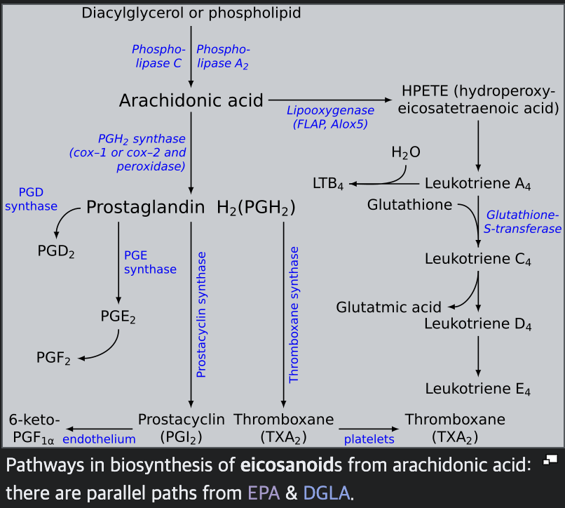
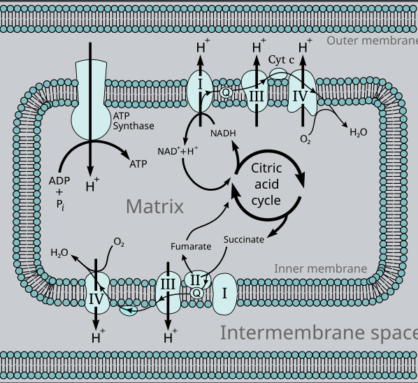
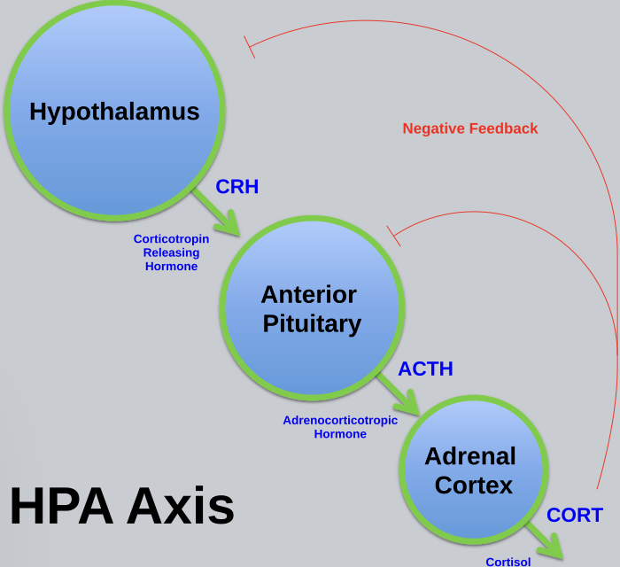
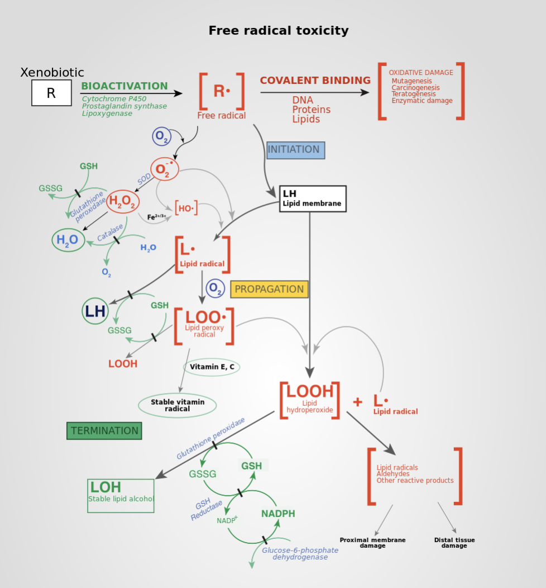
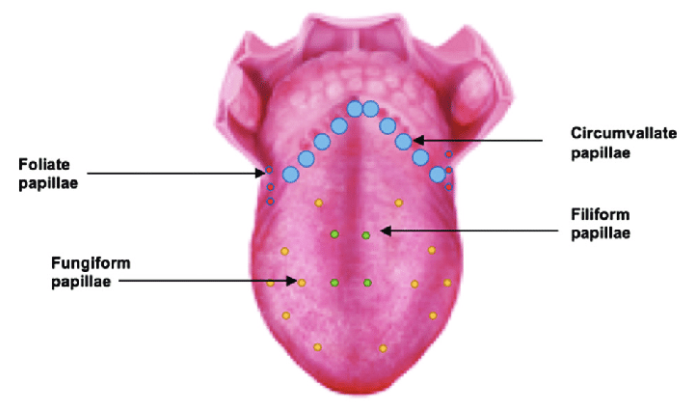
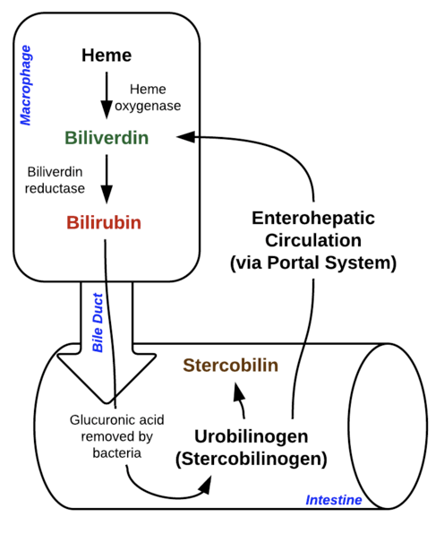

<link rel="stylesheet" href="./style.css" />

# 해독 혁명 - Detox Revolution

### Overview

- **빈부 격차는 기회를 빼앗지만, 건강 격차는 삶을 빼앗는다.**

- 몸을 단순히 개별 장기의 집합으로 보는 것이 아닌 하나의 시스템으로 이해하는 것.

- 즉 몸은 하나의 시스템으로 연결 되어 있다는 것이다. 그래서 `삶을 대하는 태도`, 즉 생활습관과 식습관이 우리의 건강을 결정한다.

- 노화의 속도를 늦춘다 &rarr; 몸의 기능을 온전히 유지하며, 사는 기간을 최대한 늘리곘다.

- **건강 지식**

  - `적확` 하고 우리의 삶에 적용 시킬 수 있는, 내면화 할 수 있는 지식을 잘 쌓아야 한다.

  - 그러한 지식이 우리의 삶을 바꾸는 지식이 된다.

- **몸의 연결**

  - 우리 몸의 시스템을 `망라`하는 원리를 파악하는것부터 시작.

  - 그 안에서 우리의 생활습관, 식습관과 관련된 원인을 찾는 것.

- **건강한 몸**

  - 건강한 몸을 위해선 `해독(detox)`은 필수 선결 조건이다.

  - 이 책에서는 해독을 위해 `십자화과 채소(cruciferous vegetable)` 섭취를 강조한다.

  - 십자화과 채소에 포함된 `phytochemical` 의 종류인 `sulforaphane` 이라는 물질은 `glutathione` 항산화 물질 생성을 촉진한다.

_적확하다 - 조금도 틀리거나 어긋남 없이 정확하고 확실하다_

_망라하다 - 널리 받아들여 모두 포함하다_

_phytochemical - 모든 식물에 포함된 유기적 물질_

### Table of contents

- [Propionic Acid(PPA)](#propionic-acidppa---프로피온산)

- [Prostaglandin(PG)](#prostaglandinpg)

- [간기능 - liver funciton test](#간기능---liver-function-test)

- [Dopamine](#dopamine)

- [Prefrontal Cortex - 전전두엽](#prefrontal-cortex---전전두엽)

- [Urea(요소) - Uric Acid(요산)](#urea요소---uric-acid요산)

- [Estrogen metabolism](#estrogen-metabolism)

- [Mercury Poisoning - 수은 중독](#mercury-poisoning---수은-중독)

- [Mercury - Thyroid gland](#mercury---thyroid-gland)

- [Inorganic Arsenic (무기 비소)](#inorganic-arsenic-무기-비소)

- [Environmental hormone - 환경 호르몬](#environmental-hormone---환경-호르몬)

- [농약 - herbicide](#농약---herbicide)

- [Advanced Glycation end-products - 최종 당화 산물](#advanced-glycation-end-products---최종-당화-산물)

- [liver](#liver)

- [bile - 담즙의 중요성](#bile---담즙의-중요성)

- [Enterohepatic Circulation - 장간 순환](#enterohepatic-circulation---장간-순환)

- [stomach - 위](#stomach---위)

- [gut microbiota - 장내 세균총](#gut-microbiota---장내-세균총)

- [Stomach - Gastric Ulcer, GERD](#stomach---gastric-ulcer-gerd)

- [Gluten](#gluten)

- [Casein protein](#casein-protein)

- [fiber - 식이섬유](#fiber---식이섬유)

- [Glutathione Composition](#glutathione-composition)

- [liposomal glutathione](#liposomal-glutathione)

- [Secretin](#secretin)

- [Urine output](#urine-output)

- [Mitochondrion](#mitochondrion)

- [Cortisol - stress hormone](#cortisol---stress-hormone)

- [Vitamin E](#vitamin-e)

- [ROS - mitochondrion](#ros---mitochondrion)

- [Autophagy - 자가 포식](#autophagy---자가-포식)

- [Betaine](#betaine)

- [Taste buds](#taste-buds)

- [RBC - bilirubin](#rbc---bilirubin)

- [Cruciferous Vegetables](#cruciferous-vegetables)

- [food additive - sugar substitute](#food-additive---sugar-substitute)

- [애호박 - pectin](#애호박---pectin)

- [cholesterol](#cholesterol)

- [Tomato - lycopene](#tomato---lycopene)

- [Oxalate](#oxalate)

- [HbA1c](#hba1c)

## Propionic Acid(PPA) - 프로피온산

- [프로피온산 - propionic acid(PPA)](https://en.wikipedia.org/wiki/Propionic_acid) 은 우리 몸에서 **장내 새균(gut microbiota)** 에 의해 식이섬유(dietary fiber)가 대사될 때 최종적으로 생성되는 대사산물이자 흔히 발견되는 **단쇄지방산(SCFA - short-chain fatty acid)** 중 한 종류다.

- PPA는 일반적으로 식품의 유통기한을 늘리기 위해 `방부제` 같은 느낌으로 넣는 `식품첨가제` 로도 사용되는 물질이다.

  - 프로피온산은 곰팡이의 증식을 자신의 무게의 0.1 ~ 1 퍼센트의 성장까지만 제한 한다고 한다.

- 하지만 PPA를 과다 섭취하면 [신경줄기세포](https://en.wikipedia.org/wiki/Neural_stem_cell) 에 안좋은 영향을 미친다. `신경회로` 를 변경해서 일부 신경세포를 과다 증식하게 만든다.

  - 신경회로가 변경되는 형태가 자폐아동 뇌 양상과 동일했다.

  - 그래서 `임신중` 에 PPA를 과도하게 섭취하게 되면 태아의 자폐 발생 확률이 높아진다고 한다.

## Prostaglandin(PG)

- [Prostaglandin(PG)](https://en.wikipedia.org/wiki/Prostaglandin) 은 염증 조절, 다양한 생리적 기능과 관련된 물질이다.

- 불포화 지방산인 오메가-6라고 불리는 [arachidonic acid](https://en.wikipedia.org/wiki/Arachidonic_acid) 지방산이 효소적 또는 비효소적 반응에 의해 **신호분자(signaling molecule)** 인 [eicosanoid](https://en.wikipedia.org/wiki/Eicosanoid) 물질이 된다.

- **arachidonic acid** 물질은 여러 경로에 의해 다른 물질로 변하며, 그 중 [COX(cyclooxygenase)](https://en.wikipedia.org/wiki/Cyclooxygenase) 효소에 의한 대사(산화) 경로를 거쳐 생성된 eicosanoid 물질이 활성화되면 prostaglandin이라 할 수 있다.

  - 즉 오메가-6 지방산은 Prostaglandin 물질의 전구체(precursor)라고 할 수 있겠다.

- PG 물질도 COX-1, COX-2 효소 경로에 따라 생성되는 종류가 다르다.

  - **COX-1** 을 통해 생성된 PG 물질은 몸의 항상성 유지와 관련된 기능을 한다.

  - **COX-2** 을 통해 생성된 PG 물질은 몸의 염증 반응에 대한 조절 기능을 한다. 즉 **고통을 준다.**

  - 평소에 염증 상황이 없는 경우 COX-2 효소의 발현도는 낮지만, **염증 상황이 있는 경우** COX-2에 의한 대사가 우선되므로, COX-2를 통한 PG가 많이 생성되어 많은 고통으로 이어지게 된다.

- PG 물질은 hormone-like effect 효과가 있는데, `생리통` 과 관련된 PG 물질(PGF2α)이 있다. `PGF2⍺` 물질은 `COX-2 경로` 를 거쳐 생성되며, 생리기간에 `자궁벽과 자궁혈관을 수축` 하는데 영향을 준다고 한다.

  - 이는 `자궁산소부족` 으로 이끌게 되며 이는 생리통의 주원인이 된다고 한다.

- `진통소염제(NSAID: Non-steroidal Anti-inflammatory Drug)`의 역할이 PG농도룰 줄이는 역할이라고 한다. 하지만 NSAID를 장기적으로 복용하게 되면 항상성 유지에 관여하는 COX-1 효소의 역할도 억제되어, 결국 장 건강에 좋지 않다고 한다.

- PG는 [Estrogen](#estrogen-metabolism)과 간접적으로 관계가 있다.

  - Estrogen은 `생리통과 관련된 PG를 합성하는 효소(COX-2)의 발현`을 촉진시킨다.

  - 그래서 Estrogen 수치를 조절하는 것이 중요하다.

  - Estrogen은 대사, 간해독 과정을 통해서 결과적으로 `장으로 배출` 되어야 한다.

  - 하지만 변비 또는 장내 세균총 문제등으로 인해 배출이 안되면 `장내 혈관을 통해 재흡수` 될 수 있다.

  - 따라서 장건강을 유지해서 장배출이 잘 되도록 해야한다.

## 간기능 - liver function test

- `ALT - Alanine Aminotransferase`

- `AST - Aspartate Aminotransferase`

- `GGT - Gamma-glutamyltransferase`

- 피검사를 할 때 세 가지 요소의 수치가 높게 나오면 간의 상태가 좋지 않다고 판단할 수 있다.

- ALT, AST, GGT 효소는 `간세포`에 많이 분포한다.

  - [ALT](https://en.wikipedia.org/wiki/Alanine_transaminase) 효소는 [alanine](https://en.wikipedia.org/wiki/Alanine) 아미노산 과 관련한 에너지, 아미노산 대사에 관여하는 효소로, 주로 간세포에 분포해서 간이 손상되면 해당 수치가 높게 나온다.

  - [AST](https://en.wikipedia.org/wiki/Aspartate_transaminase) 효소는 [aspartic acid](https://en.wikipedia.org/wiki/Aspartic_acid) 아미노산과 관련된 아미노산, 에너지 대사에 관여하는 효소로, 간 뿐만이 아닌 다른 기관에도 분포하기 때문에 `간 특이성` 이 ALT에 비해 상대적으로 낮다.

    - 그래서 일반적으로 간 수치를 볼 떄 ALT/AST 두 수치를 보고 평가하며, [AST/ALT Ratio](https://en.wikipedia.org/wiki/AST/ALT_ratio)에 따라 간 질환 유형을 감별한다.

  - [GGT](https://en.wikipedia.org/wiki/Gamma-glutamyltransferase) 효소는 [Glutathione](#glutathione-composition) 과 관련된 대사에 관여하는 효소다. 간에 주로 분포를 하지만 간 손상뿐만이 아닌 산화적 스트레스등 이유로 수치가 높게 나오기도 한다.

- 결론저긍로 간이 손상된 경우 간세포의 투과성이 증가되거나 파괴 되어 해당 효소가 혈액으로 방출된다. 이로 인해 해당 효소들이 혈액에서 검출되는 것이다.

## Dopamine

- [도파민(Dopamine - Dihydroxyphenethylamine)](https://en.wikipedia.org/wiki/Dopamine)은 자극에 대한 **보상을 예측** 하는 신경조절물질이자 호르몬이다.

- 우리의 뇌는 본능적으로 도파민을 쫒는다.

- 뇌는 여러 상황을 통해서 보상과 관련된 행동 패턴을 학습하며, 이를 기반으로 도파민 분비가 조절된다.

  1. **경험 기반의 기대** - `과거의 경험을 바탕으로` 행위, 자극에 대한 `결과를 예측`한다.

  2. **보상 예측** - 보상이 기대되는 상황에서 보상이 발생하기 전에 `미리 행복을 느낀다`.

  3. **학습과 강화** - `예측 오류(Prediction error)`를 통한 학습 강화. 예상보다 보상이 크면 도파민 분비가 증가하고, 보상이 작으면 분비가 적어진다.

  4. **동기부여** - 예상되는 보상을 기반으로 `동기를 부여` 해주고, 목표를 달성하도록 노력을 촉진시킨다.

- 도파민은 신경 자극을 받을 때 분비 되는데, 도파민 합성을 위한 [tyrosine](https://en.wikipedia.org/wiki/Tyrosine) 아미노산을 섭취하는 것도 중요하다.

## Prefrontal Cortex - 전전두엽

- 우리의 본능을 따르지 않으려면 [prefrontal cortex](https://en.wikipedia.org/wiki/Prefrontal_cortex)의 기능을 유지하는 것이 가장 중요하다.

- 뇌에서 Prefrontal Cortex는 `고차원적 인지, 사고`를 하는 역할을 담당한다

  - 추론, 문제 해결

  - 의사결정, 계획

  - 추상적 사고(철학적 사고, 상징적 의미의 이해)

  - 자기 성찰 - 자신의 과거에 대한 지적, 개선 방안 모색

  - 창의적 사고

  - 감정 조절

- 우리가 바쁘거나 스트레스를 받게 되면 prefrontal cortex의 기능이 저하된다. 이는 곧 본능적인 사고나 충동을 일으키고, 이는 곧 도파민을 요구 하게 된다.

- 따라서 `생각이 오염` 되지 않도록 내면의 상태를 평온하게 유지하려는 노력을 해야 한다.

## Urea(요소) - Uric Acid(요산)

단백질의 정상 해독 과정

- protein &rarr; metabolism &rarr; ammonia(byproduct) &rarr; liver &rarr; urea cycle &rarr; urea &rarr; kidney &rarr; 배출

간 기능 저하로 인한 간성 혼수 위험</title>

- ammonia &rarr; accumulation &rarr;  hyperammonemia  &rarr; (hepatic) encephalopathy

- 단백질은 몸에서 [이화 작용(catabolism)](https://en.wikipedia.org/wiki/Catabolism)을 거쳐 **암모니아(ammonia)** 를 부산물(byproduct) 로써 생성한다.

  - 물질이 대사되면서 우리몸에 필요한 물질을 만들어내는데, 이를 **대사산물(metabolite)** 라고 한다.

  - 하지만 암모니아는 우리가 원하지 않는 물질이므로 대사산물보단 **부산물** 이 맞다.

- 암모니아(ammonia)는 독성이 강하기 때문에 우리 몸에서 배출되어야 하지만, 우리 몸에서 암모니아를 안전하게 배출할 수 없다. 그래서 암모니아에 **이산화탄소** 를 추가함으로써 독성이 약한 **요소(Urea)** 를 생성할 수 있고 안전하게 배출할 수 있다.

- 암모니아는 간에서 [Urea Cycle](https://en.wikipedia.org/wiki/Urea_cycle) 을 통해 한 번더 대사되어 `요소(urea)로` 변환된다.

  - Urea Cycle은 **총 5가지의 효소적 반응(enzymatic reaction)** 으로 이루어져 있으며 총 **5종류의 효소** 가 관여한다.

  - 첫 두 단계의 반응은 **미토콘드리아(mitochondrial) 반응**, 그리고 나머지 세 반응은 **세포질 (cytosolic) 반응** 이다

- 변환된 urea는 혈액을 통해 **신장(kidney)** 으로 운반되어 배출이 된다.

- 인간과 같이 포유류 또는 **양서류(amphibian)** 는 이러한 방식으로 **질소를 요소로써 배출하는 종(ureotelic)** 이다.

- ammonia가 선천적인 요인, 또는 간 기능 저하로 인해 배출되지 못하고 혈액에 축적되어 [고암모니아혈증(Hyperammonemia)](https://en.wikipedia.org/wiki/Hyperammonemia) 상태가 될 수 있고, 이는 곧 [간성혼수(hepatic encephalopathy)](https://en.wikipedia.org/wiki/Hepatic_encephalopathy)를 일으킬 확률이 높아진다.

1. 퓨린(purine)의 정상적인 해독 과정

- purine &rarr; liver &rarr; uric acid &rarr; kidney &rarr; 배출

2. 요산(uric acid) 축적에 따른 위험

- uric acid &rarr; accumulation &rarr;  hyperuricemia  &rarr;  uric crystal  &rarr; gout(통풍)

- [purine](https://en.wikipedia.org/wiki/Purine) 을 섭취하면 간에서 대사를 통해 [요산(uric acid)](https://en.wikipedia.org/wiki/Uric_acid)을 생성한다.

- 요산(uric acid)은 신장을 통해 소변으로 배출이 되어야 한다. 요산이 배출되지 못하고 축적되면 [고요산혈증(hyperuricemia)](https://en.wikipedia.org/wiki/Hyperuricemia) 상태가 되며 이는 통풍이 오지는 않았지만 통풍 가능성이 있는 상태를 말한다.

  - `따라서 hyperuricemia 상태라고 해서 gout 라고 판단할 수 없다.`

- 만약 요산으로 인한 통풍이 오면, 즉 혈중 uric acid 물질이 **uric crystal(요산 결정)** 형태로 축적되어 관절등 부위에 쌓여 통증을 일으키는 것이 확인 되면 통풍이라 한다. 이는 평생 관리해야 하는 만성 질환이다.

- 혈중 uric acid 수치는 신장 기능이 저하되거나 단백질, 퓨린이 많이 있는 음식을 먹는 식습관을 가질 경우 높아질 수 있으며, 이는 꾸준한 관리가 필요하다.

## Estrogen metabolism

1. estrogen의 정상 해독 과정

- estrogen &rarr; CYP1A1 / CYP1B1 &rarr; hydroxylation &rarr; 2/4-hydroxyestrogen &rarr; COMT &rarr; methylation &rarr; 2/4-methoxyestrogen &rarr; 대/소장 배출

- 4-hydroxyestrogen &rarr; redox reaction &rarr; quinone &rarr; glutathione &rarr; 결합 &rarr; 대/소장 배출

2. estrogen의 비정상 해독 과정

- 4-hydroxyestrogen &rarr; redox reaction &rarr; quinone &rarr; DNA &rarr; 결합 &rarr; DNA adduct &rarr; carginogenecity(발암성)

- 일반적으로 신체에 주로 존재하는 에스트로겐은 세 종류가 있다.

  - `Estrone(E1)` - 폐경기 이후 주로 분비

  - `Estradiol(E2)` - 가임기

  - `Estriol(E3)` - 임신중

- 여기서 Estriol(E3)은 E1, E2와 달리 다른 대사 과정을 통해 배출된다고 한다.

- 에스트로겐(E1, E2)이 대사를 통해 몸에서 배출이 되기 위해 **수산화(hydroxylation), 메틸화(methylation)`** 두 과정을 거친다.

- **Hydroxylation**

  - 수산화는 **수산기(hydroxyl radical / OH)** 를 붙이는 과정이다.

  - estrone(E1)과 estradiol(E2) 은 **cytochrome P450** 효소군의 `CYP1A1, CYP1B1` 효소를 통해 수산화를 거친다

Estrogen metabolism(Hydroxylation) pathway

- estrone / estradiol &rarr; CYP1A1(hydroxylation) &rarr; 2-hydroxyestrone / 2-hydroxyestradiol

- estrone / estradiol &rarr; CYP1B1(hydroxylation) &rarr; 4-hydroxyestrone / 4-hydroxyestradiol

- 접두사로 붙은 숫자는 각각 분자 핵의 2번, 4번 탄소위치에 hydroxyl radical을 붙이는 것에서 구분된다.

- **Methylation**

  - 메틸화는 **메틸기(methyl radical / CH3)** 를 붙이는 과정이다.

  - 수산화된 hydroxyestrogen은 **COMT(Catechol - O - methyltransferase)** 효소를 통해 methylation과정을 거친다.

  - COMT는 말그대로 [catechol](https://en.wikipedia.org/wiki/Catechol) 구조를 갖는 물질에 메틸기를 붙이는 촉매 역할을 한다.

Estrogen metabolism(methylation) pathway

- 2/4-hydroxyestrogen &rarr; "COMT(methylation) &rarr; 2/4-methoxyestrogen

- 메틸화까지 완료된 estrogen은 자연적으로 배출이 된다.

- 문제는 4-hydroxyestrogen의 다른 대사 과정을 통해 발암 위험이 높아진다는 것이다.

Estrogen redox reaction pathway

- 4-hydroxyestrogen &rarr; redox reaction &rarr; catechol quinone

- 수산화 되어 catechol 구조를 가지게 된 catechol estrogen 물질은 redox 반응을 통해 catechol quinone 물질로 변할 수 있다

- catechol quinone 물질은 반응성이 매우 높아서 DNA와 쉽게 결합한다.

- catechol quinone과 DNA와 결합해서 [DNA adduct](https://en.wikipedia.org/wiki/DNA_adduct) 물질을 생성하는데 이는 발암물질이다.

- 하지만 우리는 이 과정을 **glutathione** 항산화 물질의 도움을 받아 회피 할 수 있다.

- quinone 물질은 또한 glutathione 물질과 결합해 해독 과정을 거친다음 안전하게 배출이 된다.

## Mercury Poisoning - 수은 중독

- 몸의 항산화 기능을 위해서 glutathione의 역할이 중요하다.

- [glutathione peroxidase(GPx)](https://en.wikipedia.org/wiki/Glutathione_peroxidase) 효소에 존재하는 [Selenocysteine(Sec)](https://en.wikipedia.org/wiki/Selenocysteine) 아미노산의 **셀레늄(Se)** 은 항산화 기능의 핵심 물질이다.

- **수은(Hg)** 은 셀레늄과 **결합성** 이 매우 강하기 때문에 수은이 체내로 들어오게 되면 셀레늄과 결합하여 항산화 기능이 제대로 발현되지 않는다.

- 수은(Hg)은 자연에서 `무기 수은(Hg``2+``)` 형태로 존재하는데 **생물 농축(bioaccumulation)과 생물 증폭(biomagnification)** 과정을 통해 `메틸 수은(CH``3``Hg``+``)` 형태로 체내에 흡수된다.

Glutathione의 정상적인 항산화 과정

- Peroxide / Reactive Oxygen Species(ROS) + GPx(Sec-H) &rarr; H2O + ROH(알코올) + GPx(Sec-SeOH)

- 2GSH + GPx(Sec-SeOH) &rarr; GSSG + GPx(Sec-H)

- GSSG, NADPH + H+ + GSR &rarr; 2GSH + NADP+

수은으로 인한 셀레늄 결핍 과정

- CH3Hg+ + GPx(Sec-H) &rarr; H+ + GPx(SecHgCH3)

- GPx(SecHgCH3) + GSH &rarr; HgSe + CH3SH + GSSG

- `GPx - Glutathione Peroxidase`

- `Sec - Selenocysteine`

- `GSH - Reduced Glutathione`

- `GSSG - Oxidized Glutathione(Disulfie)`

- `GSR - Glutathione-disulfide reductase`

- `NADP - Nicotine Adenine Dinucleotide Phosphane H(Reduced)`

- `ROH(알코올) - Alkyl group + OH`

- `SeOH - Selenenic acid`

- 활성산소종(ROS)은 [산화스트레스(Oxidative stress)](https://en.wikipedia.org/wiki/Oxidative_stress) 를 발생시켜 세포의 기능을 저하한다.

- GPx효소는 **Sec(Selenocysteine)** 아미노산 을 가지고 있는데 Sec에 포함된 셀레늄이 항산화 기능에 중요한 역할을 한다.

  - ROS는 주로 **과산화물(H2O2)** 또는 **유기 과산화물(ROOH)** 형태로 존재하는데 이들이 Selenocysteine의 셀레늄(Se)과 만나게되면 산화-환원 반응에 의해 셀레늄은 [SeOH(selenenic acid)](https://en.wikipedia.org/wiki/Selenic_acid) 형태로 산화 되고 과산화물(ROS)을 물과 알코올로 환원 시킨다.

  - SeOH를 가진 GPx의 Sec는 두 개의 **GSH(Reduced Glutathione)** 물질과 반응하여 다시 **환원형(Sec-H)** 으로 돌아가는데, 여기서 두 GSH는 **GSSG(Oxidized Glutathione)** 로 결합된 형태로 산화 된다.

  - 산화된 glutathione(GSSG)은 [GSR(Glutathione-disulfide reductase)](https://en.wikipedia.org/wiki/Glutathione_reductase) 효소와 환원형인 [NADPH](https://en.wikipedia.org/wiki/Nicotinamide_adenine_dinucleotide_phosphate) 조효소와 함께 반응해서 다시 환원형 glutathione(GSH)으로 전환된다. 이렇게 항산화 사이클을 형성한다.

- 수은은 셀레늄과 강한 결합성을 가지고 있기 때문에 체내로 오게 되면 셀레늄과 결합해서 항산화 시스템 균형을 잃게 만든다.

  - 메틸 수은 **(CH3Hg+)** 은 GPx 효소의 환원형 selenocysteine(Sec-H) 과 반응해서 항산화 기능을 상실한 상태인 **GPx(SecHgCH3)** 상태로 전환된다.

  - 기능을 상실한 효소는 GSH와 반응해서 **Hg-Se** 복합체와 **CH3SH(methanethiol)** 으로 분해되어 배출이 될 수 있다. 이 과정에서 GSH는 GSSG로 산화된다.

## Mercury - Thyroid gland

- 수은은 몸의 갑상선 호르몬 균형을 무너뜨린다.

- 갑상선에서 분비되는 호르몬은 우리 몸의 **항상성(homeostasis)** 을 유지 하는 역할을 한다.

HPT axis

- Hypothalamus &rarr; TRH &rarr; Pituitary gland &rarr; TSH &rarr; Thyroid gland &rarr; T3(20%) / T4(80 ~ 90%)

탈아이오딘화 효소와의 상호작용

- T4 &rarr; D1 / D2 &rarr; T3

- rT3 &rarr; D1 &rarr; T2

- T4 &rarr; D3 &rarr; rT3

- T3 &rarr; D3 &rarr; T2

- `TRH - Thyrotropin Releasing Hormone: 갑상선 자극 호르몬 방출(분비) 호르몬`

- `TSH - Thyroid Stimulating Hormone: 갑상선 자극 호르몬`

- `D - Deiodinase: 탈아이오딘화 효소`

- `T3 - Triiodothyronine`

- `T4 - Thyroxine`

- **T3(Triiodothyronine)** 갑상선 호르몬은 우리 몸의 기능을 조절하는데 중요한 역할을 한다.

- **Deiodinase** 효소 는 thyroid hormone 활성화 균형을 맞추는 역할을 하고, 호르몬 분비는 HPT axis 메커니즘에 의해 조절된다.

- **수은(Mercury)** 은 갑상선 호르몬 균형을 유지하려는 효소인 탈아이오딘화 효소(Deiodinase)의 [selenoprotein](https://en.wikipedia.org/wiki/Selenoprotein) 단백질의 셀레늄과 결합해 효소 기능을 무력화시켜 호르몬 균형을 무너뜨린다.

- 일반적으로 TSH 호르몬에 의해 자극받은 갑상선은 T3, T4 호르몬을 분비하는데, T3 호르몬을 T4 호르몬에 비해 적게 분비한다.

- T4(thyroxine) 호르몬은 아이오딘 원자가 4개 있는데, 탈아이오딘화 효소(deiodinase)에 의해 아이오딘 분자를 잃어서 활성도가 높은 T3(triiodothyronine) 형태가 될수 있다.

- T3호르몬은 T4호르몬에 비해 신체 활성도가 약 3 ~ 5배 정도이며 탈아이오딘화 효소에 의해 활성도가 조절된다.

- **D2(Deiodinase Type 2)** 효소는 보통 뇌하수체에 존재하는데, D2기능이 저하되면 T4를 T3로 전환시키는 기능이 저하되어 T3 호르몬 결핍이된다. 그래서 뇌하수체는 이를 인지해 TSH 호르몬을 많이 분비하는데, 이는 갑상선에 무리를 줄 수 있고, 결과적으로 혈중 갑상선 호르몬 농도를 증가 시킨다. 이러한 경우 [Hyperthyrodism(갑상선 기능 항진증)](https://en.wikipedia.org/wiki/Hyperthyroidism) 으로 이어진다.

- 이러한 호르몬 과다분비는 결과적으로 Pituitary gland 와 Thyroid gland 에 무리를 주기 때문에 TSH 호르몬 Thyroid hormone 분비 저하로 이어질 수 있다. 이러한 경우 [Hypothyrodism(갑상선 기능 저하증)](https://en.wikipedia.org/wiki/Hypothyroidism) 으로 이어진다.

## Inorganic Arsenic (무기 비소)

- **해조류** 에 많이 존재하는 무기 비소는 우리 몸에 좋지 않다.

- **유기 비소** 는 빠르게 몸에서 배출되어 심각한 독성을 유발하지 않는데, 무기 비소는 독성이 높으며 몸에서 배출되기 쉽지 않다.

- 무기 비소는 **mitochondrion** 기능 장애를 유발한다.

무기 비소가 mitochondrion에 미치는 영향

- Inorganic Arsenic &rarr; mitochondrion &rarr; ETC영향 &rarr; ATP 생성 감소 / ROS 증가 &rarr; 막 투과성 증가 &rarr; PTP 개방

- Inorganic Arsenic &rarr; mitochondrion &rarr; mtDNA 직접적인 손상 &rarr; PTP개방

- Inorganic Arsenic &rarr; mitochondrion &rarr; 세포 내 칼슘 농도 높임 &rarr; 막 전위 붕괴 &rarr; PTP개방

- PTP개방 &rarr; Cytochrome C 세포질 방출 &rarr; caspase 효소군 활성화 &rarr; apoptosis

- `mPTP - Mitochondrial permeability transition pore - (mitochondrion)투과성 전이공`

- inorganic arsenic 물질은 mitochondrion의 기능을 저하시킨다.

- mitochondrion의 기능이 저하되면 ATP생성에 지장이 생기며, 이는 곧 에너지 대사에 심각한 영향을 미친다.

- 또한 여러 루트를 통해 [mPTP](https://en.wikipedia.org/wiki/Mitochondrial_permeability_transition_pore)를 개방하게 되는데, 이를 통해 [ETC](https://en.wikipedia.org/wiki/Electron_transport_chain) 그룹 에서 중요한 역할을 하는 `Cytochrome C` 단백질이 막간(intermembrane) 에서 세포질로 방출이 된다.

  - Cytochrome C 는 Complex3(Coenzyme Q) 복합체 에서 Complex4(Cytochrome C oxidase) 복합체 로 전자를 전달하는 역할을 한다.

  - 이 과정은 ATP 합성 과정에 굉장히 중요한 역할을 하는데, Cyt C 방출로 인해 ATP 합성이 저하된다.

- 또한 Cytochrome C 단백질은 세포질로 방출이 되면 [caspase](https://en.wikipedia.org/wiki/Caspase) 효소군 을 활성화 한다. caspase 효소군은 **세포 자살(apoptosis)** 과정에 중요한 역할을한다.

- 즉 mitochondrion 밖에서의 Cytochrome C는 세포의 자살 경로를 활성화 함으로써 세포 기능을 저하시킨다.

- 또한 세포 스트레스로 인한 [necrosis](https://en.wikipedia.org/wiki/Necrosis) 과정이 유발될 수 있다.

## Environmental hormone - 환경 호르몬

- endocrine disruptor - 내분비계 교란 물질, [환경 호르몬](https://en.wikipedia.org/wiki/Endocrine_disruptor) 이란 우리 몸에서 호르몬과 유사한 반응을 주어서 내분비계를 교란 시키는 화학물질이다.

- **phthalate - 프탈레이트**

  - 플라스틱을 **유연(plasticizer)** 하게 하는 성질이 있어 가소제로 많이 쓰임, e. g., 아이들 장난감이나 의료용 장갑에 쓰임.

  - 향을 붙잡아 주는 역할을 해서 향수, 디퓨저, 샴푸같은데도 사용한다고 한다.

  - 그래서 향수 같은 제품을 고를 때 **phthalate free** 제품을 골라야 한다.

- **paraben - 파라벤**

  - 미생물의 성장을 억제해서 **방부제** 로 많이 쓰인다

    - 항균, 방부 효과가 있으며 식품에 사용되는것은 극히 제한적이라고 한다.

    - 주로 위생용품(치약, 비누 등), 화장품(크림, 샴푸, 로션 등)에 사용되어 미생물의 성장을 억제한다.

  - paraben은 **estrogen-like effects** 효과를 준다.

  - 그래서 **paraben free** 제품을 골라야 한다

- **PFAS - Per and Polyfluoroalkyl Substance - 과불화화합물**

  - [불소계면활성제](https://en.wikipedia.org/wiki/Per-_and_polyfluoroalkyl_substances) 라고도 한다.

    - 탄소와 플루오린이 결합된 **유기불소합성화학물질(organofluorine chemical compounds)** 의 총칭이다.

  - **C-F사이 강력한 결합** 을 통해 - 방수성이 있고, 열과 화학물질에 대한 저항성을 가진다.

  - 자연적인 분해가 어려워 **bioaccumulation / biomagnification** 을 통해 우리 몸에 축적된다.

  - 대표적으로 자주 사용되었던 PFOA / PFOS 물질이 있다.

  - **PFOA - Perfluorooctanoic Acid - 과불화옥탄산**

    - **코팅팬** 에 사용되는데, 비점착성 물질(테프론)이 팬의 표면에 잘 고르게 퍼지도록 하는 **보조제(계면활성제 / 유화제(emulsifier))** 역할을 했다.

    - 현재는 유해성이 많이 알려서 사용하지 않는다 `(PFOA free)`.

  - **PFOS - Perfluorooctanesulfonic acid - 과불화옥탄설폰산**

    - 섬유등의 방수 / 방오 코팅 용도로 많이 사용된다.

    - PFOA와 마찬가지로 잔류성이 강해 [POP(Persistent Organic Pollutant)](https://en.wikipedia.org/wiki/Persistent_organic_pollutant)로 분류되었다. PFOS는 PFOA보다 생물학적 반감기가 더 길어서 잔류성이 높다.

- **Bisphenol - 비스페놀**

  - [비스페놀](https://en.wikipedia.org/wiki/Bisphenol)은 **diphenylmethane** 형태의 화합물 그룹이다.

    - 비스페놀은 주로 `영수증` 과 플라스틱에 사용된다

    - 플라스틱을 딱딱하게 만드는 **경화제(hardener)** 역할을 함.

    - 영수증을 만지는 것 만으로도 비스페놀에 노출되기 때문에 영수증 되도록 만지지 않는 것이 좋다.

      - 손이 젖어있거나 기름진 경우 흡수율이 높아질 수 있다.

    - 영수증과 많이 접촉하는 직종은 장갑을 착용하는 것이 권장된다.

  - **estrogen-like effects** 특징이 있고 유해성이 많이 알려진 물질이다.

  - 보통 사용되던 종류는 **BPA(Bisphenol-A)** 였는데, 이를 대체하기 위한 `BPS, BPF` 물질이 제안되었다.

    - BPA - diphenylolpropane - **propane(CH3)구조**

    - BPF - dihydroxydiphenylmethane - **methane(CH2)구조**

    - BPS - sulphonyldiphenol - **sulfony(SO2)구조**

  - BPF, BPS는 현재 연구상 위험성이 확실하게 밝혀지지는 않았지만, 그렇다고 안전하다고 할 수 없다. 더욱 연구가 필요한 물질이라고 한다.

## 농약 - herbicide

- 보통 미국 같은데에서 옥수수를 재배하기 직전 [Roundup](<https://en.wikipedia.org/wiki/Roundup_(herbicide)>) 이라는 제초제를 주로 사용한다

- Roundup은 사실 상표, 브랜드 명이다. 이 회사에서는 `Glyphosate-based herbicide` 제초제를 제조하는데, 이는 몸에 좋지 않다고 한다.

- [Glyphosate](https://en.wikipedia.org/wiki/Glyphosate)는 식물에서 [aromatic amino acid](https://en.wikipedia.org/wiki/Aromatic_amino_acid) 생성을 위한 7과정의 [shikimate pathway](https://en.wikipedia.org/wiki/Shikimate_pathway) 과정중 [EPSP synthase](https://en.wikipedia.org/wiki/EPSP_synthase) 효소의 기능을 저하해 아미노산 합성을 방해해 식물을 죽게 한다.

- 하지만 이는 제초제라 농작물도 죽게 하지만 GMO 개발로 Roundup 제초제에 대한 저항성을 가진 Roundup-free 농작물이 있다.

## Advanced Glycation end-products - 최종 당화 산물

- 단백질과 지방이 당(sugar)와 함께 `비효소적 반응(non-enzymatic reaction)` 을 거쳐 최종 당화산물이 생성이 된다.

  - [마이야르 반응(Maillard reaction)](https://testbook.com/chemistry/maillard-reaction)이 대표적인 non-enzymatic reaction 중 하나다.

  - [캐러멜화(caramelization reaction)](https://en.wikipedia.org/wiki/Caramelization)도 비효소적 반응인데 당 성분이 오직 열에 의해서 갈변(browning)되는 [열분해(pyrolysis)](https://en.wikipedia.org/wiki/Pyrolysis) 과정이다. 이는 **아미노산** 이 포함되어 반응하는 마이야르 반응과는 다른 메커니즘이다.

  - 우리 몸에서도 [당화 반응(Glycation)](https://en.wikipedia.org/wiki/Glycation)이 발생한다. 이는 자연스럽게 발생되며 **노화(aging)** 와 연관이 있다.

- AGEs는 **RAGE(Receptor)** 수용체와 결합해 노화(aging), 만성 질환(chronic condition, disease), **신경 독성(neurotoxicity)** 등을 유발할 수 있으며, **APOE** 유전형에 따라 Alzheimer's disease 와 연관성이 있다고 한다.

- **APOE - Apolipoprotein E genotype**

  - [APOE](https://en.wikipedia.org/wiki/Apolipoprotein_E) 단백질은 우리 몸에서 **콜레스테롤, 지질(지방) 대사** 에 관여한다.

  - APOE를 생성하는 대표적인 세 가지의 대립 형질(allele)이 있는데, `APOE 4` 유전형을 가진 사람이 **AGEs** 물질에 노출되면 **Alzheimer's disease** 에 취약하다고 한다.

  - 우리 몸에서 단백질 대사가 발생하면 부산물로 [B-amyloid](https://en.wikipedia.org/wiki/Amyloid_beta) 라는 펩타이드가 생성된다.

  - 이렇게 쌓인 B-amyloid 펩타이드는 뇌에서 면역기능을 담당하는 [미세아교세포(microglia)](https://en.wikipedia.org/wiki/Microglia)에 의해 제거되어야 하는데, APOE4 단백질은 그 제거 과정을 방해한다.

  - 제거 되지 못한 B-amyloid는 **plaque** 형태로 쌓이게 되면 염증반응(Inflammatory Response) 을 일으키고, **시냅스(synapse)** 기능을 저하시킨다. 이는 결국 alzheimer로 이어진다.

## liver

- 간은 몸에서 독소를 해독하는데 중요한 역할을 한다.

- 우리 몸의 피는 무조건 간을 거쳐서 해독된다고 볼 수 있다.

liver blood circulation

- 심장 &rarr; 대동맥 &rarr; 간동맥 &rarr; 간 &rarr; 간정맥 &rarr; 심장

- 심장 &rarr; 대동맥 &rarr; 소화기관 &rarr; 간문맥 &rarr; 간 &rarr; 간정맥 &rarr; 심장

간이 독소를 해독하는 과정

- 독소 &rarr; functionalization(phase 1) &rarr; 중간체(reactive metabolites) &rarr; Conjugation pathway(phase 2) &rarr; water-soluble waste &rarr; 배출 단계(phase 3)

- 지용성 독소는 간을 거쳐 최종적으로 몸에서 배출할 수 있는 형태의 수용성(soluble) 독소로 변환이 되어야 하며, 이 과정은 간에서 진행이 된다.

- 지용성 독소는 간에서 총 3가지 단계를 거쳐서 수용성으로 배출이 된다.

- **Phase 1 - functionalization / 변환 단계**

  - 지용성 독소는 간에서 [CYP 효소](https://en.wikipedia.org/wiki/Cytochrome_P450) 에 의해 중간체로 변환된다.

  - 이 과정에서 **비타민 B군** 이 사용된다.

  - 변환된 **중간체(intermediate metabolite)** 는 **반응성이 매우 높은** 대사산물(reactive metabolites)로 독성이 강하다. 그래서 이 물질을 안정적인 물질로 변환하기 위해 Phase 2 과정을 거쳐야 한다.

- **Phase 2 - Conjugation / 결합 단계**

  - phase 1 과정을 거쳐 생성된 reactive metabolites 물질에 친수성 물질을 결합하는 과정을 거친다.

  - 독소와 결합할 수 있는 여러가지 방법, 물질이 존재한다. 그래서 결합하는 경로도 여러가지다.

    - **Glutathione Conjugation**: glutathione과 결합

    - **Amino acid Conjugation**: 아미노산과 결합

    - **Glucuronidation**: glucuronic acid(글루크론산)과 결합

    - **sulfation(황산화)**: 황산염(sulfate)과 결합

    - **methylation**: 메틸기(Methyl group)와 결합

    - **acetylation**: 아세틸기(Acetyl group)와 결합

- **Phase 3 - 배출 단계**

  - 배출 단계를 Phase 3으로써 구분하지 않고, 독립적인 과정으로 설명하거나, phase 2 과정에 포함시키는등 여러 설명이 있어 혼동이 왔지만, 나는 phase
    3 으로 구분하겠다.

  - Phase 2를 통해 해독된 독소는 **수용성(water-soluble)** 성질을 가지게 되어 쉽게 배출될 수 있다.

  - 독소는 각각 형태에 따라 **담즙(bile)** 을 통해 대장으로 배출 되거나, **신장(kidney)** 을 통해 소변으로 배출이 된다.

- 우리는 간의 해독 시스템 보존에 신경써야 한다.

- 우리가 먹는 약은 간에 무리를 준다고만 알려져있지만, 간 기능이 정상적이어야 약효를 볼 수 있다.

  - **간에서 해독되어야 활성상태** 를 띠어 약효를 볼 수 있는 약(prodrug) 도 있다. 이러한 작용으로 간 기능이 정상적이지 않으면 약을 아무리 먹어도 약효를 볼 수 없는 경우도 있다.

  - 약을 먹었을 때 간기능이 안좋아서 해독을 제때 못해 약효를 예상보다 많이 받아 부작용을 일으키는 경우도 있다.

## bile - 담즙의 중요성

- 담즙은 음식물을 소화하는데 중요한 역할을 한다.

- 담즙 제대로 분비가 되지 않으면 아무리 좋은 음식을 섭취해도 의미가 없다.

- 특히 지방의 소화가 원활히 이루어지지 않아 영양소 흡수에 문제가 발생하고, 흡수되지 못한 지방은 다른 장내 세균에 의해 분해되어 독성 물질로써 작용될 수 있다.

- 담즙은 지방을 유화 시키고, 지용성 독소를 배출 하고, 스테로이드 호르몬을 배출 하는데 중요한 역할을 한다.

- 담즙에 포함된 여러 물질 중에 소화에 중요한 역할을 하는 물질이 **담즙산(bile acid)** 이다.

담낭(gallbladder)에 쌓이는 담즙

- cholesterol &rarr; liver / CYP7A1(8B1)(27A1) &rarr; bile acid &rarr; gallbladder

- cholesterol &rarr; liver &rarr; gallbladder

- RBC &rarr; liver &rarr; bilirubin &rarr; gallbladder

- cholesterol은 간에서 CYP효소에 의해 여러 경로를 거쳐 bile acid로 변환되어 담낭에 저장되는데 콜레스테롤 과잉시 그대로 담낭에 저장 된다.

  - `담낭에 콜레스테롤이 많고, 적절히 융해 되지 않으면 담석(gallstones)이 생길 수 있다.`

- [bilirubin](https://en.wikipedia.org/wiki/Bilirubin) 은 적혈구의 헤모글로빈이 최종 대사산물로써 변환된 **혈색소** 다. 이는 담즙에 포함된 물질인데, 이 색소 수치가 높으면 [황달](https://en.wikipedia.org/wiki/Jaundice) 상태가 된다.

소장(small intestine)에서 영양분 흡수

`Duodenum(십이지장)에서의 작용`

- fat &rarr; bile acid &rarr; emulsification &rarr; incresed digestive surface area &rarr; Pancreas &rarr; lipase &rarr; lipid hydrolysis &rarr; fatty acid + monoglyceride (micelle)

`공장(Jejunum), 회장(Ileum)의 역할`

- micelle &rarr; Jejunum - Epithelial cells(Absorpive Enterocytes) &rarr; Ileum - Epithelial cells(Absorpive Enterocytes)

_Epithelial cells는 모든 부위의 상피세포를 뜻하는 포괄적인 의미_

_Enterocytes는 소장, 대장을 포함한 장의 상피세포를 뜻한다. 그래서 enterocytes가 더 적절한 표현으로 보인다._

- 담즙산(bile acid)은 담낭(gallbladder)에서 십이지장(duodenum)으로 분비된다.

- 십이지장에서 지방이 담즙산에 의해 **emulsification(유화)** 되어 **소화 표면적(digestive surface)** 을 증가시킨다.

- 유화된 지방은 췌장(pancreas)에서 분비된 lipase에 의해 가수분해(hydrolysis) 되어 지방산(fatty acid)와 monoglyceride로 분해된다.

- 분해된 지방산과 모노글리세라이드는 답즙의 bile acid, phospholipids(인지질)와 결합해 **micelle(미셀)** 을 형성한다.

- micelle은 Jejunum, Ileum의 **흡수 상피세포(Absorptive enterocyte)** 에 가까워지면 담즙산이 `해리(dissociate)` 되어 지방산과 모노글리세라이드가 흡수되고, 담즙산은 Ileum에서 대부분 재흡수된다.

담즙 분비에 도움을 주는 올리브오일

- olive oil(oleic acid) &rarr; Duodenum / Jejunum &rarr; CCK &rarr; Gallbladder / Pancreas &rarr; bile / lipase &rarr; Duodenum

- 올리브 오일에 포함된 [oleic acid(올레산)](https://en.wikipedia.org/wiki/Oleic_acid)은 오메가-9 포지션인 단일 불포화 지방산(MUFA - Monounsaturated Fatty Acid) 으로써 duodenum과 Jejunum의 [I세포](https://en.wikipedia.org/wiki/Enteroendocrine_cell#Intestinal_enteroendocrine_cells) 를 자극해 상피세포에서 [CCK(cholecystokinin)](https://en.wikipedia.org/wiki/Cholecystokinin)을 분비하게 한다.

- 분비된 CCK는 장내에 영향을 미치는데, 주로 담낭을 자극해 담즙 분비를 촉진시키고, 췌장을 자극해 lipase 분비를 촉진한다

## Enterohepatic Circulation - 장간 순환

- **담즙산(bile acid)** 은 **enterohepatic circulation(장간 순환)** 을 통해 **재사용** 된다.

Enterohepatic circulation pathway

liver &rarr; bile acid(secretion) &rarr; gallbladder &rarr; small intestine &rarr; Ileum &rarr; portal vein &rarr; liver

bile acid &rarr; Ileum &rarr; colon &rarr; portal vein &rarr; liver

- 대부분(약 95%)의 bile acid는 **회장(Ileum)** 에서 사용되며 [간문맥(hepatic portal vein)](https://en.wikipedia.org/wiki/Portal_vein) 을 통해 재흡수 된다.

- 일부(5%)의 bile acid는 **결장(colon)** 에서 재흡수 되거나 배출이 된다.

- 결장에 있는 담즙산의 대부분은 `liver detoxification pathway` 를 거쳐 해독된 수용성 독소와 결합된 상태로 있는데, 이 독소가 변비등 문제로 인해 재흡수 되는 경우가 있다.

- 또한 대장의 gut microbiota가 생성하는 `B-glucuronidase` 효소가 있는데, 이 효소가 해독된 독소의 `글루크론산 결합(glucuronidation)을 분해` 해서 재흡수 가능한 상태로 만들게되고 결국 해독되었던 독소가 재흡수 되는 경우도 있다고 한다.

- 변비로 인해 대장에서 estrogen 같은 해독된 steroid hormone 이 제때 배출 되지 못하고, 재흡수 되어 호르몬 불균형(imbalance) 을 일으킬 가능성이 있다.

## stomach - 위

- 우리 몸에서 음식물을 소화하기 위해서 첫 번째로 위(stomach)의 역할이 중요하다.

- 위에서 음식물(단백질)이 완전히 소화, 분해되지 못하고 소장(small intestine)으로 가게 되면 아무리 좋은 음식을 먹어도 의미가 없다.

  - 물론 음식이 위에서 분해되지 못하고 소장으로 가는 것은 정상적이다. 단 위의 소화 기능이 떨어지게 되면 영양소 흡수 효율이 저하될 수 있다.

  - 흡수되지 못한 음식물은 **장내 세균총(gut microbiota)** 에 의해 다른 독성 물질로 대사되거나 음식물 자체 요인으로 인해 염증(Inflammation) 을 유발할 수 있다.

- 음식물이 위에서 온전히 소화되기 위해선 **위산(Gastric Acid)** 분비가 중요하다

- 주로 위에서는 단백질을 분해하는데, `펩타이드(peptide)` 형태로 분해되어 소장에서 `아미노산(amino acid)` 으로써 흡수된다.

  - 정확하게, 분해된 펩타이드는 소장에서 [췌장으로부터 분비된 소화 효소](https://en.wikipedia.org/wiki/Pancreas#Digestion)에 의해 아미노산으로 분해 되어 흡수된다.

stomach protein digest pathway

- stomach-chief cells &rarr; pepsinogen

- stomach-parietal cells &rarr; gastric acid

- gastric acid &rarr; pepsinogen &rarr; activation &rarr; pepsin

- protein &rarr; pepsin(break down) &rarr; peptide &rarr; small instestine &rarr; amino acid

- 위의 장벽에는 **주세포(chief cell)** 와 **벽세포(parietal cell)** 가 있다.

- chief cell은 pepsinogen을 분비하고 parietal cell은 gastric acid를 분비(secretion)한다.

- pepsinogen은 gastric acid에 의한 산성환경에 의해 활성 형태 인 pepsin이 된다.

- pepsin은 단백질의 [peptide bond](https://en.wikipedia.org/wiki/Peptide_bond)을 분해해서 펩타이드를 소장으로 보내 흡수 할 수 있게끔 한다.

- pepsin은 단백질의 중간에 위치한 펩타이드 결합을 끊는 효소이기 때문에 [endopeptidase](https://en.wikipedia.org/wiki/Endopeptidase)의 일종이다.

  - 단백질 끝부분에 위치한 펩타이드 결합을 끊는 효소는 [exopeptidase](https://en.wikipedia.org/wiki/Exopeptidase)라고 한다.

- 본질적으로 pepsin과 pepsinogen은 같은 효소인데, [pepsinogen은 활성화되지 않은(inactive)pepsin](https://en.wikipedia.org/wiki/Pepsin#Precursor)이다. 이러한 효소를 [zymogen(proenzyme)](https://en.wikipedia.org/wiki/Zymogen)이라고 한다.

## gut microbiota - 장내 세균총

- 몸 안에 다양한 미생물이 살고있다. 우리는 이러한 미생물과 유기적으로 공존하면서 생활하게 된다.

- 우리 몸의 미생물과의 상호작용이 중요한데, 미생물은 크게 두 종류로 구분된다.

- `gram-positive bacteria`

  - [gram-positive bacteria](https://en.wikipedia.org/wiki/Gram-positive_bacteria)는 [gram stain(그람 염색)](https://en.wikipedia.org/wiki/Gram_stain)에서 보라색으로 염색되는 박테리아들을 말한다.

  - 이들의 특징은 세포의 외막(outer membrane)이 없고 대신 매우 두꺼운 [peptidoglycan](https://en.wikipedia.org/wiki/Peptidoglycan)층이 있다.

  - 두꺼운 peptidoglycan 층이 gram stain에서 사용하는 [Crystal violet](https://en.wikipedia.org/wiki/Crystal_violet)같은 보라색 염료들을 빠져나가지 않게 잘 유지해줘서 보라색으로 염색된다고 한다.

- `gram-negative bacteria`

  - [gram-negative bacteria](https://en.wikipedia.org/wiki/Gram-negative_bacteria)는 gram stain에서 붉은색, 분홍색 계열로 염색되는 박테리아들을 말한다.

  - outer membrane이 있고, 중간층인 peptidoglycan이 gram-positive bacteria에 비해 얇다. 그래서 gram stain에서 outer membrane과 얇은 peptidoglycan에 의해 보라색 염료를 유지하지 못하고, 대신 [safranin](https://en.wikipedia.org/wiki/Safranin)염료가 남아서 붉은색으로 보인다고 한다.

  - 이들은 세포에 외막(outer membrane)이 있고, 외막은 [지질 다당류(lipopolysaccharide)](https://en.wikipedia.org/wiki/Lipopolysaccharide)로 되어있다.

  - lipopolysaccharide(LPS)는 내독소(endotoxin) 라고도 한다.

- `LPS - lipopolysaccharide(endotoxin)`

  - gram-negative bacteria가 죽으면 그 시체에 남아있던 LPS는 방출되어 몸에 안좋은 작용을 하는데, 이는 장 투과성을 증가시켜 [장 누수 증후군(gut leaky syndrome)](https://en.wikipedia.org/wiki/Leaky_gut_syndrome)를 일으킬 수 있다

  - 이로 인해 LPS가 혈류로 들어가면 [내독소혈증(endotoxemia)](https://en.wikipedia.org/wiki/Lipopolysaccharide#Endotoxemia)를 일으키며 이는 제 2형 `당뇨(type 2 diabete)`또는 [신경염증(neuroinflammation)](https://en.wikipedia.org/wiki/Neuroinflammation)을 유발한다.

  - gram-negative bacteria 자체가 혈류로 들어가게 되는 경우 [패혈증(sepsis)](https://en.wikipedia.org/wiki/Sepsis)를 유발하며, 박테리아는 혈류 안에서 LPS를 방출하므로 [패혈성 쇼크(septic shock)](https://en.wikipedia.org/wiki/Septic_shock)를 일으킬 수 있다.

- 좋은 장내 환경을 위해서 장내 유익균의 관리가 중요하다

  - 일반적으로 gram-positive bacteria 들이 유익균 측에 속하지만 반드시 그렇지는 않다.

  - gram-positive bacteria 중에서도 유해균에 속하는 균이 있다.

  - 반대로 gram-negative bacteria 중에서도 유익균에 속하는 균이 있다.

- 장내 유익균을 위해선 식이섬유를 많이 섭취해야 한다

- 하지만 평소에 식이섬유 섭취를 자주 하지 않은 사람이 갑자기 야채를 많이 섭취하면. 장내 유익균의 비율이 비교적 적기 때문에 식이섬유가 온전하게 소화되지 않을 수 있다.

- 천천히 야채를 섭취해, 그 양을 늘려가는 방식으로 식습관을 형성해야 한다. 그렇지 않으면 야채의 좋은 성분들 조차 일부 유해균(gram-negative bacteria)에 의해 부산물이나 독성물질로 대사될 수 있기 떄문이다.

## Stomach - Gastric Ulcer, GERD

- 몸의 위 관리는 중요하다

- 몸의 **식도(Esophagus)** 의 **하부 식도 괄약근(LES - Lower Esophageal Sphincter)** 은 섭취한 음식이 위에서 역류하지 않도록 조절하는 역할을 하는데 비만, 과식을 하는 사람들을 LES의 기능이 저하될 가능성이 있다.

- [lower esophageal sphincter](https://en.wikipedia.org/wiki/Esophagus#Structure)의 기능이 떨어져 섭취한 음식물이 식도로 역류해 염증을 일으키는 증상을 [역류성 식도염(Gastroesophageal Reflux Disease)](https://en.wikipedia.org/wiki/Gastroesophageal_reflux_disease)이라고 한다.

**stomach structure**

- 위는 크게 4가지 층으로 나눌 수 있다

  - `mucosa - 점막층`

  - submucosa - 점막하층

  - muscularis propria - 근육층

  - serosa - 장막층

- 여기서 [점막층(mucosa)](https://en.wikipedia.org/wiki/Gastric_mucosa)도 3가지 층으로 구분할 수 있다

  - epithelium - 상피층

  - lamina propria - 고유판

  - muscularis mucosae - 점막근층

- epithelium은 [위소와(gastric pits)](https://en.wikipedia.org/wiki/Gastric_pits)가 있는 층이다. 이는 lamina propria에 있는 위선(gastric gland)으로 들어가는 입구다.

  - epithelium(gastric pits) &rarr; lamina propria(gastric gland)

- [gastric gland](https://en.wikipedia.org/wiki/Gastric_glands)에는 크게 다섯 가지 세포가 있다.

  - chief cell - pepsinogen 분비

  - parietal cell - HCl 분비

  - mucous neck cell(점액 경부 세포) - mucus 분비

  - [surface mucous cell(표면 점액 세포)](https://en.wikipedia.org/wiki/Foveolar_cell) - mucus, 중탄산염(bicarbonate) 분비

  - [gastric enteroendocrine cell](https://en.wikipedia.org/wiki/Enteroendocrine_cell#Gastric_enteroendocrine_cells) - gastrin 분비

- 네 종류의 세포가 분비하는 pepsinogen, HCl, mucus를 통틀어 gastric juice 라고 한다.

- enteroendocrine cell은 여러 종류가 있는데, 여기서 분비되는 **gastrin** 호르몬은 위에 분비되지 않고 혈류에 분비되어 위액 분비를 촉진한다. 그래서 위액(gastric juice) 성분에 포함되지 않는다.

- mucous neck cell, **surface mucous cell** 로부터 분비되는 점액(mucus)은 parietal cell로부터 분비되는 HCl를 방어하는 역할을 한다.

- 또한 **surface mucous cell** 로부터 분비되는 중탄산염(bicarbonate)은 HCl를 중화하는 역할을 한다.

- 위산 분비과다 또는, mucus, bicarbonate 분비 균형이 무너지면 위는 손상된다.

- 위의 벽층이 손상되어 mucosa(점막층)의 epithelium(상피층)이 손상이 되는 병적 상태를 [위미란(Gastric Erosion)](https://en.wikipedia.org/wiki/Gastric_erosion)이라고 한다.

- 점막층(mucosa)의 epithelium &rarr; lamina propria &rarr; muscularis mucosae 손상을 넘어 점막하층(submucosa)의 손상이 시작된 상태를 [위궤양(gastric ulcer)](https://en.wikipedia.org/wiki/Peptic_ulcer_disease)라고 한다.

- 보통 궤양이 발생하는 이유는 [진통소염제(NSAID)](https://en.wikipedia.org/wiki/Non-steroidal_anti-inflammatory_drug), 또는 [helicobacter pylori](https://en.wikipedia.org/wiki/Helicobacter_pylori) 감염때문이라 한다.

**olive oil**

- 올리브 오일을 섭취하면 위질환을 예방에 도움을 줄 수 있다.

- 올리브오일에 포함된 polyphenol성분 중에 hydroxytyrosol 과 oleocanthal 성분은 항산화(antioxidant), 항염증(anti-inflammatory)기능을 가진다.

- [oleocanthal](https://en.wikipedia.org/wiki/Oleocanthal)은 고급의 올리브오일에 포함된 성분인데, 천연 페놀물질로 인해 섭취시 목에서 작열감을 줄 수 있다. 그래서 올리브 오일을 섭취했을 때 목이 타는 느낌을 받는다면 그 오일은 좋은 오일이라 할 수 있다.

## Gluten

- 밀가루에는 gluten 성분이 많이 포함되어 있다.

- Gluten은 [gliadin](https://en.wikipedia.org/wiki/Gliadin)과 [glutenin](https://en.wikipedia.org/wiki/Glutenin) 단백질의 결합으로 이루어져 있는데, gliadin 단백질은 장누수(leaky gut)를 일으킬 수 있다.

gliadin이 장누수를 일으키는 과정

- gliadin &rarr; jejunum(epithelium cell)-CXCR3 &rarr; combination &rarr; zonulin &rarr; tight junction &rarr; leaky gut

**CXCR3 - CXC [Chemokine](https://en.wikipedia.org/wiki/Chemokine#CXC_chemokines) Receptor - 3**

- gliadin은 소화 효소에 부분적으로 저항성이 있다.

- gliadin의 일부는 분해되지 않고 공장(jejunum)의 상피세포(epithelium)에 있는 CXCR3 수용체와 결합해 zonulin 단백질을 분비하도록 촉진한다.

- [zonulin](https://en.wikipedia.org/wiki/Zonulin) 단백질은 세포의 [밀착연접(tight junction)](https://en.wikipedia.org/wiki/Tight_junction)을 느슨하게 만들어 장 투과성을 증가시킨다.

- 이를 통해 분해되지 않은 큰 분자 물질이 혈액으로 들어갈 가능성이 있으며 이는 면역 반응, 감염등을 일으킬 수 있다.

- gliadin은 불용성 성질을 띤다. 또한 소장 상피세포를 투과할 수 있으며, 산모가 섭취할 경우 모유에서 높은 수치로 발견된다.

- 또한 gliadin은 autoimmune disease인 [Celiac disease](https://en.wikipedia.org/wiki/Celiac_disease) 발병 원인이 된다.

## Casein protein

- 우유의 하얀색을 띠게 하는 단백질 [casein protein](https://en.wikipedia.org/wiki/Casein)은 몸에 안좋은 영향을 미칠 가능성이 있다.

- casein은 장내 산성 환경에 의해 겔화(gelation)되어 매우 천천히 분해된다. 그래서 자기 전에 섭취를 하게 될 경우, 수면 시간동안 장이 휴식할 시간을 갖지 못한다.

  - 또한 우유의 casein은 모유의 casein 단백질과 달리 이질적인 물질이라 우리 몸에 흡수 되었을 때 어떠한 면역 반응을 일으킬지 모른다.

  - casein이 장내에서 분해된 peptide는 장 누수 증후군이 있을 때 혈류로 들어와 면역 반응을 일으킬 수 있다.

  - 하지만 아미노산을 지속적으로, 천천히 흡수할 수 있기 때문에 우유가 잘 맞는 사람에게는 아미노산 공급원이 될 수 있다.

- casein도 a, b, k-casein 세 종류가 있다.

- b-casein도 A1, [A2 b-casein](https://en.wikipedia.org/wiki/A2_milk) 두 변이형이 있다.

  - 하나의 아미노산 분자 구성의 차이로 두 타입이 구분된다

    - **A1 b-casein:** [histidine](https://en.wikipedia.org/wiki/Histidine) occurs position 67 in chain of amino acids

    - **A2 b-casein:** [proline](https://en.wikipedia.org/wiki/Proline) occurs position 67 in chain of amino acids

  - 여기서 A1 b-casein이 소화 효소에 의해 생성되는 [BCM-7(b-casomorphin)](https://www.ncbi.nlm.nih.gov/pmc/articles/PMC9094626/)이라는 peptide 성분은 opioid작용이 있어 opioid receptor과 결합시 [morphine](https://en.wikipedia.org/wiki/Morphine)효과를 줄 수 있다.

  - 그래서 A1 b-casein은 morphine효과를 줌으로 써 중추 신경계(Central Nervous System)에 영향을 준다. 이는 신경계 질환(neurological disorder)으로 이어질 수 있다.

- 우유의 casein 단백질이 [암의 위험을 증가시키는 증거는 발견되지 않았다 한다.](https://en.wikipedia.org/wiki/Casein#Disease)

## fiber - 식이섬유

- 우리가 섭취하는 식이섬유는 수용성, 불용성 식이섬유 두 가지가 있다.

- **Soluble fiber - 수용성 식이섬유**

  - 우리 몸에서 흡수되는 경로가 존재하는 식이섬유이다.

  - 수용성 식이섬유는 일반적으로 gut microbiota에 의해 발효(fermentation)되어 `단쇄 지방산(SCFA - Short-chain Fatty Acid)` 으로 변환된다.

  - SCFA와 같은 byproducts들은 장내 pH농도를 낮추어 gram-negative bacteria의 활동을 저하시키는데 기여한다.

- **Insoluble fiber - 불용성 식이섬유**

  - 우리 몸에 흡수될 수 없는 식이섬유다.

  - 불용성 식이섬유는 흡수될 수 없는 대신, 대장에서 장의 운동을 촉진한다.

  - 장의 운동을 촉진함으로써 변비에 걸리지 않게 되고, 장내 독소를 재흡수하는 가능성도 줄일 수 있다.

  - 결과적으로 `대변(feces)` 의 크기, 배출 속도가 빨라지는 효과를 볼 수 있다.

  - 대변의 성분중 수분이 대부분이지만 그 외에 음식물 보다 장내 세균이 더 많이 포함되어있다고 한다. 불용성 식이섬유는 흡수되지 않고 배출되기 때문에 변의 크기가 먹은 것에 비해 증가된 효과를 볼 수 있다.

  - coarsely ground insoluble fiber triggers the secretion of mucus in the large intestine providing bulking.

  - finely ground insoluble fiber does not have this effect and instead can cause a constipation.

- 하지만 그렇다고 평소에 식이섬유를 자주 섭취하지 않는 사람이 갑작스럽게 식습관을 바꾸면 문제가 될 수 있다. 평소에 채식을 하지 않은 사람들의 장내 유익균 비율이 현저히 낮기 때문이다.

- 그래서 장내 유익균이 최대한 증식할 수 있도록 충분한 간격을 두어 천천히 식이섬유 섭취를 늘려야 한다.

- 그렇지 않으면 유익균이 감당할 수 있는 식이섬유를 초과하기 때문에, 그 초과된 식이섬유에 대해서는 유해균이 **발효(부패 - putrefaction)** 를 하기 때문이다.

- 이는 결국 식이섬유를 섭취해도 몸에 독소를 생성하게 만드는 꼴이 되어버린다.

- 또한 급격한 식이섬유 섭취를 통한 장내 미생물의 균형이 일시적으로 깨져 소화 불량등이 발생할 수 있다.

## Glutathione Composition

Glutathione이 합성되는 과정

Glutathione = Glutamate + Cysteine + Glycine

Glutmate / Cysteine &rarr; GCL &rarr; r-Glutamylcysteine

r-Glutamylcysteine / Glycine &rarr; GSS &rarr; Glutathione

[GCL - Glutamate-Cysteine ligase(연결효소)](https://en.wikipedia.org/wiki/Glutamate%E2%80%93cysteine_ligase)

[GSS - Glutathione synthetase(합성효소)](https://en.wikipedia.org/wiki/Glutathione_synthetase)

- 항산화작용에서 중요한 역할을 하는 Glutathione은 세 가지 아미노산이 결합된 **tripeptide** 형태다.

- Glutamate와 Cysteine이 **GCL** 효소에 의해 연결되어 dipeptide 형태인 [r-Glutamylcysteine(GGC)](https://en.wikipedia.org/wiki/%CE%93-L-Glutamyl-L-cysteine)이 된다.

- r-Glutamylcysteine은 **GSS** 효소에 의해 glycine과 합성되어 tripeptide 형태인 Glutathione이 된다.

- 따라서 glutathione 합성을 유도하기 위해 구성 아미노산을 많이 섭취한다고 해서 glutathione이 합성되지는 않는다.

- glutathione합성을 위해 GCL, GSS 효소의 도움이 반드시 필요하다. 여기서 중요한점은 GCL의 생성인데, GCL이 생성되기 위해 Sulforaphane 물질의 도움이 필요하다.

Glutamate-cysteine ligase가 생성되는 과정

GCL = GCLC + GCLM

[GCLC - GCL Catalytic subunit](https://en.wikipedia.org/wiki/GCLC)

[GCLM - GCL Modifier subunit](https://en.wikipedia.org/wiki/GCLM)

Sulforaphane &rarr; KEAP1 &rarr; inactive &rarr; NRF2 &rarr; ARE &rarr; composition &rarr; transcription &rarr; mRNA &rarr; Ribosome &rarr; GCLC/GCLM

- ### NRF2-KEAP1 pathway

  - [세포질(Cytoplasm)](https://en.wikipedia.org/wiki/Cytoplasm)에는 KEAP1 단백질과 [NRF2](https://en.wikipedia.org/wiki/NFE2L2) 전사인자가 있는데, 평소에는 KEAP1단백질은 NRF2와 ubiquitination 작용을 통해 [ubiquitin](https://en.wikipedia.org/wiki/Ubiquitin) 단백질을 결합함으로써 NRF2 효소의 [proteasome](https://en.wikipedia.org/wiki/Proteasome) 분해를 촉진시킨다.

  - 정확히 [Cullin3](https://en.wikipedia.org/wiki/CUL3) 단백질과 NRF2의 직접적인 ubiquitination 작용이 이루어지고 Ubiquitine ligase 복합체의 일부인 KEAP1 단백질은 이를 촉진한다.

- ### NRF2-ARE pathway

  - 산화 스트레스(Oxidative stress)또는 Sulforaphane 물질등 외부 요인으로 인해 NRF2와 ubiquitination 작용을 하던 KEAP1 단백질 변형되어 활동이 억제된다.

  - **세포핵(Cell Nucleus)** 안에 있는 DNA에 GCLC, GCLM 유전자 발현을 하는 부분을 **Promoter** 라고 한다.

  - GCLC, GCLM Promotor에는 [ARE(Antioxidant Response Element)](https://en.wikipedia.org/wiki/NFE2L2#Localization_and_function) 라는 부분이 있는데, KEAP1로부터 해방된 NRF2 전사인자는 ARE와 결합한다.

  - 결합된 ARE는 GCLC, GCLM 유전자의 **전사(transcription)** 를 촉진한다.

  - 결과적으로 해당 단백질 발현과 관련된 mRNA이 생성되고, Ribosome에 전달되고, 번역(translation)을 통해 GCLC, GCLM이 합성된다.

## liposomal glutathione

- 항산화 작용을 촉진하기 위해 Glutathione자체를 먹는 경우가 있다. 하지만 이는 효과가 거의 없을 것이다.

- Glutathione은 glutamic acid, cysteine, glycine 세 아미노산의 결합체인 tripeptide 형태인데, 이를 섭취하면 glutathione은 보통 위에서 세 아미노산으로 분해되어 결과적으로 아미노산을 섭취하는 것과 동일 하게 된다.

- 몸에서 Glutathione 합성을 촉진하기 위해 [NRF2-ARE pathway](#nrf2-are-pathway)를 유도해야 하는데, 여기서 합성에 필요한 cysteine은 조건부 필수 아미노산으로, 체내에서 합성되지만, 필요량을 충족시키기에 부족할 수 있어 필요에 따라 섭취가 권장되는 아미노산이다. 이 경우 glutathione을 섭취하는것 보다 합리적이다.

- cystein 아미노산이 충분해도 GCL 효소가 없다면 무의미하다. 즉 GCLC, GCLM 합성을 위해 `NRF2-ARE pathway` 활성화 조건이 충족되지 않는다.

- glutathione을 섭취할 경우 분해 없이 형태를 보존하면서 흡수되어야 한다. 이 때 liposomal glutathione을 섭취하는 것은 도움이 될 수 있다고 한다. 즉 glutathione을 [liposome](https://en.wikipedia.org/wiki/Liposome)에 감싼 형태를 섭취하는 것이다.

- liposome은 최소 하나의 [lipid bilayer](https://en.wikipedia.org/wiki/Lipid_bilayer)를 포함하는 작은 인공적인 [vesicle](<https://en.wikipedia.org/wiki/Vesicle_(biology_and_chemistry)>) 구조이다.

- liposome은 위의 소화효소에 저항성을 가진다. 그래서 glutathione을 liposome으로 감싸면 안전하게 소장까지 운반할 수 있다.

- 이렇게 운반된 liposomal glutathione은 소장의 **epithelial cell**에 의해 흡수되는데, 일반적으로 endocytosis를 통해 흡수된다.

  - **endocytosis(세포 내 이입)** : liposomal glutathione이 세포 내로 그대로 들어와 흡수된다.

## Secretin

- 해독을 위해 담즙 분비가 중요하다.

- 담즙 분비를 위해선 담즙을 생성하고, 담낭(gallbladder)에 저장되어야 한다

- [식초(Apple cider vinegar)](https://en.wikipedia.org/wiki/Apple_cider_vinegar)를 섭취하면 담즙 생성에 도움을 줄 수 있다.

- 식초에 있는 [Acetic acid](https://en.wikipedia.org/wiki/Acetic_acid)(초산)은 duodenum(십이지장)에서 [secretin](https://en.wikipedia.org/wiki/Secretin) 분비에 도움을 줄 수 있다.

- 분비된 secretin은 **pancreatic juice(췌장액)** 분비를 촉진시키고, pancreatic juice에 포함된 bicabonate(중탄산염)는 duodenum 내부의 산성환경을 중화시켜준다.

  - 췌장(pancreas)의 **duct cell(도관 세포)** 에서 중탄산염(bicarbonate)을 생성하고 분비한다고 한다.

  - 또한 secretin은 위장의 parietal cell에서 위산(HCl) 분비를 억제시켜 산성도를 조절한다.

- 또한 secretin은 간에서 bile 생성을 촉진해 **gallbladder(담낭)** 으로 축적한다. 이후 [Cholecystokinin(CCK)](https://en.wikipedia.org/wiki/Cholecystokinin) 호르몬에 의해 담낭이 수축되어 담즙이 분비된다.

  - Cholecystokinin 호르몬은 췌장액 분비를 촉진시켜서 **pancreozymin** 이라고 불렸다.

  - Cholecystokinin 호르몬은 십이지장(duodenum)의 **장내분비세포(enteroendocrine)** 에서 합성되고 분비된다.

## Urine output

- 우리 혈액에 쌓인 노폐물은 간을 거쳐 신장에 도달해 여과 과정을 거치고, 소변을 통해 배출이 된다.

- 혈액에 쌓인 노폐물중에 해독된 독소는 몸에서 배출될 수 있는 형태인 **친수성(Hydrophilic)** 형태로 존재하는데, 신장에서 여과되는 혈액의 pH수준이 강산성 또는 알칼리성을 띠는 경우 **비이온화 상태**가 되어 **친유성(lipophilic)** 상태가 되고 **재흡수(reabsorption)** 될 가능성이 있다.

혈액이 여과되는 과정

Blood with waste - (kidney) - nephron - glomerulus(filtration)  &rarr; (renal tubule) - proximal convoluted tubule(filtration) - loop of henl(filtration) - distal convoluted tubule(filtration)  &rarr; collecting duct &rarr; renal pelvis &rarr; ureter &rarr; bladder &rarr; urine output

- 신장(kidney)에는 약 100만개의 **nephron** 이 있고, 각각의 nephron에는 혈액을 여과하는 **사구체(glomerulus)** 와 혈액을 운반하는 **신세뇨관(renal tubule)** 이 있다.

- glomerulus에서 혈액의 1차 여과가 발생하고 renal tubule으로 이동한다. 여과되지 않은 혈액은 신장을 빠져나간다.

- renal tubule는 **원위 세뇨세관(PCT: Proximal Convoluted Tubule)** , **Henel 고리(Loop of Henel)** , **근위 세뇨세관(DCT: Distal Convoluted Tubule)** , **집합관(Collecting duct)** 네 부분으로 이루어져 있다.

- PCT - Loop of Henel - DCT를 거치는동안 여과가 발생한다. 여과된 혈액은 `신장 모세혈관(peritubular capillary)` 을 거쳐 흡수된다. 집합관에서는 여과가 발생하지 않는다.

- 과정을 모두 마친 잔여물은 **집합관(Collecting duct)** 에서 **신우(renal pelvis)** 로 이동하고 신장을 빠져나와 **요관(Ureter)** 을 거쳐 **방광(bladder)** 으로 축적되어 소변으로 배출된다.

- 여기서 여과되는 혈액이 **강산성**을 띠는 경우 친수성(hydrophilic)의 산성 독소가 **H+** 와 결합해 **친유성(lipophilic)** 을 띠며 이는 비이온화 상태이다.

- 비이온화 상태인 물질은 세포막을 쉽게 통과할 수 있는 구조가 된다. 따라서 **peritubular capillary** 를 통한 **재흡수** 가 발생할 수 있다.

- 알칼리성 독소도 마찬가지인데, 우리 현대의 식습관은 혈액을 산성으로 만들기에 최적화 되어 있다. **동물성 단백질, 과다한 염분 섭취** 가 대표적이다.

- 결과적으로 알칼리성 식품도 균형 있게 섭취함으로써 신장 혈액의 pH 농도를 적절히 유지하고, 독소 재흡수를 방지할 수 있다.

## Mitochondrion

- Mitochondrion은 ATP합성에 핵심적인 역할을 하는 **세포 소기관** 이다.

- Mitochondrion 내막(inner membrane)에 존재하는 [ETC(Electron Transport Chain)](https://en.wikipedia.org/wiki/Electron_transport_chain) **단백질 복합체** 가 있다.

- 이들은 ATP합성을 위해 전자를 전달하는데, 복합체들이 전자를 전달하는 과정에서 발생하는 **전자 누수**로 인해 **ROS(Reactive Oxygen Species)** 가 생성될 수 있다.

ETC내 전자를 전달하는 과정

---

Complex I / NADH &rarr; ubiquinone(CoQ) &rarr; Complex III + NAD+ / H+

Complex II / succinate(succinic acid) &rarr; ubiquinone(CoQ) &rarr; Complex III

- Complex I이 NADH의 전자를 [ubiquinone(CoQ)](https://en.wikipedia.org/wiki/Coenzyme_Q10)을 통해 Complex III 로 전달하거나, Complex II가 **succinate(석신산)** 의 전자를 CoQ를 통해 Complex III로 전달한다.

- 내막에 존재하는 Complex I 은 Complex I &rarr; Complex III 과정에서 양성자(proton)를 기질(matrix)에서 막간(intermembrane)으로 이동(pump) 시킨다.

  - `proton을 intermembrane으로 pump함으로써 proton gradient(프로톤 기울기)를 형성한다. 이는 Chemiosmotic phosphorylation(화학삼투적 인산화)를 통해 ATP를 생성하는데 필요하다.`

- Complex I &rarr; Complex III 전달 과정중에 **전자누수(electron leak)** 가 발생할 가능성이 있다.

---

Complex III &rarr; Cyt C &rarr; Complex IV

- Complex III는 전자를 [Cyt c(Cytochrome C)](https://en.wikipedia.org/wiki/Cytochrome_c)를 통해 Complex IV로 전달한다.

- 이 과정중에도 Complex I &rarr; Complex III 전자 전달 과정 처럼 **전자누수** 가 발생할 가능성이 있다.

- 또한 **기질(matrix)** 에서 **막간(intermembrane)** 으로 양성자(proton)을 이동(pump) 시킨다.

---

O2 &rarr; Complex IV &rarr; H2O

- Complex IV는 산소를 받아 물(H2O)을 생성한다.

- 이 과정중에도 **전자누수** 가 발생할 가능성이 있다.

- 이 과정 또한 **기질(matrix)** 에서 **막간(intermembrane)** 으로 **양성자(proton)** 을 이동(pump) 시킨다.

---

ADP + Pi &rarr; ATP synthase(Complex V) &rarr; H+(proton) &rarr; chemiosmotic phosphorylation &rarr; ATP

- ATP synthase(Complex V)는 Complex I, III, IV가 전자를 전달하면서 막간으로 이동시킨 proton을 [chemiosmotic phosphorylation(화학 삼투적 인산화)](https://en.wikipedia.org/wiki/Chemiosmosis)작용을 통해 다시 maxrix(기질)로 이동시키며 ATP를 합성한다.

---

ETC 전자 누수로 인한 ROS 생성 과정

O2 + e- &rarr; O2-(superoxide) &rarr; SOD &rarr; H2O2(hydrogen peroxide) &rarr; Fe2+ &rarr; Fenton Reaction &rarr; OH(Hydroxyl Radical) + Fe3+

- 산소는 누수된 전자와 결합하여 [superoxide(초과산화물 / O2-)](https://en.wikipedia.org/wiki/Superoxide)이 된다

- superoxide는 [SOD(superoxide dismutase)](https://en.wikipedia.org/wiki/Superoxide_dismutase) 에 의해 proton과 결합되어 **hydrogen peroxide(과산화수소 / H2O2)** 를 생성한다.

- hydrogen peroxide는 2가 철(Fe2+)을 촉매로써 [fenton reaction(fenton's reagent)](https://en.wikipedia.org/wiki/Fenton%27s_reagent)작용에 의해 분해 되고 결과적으로 OH(hydroxyl radical)이 생성된다.

- superoxide(O2-), hydrogen peroxide(H2O2), hydroxyl radical(OH)는 모두 ROS종류이며, 산화적 스트레스(oxidative stress)를 준다.

- 특히 `hydroxyl radical(OH)`는 반응성이 매우 높아 짧은 순간에 DNA, 단백질 지질등과 결합해 **세포 손상**을 일으킬 수 있다.

## Cortisol - stress hormone

- 우리는 스트레스를 받으면 cortisol 호르몬을 방출한다.

- cortisol은 [HPA axis](https://en.wikipedia.org/wiki/Hypothalamic%E2%80%93pituitary%E2%80%93adrenal_axis) 상호작용에 의해 분비된다.

HPA axis에 의해 cortisol이 분비되는 과정

stress &rarr; Hypothalamus &rarr; CRH &rarr; Anterior pituitary gland &rarr; ACTH &rarr; Adrenal cortex &rarr; cortisol &rarr; homeostasis

---

- 스트레스를 받으면 **Hypothalamus(시상하부)** 에서 [CRH(부신피질 자극 호르몬 방출 호르몬 - corticotropin-realeasing hormone)](https://en.wikipedia.org/wiki/Corticotropin-releasing_hormone)을 분비한다.

- **CRH** 에 의해 자극받은 **Anterior pituitary(뇌하수체 전엽)** 은 [ACTH(부신피질 자극 호르몬 - adrenocorticotropic hormone)](https://en.wikipedia.org/wiki/Adrenocorticotropic_hormone)을 분비한다.

- **ACTH** 은 [부신 피질(adrenal cortex)](https://en.wikipedia.org/wiki/Adrenal_cortex)을 자극해서 cortisol을 분비하게 한다, cortisol은 우리몸의 **항상성(homeostasis)** 을 조절하는 역할을 한다.

- **cortisol** 은 우리 몸에 스트레스를 받을 때 면역 시스템을 조절하고, 에너지 대사를 조절하는 등 중요한 역할을 하지만, 오랫동안 cortisol에 노출되면 좋지 않다.

- cortisol은 `T cell, B cell, NK cell과 같은 lymphocyte(림프구)` 의 **apoptosis** 를 유도하고, 면역 반응 조절에 중요한 단백질인 [cytokine](https://en.wikipedia.org/wiki/Cytokine) 분비를 억제한다.

  - T cell의 억제 외에 cortisol은 T cell을 생성하는 [Thymus(흉선)](https://en.wikipedia.org/wiki/Thymus)에도 영향을 주어 **thymic involution(흉선 위축)** 을 가속화 한다.

- 결과적으로 지속적인 cortisol 노출은 [lymphopenia(림프구 저하증)](https://en.wikipedia.org/wiki/Lymphocytopenia)으로 이어져 면역력이 약해질 수 있다.

- 물론 **blood cortisol concentration** 이 높은 경우 시상하부와 뇌하수체 전엽에서 CRH / ACTH 분비를 조절하지만, 이에 의존해서는 안된다.

- 따라서 우리는 스트레스를 받지 않기 위한 신체적, 정신적 관리가 필요하다.

---

 stress에 의해 epinephrine(adrenaline)이 분비되는 과정

stress &rarr; hypothalamus &rarr; sympathetic nervous system &rarr; adrenal medulla &rarr; epinephrine / norepinephrine

- 스트레스가 **hypothalamus** 를 자극하면 CRH 분비 외에도 [교감 신경계(SNS - sympathetic nervous system)](https://en.wikipedia.org/wiki/Sympathetic_nervous_system)에 직접적인 자극을 준다.

- 자극을 받은 **SNS** 은 [adrenal medulla(부신 수질)](https://en.wikipedia.org/wiki/Adrenal_medulla)을 자극하고, adrenal medulla에서 [epinephrine](https://en.wikipedia.org/wiki/Adrenaline)과 [norepinephrine](https://en.wikipedia.org/wiki/Norepinephrine) 호르몬이 분비된다.

- 분비되는 epinephrine과 norepinephrine의 비율은 **4:1** 정도이며 **epinephrine(adrenaline)** 호르몬은 [fight-or-flight response](https://en.wikipedia.org/wiki/Fight-or-flight_response) 반응을 일으키는 주 호르몬이다.

## Vitamin E

- 항산화 효과를 위해선 Vitamin E를 섭취하는 것도 중요하다

- Vitamin E는 **지질 과산화** 에 대한 항산화 효과가 있으며 Ascorbic Acid와 상호작용한다.

지방이 산화되는 과정 - lipid peroxidation

free radical &rarr; unsaturated fatty acid &rarr; lipid radical &rarr; O2 &rarr; combination &rarr; lipid peroxyl radical &rarr; unsaturated fatty acid &rarr; combination(chain reaction) &rarr; lipid peroxide

lipid peroxide &rarr; MDA &rarr; DNA adducts

lipid peroxide &rarr; fenton reaction &rarr; free radical &rarr; oxidative stress

---

- lipid oxidation은 크게 3단계로 나누어 볼 수 있다.

- `Initiation Phase`

  - `불포화지방산(unsaturated fatty acid)` 은 [free radical](<https://en.wikipedia.org/wiki/Radical_(chemistry)>)의 공격을 받아 **lipid radical(L•)** 이 된다.

- `Propagation Phase`

  - **lipid radical** 은 **산소(O2)** 와 결합해 **lipid peroxyl radical(lipid hydroperoxyl radical / LOO•)** 이 된다.

  - **lipid peroxyl radical(LOO•)** 은 다시 **unsaturated fatty acid** 의 수소 원자를 빼앗아 **lipid peroxide(lipid hydroperoxide / LOOH)** 가 되고, 이를 통해 새로운 **lipid radical(L•)** 을 생성한다. `이 반응은 연쇄적으로 발생한다.`

- `Termination Phase`

  - **lipid peroxide** 는 **철(Fe2+)** 과 **fenton reaction** 을 통해 **hydroxyl radical** 을 생성할 수 있고, 자연적으로 분해되어 [MDA(malondialdehyde)](https://en.wikipedia.org/wiki/Malondialdehyde)를 생성할 수 있다.

  - `MDA(malondialdehyde)` 는 다른 분자, DNA와 결합해 **DNA adducts**를 생성하거나 **세포 손상**을 일으킨다.

---

Vitamin E - Antioxidant

vitamin E(reduced) + LOO•(lipid (hydro)peroxyl radical) &rarr; redox reaction &rarr; LOOH / tocopheryl radical(oxidized vitamin E)

ascorbic acid + tocopheryl radical &rarr; redox reaction &rarr; vitamin E(reduced) / dehydroascorbic acid(oxidized vitamin C)

dehydroascorbic acid + GSH &rarr; redox reaction &rarr; ascorbic acid / GSSG(oxidized GSH)

- vitamin E는 **LOO•(lipid (hydro)peroxyl radical)** 에게 `불포화 지방산 대신 수소 원자를 주어` **LOOH(lipid (hydro)peroxide)** 를 생성하게 하고, L•(lipid radical)을 생성하지 않도록 해서 **연쇄반응(chain reaction)을 방지** 한다.

- **산화된 vitamin E(tocopheryl radical)** 는 **vitamin C(ascorbic acid)** 와 반응해 다시 환원되어 항산화 기능을 할 수 있게 된다.

- 산화된 vitamin C(dehydroascorbic acid)는 GSH와 반응해 다시 환원된다.

- 이러한 사이클을 통해 항산화 시스템이 형성되므로 vitamin C 뿐만 아닌 vitamin E의 섭취도 중요하다.

## ROS - mitochondrion

- [mitochondrion](#mitochondrion)의 ETC과정에서 전자 누수로 인해 ROS 생성에 관여를 할 수 있다.

- 운동을 할 경우에도 ETC를 통해 ROS가 생성되는데, 운동을 하면서 생기는 ROS는 오히려 **mitochondrion 생합성** 과 **산화적 스트레스에 대한 면역력 강화** 에 도움을 줄 수 있다.

운동이 mitochondrion에 영향을 주는 과정

workout &rarr; ROS &rarr; activation &rarr; PGC-l⍺ &rarr; combination &rarr; NRF-1 &rarr; gene expression regulation &rarr; mitochondrion &rarr; endurance capacity

- `PGC-1⍺ - peroxisome proliferator-activated receptor 𝛄 coactivator-1⍺, 전사활성 보조인자`

- `NRF-1 - nuclear respiratory factor-1`

---

- 운동을 하면 mitochondrion에 의해 ROS가 생성이 되는데, 운동으로 인한 `적당한 산화적 스트레스` 는 [산화적 스트레스에 대한 면역 향상에 도움을 주고(hormesis)](https://en.wikipedia.org/wiki/Hormesis), 근육 세포에 있는 [전사활성 보조인자(PGC-1⍺)](https://en.wikipedia.org/wiki/Pparg_coactivator_1_alpha) 단백질을 활성화 시킨다.

  - 전사활성 보조인자 단백질은 구인(ape man)과 현재 인간을 구분하는 지표로도 알려져 있다.

  - 전사활성 보조인자는 간에서 **포도당신생합성(gluconeogenesis)** 에 대해 주요 조절자 역할을 담당한다. 또한 이와 관련된 유전자 발현에 대한 조절자 역할도 한다.

- 활성화된 PGC-1⍺는 [NRF-1](https://en.wikipedia.org/wiki/NRF1)과 결합을 하고 mitochondrion의 합성과 관련된 유전자 발현을 촉진한다.

  - 정확히 전사활성 보조인자는 [receptor](https://en.wikipedia.org/wiki/Peroxisome_proliferator-activated_receptor_gamma)와 상호작용 함으로써 전사(transcription)을 활성화 시킨다.

- 결과적으로 세포 내 mitochondiron 개체 수가 증가해 **지구력(endurance capacity)** 이 좋아진다.

- 그렇기 때문에 운동 후 **ascorbic acid** 를 고용량으로 섭취하는 것은 면역력 강화를 오히려 방해할 수 있다. **(일반적인 식이를 통한 적절한 섭취는 괜찮다.)**

- 운동으로 인해 발생한 ROS가 PGC-1⍺를 활성화 하기 전에 ascorbic acid의 항산화 작용으로 인해 환원이 되어 버리면 mitochondrion 합성에 도움을 줄 수 없기 때문이다.

## Autophagy - 자가 포식

- 몸의 해독, 항상성 유지를 위해 의도적으로 몸 상태를 자가포식이 활성화 되는 상태로 만들 필요가 있다.

- [Autophagy](https://en.wikipedia.org/wiki/Autophagy)는 몸 안에 손상된 세포, 오래된 세포, 손상된 단백질을 분해하고, 다시 에너지원으로 사용하는 작용이다.

자가 포식이 활성화 되는 과정

fasting &rarr; insulin / glucose / amino acid - decrease &rarr; mTOR - inactivated &rarr; autophagy

fasting &rarr; AMPK - activated &rarr; fat decomposition(metabolism) &rarr; ketone bodies(metabolite) &rarr; ketosis &rarr; ketoacidosis

`mTOR - mammal Target of Rapamycin`

`AMPK - AMP(adenosin monophosphate)-activated protein kinase`

---

- **fasting(단식)** 을 하게 되면 몸의 **insulin, amino acid, glucose(혈당)** 수치가 떨어진다.

- 단식으로 인한 몸의 에너지, 인슐린 수치가 떨어지면 [mTOR(mammalian Target of Rapamycin)](https://en.wikipedia.org/wiki/MTOR) 이라는 효소의 활성이 억제되며 autophagy가 활성화 된다.

  - **mTOR** 효소는 평소에 단백질을 합성하고, **세포 성장(cell growth)** , **증식(cell proliferation)** 에 관여하며 autophagy를 억제하는 효소다.

  - 몸에 세포 성장과 관련된 에너지원이 없게 되면 자연스럽게 활성이 억제되면서, mTOR에 의해 억제되었던 **autophagy** 가 활성화 된다.

- 또한 fasting(단식) 은 [AMPK(AMP-activated protein kinase)](https://en.wikipedia.org/wiki/AMP-activated_protein_kinase) 효소를 활성화 시켜 **지방 분해(fat decomposition)** 대사활동을 활성화 하고, 대사산물로 **케톤체(ketone bodies)** 를 생성한다.

  - **AMPK** 효소는 세포의 에너지 상태를 관찰하며, 세포의 에너지가 부족할 때 활성화되어 지방과 혈당을 대사해서 에너지로 변환하는 역할을 한다.

- 몸에서 **ketone bodies(케톤체)** 가 생성되는 상태를 **ketosis** 라고 한다.

  - ketosis는 몸에서 지방 대사를 통해 배출된 대사산물인 ketone bodies(케톤체)를 에너지원으로 사용하는 대사 상태를 말한다. 따라서 ketosis 상태가 되면 지방 분해가 평소보다 더욱 활발해진다.

- ketosis 상태가 과해지면 **ketoacidosis(케토산증)** 상태가 될 위험이 있다.

  - [ketoacidosis](https://en.wikipedia.org/wiki/Ketoacidosis)는 몸에 산성 물질인 ketone bodies 농도가 높은 **병적 상태(pathology state)** 를 말한다.

  - 일반적인 식이, 운동 요법으로 **ketoacidosis** 에 걸릴 확률은 매우 희박하고, 보통 **type 1 diabete(제 1형 당뇨)** 와 같은 인슐린 결핍증을 가질 경우 ketoacidosis에 취약하다.

## Betaine

- `비트(beet)` 에 포함된 [Betaine(trimethyglycine)](https://en.wikipedia.org/wiki/Betaine)은 유전자 발현 조절에 효과가 있다.

  - 비트(beet)는 서양에서 **사탕무(sugar beet)** 와 같은 종이지만, 두 채소는 성분이 다르므로 혼동해서는 안된다.

  - 물론 sugar beet에도 betaine이 포함되어 있다. 하지만 sucrose 비율이 높으므로 주의해야 한다. `(betaine이란 이름은 sugar beet에서 발견되어 독립되어 지어졌고, 이후 성분 분석에 의해 trimethylglycine으로 명명되었다.)`

betaine이 주는 이로움

betaine - methyl donor &rarr; DNA &rarr; Regulation of gene expression

betaine - methyl donor &rarr; BHMT &rarr; homocysteine &rarr; methionine

- `BHMT - Betaine-homocysteine methyltransfrerase`

---

- [betaine](https://en.wikipedia.org/wiki/Betaine)은 **DNA** 에 methyl을 제공해서 유전자 발현을 조절한다. 따라서 필요한 형태, 필요한 양의 단백질이 올바르게 합성되어 세포 기능, 대사 조절이 원활하게 이루어진다.

- betaine은 [BHMT](https://en.wikipedia.org/wiki/Betaine%E2%80%94homocysteine_S-methyltransferase)를 통해 [homocysteine](https://en.wikipedia.org/wiki/Homocysteine)을 메틸화(methylation) 함으로써 [methionine](https://en.wikipedia.org/wiki/Methionine) 아미노산을 생성한다.

  - **homocysteine** 은 **essential amino acid** 인 methionine의 대사산물로 자연스럽게 생성되어 축적되지만, 과다축적이 되면 [hyperhomocysteinemia](https://en.wikipedia.org/wiki/Hyperhomocysteinemia)상태가 된다.

  - hyperhomocysteinemia 상태가 되면 **심혈관 질환(cardiovascular disease)** 위험이 높아지고, 조기 유산(early-term spountanious abortion) 가능성이 높아진다.

## Taste buds

- 혀에는 유두(papillae)가 있고, 각 papillae는 gustatory receptor cell의 cluster(미각 수용체 세포 - gustatory cell)인 taste buds(미뢰)가 여러 개 있다.

- 혀에는 여러 papillae 부분으로 구분되어 있는데, 주로 네 부분으로 나누어 볼 수 있다.

- **papillae**

  - foliate papillae - `(엽상)잎세` 모양(측면 뒤쪽)

  - circumvallate papillae - `(유곽)성곽` 모양(혀 뒷 부분 V자 배열)

  - fungiform papillae - `(심상)버섯` 모양(앞면)

  - filiform papillae - `사상(실, 섬유)` 모양 **(surface of the anterior 2/3 of the tongue)**

- foliate papillae, fungiform papillae, circumvallate papillae는 미뢰(taste buds)가 있으며, 각 taste bud에는 대략 50 ~ 100개의 gustatory cells가 존재한다.

- **filiform papillae** 에는 taste bud이 없고, 물리적 감각(촉각)을 느끼는 부분이다. 그래서 넓은 부분을 차지한다. 주로 음식을 이동 시키는 등 기계적 기능을 담당한다.

맛을 느끼는 과정

food &rarr; gustatory cell &rarr; chemical reaction &rarr; gustatory cell activation &rarr; neural signal &rarr; cranial nerve &rarr; taste center &rarr; gustatory cortex of insula &rarr; recognition of taste

- 음식을 섭취하면 gustatory cell에서 화학반응이 일어나 세포가 활성화되어 신경 신호를 생성한다.

- 생성된 신호는 **cranial nerve(대뇌 신경)** 을 통해 `taste center(미각 중추)` 로 전달된다.

  - 대뇌 신경에서 [안면 신경(facial nerve)](https://en.wikipedia.org/wiki/Facial_nerve), [설인 신경(glossopharyngeal nerve)](https://en.wikipedia.org/wiki/Glossopharyngeal_nerve), [미주 신경(vague nerve)](https://en.wikipedia.org/wiki/Vagus_nerve) (7, 9 ,10번 대뇌신경)을 통해 미각 신호가 전달된다.

- 미각 중추를 거쳐 **대뇌 피질(celebral cortex)** 의 [insula cortex](https://en.wikipedia.org/wiki/Insular_cortex) 부분의 위치한 **gustatory cortex(미각 피질)** 로 전달되어 맛을 인지하게 된다.

  - **미각 중추(taste center)** 는 사실상 비공식 용어인데, 정확히 미각을 담당하는 중추인 **연수(medulla oblongata)** &rarr; 시상(thalamus)의 **내복측핵(VPM - Ventral Posteromedial Nucleus)** 을 통해 신호가 전달 된다.

  - gustatory nerve &rarr; taste center &rarr; gustatory cortex의 neural signal 전달 과정은 neurotransmission 과정의 개념이다.

## RBC - bilirubin

- 담즙의 구성요소인 bilirubin은 적혈구가 파괴되어 생성되는 최종 대사산물이다.

- bilirubin은 우리 몸의 대변(feces)색, 담즙(bile)에 갈색을 띠게하는 주요 성분이다.

- 혈액(blood stream)에 bilirubin 수치가 높으면 jaundice(황달) 증세가 나타날 수 있다.

빌리루빈 생성 과정

RBC &rarr; liver / spleen &rarr; decomposition &rarr; heme / globin

globin &rarr; protease &rarr; hydrolysis &rarr; amino acid

heme &rarr; heme oxygenase &rarr; biliverdin &rarr; biliverdin reductase &rarr; unconjugated bilirubin &rarr; albumin &rarr; combination &rarr; liver &rarr; UGT1A1 + glucuronic acid &rarr; bilirubin(conjugated)

bilirubin &rarr; bile canaliculi &rarr; bile duct &rarr; gallbladder &rarr; duodenum &rarr; gutmicrobiota &rarr; metabolism &rarr; urobilinogen &rarr; stercobilinogen &rarr; stercobilin &rarr; feces

`UGT1A1 - UDP(uridine diphosphate)-glucuronosyltrasferase`

---

- 수명이 다한 적혈구는 liver과 **spleen(비장)** 에서 [heme](https://en.wikipedia.org/wiki/Heme)와 [globin](https://en.wikipedia.org/wiki/Globin)으로 분해된다. 이 과정은 대부분 liver보다 **spleen** 에서 진행된다.

- 여기서 globin은 protease 효소에 의해 amino acid로 가수분해(hydrolysis)되어 재사용 될 수 있게 한다.

- heme는 **heme oxygenase** 효소에 의해 산소(O2)를 얻어 [biliverdin](https://en.wikipedia.org/wiki/Biliverdin)이 된다.

  - 이 과정에서 철(Fe2+)과 일산화탄소(CO)가 방출된다.

- biliverdin은 **biliverdin reductase** 효소에 의해 환원되어 불용성(insoluble)을 띤 `unconjugated bilirubin` 이 된다.

- unconjugated bilirubin은 간으로 이동하기 위해 혈액의 [albumin](https://en.wikipedia.org/wiki/Albumin) 단백질과 결합된다.

- 간으로 이동한 unconjugated bilirubin은 **UGT1A1 효소** 에 의해 **glucuronic acid** 와 결합하여 수용성(soluble)을 띤 **(conjugated)bilirubin** 이 된다.

- [bilirubin](https://en.wikipedia.org/wiki/Bilirubin) 은 즉시 **duodenum** 으로 이동하거나 bile canaliculi(담즙 모세관)과 bile duct(담관)을 거쳐 gallbladder(담낭)으로 이동하여 gallbladder(담낭)에 축적되었다 duodenum으로 분비된다.

  - 담낭에 축적된 bilirubin으로 인해 담즙이 황록색을 띤다.

- large intestine(colon)으로 이동한 bilirubin은 [gut microbiota](#gut-microbiota---장내-세균총)에 의해 환원되어 **urobilinogen** 이 된다.

- [urobilinogen](https://en.wikipedia.org/wiki/Urobilinogen)은 바로 **stercobilin** 으로 환원되거나 [stercobilinogen](https://en.wikipedia.org/wiki/Stercobilinogen)으로 환원되었다 **stercobilin** 으로 산화된다, heme 분해 최종산물인 [stercobilin](https://en.wikipedia.org/wiki/Stercobilin)으로 인해 **feces(대변)** 이 갈색을 띤다.

- 또한 [enterohepatic circulation(장간 순환)](#enterohepatic-circulation---장간) 에 의해 다시 간으로 흡수되어 처리되고, 소변에 **urobilin** 형태로 배출되어 황색을 띠게 한다.

## Cruciferous Vegetables

- 십자화과 채소는 충분히 씹은 후 섭취해야 항산화 효과를 최대한 이끌어낼 수 있다.

양배추를 잘 씹어 먹어야 하는 이유

cabbage(myrosinase / glucosinolates)- physical break down &rarr; myrosinase &rarr; glucosinolates - hydrolysis &rarr; aglycone + glucose

aglycone &rarr; external environment(pH, other substances) &rarr; isothiocyanates(sulforaphane) / nitriles / thiocyanates

- 채소의 항산화 물질 생성은 채소 세포에 있는 [myrosinase](https://en.wikipedia.org/wiki/Myrosinase) 효소가 [glucosinolates](https://en.wikipedia.org/wiki/Glucosinolate) 화합물을 `가수분해(hydrolysis)` 하는 작용에서 부터 시작된다.

  - myrosinase 효소와 glucosinolates 물질은 채소 내에 따로 분리`(각각 다른 세포에 존재)` 되어 있다.

  - 분리된 간격을 **물리적으로 파괴** 해서 myrosinase 효소가 glucosinolates와 접촉할 수 있게 해야 한다.

- [sulforaphane](https://en.wikipedia.org/wiki/Sulforaphane)은 glucosinolates의 한 종류인 [glucoraphanin](https://en.wikipedia.org/wiki/Glucoraphanin)으로부터 생성된 물질이다. 즉 항산화 물질인 sulforaphane의 효과를 얻기 위해서 myrosinase 효소가 glucosinolates와 접촉해 대사를 할 수 있게 충분히 씹어서 섭취를 해주어야 한다.

  - myrosinase 효소는 높은 온도에서 활성이 줄어들기 때문에`(보통 70도가 넘어가면 활성을 잃는다.)` **5분 이내** 로 쪄서 먹는 것이 제일 좋다!

- 이러한 채소의 기전, 형태를 [mustard oil bomb](https://en.wikipedia.org/wiki/Mustard_oil_bomb)이라고 한다.

  - mustard oil bomb은 초식동물로부터 채소 자신을 보호하기 위한 **방어 기전** 을 위해 존재한다.

  - mustard oil bomb은 myrosinase 효소와 glucosinolates가 따로 분리되어 있는 채소 조직 내부의 형태다.

  - 외부 손상으로 인해 mustard oil bomb안에 분리되어 있었던 myrosinase 효소와 glucosinolates가 결합함으로써 대사 산물을 생성한다.

  - glucosinolates의 대사산물은 초식동물로부터 자신을 보호하기 위한 독성물질로써 작용하도록 존재한다. 하지만 현재 초식동물에게 영향을 미칠정도로 독성이 강하지 않다.

  - 결과적으로 외부 손상으로부터 독성물질을 생성하는 방어 기전 작용이다. 하지만 적절한 섭취시 항산화 효과 등 유익한 효과를 준다고 한다.

## food additive - sugar substitute

- [설탕(sucrose)](https://en.wikipedia.org/wiki/Sucrose)은 [이당류(disaccharide)](https://en.wikipedia.org/wiki/Disaccharide)의 한 종류로, [단당류의(monosaccharide)](https://en.wikipedia.org/wiki/Monosaccharide)의 종류인 [포도당(glucose)](https://en.wikipedia.org/wiki/Glucose)와 [과당(fructose)](https://en.wikipedia.org/wiki/Fructose)의 결합체다.

- sucrose는 빠르게 monosaccharide로 분해되고 흡수되어 혈당을 빨리 올리고, sucrose에 포함된 fructose의 일부는 에너지로 사용될 수 있지만, `대부분 간에서만 대사 되는 당` 이기 때문에 간에 좋지 않다.

  - fructose는 소화 과정중에 장을 통해 흡수되며 바로 혈류(blood stream)로 가게 된다.

  - 간은 galactose를 포함하여 fructose를 처리하여 glucose 형태로 변환한다. 이는 보통 [glycogen](https://en.wikipedia.org/wiki/Glycogen) 형태로 축적한다고 한다.

  - fructose는 식후 혈당을 증가시키지 않는다. 이에 따라 fructose의 과다 섭취가 insulin resistence등 다양한 metabolic syndrome을 일으키는 인과 관계성에 관한 논쟁이 많았다.

- 이러한 건강 문제를 해결하기 위한 설탕 대체제(sugar substitute)가 있다.

### Erythritol

- [에리스리톨(Erythritol)](https://en.wikipedia.org/wiki/Erythritol)은 보통 옥수수에서 **glucose** 를 추출해 **효소(enzyme)** 를 첨가하고, **발효(fermentation)** 과정을 거쳐 최종적으로 합성한 `당 알코올(sugar alcohol)` 이다.

- 약 설탕의 60 - 70%의 단맛을 제공하지만, 칼로리는 거의 없다

- [최근 리포트(2024)](https://en.wikipedia.org/wiki/Erythritol#Safety)에 따르면 erithritol은 **blood clots(혈전증)** 유발과 관련이 있고, **heart disease(심장질환)** 의 위험을 증가시킨다고 한다.

### Xylitol

- [자일리톨(Xylitol)](https://en.wikipedia.org/wiki/Xylitol)은 `birch(자작나무)` 에서 추출한 `sugar alcohol` 이다.

- birch에서 추출되었다고 해서 **birch sugar** 라고도 부른다.

- 약 7정도의 GI수치를 가지고 있다고 하며, [sterptococcus mutans(충치 균)](https://en.wikipedia.org/wiki/Streptococcus_mutans) 성장 억제 효과가 있다고 한다.

`sugar alcohol 종류는 많이 섭취하게 되면 부작용으로 삼투성 설사(osmotic diarrhea)를 일으킬 수 있으니 조심해야 한다.`

### stevia(steviol glycoside)

- [스테비아(steviol glycoside)](https://en.wikipedia.org/wiki/Steviol_glycoside) 는 **국화과(asteraceae)** 인 **stevia rebaudiana** 식물의 잎에서 추출한 물질이다.

- 설탕보다 30 - 320배의 단맛을 가지고 있다 하는데, 기술 문헌에서는 이를 인정하는 입장은 아니라고 한다. 이러한 결과 값의 차이가 발생하는 이유는, 대부분 실험에 사용된 steviol glycoside는 발효되지 않았고, 안정적 온도, 안정적 pH 환경에서 steviol glycoside에 대한 실험 결과이기 때문이다.

- 인간에게는 steviol glycoside를 대사할 수 있는 효소가 없기 때문에 [혈당 반응(glycemic response)](https://en.wikipedia.org/wiki/Blood_sugar_level)을 일으키기 않는다.

### Allulose

- [알룰로스(Allulose)](https://en.wikipedia.org/wiki/Psicose)는 옥수수(corn), 사탕수수(sugar cane)에서 **fructose** 를 추출해 효소와 함께 **발효(fermentation)** 과정을 거쳐 추출한 D-psicose라는 **단당류(monosaccharide)** 물질이다.

  - D-psicose에서 **D** 는 라틴어로 `Dexter(오른쪽)` 의 의미로, **입체 화학(stereochemistry)** 에서 [chirality(카이랄성)](https://en.wikipedia.org/wiki/Chirality) 성질을 가지며, 즉 [enantiomer(거울상 이성질체)](https://en.wikipedia.org/wiki/Enantiomer) 를 의미한다.

  - 반대형은 `L(laevus)` 형이다.

- 추출량이 적고, 자연적으로 존재하는 양이 드물어 **rare sugar** 라고도 불린다.

- D-psicose는 sucrose와 달리 몸에 거의 흡수되지 않고 대부분 **kidney** 또는 **colon** 을 통해 배출(대부분 신장을 통해) 되어 혈당을 올리지 않고 인슐린도 거의 분비되지 않는다.

- FDA에서는 **nutrition and supplement facts** 라벨에 D-psicose 당 성분을 `총 당류 성분(total sugars)`에 포함시키지 않아도 된다고 허가 했지만, `총 탄수화물량` 에 관하여 1g 당 0.4 kcal로 표기하는 것을 요구한다고 한다.

### luo han guo(mogroside)

- [나한과(luo han guo)](https://en.wikipedia.org/wiki/Siraitia_grosvenorii)는 중국의 나한과(luo han guo - monkfruit)라는 식물이며 여기서 추출한 **sugar substitute** 의 정식 명칭은 [mogroside](https://en.wikipedia.org/wiki/Mogroside)라고 한다,

- mogroside의 종류인 mogroside V는 설탕의 약 100 - 250배정도 단맛을 난다고 하며 우리가 주로 소비하는 '나한과'라고 하는 **sweetener** 는 mogroside 계열중 mogroside V라고 한다.

- 또한 mogroside는 중국에서 치료 목적으로도 사용되는 물질이며 항염증, 항산화 효과가 있다고 한다.

## 애호박 - pectin

- [애호박(Korean zucchini)](https://en.wikipedia.org/wiki/Aehobak)은 pectin 성분이 많다.

  - `물론 pectin은 애호박 뿐만이 아닌 식물의 세포 벽에 존재하는 다당류(polysaccharide)의 일종이다. - 정확히는 heteropolysaccharide 라고 한다.`

- [pectin](https://en.wikipedia.org/wiki/Pectin)은 `수용성 식이섬유(soluble dietary fiber)` 로써, **친수성(hydrophilc)** 을 띤다.

- pectin은 구조적인 중합체이며, galacturonic acid 성분으로 이루어져 있다.

  - galacturonic acid는 galactose의 산성 형태다.

- pectin은 주로 세포 외분비를 통해 세포 벽으로 침전(deposited)되며, 육상 식물(terrestrial plants) 세포 벽과 중층(middle lamella)에 존재한다.

- pectin은 장 내에 **물(H2O)** 분자와 수소 결합을 통해 수분을 끌어들이며 **팽창** 하여 `gel(겔)` 을 형성한다.

  - 콜레스테롤과 장내 탄수화물을 잡아두기 떄문에 콜레스테롤 수치 감소에 도움을 주고, 포도당 흡수속도도 감소한다.

- pectin gel은 천천히 흡수되며, 흡수된 수분으로 인해 변의 부피가 증가하고, 부드러운 변을 생성하는데 기여한다.

- pectin gel은 소장의 담즙산(bile acid)와 결합해 채외로 배출하며, 이를 통해 `장간 순환(enterohepatic circulation)` 으로 인한 재흡수가 되지 않는다.

- 부족해진 bile acid를 합성하기 위해선 **콜레스테롤(cholesterol)** 이 필요한데, bile acid가 부족해지면, 간에서는 [LDL(Low-density lipoprotein)](https://en.wikipedia.org/wiki/Low-density_lipoprotein) 을 더욱 끌어다 사용해 `Blood LDL concentration` 이 낮아진다.

- pectin은 식물이 익을 때(ripening) [pectinase](https://en.wikipedia.org/wiki/Pectinase)와 같은 효소가 활성화 되어 가수분해 되어 해당 식물의 즙(juice)을 추출할 수 있다.

  - pectinase는 일반적으로 45 - 55°C , pH 3.0 - 6.5 정도에서 활성을 띤다고 한다.

## cholesterol

- [cholesterol](https://en.wikipedia.org/wiki/Cholesterol)은 sterol 종류의 **유기 화합물(organic compound)** 이다.

  - sterol은 [gonane](https://en.wikipedia.org/wiki/Gonane) 유기 화합물 구조에서 C3 carbon 위치에 OH(hydroxyl group) 물질이 대체된 형태이다.

- cholesterol은 세포막 유동 안정성, 신경 전달, 담즙산 및 콜레스테롤 생성 등, 생명 유지를 위한 필수적인 물질이다.

- 현대 식습관은 영양 과잉으로 몸에 콜레스테롤이 과하게 축적되는 경우가 많다.

콜레스테롤이 사용되는 과정

liver &rarr; VLDL &rarr; blood &rarr; lipoprotein lipase &rarr; distribution of triglyceride &rarr; LDL - apolipoprotein &rarr; receptor-mediated endocytosis &rarr; endosome / lysosome &rarr; hydrolysis

---

### LDL(low density lipoprotein)

- 콜레스테롤은 간에서 생성된 VLDL에 포함되어 있다.

- [VLDL(Very low density lipoprotein)](https://en.wikipedia.org/wiki/Very_low-density_lipoprotein)은 크게 4가지 물질로 구성되어있다.

  - **phospholipid(인지질)** - VLDL의 수용성 성질을 유지함

  - **triglyceride(중성지방)** - 혈액을 통해 중성지방을 지방, 근육 세포로 분배함.

  - **apolipoprotein** - 주로 **apolipoprotein B-100** 이 존재하며, LDL이 조직세포의 [수용체에 내포(섭취)(receptor-mediated endocytosis)](https://en.wikipedia.org/wiki/Receptor-mediated_endocytosis) 될 때 사용

  - **cholesterol** - 세포내 유동 안정성, 신경전달등 여러 기능을 위한 물질.

- VLDL은 혈액을 순환하며 [lipoprotein lipase](https://en.wikipedia.org/wiki/Lipoprotein_lipase) 효소에 의해 중성지방이 lipoprotein에서 가수분해되어 몸의 세포조직이 사용될 수 있게 한다.

  - `lipase - 지질 가수분해 효소`

- 중성지방을 분배하는 과정에서 VLDL의 중성지방 밀도가 줄어들면서 cholesterol의 비율이 상대적으로 높게되어 LDL 형태가 된다.

- [LDL](https://en.wikipedia.org/wiki/Low-density_lipoprotein) 상태가 되면 LDL의 apolipoprotein B-100 단백질이 조직세포의 LDL 수용체에 내포(receptor-mediated endocytosis)되며, [endosome](https://en.wikipedia.org/wiki/Endosome)을 거쳐 [lysosome](https://en.wikipedia.org/wiki/Lysosome)으로 운반되어 가수분해된다.

- 이러한 메커니즘으로 조직세포는 LDL Receptor 발현을 조절해 `필요한 만큼` 끌어다 사용하는데, 이러한 LDL이 과다 축적되면 좋지 않다.

---

콜레스테롤로 인해 죽상동맥경화증(atherosclerosis)에 걸리는 과정

LDL &rarr; ROS &rarr; oxidation &rarr; LDL(oxidized) &rarr; artery endothelial cell(vascular) &rarr; inflammation &rarr; macrophage &rarr; phagocytosis &rarr; atherosclerotic plaque &rarr; accumulation &rarr; fibrosis &rarr; atherosclerosis

- 축적되어 사용되지 못한 LDL은 `ROS` 에 의해 산화될 수 있다.

- 산화된 LDL은 `동맥 내피 세포(artery endothelial cell)` 같은 `혈관(vascular)` 에 붙어 **염증(inflammation)** 을 유발한다.

- 이 과정에서 [대식세포(macrophage)](https://en.wikipedia.org/wiki/Macrophage) 가 산화된 LDL을 **대식(phagocytosis)** 하며 [거품세포(foam cell / lipid-laden macrophage)](https://en.wikipedia.org/wiki/Foam_cell)을 형성한다.

- 형성된 foam cell은 쉽게 사라지지 않으며 혈관에 축적되어 **atherosclerotic plaque(죽상 플라크)** 를 형성한다.

- 형성된 plaque는 지속적으로 축적될시 혈관을 막게 되고, 혈관의 탄력성을 잃게 만들어 [섬유화(fibrosis)](https://en.wikipedia.org/wiki/Fibrosis) 를 진행시킨다.

- 결과적으로 이러한 병적 상태를 [죽상동맥경화증(atherosclerosis)](https://en.wikipedia.org/wiki/Atherosclerosis) 이라고 한다. `'죽상'은 foam cell이 죽처럼 걸쭉하게 혈관에 붙어 있어 붙은 명칭이라고 한다`

## Tomato - lycopene

- 토마토에 포함된 lycopene은 항산화 효과가 뛰어나다

- [lycopene](https://en.wikipedia.org/wiki/Lycopene)의 이름은 이전 고대 토마토 종인 [Lycopersicon](https://en.wikipedia.org/wiki/Lycopersicon)으로부터 유래 했으며, 토마토에서 발견되는 carotene 유기 화합물이다.

- [carotene](https://en.wikipedia.org/wiki/Carotene) 은 [carotenoid](https://en.wikipedia.org/wiki/Carotenoid)의 한 종류이며, 붉은색을 띠는 특징을 가지는 carotenoid 화합물에서 산소 분자가 포함되지 않은 탄화수소 형태의 carotenoid 물질을 carotene 이라고 한다.

  - 산소 분자를 포함한 carotenoid는 [xanthophyl](https://en.wikipedia.org/wiki/Xanthophyll) 이라고 한다.

- lycopene은 [vitamin E(tocopherol)](#vitamin-e)와 같은 `지용성 항산화물질` 이며, 지질층에서 tocopherol과 같이 항산화 작용을 한다.

  - lycopene은 주로 [singlet oxygen](https://en.wikipedia.org/wiki/Singlet_oxygen)과 같은 고반응성 활성산소종과 반응해 중화 하는 역할을 한다.

- lycopene의 생채 이용률(bioavailable)을 더욱 높히기 위해 **열을 가하는 방법(heating)** 이 있다.

  - lycopene은 자연에서 안정적인 구조인 **all-trans** 형으로 존재하는데, 열에 안정적이기 때문에 에너지 작용을 받아 **이성질화(isomerization)** 되어 이중 결합 구조가 달라져 **cis-isomer(cis-이성질체)** 형이 될 수 있다.

  - 또한 lycopene은 **지용성 물질** 이기 때문에 기름과 함께 조리하면 흡수율이 더욱 향상된다.

  - 이중 결합 구조가 달라진 형태에 따라 5-cis, 11-cis등 다양한 형태가 존재한다.

  - 일부 연구에서는 lycopene이 all-trans 형태보다 cis-isomer 형태일 때 흡수율이 높다고 한다. 따라서 혈중 lycopene농도가 상대적으로 높아져 항산화 효과가 뛰어날 수 있다고 한다.

- 하지만 열을 가하면 토마토에 있는 비타민 성분들이 비활성화되어 비타민 효과를 거의 볼 수 없다고 한다.

## Oxalate

- 요로결석을 예방하기 위해 옥살산과 칼슘을 적절히 섭취해야 한다.

- [옥살산(oxalic acid)](https://en.wikipedia.org/wiki/Oxalic_acid)은 **유기산(organic acid)** 의 한 종류이며, 체내에서 산화 반응 등에 의해 **양성자(proton)** 를 잃어 음이온을 띠는 **oxalate** 형태로 체내에 존재한다.

- 옥살산은 특히 시금치, 비트에 많이 포함되어 있으며, **ascorbic acid** 최종 대사 산물로써 생성되거나 **특정 아미노산(glycine, serine)** , 또는 [glycolate(glycolic acid)](https://en.wikipedia.org/wiki/Glycolic_acid) 물질이 대사되어 체내에 자연스럽게 생성되는 물질이다.

- 체내에 존재하는 oxalate는 **calcium** 과 결합해 [calcium oxalate](https://en.wikipedia.org/wiki/Calcium_oxalate)결정을 형성하는데, 이는 [신장 결석(renal stone)](https://en.wikipedia.org/wiki/Kidney_stone_disease)의 주요 원인이 된다.

  - 참고로 calcium oxalate crystal은 **지의류(lichens)** 에서 두 종류의 미네랄 형태로 발견된다고 한다.

    - purina - lichens 겉표면에 파우더의 형태로 코팅된 형태

    - thallus - 내부 구조를 구성하는 형태

신장 결석이 생기는 과정

oxalate &rarr; small intestine &rarr; passive diffusion &rarr; blood vessel &rarr; calcium &rarr; combination &rarr; calcium oxalate &rarr; urinary organs &rarr; accumulation &rarr; calcium oxalate stone &rarr; renal stone

- oxalate는 보통 small intestine에서 calcium과 결합해 calcium oxalate를 형성하는데, small intestine에서 형성된 불용성의 calcium oxalate는 더 이상 흡수되지 않아 일반적으로 문제 없이 대장(colon)을 통해 배출된다.

- 하지만 calcium결핍 등 여러 이유로 oxalate는 calcium과 결합하지 않고, small intestine과 혈류 사이 oxalate 농도 차이가 발생하며 자연스럽게 [수동적 확산(passive diffusion)](https://en.wikipedia.org/wiki/Passive_transport)되어 혈관으로 이동할 수 있다.

- 혈액의 칼슘과 결합되어 형성된 **calcium oxalate** 는 일반적으로 **kidney** 에 축적된다.

- calcium oxalate는 결정 형태를 띠고 있으며 축적될 시 calcium oxalate stone 형태가 되고 이는 **renal stone** 이라고 불리는 병적 상태의 요인이 된다.

- renal stone의 원인은 다양하지만 그 중 대부분이 calcium oxalate 가 신장에서 축적되어 형성되는 경우라고 한다.

- 결론적으로 renal stone 현상을 예방하기 위해 자신의 신체 환경, 요인에 따라 oxalate 물질이 포함된 음식을 적절히 섭취하는 것이 좋고, 칼슘도 적절히 섭취하는 것이 중요하다.

## HbA1c

헤모글로빈이 당화되는 과정

HbA0 &rarr; blood stream &rarr; glucose &rarr; non-enzymatic reaction &rarr; HbA1c(glycated)

- 혈액의 HbA1c 수치는 지난 약 3개월간의 혈당 수치를 예측할 수 있는 **임상지표** 로써 사용된다.

  - HbA1c 수치를 통해 당뇨 합병증 및 심장 질환 위험을 진단할 수 있다.

- HbA1c는 헤모글로빈 중에 대부분(약 97%)을 차지하는 A0 아형(subtype)이 포도당(glucose)과 비효소적 결합(non-enzymatic reaction) 되어 당화된 헤모글로빈이다.

  - galactose, fructose 보다 주로 **glucose** 에 의한 당화 반응이 일어난다 한다. 혈중 농도도 glucose가 월등히 높기 때문에 일반적으로 **glucose** 에 의해 당화된 헤모글로빈 임상수치로써 HbA1c를 사용한다.

  - galactose, fructose와 결합된 헤모글로빈은 따로 명칭이 없다고 한다.

- 즉 HbA1c는 [당화된 헤모글로빈(glycated hemoglobin)](https://en.wikipedia.org/wiki/Glycated_hemoglobin)이라 할 수 있다.

  - glycosylated hemoglobin은 잘못된 호칭이다.

  - 효소에 의해 특정 위치에 당 사슬이 결합되는 [glycosylation](https://en.wikipedia.org/wiki/Glycosylation) 반응과, 비효소적으로 당류가 단백질, 또는 지방 등에 비가역적 결합되는 [glycation](https://en.wikipedia.org/wiki/Glycation) 반응은 각각 다른 과정이다.

- 한 번 당화된 헤모글로빈은 적혈구가 수명을 다 할때까지 혈류를 맴돌게 된다.

- 헤모글로빈이 포함돤 적혈구는 약 4개월 정도의 수명을 가지고 있지만, 여러 조건을 고려해 HbA1c 수치는 지난 2~3개월간의 혈당 수치를 반영한다.

- HbA1c 수치는 전체 적혈구안에서 비율을 측정하는 것이기 때문에 적혈구 수명, 생성과 관련된 질환이 있으면 측정 값이 다를 수 있다.

## Alkaloid

- 알칼로이드는 자연적으로 발생하는 유기 화합물 인데 **nitrogen(질소)** 원자를 포함하는 유기 화합물이다.

- **cocaine, morphine** 물질도 알칼로이드에 포함된다.

- 일부 알칼로이드는 **hepatotoxicity(간독성)** 이 있어 식물을 섭취할 때 주의가 필요하다.

- [pyrrolizidine alkaloid](https://en.wikipedia.org/wiki/Pyrrolizidine_alkaloid)는 **pyrrolizidine** 구조를 기본으로 가지는 알칼로이드 물질인데, 이는 cocaine, morphine과 같이 **간독성** 을 띤다.

  - **물론 cocaine, morphine은 간독성보단 중독성(addictive), 의존성(dependency)에 대한 문제가 크다**

- pyrrolizidine alkaloid(PAs)는 보통 특정 식물에 존재한다

  - [asteraceae(국화과)](https://en.wikipedia.org/wiki/Asteraceae)

  - [Fabaceae(콩과)](https://en.wikipedia.org/wiki/Fabaceae)

  - [Boraginaceae(지치과)](https://en.wikipedia.org/wiki/Boraginaceae)

- 또한 꿀, 허브차등에 자연적으로 포함되며 다양한 pyrrolizidine alkaloid 물질이 있다고 한다.

## goitrogen

- [goitrogen](https://en.wikipedia.org/wiki/Goitrogen)은 갑상선의 기능을 방해해 갑상선종(goiter)을 유발한다는데에서 이름이 기원했다.
  자연적으로 존재하는 유기황화합물(organicsulfur compound)이며
- 십자화과 채소 섭취를 통해 goitrogen의 영향을 받을 수 있다.

goitrogen 생성과 갑상선종

cruciferous vegitable - progoitrin(glucosinolate) &rarr; myrosinase &rarr; hydrolysis &rarr; aglycone &rarr; goitrin(lactone) &rarr; thyroid gland - NIS &rarr; disrupt iodine absorption
&rarr; pituitary gland &rarr; TSH &rarr; goiter

- progoitrin은 glucosinolate의 일종이다. sulforaphane 생성 과정 처럼 채소 세포가 파괴 될 때 myrosinase 효소와 접촉되어 goitrin 물질이 된다.

- [goitrin](https://en.wikipedia.org/wiki/Goitrin)은 **유기황화합물(organosulfar compound)** 이며 glucosinonate의 최종 대사 물질 형태인 thiocyanate, isothiocyanate, nitrile과 다른 [lactone](https://en.wikipedia.org/wiki/Lactone) 구조를 가지고 있는 물질이라고 한다.

- 활성된 goitrin은 갑상선의 [NIS(sodium-iodine symporter)](https://en.wikipedia.org/wiki/Sodium/iodide_cotransporter) 공동 수용체의 아이오딘 수용 기능을 방해해 갑상선 호르몬 생성(T3, T4)을 방해한다.

  - 이로 인해 [HPT axis](#thyroid-gland---mercury) 균형의 혼란이 생기며, **뇌하수체(pituitary gland)** 는 **TSH(Thyroid-Stimulating hormone)** 호르몬을 갑상선으로 계속 분비를 하게 된다.

  - 하지만 갑상선은, 갑상선 호르몬(T3, T4) 생성을 위한 아이오딘을 수용할 수 없는 상태다. 이러한 상태가 계속되면 갑상선이 비대해져서 결국 [갑상선종(goiter)](https://en.wikipedia.org/wiki/Goitre)이 발생할 수 있다.

## Potassuim

- 칼륨(K) 이라 불리는 Potassium의 섭취는 중요하다

- 칼륨은 체내 나트륨과 상호작용하며 나트륨 관리에 필수적이다.

- 나트륨도 우리 몸에 반드시 필요한 요소지만, 현대 식문화 관점에서 나트륨을 과다 섭취하므로 칼륨 섭취에 대한 중요성을 알아야 한다.

칼륨(potassium)과 나트륨(sodium)펌프 상호작용

ATP + 2K+ &rarr; membrane - sodium-potassium ATPase(Na+ / K+ pump) &rarr; ADP + Pi + 3Na+

- 체내로 들어온 칼륨 이온은 세포에 있는 [sodium-potassium ATPase](https://en.wikipedia.org/wiki/Sodium%E2%80%93potassium_pump) 라는 효소에 의해 세포 내부의 칼륨, 나트륨 농도가 조절된다.

- 칼륨이 세포 내로 유입되고, 나트륨이 세포 외로 빠져 나갈 때 ATP에 있는 하나의 인산 분자가 무기 인산으로 분해되는데, 이로 인해 세포막에 **전위차** 가 생기며, 이는 신경 자극 및 전기적 신호 생성에 기여한다.

- 세포내에서 혈액으로 방출된 나트륨은 신장을 통해 배출될 수 있으므로, 이러한 작용을 통해 나트륨 배출을 유도함으로써 체내 나트륨 농도를 조절할 수 있다.

- 하지만 신장의 기능이 좋지 않다면, 칼륨 및 나트륨 배출에 문제가 생기므로 이 또한 고려해야 한다.

---

고칼륨혈증 - hyperkalemia

kidney - eGFR &lt; 45 &rarr; hyperkalemia &rarr; adrenal cortex &rarr; aldosterone &rarr; nephron - distal convoluted tubule &rarr; collecting duct &rarr; excretion potassium + reabsorption sodium &rarr; electrolyte imbalance

- 칼륨은 신장을 통해 배출되어야 하는데, **사구체 여과율(eGFR - glomerulus filtration rate)** 이 낮으면 칼륨이 배출 되지 않게되어 [고칼륨혈증(hyperkalemia)](https://en.wikipedia.org/wiki/Hyperkalemia) 상태가 될 수 있다.

- 체내 칼륨농도가 높아지면 일반적으로 **부신 피질(adrenal cortex)** 에서 **aldosterone** 이라는 호르몬을 분비한다.

- [aldosterone](https://en.wikipedia.org/wiki/Aldosterone) 호르몬은 주로 nephron의 **원위 세뇨관(distal convoluted tubule)와 집합관(collecting duct)** 에서 **체내 칼륨을 분비** 하도록 유도하여 칼륨 농도를 조절하는 동시에 **나트륨을 재흡수** 하도록 유도한다.

  - `proximal / distal convoluted tubule, loop of henle은 각각의 nephron마다 있지만 collecting duct는 각 nephrone의 여과 결과물을 모아 연결하므로 상대적으로 수가 적다.`

- 하지만 체내 칼륨 농도가 과도하게 높아 **hyperkalemia** 상태가 되면 aldosterone의 작용을 과도하게 받게 된다. 이로 인해 [전해질 불균형(electrolyte imbalance)](https://en.wikipedia.org/wiki/Electrolyte_imbalance) 상태가 될 수 있어 주의가 필요하다.
