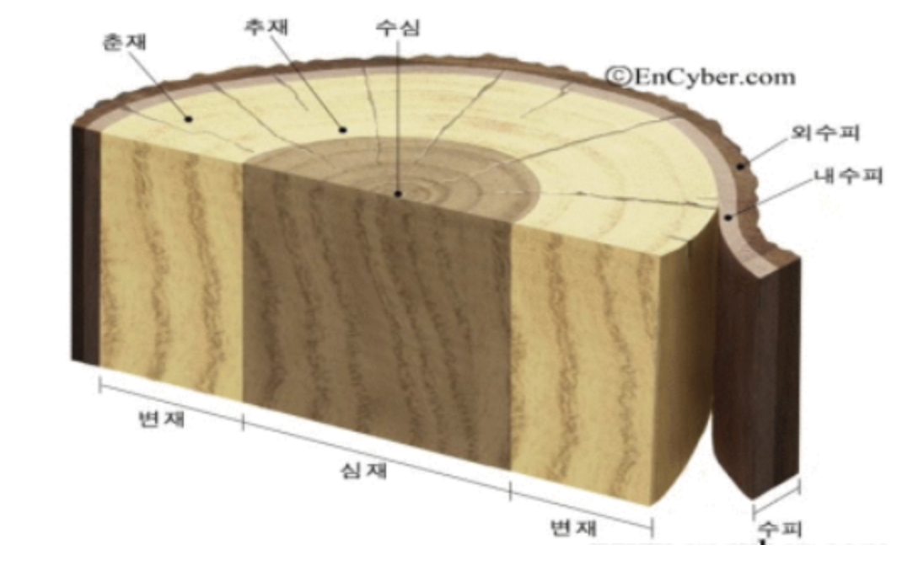

# 디자인재료

## Table of Contents

[디자인재료 일반](#디자인재료-일반)

[종이재료 일반](#종이재료-일반)

[디자인 표현재료](#디자인-표현재료)

[사진재료 일반](#사진재료-일반)

[현상 및 인화](#현상-및-인화)

[공업재료 일반](#공업재료-일반)

---

## 디자인재료 일반

### 재료의 분류

재료는 탄소를 포함하는가에 따라 무기재료, 유기재료로 분류된다.

**`무기재료(Inorganic Material)`**

탄소를 포함하지 않는 재료.

| 구분       | 설명                                                                     |
| ---------- | ------------------------------------------------------------------------ |
| 금속재료   | 금속 원소로 이루어진 재료. 철, 강, 알루미늄, 구리 등. 강도·내구성이 높음 |
| 비금속재료 | 금속 이외의 무기재료. 유리, 석고, 시멘트, 세라믹 등                      |
| 도자기재료 | 점토·규소 등을 고온에서 소성하여 만든 재료. 도기, 자기, 위생도기 등      |

**`유기재료(Organic Material)`**

탄소를 포함하는 재료.

| 구분     | 설명                                                                            |
| -------- | ------------------------------------------------------------------------------- |
| 천연재료 | 자연에서 얻은 유기재료. 목재, 종이, 천연고무, 가죽, 면 등                       |
| 합성재료 | 인공적으로 합성한 유기재료. 플라스틱, 합성고무, 합성섬유(나일론, 폴리에스터) 등 |

### 재료의 일반적 성질

**`응력(Stress)`**

재료에 외력이 가해졌을 때 재료 내부에 발생하는 저항력. 단위면적당 힘(N/m², Pa)으로 나타낸다.

| 종류        | 설명                                                      |
| ----------- | --------------------------------------------------------- |
| 인장 응력   | 외부에서 양쪽으로 당기는 힘에 의해 내부에 발생하는 저항력 |
| 압축 응력   | 외부에서 양쪽으로 누르는 힘에 의해 내부에 발생하는 저항력 |
| 전단 응력   | 재료를 엇갈리게 자르는 힘(전단력)에 의해 발생하는 저항력  |
| 굽힘 응력   | 재료를 구부리는 힘에 의해 발생하는 복합 응력              |
| 비틀림 응력 | 재료를 비트는 힘(토크)에 의해 발생하는 전단 응력          |

**`강도(Strength)`**

재료가 외력에 저항하는 능력. 응력이 재료의 강도 한계에 도달하면 파괴된다.

| 종류           | 설명                                                      |
| -------------- | --------------------------------------------------------- |
| 인장 강도      | 재료를 당기는 힘에 저항하는 능력                          |
| 압축 강도      | 재료를 누르는 힘에 저항하는 능력                          |
| 전단 강도      | 재료를 엇갈리게 자르는 힘에 저항하는 능력                 |
| 굽힘 강도      | 재료를 구부리는 힘에 저항하는 능력                        |
| 피로 강도      | 반복 하중에 견디는 능력                                   |
| 경도(Hardness) | 표면의 딱딱함. 다른 물질에 의한 긁힘·눌림에 저항하는 능력 |

**`기타 성질`**

| 구분   | 설명                                                                     |
| ------ | ------------------------------------------------------------------------ |
| 탄성   | 외력이 제거되면 원래 형태로 돌아오는 성질                                |
| 소성   | 외력에 의해 변형된 후 힘이 제거되어도 원래 형태로 돌아오지 않는 성질     |
| 연성   | 재료가 끊어지지 않고 가늘게 늘어날 수 있는 성질. 예) 철사, 구리선        |
| 인성   | 충격이나 갑작스러운 힘에 저항하는 능력. 파괴 전까지 흡수하는 에너지의 양 |
| 전성   | 재료가 얇고 넓게 펴질 수 있는 성질. 예) 금박, 알루미늄 포일              |
| 취성   | 거의 변형 없이 갑자기 파괴되는 성질. 예) 유리, 도자기                    |
| 함수율 | 재료 내에 포함된 수분의 비율. 목재 등에서 중요한 특성                    |

---

## 종이재료 일반

### 종이재료

종이는 기원전 2400년경 이집트 식물 파피루스(Papyrus)를 원료를 통해 기록을 위한 재료로서 최초로 제작되었다.

**`펄프`**

종이의 원료를 기계적 또는 화학적 처리를 통해 셀룰로오스 섬유를 추출한 것을 펄프라고 한다.

펄프는 원료의 종류, 용도, 제조법 등에 따라 분류된다.

| 원료        | 설명                                                                |
| ----------- | ------------------------------------------------------------------- |
| 목재 펄프   | 침엽수·활엽수 등 나무를 원료로 만든 펄프. 품질 우수. 가장 많이 사용 |
| 비목재 펄프 | 면, 볏짚, 대나무, 사탕수수 등 나무 이외의 식물 원료 펄프            |

| 용도        | 설명                                                                         |
| ----------- | ---------------------------------------------------------------------------- |
| 재사용 펄프 | 폐지를 재처리하여 만든 펄프. 재생 펄프라고도 함                              |
| 용해 펄프   | 순수 셀룰로오스 함량이 높은 고순도 펄프. 인조섬유(레이온)·셀로판 제조에 사용 |

| 제조법          | 설명                                                                            |
| --------------- | ------------------------------------------------------------------------------- |
| 기계 펄프       | 목재를 기계적으로 분쇄한 펄프. 불순물 많고 강도 낮으나 수율 높음. 신문지에 사용 |
| 화학 펄프       | 화학약품으로 리그닌을 제거한 펄프. 품질·강도 높음. 인쇄용지·필기용지에 사용     |
| 세미케미컬 펄프 | 화학 처리 후 기계 처리를 병용한 중간 방식의 펄프                                |

### 종이의 성질

**`평량`**

종이의 단위면적당 무게를 평량이라고 한다.

단위는 $g/m^2$ 를 사용한다.

**`강도`**

외력에 의해 종이를 일정량 굽히는 데 소요되는 무게.

| 종류     | 설명                                                      |
| -------- | --------------------------------------------------------- |
| 파열강도 | 종이를 압력으로 뚫을 때 견디는 강도, $kg/cm^2$ 단위 사용  |
| 인장강도 | 종이를 양쪽에서 당길 때 견디는 강도                       |
| 신축률   | 습도 변화에 따라 종이가 늘어나거나 줄어드는 정도          |
| 인열강도 | 종이를 찢을 때 견디는 강도                                |
| 충격강도 | 갑작스러운 충격에 견디는 강도                             |
| 표면강도 | 인쇄 시 잉크가 당기는 힘에 종이 표면이 뜯어지지 않는 강도 |
| 내절강도 | 종이를 반복해서 접었다 폈을 때 견디는 강도                |

### 종이 제조 공정

**`제조공정`**

| 과정   | 설명                                                                       |
| ------ | -------------------------------------------------------------------------- |
| 고해   | 펄프 섬유를 물속에서 두들겨 섬유를 가늘고 길게 만들어 결합력을 높이는 공정 |
| 사이징 | 풀·수지 등을 입혀 잉크·물의 흡수를 조절하고 표면 강도를 높이는 공정        |
| 충전   | 탄산칼슘·점토 등 충전재를 넣어 불투명도·평활도를 높이는 공정               |
| 착색   | 염료·안료를 첨가하여 종이에 색을 부여하는 공정                             |
| 정정   | 이물질·덩어리를 제거하는 정제·선별 공정                                    |
| 초지   | 펄프를 망 위에 고르게 펴서 탈수·건조하여 종이를 만드는 최종 공정           |

**`가공법`**

| 가공법   | 설명                                             | 효과                               |
| -------- | ------------------------------------------------ | ---------------------------------- |
| 도피가공 | 종이 표면에 코팅제(클레이·수지 등)를 바르는 가공 | 표면이 매끄러워지고 인쇄 적성 향상 |
| 흡수가공 | 합성수지나 오일을 종이에 흡수시키는 가공         | 방수성·방습성 향상                 |
| 변성가공 | 화학적 처리로 종이 특성을 변화시키는 가공        | 내수성·내열성 등 특수 성질 부여    |
| 배접가공 | 종이를 여러 겹 합지(붙여서) 두껍게 만드는 가공   | 두께·강도 증가. 판지 제조에 사용   |

**`표면가공`**

| 표면가공       | 설명                                            | 효과                           |
| -------------- | ----------------------------------------------- | ------------------------------ |
| 오버프린트     | 인쇄된 면 위에 투명 래커·바니시를 도포          | 광택 및 내마모성 향상          |
| 비틸코팅       | 표면에 비닐(PVC) 계열 수지를 코팅               | 내수성·내구성 향상             |
| 프레스코트     | 압착 롤로 코팅제를 도포하는 방식                | 평활도·광택 향상               |
| 원압           | 캘린더(금속 롤러)로 압착하는 가공               | 표면을 매끄럽게 하고 광택 부여 |
| 비닐 필름 장착 | 비닐 필름을 열과 압력으로 접착(라미네이션)      | 방수 및 표면 보호              |
| 왁스칠         | 왁스를 표면에 도포                              | 방수성·미끄럼성 부여           |
| 미술가공       | 엠보싱·금박 등 특수 효과를 부여하는 장식적 가공 | 고급감·심미성 향상             |

### 종이의 종류

**`도화지`**

스케치용이나 그림, 채색용으로 사용되는 종이

| 종류     | 설명                                                                                      |
| -------- | ----------------------------------------------------------------------------------------- |
| 와트만지 | 두껍고 거친 표면의 수채화 전용 종이. 물감 흡수가 좋아 수채화 표현에 적합                  |
| 켄트지   | 표면이 매끄럽고 단단한 백색 종이. 잉크·연필·마커 모두 적합. 제도·스케치에 일반적으로 사용 |

**`포장용지`**

| 종류       | 설명                                                                            |
| ---------- | ------------------------------------------------------------------------------- |
| 크라프트지 | 황산염 펄프(Kraft 펄프)로 만든 강도 높은 갈색 포장지. 봉투·쇼핑백·포장재에 사용 |
| 노루지     | 양키머신으로 만든 종이, 한쪽 면에 광택이 있음                                   |

**`박엽지`**

바탕이 비치는 얇은 종이

| 종류            | 설명                                                                    |
| --------------- | ----------------------------------------------------------------------- |
| 글라싱지        | 표면에 광택 처리를 한 얇은 종이. 식품 포장·고급 포장재에 사용           |
| 라이스지        | 쌀·닥나무 등을 원료로 한 얇고 부드러운 종이. 식품 포장·특수 인쇄에 사용 |
| 인디아(India)지 | 얇고 내구성이 있는 종이. 성경·사전 등 얇은 책 제본에 사용               |
| 콘덴서지        | 전기 콘덴서(축전기) 절연에 사용되는 극히 얇은 종이                      |
| 전기 절연지     | 전기 절연 목적으로 사용되는 특수 종이. 코일·변압기 등에 사용            |

**`판지`**

두꺼운 종이 또는 여러 겹을 합지한 판 형태의 종이.

**골판지(Corrugated board)**

중간에 파형(골 형태)의 심지(Fluting)를 삽입한 판지. 완충성·강도가 뛰어나고 가벼워 포장 상자에 주로 사용.

| 골 종류 | 골 높이  | 특징                                            |
| ------- | -------- | ----------------------------------------------- |
| A골     | 약 4.5mm | 완충성 우수. 일반 외장 박스에 사용              |
| B골     | 약 2.5mm | 편평 압축 강도 우수. 음식·소형 제품 상자에 사용 |
| C골     | 약 3.5mm | A골과 B골의 중간 특성                           |
| E골     | 약 1.2mm | 인쇄 적성 우수. 소형 고급 포장재에 사용         |

**백판지(White board)**

표면이 흰색으로 도공(코팅)된 두꺼운 판지.

| 종류     | 설명                                                                           |
| -------- | ------------------------------------------------------------------------------ |
| 아이보리 | 고급 백판지. 표면 도공층이 두꺼워 인쇄 품질 우수. 고급 식품·화장품 포장에 사용 |
| 마닐라지 | 황색 표면의 판지. 표면이 매끄럽고 그림 작업·봉투·파일에 사용                   |
| 회색판지 | 재생 펄프로 만든 회색 판지. 책 표지·뒷판·저가 포장재에 사용                    |

---

## 디자인 표현재료

### 채색재료

| 종류          | 설명                                                                                         |
| ------------- | -------------------------------------------------------------------------------------------- |
| 염료(Dye)     | 물·용제에 녹아 섬유 등에 침투하여 염색하는 색소. 투명하고 선명. 빛에 의해 퇴색될 수 있음     |
| 안료(Pigment) | 물·용제에 녹지 않는 불용성 색소. 불투명하고 내구성 높음. 빛·열에 강함                        |
| 전색제        | 안료를 분산시켜 도막을 형성하는 매체(Medium). 예) 유화 → 린시드 오일, 수채화 → 아라비아 고무 |

### 표현재료 특성

| 종류        | 설명                                                             | 장점                                                           | 단점                                                    |
| ----------- | ---------------------------------------------------------------- | -------------------------------------------------------------- | ------------------------------------------------------- |
| 수채화 물감 | 안료를 아라비아 고무로 녹여 물로 희석하는 투명 수성 물감         | 투명감·번짐 효과 표현. 맑고 깨끗한 색감. 빠른 건조             | 수정이 어려움. 건조 후 색이 밝아짐                      |
| 포스터 컬러 | 안료를 아라비아 고무·점토로 혼합한 불투명 수성 물감(과슈와 유사) | 불투명하여 수정·덮어 바르기 가능. 선명한 색상                  | 두껍게 바르면 갈라짐. 건조 후 색이 변함                 |
| 아크릴 물감 | 아크릴 수지를 전색제로 사용하는 물감. 수성이지만 건조 후 내수성  | 빠른 건조. 다양한 재료에 적용 가능. 유화·수채화 기법 모두 구현 | 빠른 건조로 블렌딩(색 섞기)이 어려울 수 있음            |
| 유화 물감   | 안료를 린시드 오일 등 건성유로 개어 만든 물감                    | 건조가 느려 블렌딩 용이. 풍부한 색감과 깊이. 수정 가능         | 건조 시간이 길고(수일~수주), 테레핀유 등 별도 용제 필요 |
| 파스텔      | 안료를 분필처럼 굳혀 막대기 형태로 만든 건식 재료                | 색조 표현이 자유롭고 수정 쉬움. 풍부한 발색                    | 고착력 낮아 정착제(Fixative) 처리 필요. 가루날림        |
| 목탄        | 나뭇가지를 탄화시킨 드로잉 재료                                  | 명암·질감 표현에 탁월. 수정 및 지우기 용이                     | 고착력 낮아 정착제 필요                                 |
| 콩테(Conte) | 흑연·점토·안료를 압축 성형한 드로잉 재료. 목탄보다 딱딱함        | 목탄보다 세밀한 표현 가능. 흑·갈색·적갈색 등 다양한 색상       | 목탄보다 지우기 어려움                                  |

---

## 사진재료 일반

### 필름

필름은 셀룰로이드와 같은 투명막(Base) 위에 빛에 민감한 화학적, 물리적 반응을 일으키는 감광유제를 암실에서 발라 만든 것이다.

**`필름 구조`**

| 층                        | 설명                                                                                       |
| ------------------------- | ------------------------------------------------------------------------------------------ |
| 보호막층                  | 유제층을 물리적 긁힘·손상으로부터 보호하는 얇은 투명 층                                    |
| 유제층                    | 할로겐화은(AgBr 등) 결정이 젤라틴에 분산된 층. 빛에 반응하여 잠상(潛像)을 형성하는 핵심 층 |
| 필름 베이스               | 셀룰로이드·폴리에스터 등 투명 플라스틱 지지체. 유제층을 지탱                               |
| 하도층                    | 베이스와 유제층 사이의 접착력을 높이는 중간층                                              |
| 헐레이션(Halation) 방지층 | 베이스 뒷면의 빛 흡수층. 빛이 베이스를 통과하여 반사되는 헐레이션 현상 방지                |

- 잠상(潛像, Latent Image): 빛에 노출된 후 눈에는 보이지 않지만 현상액으로 처리하면 나타나는 숨겨진 상(이미지).

- **Halation** : 강한 빛이 필름이나 사진 건판에 닿았을 때, 그 면에서 반사된 빛이 다시 유제에 닿아 감광되는 현상.

### 필름의 성질

**`감광도`**

필름이 빛에 반응하는 민감도. ISO(ASA) 수치로 표시하며, 수치가 높을수록 빛에 민감함.

| 구분   | ISO 범위     | 특성                                                                                  |
| ------ | ------------ | ------------------------------------------------------------------------------------- |
| 저감도 | ISO 25~100   | 빛에 민감하지 않아 밝은 환경 필요. 입자가 미세하여 화질 선명. 정물·풍경 촬영에 적합   |
| 중감도 | ISO 100~400  | 일반적인 실내외 환경에서 사용. 화질과 감도의 균형                                     |
| 고감도 | ISO 400 이상 | 빛이 적은 어두운 환경에서 사용 가능. 입자가 거칠어 화질 저하. 스포츠·실내 촬영에 사용 |

**`감색성`**

필름의 유제가 반응하는 빛의 색 파장 범위.

| 구분                        | 설명                                                                   |
| --------------------------- | ---------------------------------------------------------------------- |
| 청감성(Blue-sensitive) 필름 | 청색·보라색 파장에만 반응. 적색·녹색에는 반응하지 않음. 초기 흑백 필름 |
| 정색성(Orthochromatic) 필름 | 청색·녹색 파장에 반응. 적색에는 반응하지 않음                          |
| 전정색성(Panchromatic) 필름 | 가시광선 전 파장(청·녹·적)에 고르게 반응. 현재 일반 흑백 필름의 표준   |

**`입상성`**

필름 유제의 할로겐화은 결정 입자의 크기에 관한 성질. 감광도와 밀접한 관련이 있음.

| 구분        | 특징                                  | 관련 감광도 |
| ----------- | ------------------------------------- | ----------- |
| 미립자 필름 | 입자가 미세하여 해상력 높고 화질 선명 | 저감도 필름 |
| 조립자 필름 | 입자가 굵어 거친 질감. 해상력 낮음    | 고감도 필름 |

**`콘트라스트(Contrast)`**

명부(밝은 부분)와 암부(어두운 부분)의 밀도 차이. 계조(Gradation)라고도 함.

| 구분                | 설명                                 | 용도                      |
| ------------------- | ------------------------------------ | ------------------------- |
| 경조(High Contrast) | 명암 차이가 크고 중간 톤이 거의 없음 | 인쇄 원판, 문자·선화 복제 |
| 중간조(Normal)      | 자연스러운 계조 표현                 | 일반 사진 촬영            |
| 연조(Low Contrast)  | 명암 차이가 적고 부드러운 계조       | 인물 사진, 부드러운 표현  |

**`해상력`**

필름이 피사체의 세부를 얼마나 정밀하게 재현할 수 있는지를 나타내는 능력. 단위: 선/mm(lp/mm).

입자가 미세할수록(저감도) 해상력이 높고, 입자가 굵을수록(고감도) 해상력이 낮아진다.

**`관용도`**

적정 노출 범위를 벗어난 과다·과소 노출에서도 허용 가능한 화질을 얻을 수 있는 노출 허용 범위.

관용도가 넓을수록 노출 실패에 강하다. 일반적으로 고감도 필름일수록 관용도가 넓고, 저감도 필름일수록 관용도가 좁다.

### 필름 종류

**`형태에 의한 분류`**

| 필름          | 설명                                                                              |
| ------------- | --------------------------------------------------------------------------------- |
| 롤 필름       | 긴 필름을 두루마리 형태로 감아 카메라에 장착. 35mm·120mm 규격. 일반 카메라에 사용 |
| 컷(시트) 필름 | 낱장 형태의 필름. 대형 카메라(뷰 카메라)에 사용. 4×5인치, 8×10인치 등             |
| 필름 팩       | 복수의 낱장 필름을 팩 형태로 묶어 카메라에 장착. 교체가 빠르고 편리               |

**`현상 처리에 의한 분류`**

| 필름          | 설명                                                                                                          |
| ------------- | ------------------------------------------------------------------------------------------------------------- |
| 내향발색 필름 | 발색 성분(커플러)이 필름 유제 내부에 미리 포함된 필름. 현상 시 내부에서 색소 형성. 현재 일반 컬러 필름의 표준 |
| 외향발색 필름 | 발색 성분이 없어 현상 처리 과정에서 외부 발색제를 공급하여 색소를 형성하는 필름                               |

**`화상에 의한 분류`**

| 필름               | 설명                                                                                                                       |
| ------------------ | -------------------------------------------------------------------------------------------------------------------------- |
| 컬러 네거티브 필름 | 촬영 후 현상하면 색상이 보색으로 반전된 음화(Negative) 이미지. 인화(프린트) 과정을 거쳐 양화로 변환. 일반 사진 촬영에 사용 |
| 컬러 포지티브 필름 | 촬영 후 현상하면 원래 색상 그대로의 양화(Positive) 이미지. 슬라이드 필름이라고도 함. 인쇄 원고·프레젠테이션에 사용         |

---

## 현상 및 인화

### 현상(Developing)

**`현상 약품`**

| 종류   | 설명                                                                                            |
| ------ | ----------------------------------------------------------------------------------------------- |
| 현상액 | 필름의 잠상(潛像)을 가시적인 금속 은(Ag) 이미지로 환원·발현하는 약품                            |
| 정지액 | 현상 후 현상액의 작용을 즉시 중단시키는 산성(초산 등) 약품. 과현상 방지                         |
| 정착액 | 미반응 할로겐화은을 제거하여 이미지를 빛에 안정화(정착)시키는 약품. 티오황산나트륨(하이포) 사용 |

**`현상액 종류`**

현상액은 여러 성분의 혼합으로 이루어진다.

| 종류     | 설명                                            | 재료                                      |
| -------- | ----------------------------------------------- | ----------------------------------------- |
| 현상주약 | 할로겐화은을 금속 은으로 환원하는 핵심 성분     | 하이드로퀴논(Hydroquinone)·메톨(Metol) 등 |
| 촉진제   | 현상주약의 활성을 높이는 알칼리 성분            | 탄산나트륨·수산화나트륨 등                |
| 보향제   | 현상액의 산화를 방지하여 보존성을 높이는 성분   | 아황산나트륨 등                           |
| 억제제   | 노출되지 않은 부분의 현상(포그)을 억제하는 성분 | 브롬화칼륨(KBr) 등                        |

**`현상 처리 과정`**

| 과정     | 설명                                                                                  |
| -------- | ------------------------------------------------------------------------------------- |
| 현상     | 현상액에 필름을 담가 잠상을 가시적인 금속 은 이미지로 환원. 온도·시간을 일정하게 유지 |
| 중간정지 | 정지액(초산수)에 담가 현상액 작용을 즉시 중단. 과현상 방지                            |
| 정착     | 정착액(하이포)에 담가 미반응 할로겐화은을 제거. 이미지를 안정화하여 빛에 견디게 함    |
| 수세     | 흐르는 물로 약품 성분을 완전히 세척. 잔류 약품으로 인한 변색 방지                     |
| 건조     | 수세 후 필름을 건조하여 현상 완료                                                     |

### 인화(Printing)

**`인화지 종류`**

| 구분                                 | 설명                                                                                                      |
| ------------------------------------ | --------------------------------------------------------------------------------------------------------- |
| RC(Resin-Coated)                     | 종이 양면을 폴리에틸렌 수지로 코팅한 인화지. 약품 침투가 적어 수세·건조가 빠름. 현재 가장 일반적으로 사용 |
| 다 계조 인화지(무호지)               | 필터에 따라 콘트라스트를 조절할 수 있는 인화지. 하나의 인화지로 다양한 계조 표현 가능                     |
| FB(Fiber Base: 바라타지, 섬유인화지) | 순수 섬유 기반 인화지. 약품이 기저에 흡수되어 수세 시간이 길지만 계조·질감이 우수. 전문가·아카이브 용도   |

**`인화 과정`**

| 과정             | 설명                                                                                    |
| ---------------- | --------------------------------------------------------------------------------------- |
| 노광             | 확대기를 통해 네거티브 필름 이미지를 인화지에 빛으로 투사. 노출 시간·조리개로 밝기 조절 |
| 현상             | 현상액에 인화지를 담가 잠상을 가시 이미지로 환원                                        |
| 중간 정지와 정착 | 정지액으로 현상을 중단 후 정착액으로 미반응 감광제를 제거하여 이미지 안정화             |
| 수세 및 건조     | 흐르는 물로 잔류 약품 세척 후 건조. RC지는 건조가 빠르고 FB지는 건조 시간이 김          |
| 수정             | 인화된 사진의 흠결(먼지 반점 등)을 수정액·연필 등으로 보정하는 작업                     |

---

## 공업재료 일반

### 목재

목재는 식물학상 현화식물에 속한다

**`은화식물 현화식물 구분`**

| 구분     | 특징                                                                    |
| -------- | ----------------------------------------------------------------------- |
| 은화식물 | 꽃이 피지 않고 포자로 번식. 양치식물·이끼·균류 등. 목재로 사용되지 않음 |
| 현화식물 | 꽃이 피고 씨앗으로 번식. 목재는 현화식물에서 나옴                       |

**`현화식물 종류`**

| 구분               | 설명                                             | 나무 종류                   |
| ------------------ | ------------------------------------------------ | --------------------------- |
| 나자식물(겉씨식물) | 씨앗이 밖에 드러난 식물. 침엽수가 여기에 속함    | 소나무·전나무·잣나무 등     |
| 피자식물(속씨식물) | 씨앗이 열매 안에 있는 식물. 활엽수가 여기에 속함 | 참나무·느티나무·오동나무 등 |

**`침엽수 활엽수 구분`**

| 구분   | 특징                                                                                                            |
| ------ | --------------------------------------------------------------------------------------------------------------- |
| 침엽수 | 잎이 바늘처럼 가늘고 뾰족한 나무. 대부분 상록수. 목재가 연하고(연목/Softwood) 가공이 쉬움. 건축재·구조재에 사용 |
| 활엽수 | 잎이 넓은 나무. 대부분 낙엽수. 목재가 단단하고(경목/Hardwood) 조직이 치밀함. 가구·마루재에 사용                 |

**`목재 조직`**

| 구분   | 설명                                                                                                        | 특징                                      |
| ------ | ----------------------------------------------------------------------------------------------------------- | ----------------------------------------- |
| 수심   | 나무의 중심부                                                                                               | 약하고 부식되기 쉬움                      |
| 심재   | 수심 주변의 어두운 색 목재 부분. 세포가 죽어 수분이 적음                                                    | 내구성·강도 높음. 가구·건축 구조재에 적합 |
| 변재   | 심재 바깥쪽의 밝은 색 목재. 살아있는 세포 포함                                                              | 수분이 많고 심재보다 연함. 부식에 약함    |
| 수피   | 나무의 가장 바깥 껍질                                                                                       | 나무를 외부 충격·병해로부터 보호          |
| 나이테 | 1년에 한 층씩 형성되는 동심원 형태의 조직. 봄에 자란 연한 춘재(春材)와 여름에 자란 단단한 추재(秋材)로 구성 | 나이테 수로 나무 나이 판별 가능           |

**`목재 상처(흠)`**

| 구분     | 설명                                                               |
| -------- | ------------------------------------------------------------------ |
| 갈라짐   | 건조나 충격으로 목재에 틈이 생기는 현상                            |
| 옹이     | 가지가 달렸던 자리. 섬유 방향이 불규칙하여 강도 약하고 가공 어려움 |
| 껍질박이 | 나무 성장 중 수피가 목재 내부에 끼어 들어간 결함                   |
| 썩정이   | 균류 등에 의해 목재가 부패·변색된 부분                             |
| 송진구멍 | 침엽수에서 송진이 모인 수지 분비 통로(수지구). 접착·도장에 악영향  |

**`목제 제품`**

| 구분                      | 설명                                                                           | 특징                                                    |
| ------------------------- | ------------------------------------------------------------------------------ | ------------------------------------------------------- |
| 합판(Veneer)              | 얇게 켠 단판(베니어)을 홀수 겹으로 직교하여 접착한 판재                        | 뒤틀림 방지·강도 균등. 가구·건축 내장재에 사용          |
| 집성목재(Glued Laminated) | 소각재를 나뭇결 방향으로 맞추어 접착제로 접합한 구조재                         | 변형 적고 강도 높음. 기둥·보에 사용                     |
| 섬유판(Fiberboard)        | 목재 섬유를 결합재와 함께 압착한 판재. MDF(Medium Density Fiberboard)가 대표적 | 표면이 균일하고 가공이 쉬움                             |
| 파티클 보드               | 목재 칩(조각)을 접착제로 압착한 판재                                           | 원가 저렴. 가구·내장재에 사용                           |
| 압축 목재                 | 목재에 열·압력을 가하여 밀도를 높인 강화 목재                                  | 강도·경도 향상                                          |
| 코르크(Cork)              | 참나무 수피를 원료로 한 경량 소재                                              | 탄성·방음·방열·방수성 우수. 게시판·바닥재·병마개에 사용 |
| 플로어링(Flooring)        | 마루 바닥재용으로 가공된 목재 판재                                             | 표면이 매끄럽고 내마모성 처리                           |

### 플라스틱

1930년대 석유화학 발전의 영향으로 여러 합성수지가 생산되어 여러 분야에 활용되고 있는 재료.

**`플라스틱 구분`**

| 구분          | 설명                                                       | 특징                                            |
| ------------- | ---------------------------------------------------------- | ----------------------------------------------- |
| 열경화성 수지 | 열을 가하면 굳어지고 다시 가열해도 형태가 변하지 않는 수지 | 한번 성형되면 재활용 불가. 내열성·내화학성 우수 |
| 열가소성 수지 | 열을 가하면 부드러워지고 냉각하면 굳어지는 수지            | 반복 가열·성형 가능. 재활용 가능                |

**`열경화성 수지 종류`**

| 종류                       | 특징                                   | 용도                    |
| -------------------------- | -------------------------------------- | ----------------------- |
| 페놀수지(PF, 베이클라이트) | 세계 최초 합성수지. 절연성·내열성 우수 | 전기 부품·핸들·소켓     |
| 에폭시수지(DAP)            | 접착력·내화학성·전기 절연성 우수       | 접착제·코팅·전기 기판   |
| 멜라민수지(MF)             | 표면이 단단하고 내마모성·내습성 우수   | 식기·가구 표면재·적층판 |
| 요소수지(UP)               | 착색이 쉽고 표면 광택 우수             | 단추·식기·합판 접착제   |
| 불포화폴리에스터(UP)       | FRP(섬유강화플라스틱) 제조에 사용      | 선박·욕조·자동차 부품   |

**`열가소성 수지 종류`**

| 종류               | 특징                                 | 용도                      |
| ------------------ | ------------------------------------ | ------------------------- |
| 폴리에틸렌(PE)     | 가장 많이 사용. 유연성·내화학성 우수 | 비닐봉지·용기·파이프      |
| 폴리프로필렌(PP)   | 가볍고 내열성·강도 우수              | 식품 용기·자동차 부품     |
| 폴리염화비닐(PVC)  | 가공성 우수. 연질·경질 모두 가능     | 파이프·호스·창틀·바닥재   |
| 폴리스티렌(PS)     | 투명하고 단단. 발포 시 스티로폼      | 일회용 컵·포장재          |
| ABS수지            | 강도·가공성·도장성 우수              | 가전 케이스·자동차 내장재 |
| 아크릴(PMMA)       | 투명도·광학적 성질 우수. 유리 대용   | 간판·렌즈·수족관          |
| 나일론(PA)         | 강도·내마모성·내열성 우수            | 기어·베어링·섬유          |
| 폴리카보네이트(PC) | 충격에 매우 강하고 투명              | CD·안전경·방탄유리        |

**`플라스틱 성형법`**

| 구분             | 설명                                                                                           |
| ---------------- | ---------------------------------------------------------------------------------------------- |
| 사출성형         | 용융된 수지를 금형에 주입하여 성형. 열가소성 수지에 주로 사용. 대량 생산 및 복잡한 형상에 적합 |
| 압출성형         | 용융된 수지를 다이(구멍)로 연속 밀어내어 성형. 파이프·필름·봉 등 단면이 일정한 제품 제조       |
| 블로우성형       | 파리손(튜브 형태 수지)을 금형 안에서 공기로 불어 팽창시켜 성형. 병·용기 제조에 사용            |
| 압축성형         | 수지를 금형에 넣고 열과 압력으로 성형. 열경화성 수지에 주로 사용. 단순한 형상에 적합           |
| 주입성형(주조법) | 액상 수지를 금형에 부어 굳히는 성형법. 정밀도 높고 대형 제품 가능                              |
