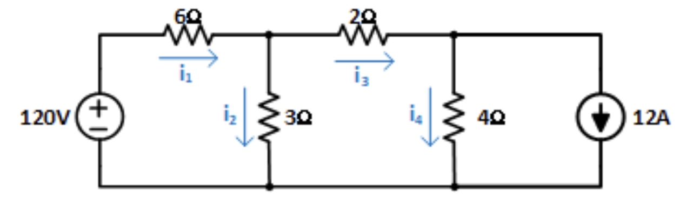
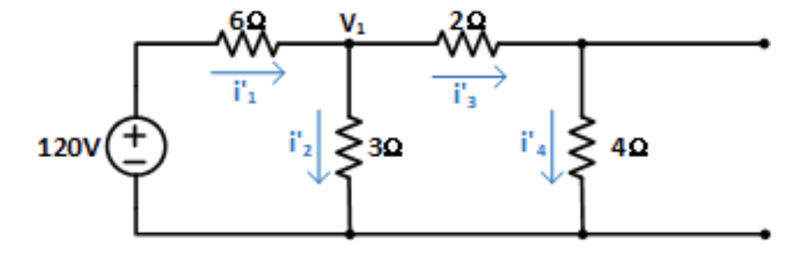
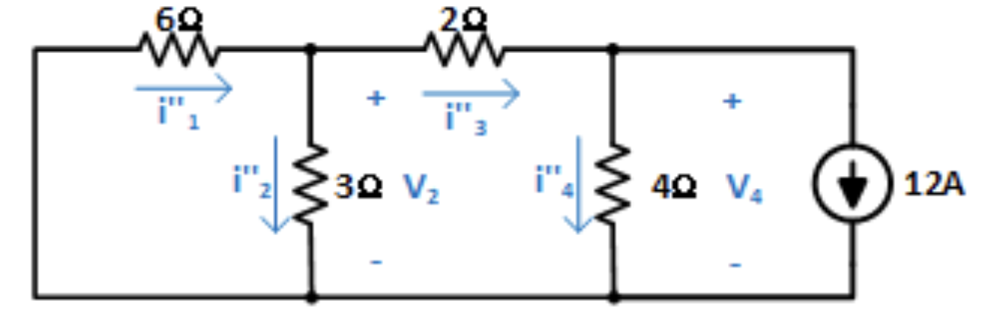
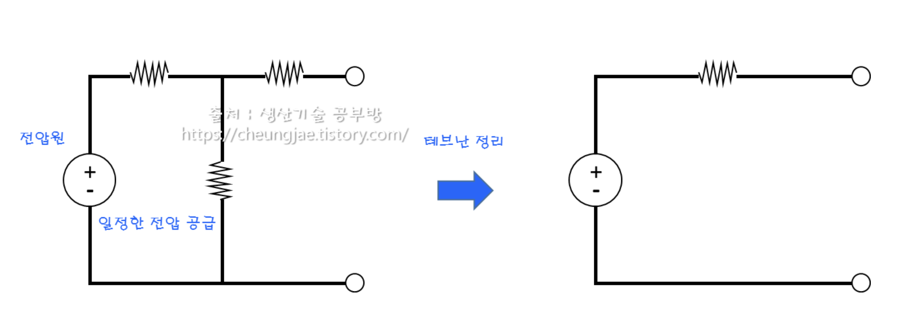
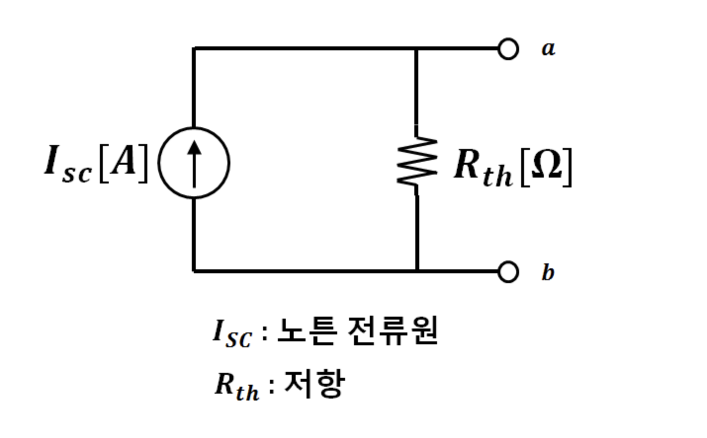

# Direct Current

## Table of contents

[옴의 법칙(Ohm's law)](#옴의-법칙ohms-law)

[저항의 접속](#저항의-접속)

[전기저항](#전기저항)

[전류의 열작용](#전류의-열작용)

[열전기 현상](#열전기-현상)

[키르히호프의 법칙(Kirchhoff's law)](#키르히호프의-법칙kirchhoffs-law)

[중첩의 원리(Principle of Superposition)](#중첩의-원리principle-of-superposition)

[테브낭의 정리와 노튼의 정리](#테브낭의-정리와-노튼의-정리)

---

## 옴의 법칙(Ohm's law)

전기회로에 흐르는 전류는 전압에 비례하고, 저항에 반비례 한다.

$$
I=\frac{V}{R} \\[10pt]

R:\text{저항(Resistance)} \quad I:\text{전류(Intensity of current, Electric current)} \quad V:\text{전압(Voltage)}
$$

### 전류

회로의 어느 단면을 단위 시간에 통과하는 전하의 양.

t초 동안 Q의 전하가 이동하였을 때의 전류의 세기는 다음과 같다.

전류의 SI 단위는 **암페어(Ampere)** 이고 기호 A로 표기한다.

- 1 암페어는 1 초에 1 쿨롱의 전하가 흐른 것을 뜻한다.

$$
I=\frac{Q}{t}[A] \\[10pt]
Q: \text{전하량(Quantity)} \quad I: \text{전류(Intensity of current, Electric current)}
$$

### 전압(전위차)

단위 전하당 한 일

$$
V=\frac{W}{Q}[V] \\[10pt]
V:\text{전압(Voltage)} \quad W:\text{전하 이동에 의한 일의 양(Work)}
$$

### 컨덕턴스(Conductance)

전기가 얼마나 잘 통하느냐 하는 정도를 나타내는 계수로, 저항의 역수 또는 어드미턴스의 실수부이다.

단위는 지멘스(S) 또는 모(mho, ℧)이며, 기호는 G이다.

$$
G=\frac{1}{R}
$$

---

## 저항의 접속

### 직렬 저항 접속

하나 이상의 저항들을 일렬로 접속한 것.

합성저항은 각 저항의 값을 더한 값이다.

$$
\text{저항 R1 R2 R3 에 대한 합성저항} R_T \\[10pt]
R_{T} = R_1 + R_2 + R_3 \\[10pt]
\text{옴의 법칙(Ohm's law)에 의한 전압 분배} V_1, V_2, V_3 \\[10pt]
V_1=\frac{R_1}{R_T} * V, V_2 = \frac{R_2}{R_T} * V, V_3 = \frac{R_3}{R_T} * V
$$

### 병렬 저항 접속

2개 이상의 저항의 양 끝을 각각 한 곳에서 접속하는 것.

합성저항은 각 저항의 역수를 더한 값의 역수와 같다.

$$
\text{저항 R1 R2 R3 에 대한 합성저항} R_T \\[10pt]
R_{T} = \frac{1}{\frac{1}{R_1} + \frac{1}{R_2} + \frac{1}{R_3}} \\[10pt]
\text{옴의 법칙(Ohm's law)에 의한 전류 분배} I_1, I_2, I_3 \\[10pt]
I_1=\frac{R_T}{R_1} * I, I_2 = \frac{R_T}{R_2} * I, I_3 = \frac{R_T}{R_3} * I
$$

### 전지 접속

전지는 내부저항을 가지고 있다.

직렬접속에 대한 식은 다음과 같다.

$$
\text{전지 n개의 에너지 합 nE} \\[10pt]
nE=I(R+nr) \\[10pt]
E: \text{전지 전압} \quad r: \text{전지 내부저항} \quad R: 회로 저항
$$

병렬접속에 대한 식은 다음과 같다.

$$
\text{전지 n개의 에너지 합 E} \\[10pt]
E=I(R+\frac{r}{n}) \\[10pt]
$$

---

## 전기저항

### 고유저항(⍴)

길이 1m, 단면적 1m2의 임의 도체 양면 사이의 저항값을 나타낸다.

기호는 rho(⍴)로 사용하며, Ω \* m로 표현한다.

$$
⍴ = \frac{R*A}{l}[Ω * m] \\[10pt]
A: \text{단면적(Area)} \quad l: \text{길이(length)}
$$

도체의 저항(R)은 고유저항(⍴)과 도체의 길이(l)에 비례하고, 단면적(A)에 반비례한다.

$$
R=\frac{⍴*l}{A}[Ω]
$$

**전도율(Conductivity, σ)** 은 고유저항의 역수로서, 전류의 흐르기 쉬운 정도를 나타낸다.

- 기호는 시그마(σ)를 사용한다.

### 저항의 온도 특성

금속체 저항은 온도의 상승에 따라 점차 **저항이 증가** 하는 특성을 지니고 있다.

**`표준연동(標準軟銅, 연질 구리) 에 대한 온도 계수`**

0[oC]에서의 온도 계수(⍺0): 도체의 온도가 0[oC]에서 1[oC]로 상승할 경우의 저항의 증가비율.

$$
⍺_0 = \frac{1}{234.5} = 0.00427
$$

t[oC]에서의 온도 계수(⍺t): 도체의 온도가 t[oC]에서 1[oC] 상승할 경우의 저항의 증가비율.

$$
⍺_t = \frac{⍺_0}{234.5 + t} = \frac{⍺_0}{1+⍺_0t}
$$

---

## 전류의 열작용

### 전력(P)

단위 시간동안에 전기에너지의 소비량을 나타내는 단위.

기호는 P(Power)를 사용하며, 단위로 W(Watt)를 사용한다.

1초 동안에 1J의 일을 할 때 1W의 전력이라고 표현한다. (W = J/sec)

$$
P=\frac{V*Q}{t} = VI = I^2R = \frac{V^2}{R}[W]
$$

### 전력량(W)

일정 시간 동안의 전기 에너지의 총량을 나타내는 단위.

기호는 W(Work)을 사용하며, 단위는 J(W \* sec), Wh 등을 사용한다.

$$
W = I^2Rt = VIt = Pt[J]
$$

### 줄의 법칙(Joule's law)

저항에 전류를 흘릴 때 전류에 의한 단위시간당 발생열량은 도체의 저항과 전류의 제곱에 비례한다는 법칙.

발열량의 기호는 Q(Quantity of heat) 또는 H(Heat)를 사용하며, 단위는 J 또는 cal을 사용한다.

$$
H=I^2Rt[\text{J}]=0.24*I^2Rt[\text{cal}] \\[10pt]
\text{* 1cal = 4.186J}, \quad \text{* 1J} = \frac{1}{4.186}\text{cal} = 0.24\text{cal}
$$

---

## 열전기 현상

### 제벡 효과(Seebeck effect)

서로 다른 두 종류의 금속을 접촉하여 두 접점의 온도를 다르게 하면 온도차에 의해서 **열기전력** 이 발생하고 미소한 전류가 흐르는 현상.

### 펠티에 효과(Peltier effect)

두 종류의 금속을 접촉하여 전류를 흘리면 그 접점의 접합부에서 열의 발생 및 흡수 현상이 생기는 현상.

전자냉동기 등에서 활용된다.

---

## 키르히호프의 법칙(Kirchhoff's law)

### 제 1법칙(전류법칙, KCL - Kirchhoff's current law)

회로의 한 접속점에서 접속점에 흘러들어오는 전류의 합과 흘러나가는 전류의 합은 같다.

$$
\sum{I}=I_1 + I_2 - I_3 - I_4 - I_5 = 0\\[10pt]
\text{들어오는 전류: }I_1, I_2 \quad \text{나가는 전류: } I_3, I_4, I_5
$$

### 제 2법칙(전압법칙, KVL - Kirchhoff's voltage law)

회로망 중의 임의의 폐회로 내에서 일주 방향에 따른 전압 강하의 합은 [기전력](../abbreviation.md#기전력起電力-emf-electromotive-force)의 합과 같다.

예를 들어, 12V 전지에 저항 두 개가 직렬로 연결된 회로라면:

$$
V_1 + V_2 = 12V
$$

저항에서 강하된 전압의 합($V_1+V_2$​)이 전원이 공급한 기전력(12V)과 정확히 같아야 한다.

이것을 수식으로 쓰면:

$$
∑E=∑IR
$$

즉, 기전력의 합 = 전압 강하의 합이 된다.

---

## 중첩의 원리(Principle of superposition)

회로 내에 2개 이상의 전원이 동시에 작용할 때 회로에 흐르는 전류는 전원이 각각 단독으로 그 위치에 존재할 때 발생하는 전류의 합이다.

### 전류 구하기

회로에는 120V의 전압원과 12A의 전류원, 총 2개의 전원이 있다.

각각의 독립된 전압과 전류값을 계산하기 위해 전압원과 전류원을 독립시켜 각 저항에 걸리는 전압, 전류값을 측정해야 한다.

전압원을 없애는 것을 **단락(Short)** 한다고 하며, 전류원을 없애는 것을 **개방(Open)** 한다고 한다.

**`전류원 개방(open)`**

전류원을 개방하여 전압원에 대한 각각의 전류값을 측정한다.

$$
\text{KCL 법칙에 의한 }V_1\text{에 흐르는 전류의 합 (모든 전류 유출 = 0)}\\[10pt]
\frac{V_1 - 120}{6} + \frac{V_1}{2+4} + \frac{V_1}{3} = 0 \\[10pt]
\frac{4V_1}{6} = \frac{120}{6} \quad \Rightarrow \quad V_1=30[V]\\[10pt]
\text{각 노드에 흐르는 전류}i_1, \dots, i_4\\[10pt]
i'_1 = \frac{120-30}{6} = 15[A]\\[6pt]
i'_2= \frac{30}{3} = 10[A]\\[6pt]
i'_3=i'_4= \frac{30}{2+4} = 5[A]
$$

- $i'_3$과 $i'_4$는 $V_1$ 기준 직렬 연결이므로 같은 전류가 흐른다.

**`전압원 단락(Short)`**

**노드 전압법(Node Voltage Method)** 을 통해 각 마디의 전류값을 측정할 수 있다.

6Ω, 3Ω, 2Ω 선이 만나는 지점을 $V_2$노드로 보고, 2Ω, 4Ω, 12A 선이 만나는 점을 $V_4$노드로 정의하여 각 노드를 기준으로 KCL을 적용한다.

$$
V_2\text{노드를 기준으로 적용한 KCL}\\[10pt]

\frac{V_2}{6} + \frac{V_2}{3} + \frac{V_2}{2} - \frac{V_4}{2} = 0 \\[10pt]

V_4\text{노드를 기준으로 적용한 KCL}\\[10pt]

\frac{V_4}{2} + \frac{V_4}{4} - 12 - \frac{V_2}{2} = 0 \\[10pt]

\text{식을 연립하여 정리된 개별 응답} \\[10pt]

V_2=-12[V] \quad V_4=-24[V] \\[10pt]

i''_1=2[A] \quad i''_2=-4[A] \quad i''_3=6[A] \quad i''_4=-6[A]
$$

**`개별 응답의 합으로 전체 응답 구하기`**

$$
i_1=i'_1+i''_1=17[A]\\[10pt]
i_2=i'_2+i''_2=6[A]\\[10pt]
i_3=i'_3+i''_3=11[A]\\[10pt]
i_4=i'_4+i''_4=-1[A]\\[10pt]
$$

---

## 테브낭의 정리와 노튼의 정리

테브낭의 정리와 노튼의 정리는 회로를 간단히 하여 **부하 저항($R_L$, Load Resistance)** 에 걸리는 전압을 쉽게 측정하기 위해 정립되었다.

### 테브낭의 정리(Thevenin's Theorem)

아무리 복잡한 회로라도, 특정 두 단자에서 바라보면 하나의 전압원($V_{th}​$)과 하나의 저항($R_{th}$)이 **직렬** 로 연결된 단순한 회로로 나타낼 수 있다는 정리.

- $R_{th}$ 는 모든 독립 전원을 제거(전압원 단락, 전류원 개방)한 상태에서 출력 두 단자 사이에서 구한 **합성저항** 을 의미한다.

- $V_{th}$ 는 부하저항($R_L$)을 제거한 상태(개방)에서 출력 두 단자 사이에서 측정한 **개방 회로 전압(Open Circuit Voltage)** 을 의미한다.

### 노튼의 정리(Norton's theorem)

아무리 복잡한 회로라도, 특정 두 단자에서 바라보면 하나의 전류원($I_N$)과 하나의 저항($R_{th}$)이 **병렬** 로 연결된 단순한 회로로 나타낼 수 있다는 정리.

- $I_N$($I_{sc}$, 노튼 전류)은 단락전류(Short Circuit Current)라고도 부르며, 두 단자를 단락시켰을 때 흐르는 전류를 의미한다.

### 최대전력 전달

임의의 회로에서 발생한 전력을 회로에 연결된 부하회로에 최대로 전달하려면 부하저항($R_L$) 값이 테브낭 합성저항($R_{th}$)값과 같아야 한다.

$$
P_L=I^2*R_L=\frac{{V_{th}}^2}{{(R_{th}+R_L)}^2}*R_L \\[10pt]

P_L: \text{저항}R_L\text{이 소비하는 전력}
$$

**`식에 대한 논리적 근거`**

$R_L$값이 작을수록 전류가 많이 흐르지만 부하저항 $R_L$에 걸리는 전압은 0에 가까워져서 소비전력은 0이 된다.

$R_L$이 클수록 부하 양단 전압이 커지지만 전류가 0에 가까워지기 때문에 소비전력은 0이 된다.

즉, $R_L$값이 너무 작아도, 너무 커도 전력이 0이 되며, 중간 어딘가에 최댓값이 존재한다. 그 지점이 $R_L=R_{th}$가 되는 부하저항 값이다.

**`최대전력 저항 도출 과정`**

표기를 간단히 하기 위해 $R_L = x, R_{th} = R$ 로 놓으면 식은 다음과 같다.

$$
P_L={V_{th}}^2*\frac{x}{(R + x)^2}
$$

식을 **몫의 미분법(Quotient rule)** 을 적용하여 미분한다.

$$
(\frac{f}{g})'=\frac{f'g-fg'}{g^2} \\[10pt]

f(x)=x,\space g(x)=(R+x)^2 \\[10pt]
f'(x)=1,\space g'(x)=2(R+x) \\[10pt]

\frac{dP_L}{dx} = {V_{th}}^2 * \frac{1 \cdot (R+x)^2 - x \cdot 2(R+x)}{(R+x)^4} = {V_{th}}^2 * \frac{R-x}{(R+x)^3} \\[10pt]
x=R,\space R_L = R_{th}
$$

미분값이 0인 정점이 극댓값인지 극솟값인지 확인한다.

- $x < R$: 기울기가 양수이기 때문에 전력이 증가중이다.

- $x = R$: 기울기가 양수에서 0이 되므로 극댓값이다.

- $x > R$: 기울기가 감소하므로 전력이 감소중이다.

따라서 $x = R$인 지점이 $P_L$의 극댓값임을 확인할 수 있다.

기존 전력식에 $R_L=R_{th}$ 식을 대입하면 다음과 같다.

$$
P_{L,\text{max}} = {V_{th}}^2 * \frac{R_{th}}{(R_{th} + R_{th})^2}= {V_{th}}^2 * \frac{R_{th}}{{4R_{th}}^2} = \frac{{V_{th}}^2}{4R_{th}}
$$
