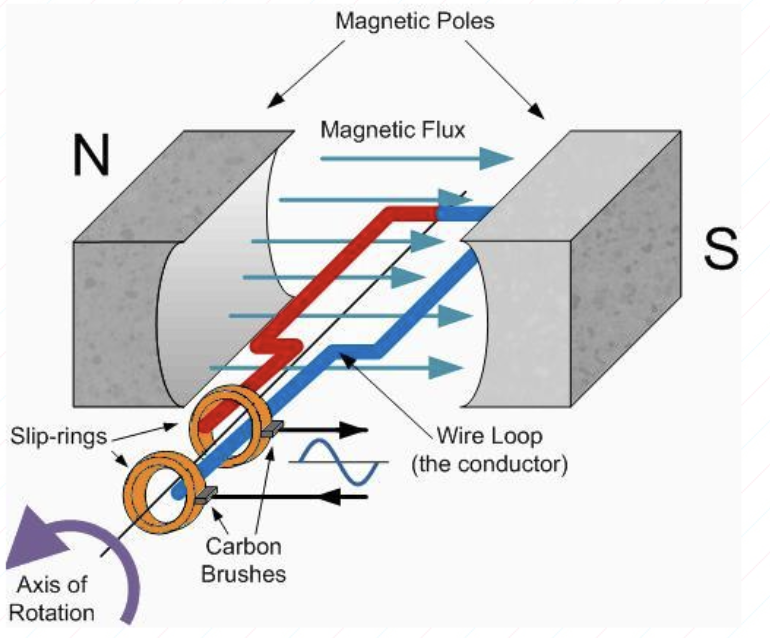
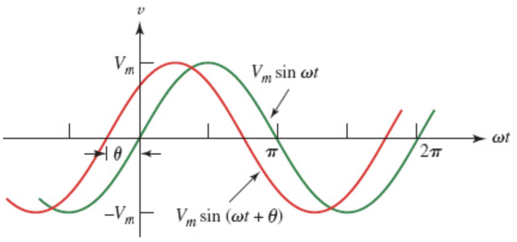

# Alternating Current

## Table of Contents

[정현파 교류와 표시방법](#정현파-교류와-표시방법)

[RLC 기본 회로](#rlc-기본-회로)

---

## 정현파 교류와 표시방법

### 각속도와 선속도

**`각속도`**

**각속도(Angular Velocity)** 는 단위 시간당 회전하는 각도를 나타낸다.

기호는 $\omega$ 를 사용하며, 단위는 $[rad/s]$ 를 사용한다.

각속도는 회전 주기가 짧을 수록 높다.

$\omega$ 와 회전각 $\theta$ 와의 관계는 다음과 같다.

$$
\omega = \frac{2\pi}{T}\\[6pt]
\theta = \omega t = \frac{2\pi t}{T}
$$

**`선속도`**

**선속도(Linear Velocity)** 는 원운동에서 원주 위의 한 점이 이동하는 속도를 나타낸다.

반지름이 $r$ 인 회전체에서 각속도와의 관계는 다음과 같다.

$$
v = \frac{2\pi r}{T} = \omega r
$$

### 코일에 발생하는 전압

코일이 회전할 때 발생하는 전압은 다음과 같다.

$$
V = 2Blv\sin\theta[V] = V_m\sin\theta[V] \\[6pt]
B: \text{magnetic flux density} \quad l: \text{코일의 길이} \quad v: \text{코일 회전 속도}
$$

**`유도 과정`**

패러데이 법칙에 따라 시간 변화량에 따른 자속 변화량이 유도하는 에너지는 다음과 같다.

$$
e = -\frac{d\phi}{dt}
$$

코일에 흐르는 자속($\phi$)은 자속밀도와 면적($BA$), 그리고 자속과 코일의 내적($\cos\theta$)으로 표현할 수 있다.

회전각 $\theta$ 는 각속도($\omega$)와 시간($t$)으로 치환할 수 있다.

$$
e = -\frac{dBA\cos\theta}{dt} = -\frac{dBA\cos(\omega t)}{dt}
$$

시간($dt$)으로 미분하면 다음과 같다.

$$
-\frac{dBA\cos(\omega t)}{dt} = -BA * \omega * (-\sin(\omega t)) = \omega BA\sin(\omega t) = \omega BA\sin\theta
$$

코일의 면적($A$)은 회전축 길이($l$)와 지름($2r$)로 표현할 수 있다. **(사각형 코일 기준)**

$$
\omega BA\sin\theta = \omega 2rlB\sin\theta
$$

각속도를 선속도로 정리하면 다음과 같다.

$$
\omega 2rlB\sin\theta = 2Blv\sin \theta
$$

### 주기와 주파수

각속도와 주기($T$), 주파수($f$)의 관계는 다음과 같다.

$$
T = \frac{1}{f}[s] \\[6pt]
\omega = \frac{2\pi}{T} = 2\pi f[rad/s]
$$

### 정현파 위상과 위상차

주파수가 동일한 교류가 존재할 때 시간 차에 따라 위상차(Phase difference)가 발생할 수 있다.

**`동상과 이상`**

| 용어               | 설명                         |
| ------------------ | ---------------------------- |
| 동상(In-phase)     | 정현파의 위상이 같을 때      |
| 이상(Out-of-phase) | 정현파의 위상이 같지 않을 때 |

**`진상과 지상`**

| 용어                | 설명                                                           |
| ------------------- | -------------------------------------------------------------- |
| 진상(Leading Phase) | 정현파의 위상이 앞설 때 -> $v = V_m\sin (\omega t + \theta)$   |
| 지상(Lagging Phase) | 정현파의 위상이 뒤쳐질 때 -> $v = V_m\sin (\omega t - \theta)$ |

### 정현파 교류의 크기

| 용어                          | 설명                                      | 식                                           |
| ----------------------------- | ----------------------------------------- | -------------------------------------------- |
| 순시값(Instantaneous value)   | 특정 순간의 전압 또는 전류의 크기 값      | $v = V_m\sin (\omega t + \theta)$            |
| 최댓값(Max value)             | 교류파형의 순시값 중 최댓값               | $V_m\sin\frac{\pi}{2} = V_m$                 |
| 평균값(Average value)         | 순시값 1주기의 평균값                     | $V_{av} = \frac{2}{\pi}V_m = 0.637V_m$       |
| 실효값(RMS: Root Mean Square) | 동일한 힘의 교류값을 직류값으로 환산한 값 | $V_{rms} = \frac{1}{\sqrt{2}}V_m = 0.707V_m$ |

**`평균값 유도`**

$V_m\sin\theta$ 정현파의 평균 값은 0이므로, 절대값으로 계산하기 위해서 그래프를 회전각에 대해 0 ~ $\pi$ 까지 적분한 값의 두배를 취하고 $2\pi$ 로 나눈다.

$$
V_{av} = \frac{2V_m}{2\pi}\int_0^\pi \sin \theta d\theta \\[6pt]
= \frac{V_m}{\pi}[-\cos \theta]_0^\pi = \frac{2}{\pi}V_m \\[6pt]
= 0.637V_m[V]
$$

**`실효값 유도`**

실효값은 순시값 제곱의 평균에 제곱근을 취한 값이다.

**1. 순시값 제곱의 평균**

순시값의 제곱을 취한 값의 평균은 다음과 같다.

$$
 \frac{1}{2\pi} * 2\int_0^{\pi}(V_m)^2\sin ^2\theta d\theta
$$

**2. 삼각함수 적분 정리**

순시값 제곱의 $\sin^2\theta$ 을 적분하기 위해서는 삼각함수 배각 공식과 피타고라스 정리를 활용해야 한다.

$$
\cos2\theta = \cos^2\theta-\sin^2\theta \\[6pt]
$$

빗변의 길이가 1인 직각삼각형에 따르면 다음과 같이 정리할 수 있다.

$$
x = \cos\theta \quad y = \sin\theta \\[6pt]
\sin^2\theta + \cos^2\theta = 1^2
$$

두 식을 연립하여 $\sin^2\theta$ 를 기준으로 정리하면 다음과 같다.

$$
\cos2\theta = (1-\sin^2\theta)-\sin^2\theta = 1 - 2\sin^2\theta \\[6pt]
\sin^2\theta = \frac{1-\cos2\theta}{2}
$$

**3. 적분 대입**

위의 삼각함수식을 활용해 $\sin^2\theta$ 를 $\cos2\theta$ 로 정리하여 적분하면 다음과 같다.

$$
\int_0^\pi \frac{1}{2} d\theta - \int_0^\pi \frac{\cos2\theta} {2} d\theta = \frac{\pi}{2} - \frac{1}{4}[\sin2\theta]_0^\pi \\[6pt]
= \frac{\pi}{2} - \frac{1}{4}[\sin2\pi - \sin0] \\[6pt]
=\frac{\pi}{2}
$$

**4. 제곱근 대입**

적분한 값을 제곱근을 취하여 실효값을 구한다.

$$
\sqrt{\frac{1}{2\pi} * 2\int_0^{\pi}(V_m)^2\sin ^2\theta d\theta} = \sqrt
{\frac{1}{2\pi} * 2(V_m)^2\frac{\pi}{2}} \\[6pt]
\frac{1}{\sqrt{2}}V_m = 0.707V_m
$$

### 최댓값, 평균값, 실효값의 관계

반 주기(0 ~ $\pi$) 동안 $\sin\theta$ 의 적분 값은 2이므로, 평균값은 최댓값에 $\frac{2}{\pi}$ 를 곱한 값과 같다.

$$
V_{av} = V_m * \frac{2}{\pi} = 0.637V_m
$$

실효값은 최댓값에 $\frac{1}{\sqrt{2}}$ 을 곱한 값과 같다.

$$
V_{rms} = \frac{1}{\sqrt{2}} * V_m = 0.707V_m
$$

### 파고율과 파형율

**`파고율(Crest Factor)`**

파고율은 교류 파형의 최댓값을 실효값으로 나눈 비율이다.

절연 내압, 부품 내압 설계시 필요한 값이며, 이를 통해 부품의 안정성을 높인다.

파고율이 1에 가까울 수록 안정성이 높다.

정현파의 경우 파고율은 다음과 같다.

$$
k_p = \frac{V_m}{V_{rms}} = \frac{V_m}{0.707V_m} = 1.414(\sqrt{2})
$$

**활용 사례**

실효값 100V의 정현파의 최댓값(최대 전압)은 $V_m = V_{rms} * \sqrt{2} = 141.4[V]$ 이므로, 내압 설계시 141.4V 이상의 압력을 견디도록 절연 설계를 해야 한다.

**`파형율(Form Factor)`**

파형율은 파형의 모양이 얼마나 고른지 나타낸 수치다.

실제 에너지 효율은 파형의 모양에 따라 다르기 때문에, 에너지 효율을 계산하기 위해 파형율이 요구된다.

- 일반적으로 정류회로에서 직류 출력 전압 계산시 사용된다.

파형율이 1에 가까울 수록 에너지 효율이 높다.

정현파의 경우 파형율은 다음과 같다.

$$
k_f = \frac{V_{rms}}{V_{av}} = \frac{0.707V_m}{0.637V_m} = 1.11
$$

---

## RLC 기본 회로

### 순수 저항 회로(Purely Resistive Circuit) 교류전압

순수 저항 회로에서 교류전압을 인가했을 때 흐르는 전류와 교류파는 위상이 같다.

교류전압 $\sqrt{2}V\sin{\omega t}$ 을 가했을 때 흐르는 전류의 순시값은 다음과 같다.

$$
i = \sqrt{2}\frac{V}{R}\sin{\omega t} = \sqrt{2}I\sin{\omega t}[A]
$$

### 순수 유도성 회로(Purely Inductive Circuit) 교류전압

순수 유도성 회로(코일만 있는 회로)에서 교류전압을 인가했을 때 전류의 위상은 전압보다 $\pi/2$ 만큼 뒤쳐진다(Lagging Phase)

인덕턴스가 L인 회로에 교류전압 $\sqrt{2}\sin{\omega t}$ 을 인가했을 때 흐르는 전류의 순시값은 다음과 같다.

$$
i_L = \frac{\sqrt{2}}{\omega L}\sin\!\left(\omega t - \frac{\pi}{2}\right)[A]
$$

코일에 축적되는 에너지는 다음과 같다.

$$
W = \frac{1}{2}LI^2[J]
$$

### 순수 용량성 회로(Purely Capacitive Circuit)

순수 용량성 회로(커패시터만 있는 회로)에서 교류전압을 인가했을 때, 커패시터에 흐르는 전류의 위상은 $\frac{\pi}{2}$ 만큼 앞선다(Leading Phase)

커패시턴스가 C인 회로에 교류전압 $\sqrt{2}\sin{\omega t}$ 를 인가했을 때 커패시터에 흐르는 전류의 순시값은 다음과 같다.

$$
i = C\frac{\Delta v}{\Delta t} = \sqrt{2}\omega C\sin(\omega t + \frac{\pi}{2})
$$

콘덴서에 축적되는 에너지는 다음과 같다.

$$
Q = CV = \sqrt{2}C\sin{\omega t}
$$

### 유도성 / 용량성 리액턴스

**`유도성 리액턴스`**

순수 유도성 회로에 교류전압이 인가될 때, 유도기전력이 기존 전력에 저항하여 나타나는 저항적 특성을 유도성 리액턴스라고 한다.

$$
X_L = \omega L = 2\pi fL[\Omega]
$$

**`용량성 리액턴스`**

순수 용량성 회로에 교류전압을 인가할 때, 전류의 방향이 콘덴서의 방출 전류와 맞닥드려 상쇄될 때 나타나는 저항적 특성을 용량성 리액턴스라고 한다.

$$
X_C = \frac{1}{\omega C} = \frac{1}{2\pi fC}[\Omega]
$$

---

## RLC 직렬 회로

### RL 직렬회로

