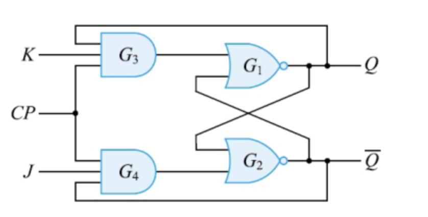
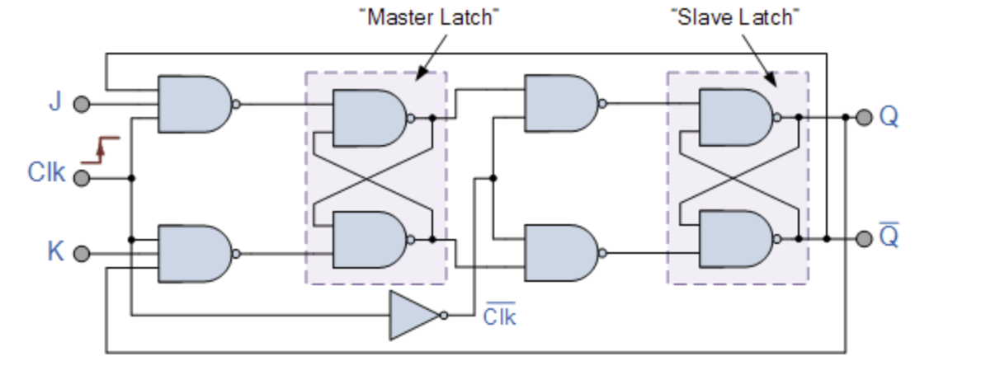
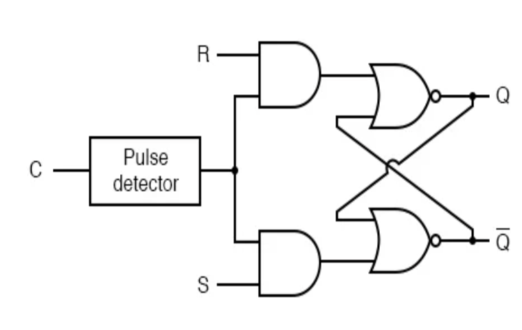
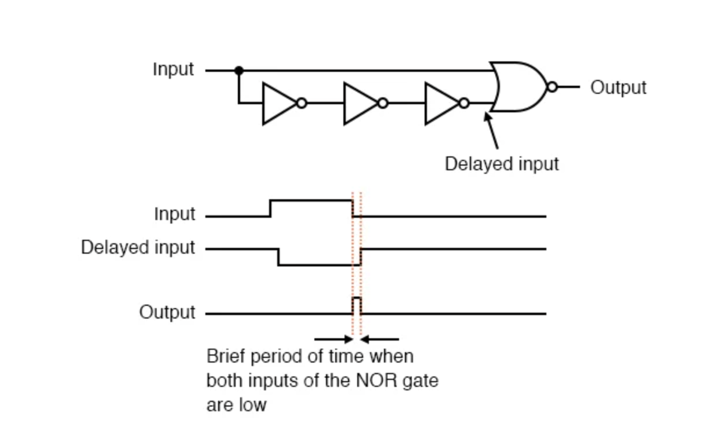
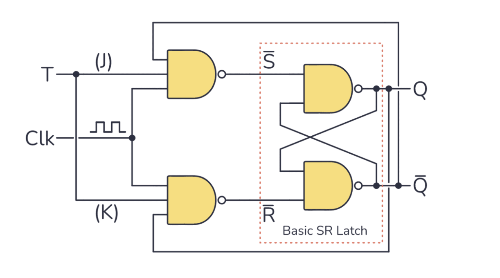
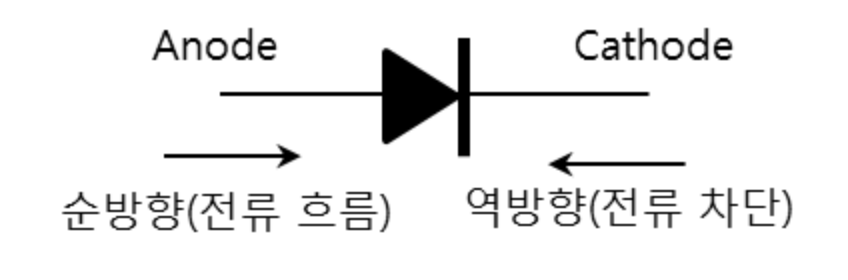
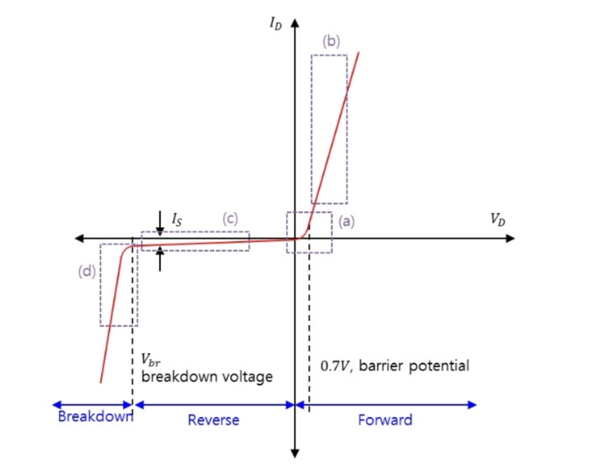
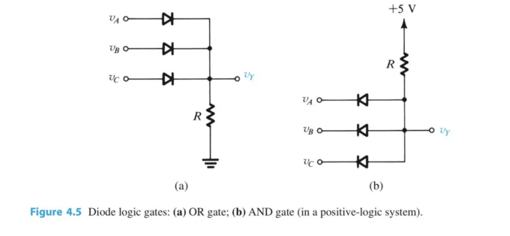

# Electronic calculator structure

## Table of contents

[주소 명령어(Address Instruction)](#주소-명령어address-instruction)

[플립플롭(Flip-flop)](#플립플롭flip-flop)

[다이오드(Diode)](#다이오드diode)

[메이저 상태(Major state)](#메이저-상태major-state)

[채널 제어기(Channel controller)](#채널-제어기channel-controller)

[레지스터(Register)](#레지스터register)

[명령어(Instruction)](#명령어instruction)

[CPU와 I/O 장치 사이의 데이터 전송 방식](#cpu와-io-장치-사이의-데이터-전송-방식)

[데이터 교환 방식](#데이터-교환-방식)

[데이터 단위](#데이터-단위)

[I/O 장치 주소 지정 방식](#io-장치-주소-지정-방식)

[운영체제 처리 방식](#운영체제-처리-방식)

[논리소자(Logic Element)](#논리소자logic-element)

[저장 매체 접근 방식](#저장-매체-접근-방식)

[비트 표현법](#비트-표현법)

[집적회로 집적도(IC Integration)](#집적회로-집적도ic-integration)

[논리소자 전기적 특성](#논리소자-전기적-특성)

---

## 주소 명령어(Address Instruction)

주소 명령어는 주소를 몇 개 포함하느냐에 따라 구분됨.

주소 명령어는 컴퓨터 구조에서 **레지스터 및 메모리** 연산을 위해 사용됨.

### 0-주소 명령어(Zero-address Instruction)

주소가 포함되지 않은 명령어.

**스택(stack)** 메모리와 관련된 역할을 수행할 때 사용됨.

```text
Expression: X = (A+B)*(C+D)
Postfixed : X = AB+CD+*
TOP means top of stack
M[X] is any memory location

---------------------------

PUSH A   ->   TOP = A
PUSH B   ->   TOP = B
ADD      ->   TOP = A+B
PUSH C   ->   TOP = C
PUSH D   ->   TOP = D
ADD      ->   TOP = C+D
MUL      ->   TOP = (C+D)*(A+B)
POP X    ->   M[X] = TOP
```

### 1-주소 명령어(One-address Instruction)

**누산기(Accumulator)** 를 묵시적 피연산자로 사용하고, 나머지 하나의 피연산자 주소만 명령어에 명시하는 방식.

명시된 피연산자의 주소를 참조하여 누산기의 데이터와 함께 연산을 수행.

구조

| 조작부호 (Opcode) |  모드 (Mode)   | 오퍼랜드 / 오퍼랜드 주소 (Operand / Address of Operand) |
| :---------------: | :------------: | :-----------------------------------------------------: |
|    연산 명령어    | 주소 지정 모드 |             피연산자 값 또는 피연산자 주소              |

```text
Expression: X = (A+B)*(C+D)
AC is accumulator
M[] is any memory location
M[T] is temporary location

---------------------------

LOAD A    ->    AC = M[A]
ADD B     ->    AC = AC + M[B]
STORE T   ->    M[T] = AC
LOAD C    ->    AC = M[C]
ADD D     ->    AC = AC + M[D]
MUL T     ->    AC = AC * M[T]
STORE X   ->    M[X] = AC
```

### 2-주소 명령어(Two-address Instruction)

상용 컴퓨터에서 주로 사용되는 명령어.

목적지 주소(Destination)와 소스 주소(Source) 총 2개를 포함하여 연산을 수행. 연산 결과는 목적지 주소에 저장됨.

구조

| 조작부호 (Opcode) |  모드 (Mode)   |                목적 주소 (Destination address)                 |   소스 주소 (Source address)   |
| :---------------: | :------------: | :------------------------------------------------------------: | :----------------------------: |
|    연산 명령어    | 주소 지정 모드 | 피연산자 주소면서 연산 결과가 저장될 레지스터 또는 메모리 주소 | 피연산자 값 또는 피연산자 주소 |

```text
Expression: X = (A+B)*(C+D)
R1, R2 are registers
M[] is any memory location

---------------------------

MOV R1, A    ->    R1 = M[A]
ADD R1, B    ->    R1 = R1 + M[B]
MOV R2, C    ->    R2 = M[C]
ADD R2, D    ->    R2 = R2 + M[D]
MUL R1, R2   ->    R1 = R1 * R2
MOV X, R1    ->    M[X] = R1
```

### 3-주소 명령어(Three-address Instruction)

목적지 주소와 피연산자 주소 2개를 포함하여 총 3개의 주소를 포함한 명령어.

하나의 명령어로 두 피연산자와 결과 주소를 모두 지정할 수 있어 프로그램의 명령어 수가 줄어들지만, 명령어 자체의 길이가 길어져 명령 수행 속도가 빨라지지는 않음.

구조

| 조작부호 (Opcode) |  모드 (Mode)   |       목적 주소 (Destination address)        |   소스 주소 (Source address)   |   소스 주소 (Source address)   |
| :---------------: | :------------: | :------------------------------------------: | :----------------------------: | :----------------------------: |
|    연산 명령어    | 주소 지정 모드 | 연산 결과가 저장될 레지스터 또는 메모리 주소 | 피연산자 값 또는 피연산자 주소 | 피연산자 값 또는 피연산자 주소 |

```text
Expression: X = (A+B)*(C+D)
R1, R2 are registers
M[] is any memory location

---------------------------

ADD R1, A, B    ->    R1 = M[A] + M[B]
ADD R2, C, D    ->    R2 = M[C] + M[D]
MUL X, R1, R2   ->    M[X] = R1 * R2
```

---

## 플립플롭(Flip-flop)

1비트를 저장할 수 있는 가장 기본적인 기억 소자.

상태를 기억하는 개념을 하드웨어로 구현한 소자.

레지스터, CPU 내부(AC, PC 등), 캐시, 카운터, 상태 머신 등 장치에 포함되어 쓰인다.

실제로 **D-플립플롭** 이 가장 많이 쓰인다.

### SR 플립플롭(Set-reset Flip-flop)


S(set)와 R(reset) 두 개의 입력으로 상태를 제어하는 가장 기본적인 플립플롭.

**`구조`**

NOR 게이트 2개로 구성(입력 부분 제외)

입력부(R, S), 래치부(NOR)로 구성

**`동작 흐름`**

|  S  |  R  |        Q(t+1)        |
| :-: | :-: | :------------------: |
|  0  |  0  |          Q           |
|  1  |  0  |          1           |
|  0  |  1  |          0           |
|  1  |  1  | undefined(예측 불가) |

**`문제점`**

금지 상태(S=R=1)

- S=R=1 상태를 금지 상태라고 한다.

- 금지 상태 이후 출력 결과는 예측 불가능하다.

### JK 플립플롭(JK Flip-flop)



SR 플립플롭의 금지 상태(S=R=1) 문제를 해결하기 위해 만들어진 플립플롭.

JK의 정확한 의미는 파악되지 않았다.

- 그냥 알파벳 순서로 JK를 붙였다는 설이 가장 유력하다.

**`구조`**

J는 S(set)에 대응하고 K는 R(reset)에 대응한다.

J=K=1 상태에서 기존 출력값을 반전(토글)한다.

입력부(J, K), 래치부(NOR) 외에 **피드백부(Q, Q')** 가 존재하여 입력부로 들어감.

**`동작 흐름(진리표)`**

|  J  |  K  |   Q(t+1)   |
| :-: | :-: | :--------: |
|  0  |  0  |     Q      |
|  1  |  0  |     1      |
|  0  |  1  |     0      |
|  1  |  1  | !Q(toggle) |

**`문제점`**

레이싱(Racing)문제

- J=K=1 상태에서 클럭이 1인 동안 계속 토글이 반복될 수 있다.

- 문제를 해결하기 위해 트리거 방식을 기존 **레벨 트리거(Level trigger)** 방식에서 **엣지 트리거(Edge trigger)** 방식으로 변경할 수 있다. (클럭의 상승/하강 순간에만 반응)

### 주종 JK 플립플롭(Master-slave JK Flip-flop)



기존 JK 플립플롭의 레이싱 문제를 해결하기 위해 만들어짐.

**`구조`**

JK 플립플롭 2개를 직렬로 연결하여, 입력과 연결된 앞 부분을 마스터(master) 플립플롭으로 구분하고, 피드백 부와 연결된 뒷 부분을 종(slave) 플립플롭으로 구분함.

**`동작 방식`**

CLK = 1

- 클럭(clk)이 1인 경우 마스터 플립플롭이 활성화되어 입력값(JK)을 받아들임.

- 종 플립플롭은 비활성화되어 출력 상태(피드백 부)는 변화가 없음.

- 클럭이 1상태를 유지하는 경우 토글이 반복되어 레이싱 문제가 발생했었는데, 피드백과 연결된 종 플립플롭이 입력값을 받아들이지 않으므로 레이싱이 발생하지 않음.

CLK = 0

- 클럭이 0인 경우 마스터 플립플롭이 비활성화되어 입력(JK)을 차단함.

- 종 플립플롭은 활성화되어 마스터 플립플롭의 출력값을 전달함.

**`문제점`**

1s catching 문제

```text
원래 J = 0 이어야 하는데

      J=0 정상        J=0 정상
        ↓               ↓
0V ─────────/\─────────────
            ↑
      순간적으로 5V 튀어오름
      = 회로가 J=1로 인식!
      = 1s catching 발생!
```

- CLK=1 구간에 J에 순간적인 노이즈가 들어와도 마스터가 받아들여버린다.
  - 여기서 노이즈란, J(또는 K) 입력선에 의도치 않게 끼어드는 전기적 잡신호로 인하여 입력값이 1로 오인되는 현상을 말한다.

- 이 문제도 엣지 트리거 방식으로 완전히 해결 가능.

### 엣지 트리거 JK 플립플롭(Edge triggered JK Flip-flop)



1s catching 문제를 해결하기 위해 JK 플립플롭에서 클럭펄스에 **엣지 디텍터(Edge Detector)**를 추가한 플립플롭

**`엣지(펄스) 디텍터(Edge/Pulse Detector)`**



상승(Positive) 엣지 디텍터와, 하강(Negative) 엣지 디텍터로 구분된다.

현재 사진에 표현된 디텍터는 펄스가 상승에서 하강시 딜레이된 출력에 의해 아웃풋이 순간적으로 펄스를 방출하기 때문에 하강 엣지 디텍터다.

**`구조`**

- JK 플립플롭에서 엣지 디텍터가 추가된 구조다.

- 피드백 부에 출력값이 입력부로 연결되는 선이 포함되어 있지만, **클럭 펄스가 순간적으로 발생하기 때문에 피드백 부의 출력값이 입력값에 영향을 줄 시간이 부족하여** 선을 생략하여 표현한다.

### D 플립플롭(Delay/Data Flip-flop)


JK 플립플롭에서 입력값(JK)를 D(Delay/Data)로 통합한 플립플롭.

구조가 간단하고 안정성, 범용성이 높아 현재 실무 표준으로 사용됨.

**`D의 유래`**

D의 의미는 두 가지 설이 있으며, Delay가 원래 의미이고 Data는 확장된 해석이다.

- Delay
  - 입력 D가 클럭 한 박자 늦게 출력 된다는 의미.

- Data
  - 데이터를 저장한다는 의미.

**`구조`**

D 플립플롭은 토글 기능이 필요 없기 때문에 JK 플립플롭의 피드백 선(출력이 입력으로 연결되는 선)이 필요 없다.

기존 구분된 SR입력을 D로 통일하여 한쪽은 NOT 게이트를 통과하여 부정값을 주어서 S=R=1 상태를 완전히 회피.

**`동작 흐름(진리표)`**

|  D  | Q(t+1) | Q'(t+1) |
| :-: | :----: | :-----: |
|  0  |   0    |    1    |
|  1  |   1    |    0    |

### T 플립플롭(Toggle Flip-flop)



JK 플립플롭의 JK 입력을 T(toggle)로 통합하여, T 입력값에 따라 출력을 유지하거나 반전시키는 플립플롭.

**`구조`**

피드백 선

- T 플립플롭의 핵심 동작은 현재 출력을 반전시키는 것이다. 따라서 피드백 선과 입력부의 연결이 필요하다.

T 입력

- JK의 입력을 하나로 묶어서 1개의 동일한 입력 상태로 표현.

**`동작 흐름(진리표)`**

|  T  | Q(t+1) | Q'(t+1) |
| :-: | :----: | :-----: |
|  0  |   Q    |   Q'    |
|  1  |   !Q   |   !Q'   |

---

## 다이오드(Diode)



다이오드는 전류를 한쪽 방향으로 흐르게 하는 반도체 부품이다.

이 성질을 이용하여 **교류를 직류로 변환** 하는 정류 회로에 주로 활용된다.

### Anode / Cathode

PN접합을 통해 Anode를 +극 으로 하고, cathode를 -극으로 하여 전류가 흐르게 하는 것을 순방향 특성(순방향 바이어스)이라 한다.

반대로 Anode를 -극으로 하고, cathode를 +극으로 하는 것을 역방향 특성(역방향 바이어스)라고 하며, 이 경우 **전류가 차단** 된다.

### 다이오드 특성 곡선



**`(a) 문턱 전압(Barrier potential)`**

문턱 전압 이하에서는 순방향의 전압이 인가되어도 전류가 흐르지 않고, 문턱 전압 이상의 전압이 걸려야 전류가 흐르게 된다.

반도체 물질이 Ge(게르마늄)일 때는 0.2V ~ 0.3V 정도이며, Si(규소 / 실리콘)일 때는 0.5V ~ 0.7V 정도다.

오프셋 전압(Offset potential)이라고도 한다.

**`(b) 벌크 저항(Bulk resistance)`**

다이오드 반도체 자체가 가지고 있는 저항값.

문턱 전압 이상의 전압이 인가될 때 이상적으로 저항 없이 같은 크기의 전류가 흘러야 하지만, 반도체 자체의 저항(bulk resistance)으로 인하여 전류 손실이 발생한다.

전압 대비 전류의 기울기를 통하여 벌크 저항을 유추할 수 있다.

**`(c) 역방향 전류(Reverse current)`**

이상적인 다이오드에서는 역방향 전압이 인가될 때 전류가 흐르지 않지만, 실제로는 미세한 역방향 전류가 흐르게 된다.

**`(d) 항복 전압(Breakdown voltage)`**

실제 다이오드는 역방향으로 차단할 수 있는 전압이 한계가 있으며, 그 기준 전압을 항복 전압이라고 한다.

항복 전압을 넘어선 역방향 전압이 인가되면 더 이상 전류를 차단시키지 못하고 역방향으로 전류가 흐르게 된다.

### 다이오드 논리 게이트(Diode logic gate)



**`(a) OR 게이트`**

(a) 게이트에서 입력 V<sub>A</sub>, V<sub>B</sub>, V<sub>C</sub> 중 하나라도 5V가 걸리면 순방향 바이어스가 걸려서 출력 V<sub>Y</sub>에 이상적으로는 5V, 실제로는 문턱 전압 강하만큼 낮은 전압이 출력된다.

**`(b) AND 게이트`**

(b) 게이트에서 입력 V<sub>A</sub>, V<sub>B</sub>, V<sub>C</sub> 중 하나라도 입력이 0V라면 출력 V<sub>Y</sub>에는 이상적인 결과로 0V가 걸린다.

모든 다이오드 입력에 전압을 주면 다이오드는 역방향 바이어스가 걸려서 전류가 흐르지 않는 상태(opened)가 된다. 따라서 +[Vcc](/embedded/abbreviation.md#vccvoltage-at-the-common-collector)로부터 들어온 전압이 온전하게 출력 V<sub>Y</sub>로 흐를 수 있게 된다.

다이오드에 입력이 하나라도 없으면 +Vcc로부터 들어온 전압이 다이오드에 순방향 바이어스로 걸리게 되어 **전압 강하** 가 발생한다. 따라서 출력 V<sub>Y</sub>에 걸리는 전압은 실제로 5V미만이 걸려 사실상 무의미한 전압이 걸린다.

_실무적으로 다이오드를 이용해서 논리게이트를 표현하는 것은 전력이 비효율적으로 많이 소모되기 때문에 잘 사용하지는 않는다._

---

## 메이저 상태(Major state)

메이저 상태는 현재 CPU가 무엇을 하고 있는가를 나타내는 상태를 말한다.

메이저 상태는 메이저 스테이트 레지스터를 통해서 알 수 있다.

CPU가 메모리에 접근하는 방식에 따라 Fetch, Indirect, Execute, Interrupt 상태로 구분한다.

_`메이저 스테이트 레지스터(Major State Register)는 특정 상용 CPU 모델(예: Intel Core i9, Apple M3 등)에 이름 그대로 들어있는 부품이라기보다, 컴퓨터 구조(Computer Architecture)의 교육적 모델이나 전통적인 논리 설계 방식의 CPU에서 상태를 관리하기 위해 사용하는 개념적인 장치에 가깝다.`_

- 실무와 현대 컴퓨터 구조에서는 [명령 사이클(Instruction Cycle)](https://en.wikipedia.org/wiki/Instruction_cycle)이 더욱 보편적이고 핵심적인 개념이다.

### 사이클 제어

메이저 스테이트 레지스터의 값은 F, R플립플롭 상태에 따라 결정된다.

|  F  |  R  | 신호 |   상태    |
| :-: | :-: | :--: | :-------: |
|  0  |  0  |  C0  |   Fetch   |
|  0  |  1  |  C0  | Indirect  |
|  1  |  0  |  C0  |  Execute  |
|  1  |  1  |  C0  | Interrupt |

### 메이저 상태 과정


**`인출 사이클(Fetch cycle)`**

- 명령어를 주기억장치에서 중앙처리장치의 명령 레지스터로 가져와 해석하는 단계.

- 가져온 명령어 종류에 따라 indirect 또는 execute 단계로 변천한다.

**`간접 사이클(Indirect cycle)`**

- Fetch 단계에서 해석된 명령의 주소부가 간접 주소인 경우 수행된다.

- 명령 주소가 간접 주소이면, 유효 주소를 계산하기 위해 다시 indirect 단계를 수행한다.

- 간접 주소가 아닌 경우에는 명령어 종류에 따라서 Execute 단계 또는 Fetch 단계로 이동할지를 판단한다.

**`실행 사이클(Execute cycle)`**

- fetch 단계에서 인출하여 해석한 명령을 실행하는 단계.

- 메이저 상태 레지스터 상태 변화를 감지하여 interrupt 단계로 변천할 것인지를 판단한다.

**`인터럽트 사이클(Interrupt cycle)`**

- 인터럽트 발생 시 복귀 주소(PC)를 저장시키고, 제어 순서를 인터럽트 처리 프로그램의 첫 번째 명령으로 옮기는 단계.

- 인터럽트 사이클을 마친 후에는 항상 fetch 단계로 변천한다.

---

## 채널 제어기(Channel controller)

### 채널(Channel)

주기억 장치와 입출력 장치 사이에서 입출력을 제어하는 입출력 전용 프로세서(IOP).

CPU 대신 I/O를 전담 처리하는 프로세서로, CPU와 I/O 장치 사이의 속도 차이를 줄이기 위해 사용됨.

채널은 **프로세서** 이므로 필요에 따라 자체적으로 질의 수정 또는 코드 변환 등의 기능을 수행할 수 있다.

입출력 수행 중 어떤 에러 조건이 발생하면 CPU에 인터럽트를 걸 수 있다.

**`맥락에 따른 의미`**

컴퓨터 구조에서 I/O 채널은 데이터 전송을 관리하는 별도의 프로세서, 즉 하드웨어 장치를 의미한다.

- **I/O 채널** 은 I/O처리를 전달하는 개념 자체를 말하며, **채널 제어기** 는 I/O채널 개념을 구현한 하드웨어 장치를 강조하는 표현이다.

통신에서의 채널은 데이터가 지나가는 통로, 회선을 의미한다.

### 구성 요소


Channel Program

- 채널 명령어(CCW)들이 연결 리스트로 연결되어 있는 집합. 주기억 장치에서 프로그램으로 형성됨.

- 채널 제어기에 의해 명령어들이 수행됨.

CAW(Channel Address Word - 채널 주소 단어)

- CCW의 시작 주소를 기억하는 레지스터

CCW(Channel Command Word - 채널 명령어)

- 주기억 장치에 있는 하나의 Block을 입출력하기 위한 정보를 가지고 있는 명령어.

- 채널 제어기에 의해 인출(Fetch)되어 수행된다.

- 구조

  | operation Code | Block Address | Word Count | Next CCW Address |
  | :------------: | :-----------: | :--------: | :--------------: |

  Operation Code
  - 입출력 여부, 분기, 입출력 장치 제어, 채널 동작에 대한 정보를 나타냄

  Block Address
  - Block의 첫 번째 주소

  Block Word Count
  - 입출력하고자 하는 Block의 word 개수

  Next CCW Address
  - 다음 채널 명령어 주소

CSW(Channel Status Word - 채널 상태 단어)

- 입출력 완료 후 채널이 CPU에게 결과를 보고하기 위한 상태 정보를 기억하는 레지스터.

- 입출력 정상 완료 여부, 잔여 word count, 에러 조건 등의 정보를 포함한다.

### 입출력 장치에 따른 채널의 종류

셀렉터 채널(Selector channel)

- 채널을 하나의 입출력 장치가 독점해서 전용으로 처리하는 방식.

- 고속 전송에 적합한 방식. Disk 장치에 적합.

바이트 멀티플렉서 채널(Byte Multiplexer channel)

- 한 개의 채널에 여러 개의 입출력 장치를 연결해서 시분할 공유(Time share) 방식으로 입출력하는 방식.

- 저속 입출력 방식이다.

- 속도가 느린 장치들을 여러 개 관리할 수 있다. 키보드, 프린터와 같은 느린 장치들을 한 채널에 연결할 때 사용.

블록 멀티플렉서 채널(Block multiplexer channel)

- 하나의 데이터 경로를 공유한다는 점과 고속 I/O 장치를 취급한다는 점에서 셀렉터 채널과 바이트 멀티플렉서 채널 방식을 결합한 형태.

---

## 레지스터(Register)

### 범용 레지스터(General purpose register)

**`데이터 레지스터(Data Register)`**

연산에 사용할 데이터를 임시로 저장.

누산기(AC)가 대표적으로 DR로 사용됨.

인덱스 레지스터(Index Register)

배열이나 반복문에서 인덱스 값을 저장.

기준 주솟값에 인덱스 레지스터에 저장된 값을 더해서 배열 요소의 유효 주소를 계산.

**`베이스 레지스터(Base Register)`**

프로그램이 메모리에 적재된 시작 주소(기준 주소)를 저장.

논리 주소에 베이스 레지스터에 저장된 값을 더해서 물리 주소로 **변환** 하는데 사용됨.

### 특수 목적 레지스터(Special purpose register)

**`프로그램 카운터(PC, Program Counter)`**

다음에 실행할 명령어의 메모리 주소를 저장.

명령어를 인출할 때마다 자동으로 증가하고, 분기(branch) 명령시 해당 주소로 변경.

**`명령어 레지스터(IR, Instruction Register)`**

현재 실행중인 명령어를 저장.

메모리에서 인출(Fetch)한 명령어가 IR로 들어오고 제어장치가 해독(decode)함.

메모리 주소 레지스터(MAR, Memory Address Register)

CPU가 접근하려는 메모리 주소를 저장함.

메모리에 I/O 요청을 보낼 때 MAR 값이 주소 버스로 나감.

**`메모리 버퍼 레지스터(MBR, Memory Buffer Register)`**

메모리에서 읽어온 데이터 또는 메모리에 쓸 데이터를 임시 저장.

MDR(Memory Data Register)라고도 불림.

**`스택 포인터(SP, Stack Pointer)`**

현재 스택의 최상위(top) 주소를 가리킴.

함수 호출, 복귀, interrupt 처리시 데이터를 push/pop할 때 사용됨.

**`상태 레지스터(PSR/Flag Register)`**

ALU(Arithmetic Logic Unit) 연산 결과의 상태를 비트별로 저장함.

대표적인 플래그로는 Zero(결과가 0), Carry(자리 올림 발생), Overflow, Sign(부호) 등이 있다.

**`시퀀스 카운터(SC, Sequence Counter)`**

제어장치에서 마이크로 연산의 순서를 제어하는데 사용됨.

각 명령어의 실행 단계를 순차적으로 진행할 때 사용됨.

---

## 명령어(Instruction)

### 데이터 전송 명령어

데이터를 이동시키는 명령어

| 명령어 | 설명                                  |
| :----: | :------------------------------------ |
|  load  | 메모리에서 레지스터로 데이터를 읽어옴 |
| store  | 레지스터의 데이터를 메모리에 씀       |
|  move  | 레지스터 간 데이터를 복사             |
|  push  | 스택에 데이터를 쌓음 (SP 감소)        |
|  pop   | 스택에서 데이터를 꺼냄 (SP 증가)      |

### 연산 명령어

산술/논리 연산을 수행하는 명령어

| 명령어 | 설명                   |
| :----: | :--------------------- |
|  add   | 두 값을 더함           |
|  sub   | 두 값을 뺌             |
|  and   | 비트 AND 연산          |
|   or   | 비트 OR 연산           |
|  set   | 지정한 비트를 1로 설정 |

### 제어 명령어

프로그램의 실행 흐름을 변경하는 명령어

| 명령어 | 설명                                       |
| :----: | :----------------------------------------- |
|  jump  | 지정한 주소로 **무조건** 이동              |
| branch | 조건에 따라 지정한 주소로 이동 (조건 분기) |
|  call  | 현재 PC를 저장하고 서브루틴으로 이동       |
| return | 저장된 PC로 복귀                           |

### 입출력 명령어

CPU와 외부 입출력 장치 사이에서 데이터를 전송하는 명령어

| 명령어 | 설명                                          |
| :----: | :-------------------------------------------- |
|   IN   | 입출력 장치에서 데이터를 읽어 레지스터에 저장 |
|  OUT   | 레지스터의 데이터를 입출력 장치로 전송        |

### 주소 지정 방식(Addressing mode)

명령어에서 피연산자(operand)의 실제 위치(유효 주소)를 결정하는 방식.

간접 사이클(Indirect cycle)은 이 중 간접 주소 방식일 때만 수행된다.

**`즉시 주소 지정(Immediate addressing)`**

명령어 자체에 피연산자 값이 포함되어 있음.

메모리 접근 없이 빠르게 처리되지만, 표현 가능한 값의 범위가 명령어 길이에 제한됨.

예: `LOAD #5` → 레지스터에 값 5를 바로 적재.

**`직접 주소 지정(Direct addressing)`**

명령어의 주소부가 피연산자가 저장된 메모리 주소를 직접 나타냄.

예: `LOAD 100` → 메모리 100번지의 값을 읽어옴.

**`간접 주소 지정(Indirect addressing)`**

명령어의 주소부가 피연산자의 주소를 담고 있는 메모리 주소를 가리킴. 즉, 주소의 주소.

메모리를 두 번 접근해야 하므로 속도가 느리지만, 넓은 주소 공간을 표현할 수 있음.

이 방식일 때 간접 사이클(Indirect cycle)이 수행됨.

**`레지스터 주소 지정(Register addressing)`**

피연산자가 메모리가 아닌 레지스터에 있음.

메모리 접근이 없어 가장 빠름.

예: `LOAD R1` → 레지스터 R1의 값을 읽어옴

**`레지스터 간접 주소 지정(Register indirect addressing)`**

레지스터에 저장된 값을 메모리 주소로 사용함.

예: LOAD (R1) → R1이 가리키는 메모리 주소의 값을 읽어옴

**`변위 주소 지정(Displacement addressing)`**

기준 주소(레지스터 값)에 명령어의 변위(offset)를 더해 유효 주소를 계산함.

베이스 레지스터 방식, 인덱스 레지스터 방식, 상대 주소 방식이 이에 해당함.

|      방식       |      기준       | 설명                                                    |
| :-------------: | :-------------: | :------------------------------------------------------ |
| 베이스 레지스터 | 베이스 레지스터 | 프로그램의 메모리 적재 시작 주소 기준. 재배치에 사용    |
| 인덱스 레지스터 | 인덱스 레지스터 | 배열 순회 등 반복 접근에 사용                           |
|    상대 주소    |       PC        | PC 기준으로 분기 목적지를 표현. branch 명령에 주로 사용 |

---

## CPU와 I/O 장치 사이의 데이터 전송 방식

### 전송 방식

**`동기식 전송(Synchronous)`**

송신과 수신이 **같은 클럭을 공유** 하여 일정한 타이밍에 맞춰 데이터를 전송.

속도가 빠르지만 양쪽의 클럭이 동기화되어야 함.

**`비동기식 전송(Asynchronous)`**

별도의 클럭 없이 **시작 비트(Start bit)와 정지 비트(Stop bit)** 로 데이터의 시작과 끝을 알리는 방식.

**패리티 비트(Parity bit)** 를 포함하여 오류 검출을 수행하기도 함.

Start/Stop bit가 오버헤드로 작용하여 속도가 느리지만, 구현이 간단하고 저속 장치에 많이 사용됨.

### 전송 방향

**`단방향(Simplex)`**

한쪽 방향으로만 전송 가능한 방식.

TV 방송, 라디오 등이 해당.

**`반이중(Half Duplex)`**

양방향 전송이 가능하지만 동시에는 불가능한 방식.

한쪽이 보내는 동안 다른 쪽은 받기만 해야 함. 무전기가 대표적.

**`전이중(Full Duplex)`**

양방향 동시 전송이 가능한 방식. 전화, 네트워크 통신 등이 해당.

### 전송 단위

**`직렬 전송(Serial)`**

데이터를 한 비트씩 순차적으로 전송함.

회선이 적게 필요하지만 속도가 느림.

USB, UART 등이 해당함. 저속 장치나 장거리 전송에 적합함.

**`병렬 전송(Parallel)`**

여러 비트를 동시에 전송함.

속도가 빠르지만 그만큼 **많은 회선** 이 필요함.

내부 버스, 과거 프린터 포트 등이 해당함.

고속 장치나 근거리 전송에 적합함.

단, 여러 회선의 신호 도착 타이밍이 어긋나는 **스큐(Skew) 문제** 가 발생할 수 있어 장거리·고속 환경에서는 불리함. 이것이 현대에 고속 직렬 방식(PCIe, SATA, USB 3.x)을 선호하는 이유임.

### 제어 방식

**`스트로브(Strobe) 방식`**

한쪽(송신 또는 수신)이 **스트로브 신호** 를 보내서 데이터가 유효하다는 것을 알림.

**별도의 스트로브 신호 회선** 이 필요.

스트로브를 누가 발생시키는지에 따라 구분

- **송신측 스트로브** : 송신이 데이터를 버스에 올린 후 스트로브 신호를
  발생시켜 수신에게 알림.

- **수신측 스트로브** : 수신이 데이터를 읽을 준비가 되었을 때 스트로브 신호를 발생시켜 송신에게 알림.

한쪽만 제어하므로(한 개의 제어선만 사용) 구현이 간단하지만, 수신측이 데이터를 정상적으로 받았는지 확인할 수 없는 단점이 있다.

**`핸드세이킹(Handshaking) 방식`**

송신과 수신이 서로 확인 신호를 주고받으며 전송하는 방식.

스트로브 제어 방식의 결점을 보완한 것으로, I/O 장치와 인터페이스 간의 비동기 데이터 전송을 위해 사용함.

스트로브보다 복잡(많은 회선이 필요)하지만 데이터 전송의 신뢰성이 높다.

양쪽이 모두 동작해야 하고, 속도가 다른 장치 간에도 사용 가능.

### CPU 개입정도

**`프로그램에 의한 I/O(Programmed I/O)`**

CPU가 직접 I/O 장치의 상태를 **반복적으로 확인(Polling)** 하면서 데이터를 전송.

CPU가 I/O 완료까지 계속 관여해야 하므로 **CPU 사용 효율이 가장 낮다** .

**`인터럽트에 의한 I/O(Interrupt-driven I/O)`**

I/O 장치가 준비되면 CPU에게 인터럽트를 걸어 알림.

CPU는 인터럽트가 올 때까지 다른 작업을 할 수 있어서 폴링 방식보다 효율적.

단, 인터럽트가 발생하면 **실제 데이터 이동(I/O 레지스터 → 메모리)은 CPU가 직접 수행** 하므로, 전송 데이터 양이 많을 경우 CPU 부하가 여전히 크다. 이것이 DMA 도입의 배경이 됨.

**`DMA(Direct Memory Access)`**

**CPU 개입 없이 DMA 컨트롤러** 가 I/O 장치와 메모리 사이에 직접 데이터를 전송.

CPU는 전송 시작과 완료만 관여하므로 대량 데이터 전송에 효율적.

메모리 버스를 사용하는 방식에 따라 세 가지로 구분.

- **Cycle Stealing**: CPU 버스 사이클 사이사이에 한 사이클씩 버스를 빌려 사용. CPU 지연이 최소화됨.

- **Burst mode**: 전송이 완료될 때까지 버스를 독점. 전송 속도가 빠르지만 CPU 지연이 큼.

- **Transparent mode**: CPU가 버스를 사용하지 않는 유휴 시간을 이용하여 전송. CPU에 영향 없음.

**[채널(Channel)](#채널-제어기channel-controller)**

DMA보다 더 발전된 방식으로, **채널 제어기** 가 자체적으로 I/O 프로그램을 실행하며 데이터 전송을 관리.

CPU 개입이 가장 적고, 멀티플렉서 채널, 셀렉터 채널, 블록 멀티플렉서 채널로 구분.

### 큐(Queue)에 의한 전송

독립적인 전송 방식이 아니라, 위의 전송 방식들과 함께 사용되는 **버퍼링 보조 메커니즘**이다.

송신과 수신의 속도 차이가 클 때 중간에 **버퍼(큐)**를 두어 데이터를 임시 저장하는 방식.

비동기적으로 동작하며, 빠른 쪽이 큐에 데이터를 넣고(enqueue) 느린 쪽이 자기 속도에 맞춰 데이터를 처리(dequeue).

속도 차가 큰 장치 간 전송에 적합.

---

## 데이터 교환 방식

### 회선 교환방식 (Circuit Switching)

통신 전에 송신과 수신 사이에 **전용 경로** 를 먼저 설정하고, 통신이 끝날 때까지 그 경로를 독점적으로 사용하고, 전송이 완료되면 회선을 해제하는 방식.

전용 경로를 사용하므로 전송 지연이 적고 일정한 품질이 보장되지만, 통신하지 않는 동안에도 회선을 점유하고 있어서 회선 이용 효율이 낮음.

연결 설정 시간이 필요하지만, 한번 연결되면 데이터 전송 속도가 일정.

PSTN(공중 전화망, 아날로그 유선 전화)이 대표적인 예시다. 전화를 걸면 경로가 설정되고, 통화 중에는 그 회선을 독점. 현대 인터넷 전화(VoIP)는 패킷 교환 방식 기반이므로 혼동 주의.

### 메시지 교환방식 (Message Switching)

전용 경로를 설정하지 않고, 메시지 단위로 중간 노드에 저장한 후 다음 노드로 전달하는 축적 교환(Store-and-Forward) 방식.

전용 회선이 필요 없어서 회선 이용 효율이 높다.

메시지 전체를 저장한 후 전달하므로 메시지가 클수록 지연 시간이 길어지고, 중간 노드에 큰 저장 공간이 필요하다.

실시간 통신에는 부적합한 방식.

이메일, 전보 시스템이 메시지 교환방식에 가깝다.

### 패킷 교환방식 (Packet Switching)

메시지를 **패킷(packet)** 이라는 작은 단위로 분할하여 각각 독립적으로 전송함.

메시지 교환과 마찬가지로 축적 교환 방식이지만, 단위가 작아서 더 효율적으로 전송함.

회선 이용 효율이 가장 높고, 여러 사용자가 네트워크를 공유할 수 있다.

실시간 통신에도 비교적 적합하다.

인터넷이 대표적인 예시.

- TCP는 가상 회선 방식에 가깝고, UDP는 데이터그램 방식에 가깝다.

**`세부 방식`**

가상 회선 방식(Virtual Circuit)

- 전송 전에 논리적인 경로를 먼저 설정하고, 모든 패킷이 같은 경로로 순서대로 전송.

- 회선 교환과 패킷 교환의 장점을 결합한 방식으로, 패킷 도착 순서가 보장됨.

- 동작 순서: **연결 설정(Call Setup)** → **데이터 전송** → **연결 해제(Teardown)** 의 3단계로 진행.

- ATM(Asynchronous Transfer Mode)이 대표적인 예시.

데이터그램 방식(Datagram)

- 각 패킷이 **독립적인 헤더(목적지 주소 포함)** 를 가지고 스스로 최적의 경로를 결정하여 전송됨.

- 패킷마다 다른 경로로 갈 수 있어서 도착 순서가 바뀔 수 있고, 수신 쪽에서 재조립해야 한다.

- 유연하지만 패킷 도착 순서가 보장되지 않음.

**`세 방식 비교`**

| 구분        | 회선 교환           | 메시지 교환  | 패킷 교환                               |
| ----------- | ------------------- | ------------ | --------------------------------------- |
| 경로 설정   | 전용 경로 사전 설정 | 없음         | 없음(데이터그램) / 논리 경로(가상 회선) |
| 전송 단위   | 연속 비트 스트림    | 메시지 전체  | 패킷(소단위)                            |
| 회선 효율   | 낮음                | 높음         | 가장 높음                               |
| 전송 지연   | 낮고 일정           | 크고 가변적  | 작고 가변적                             |
| 실시간 통신 | 적합                | 부적합       | 비교적 적합                             |
| 대표 예시   | PSTN(유선 전화)     | 이메일, 전보 | 인터넷(IP)                              |

---

## 데이터 단위

컴퓨터에서 데이터를 표현하는 단위는 아래와 같이 **작은 단위에서 큰 단위로 계층적으로 쌓인다.**

Bit → Nibble → Byte → Word → Field → Record → File → Database

**`비트(Bit)`**

- Binary Digit의 줄임말. 컴퓨터가 표현할 수 있는 **최소 데이터 단위**로, 0 또는 1의 값을 가진다.

**`니블(Nibble)`**

- 4비트를 묶은 단위. 16진수 한 자리를 표현할 수 있다.

**`바이트(Byte)`**

- 8비트를 묶은 단위. ASCII 기준으로 문자 하나를 표현하는 기본 단위로 사용됨.

- 단, 한글·한자 등 유니코드 문자는 2~4바이트가 필요하므로 "1바이트 = 문자 1개"는 ASCII에 한정된 설명임.

**`워드(Word)`**

CPU가 한 번에 처리할 수 있는 데이터 단위.

CPU 아키텍처에 따라 크기가 다르다. 16비트 CPU면 1워드는 16비트, 32비트 CPU면 1워드는 32비트가 된다.

워드를 기준으로 파생 단위가 존재함:

- **Half Word**: 워드의 절반 (32비트 CPU 기준 16비트)

- **Double Word(DWORD)**: 워드의 2배 (32비트 CPU 기준 64비트)

- **Quad Word(QWORD)**: 워드의 4배 (32비트 CPU 기준 128비트)

**`필드(Field)`**

여러 바이트나 워드를 묶어 의미있는 하나의 데이터 항목을 표현한 것.

이름, 나이, 주소 같은 개별 항목을 필드라고 정의할 수 있음.

**`레코드(Record)`**

관련된 필드들을 묶은 단위.

데이터베이스에서 한 행(row)에 해당함.

**`파일(File)`**

관련된 레코드들을 묶은 단위.

**`데이터베이스(Database)`**

관련된 파일을 묶은 단위.

---

## I/O 장치 주소 지정 방식

I/O 주소 지정 방식은 CPU가 I/O 장치의 주소를 어떻게 관리하느냐에 따라 크게 두 가지로 나뉜다.

### 메모리 맵 I/O (Memory-Mapped I/O)

메모리 주소 공간의 일부를 I/O 장치에 할당하는 방식.

CPU 입장에서 메모리 접근이나 I/O 접근이나 똑같은 주소 체계를 사용한다.

**`동작 원리`**

예를 들어 전체 주소 공간이 0000~FFFF라면, 0000~DFFF는 메모리로, E000~FFFF는 I/O 장치로 할당하는 방식.

CPU는 메모리 접근 명령어(LOAD, STORE)로 I/O 장치에도 접근할 수 있음.

**`장점`**

별도의 I/O 전용 명령어가 필요 없다.

메모리 접근 명령어를 그대로 사용하므로 명령어 체계가 단순하고, 프로그래밍이 편리하다.

또한 메모리 관련 다양한 주소 지정 모드를 I/O에도 활용할 수 있다.

**`단점`**

메모리 주소 공간의 일부를 I/O에 빼앗기므로 사용 가능한 메모리 용량이 줄어들어 메모리 이용 효율이 낮아짐.

또한 주소만 보고 메모리 접근인지 I/O 접근인지 구별하기 어렵다.

I/O 레지스터 값은 하드웨어가 직접 바꾸는데, CPU 캐시가 이를 모르고 **캐시된 옛값을 읽는 문제**가 발생할 수 있음. 따라서 I/O 용도 주소 영역은 캐시 불가(non-cacheable)로 설정하거나, 소프트웨어에서 `volatile` 키워드를 사용해야 함.

**`사용 예시`**

ARM 프로세서 기반 시스템, 임베디드 시스템에서 많이 사용됨.

### 격리형 I/O (Isolated I/O)

메모리 주소 공간과 I/O 주소 공간을 완전히 분리하는 방식.

I/O 전용 주소 공간이 별도로 존재.

**`동작 원리`**

메모리는 메모리 주소 공간(0000~FFFF)을 전부 사용하고, I/O 장치는 별도의 I/O 주소 공간을 사용. x86 기준으로 I/O 주소 공간은 **16비트(0x0000~0xFFFF, 총 64KB)** 로 고정되어 있다.

CPU는 메모리 접근에는 LOAD/STORE 명령어를, I/O 접근에는 IN/OUT 같은 **전용 명령어** 를 사용.

**`장점`**

메모리 주소 공간 전체를 메모리에 사용할 수 있어 메모리 이용 효율이 높다.

주소만 보고 메모리 접근인지 I/O 접근인지 명확하게 구별할 수 있다.

**`단점`**

I/O 전용 명령어(IN, OUT 등)가 별도로 필요하여 명령어 체계가 복잡해진다.

메모리 주소 지정 모드를 I/O에 활용할 수 없다.

**`사용 예시`**

Intel x86 프로세서 기반 시스템에서 사용된다.

### 두 방식 비교

| 구분        | 메모리 맵 I/O                  | 격리형 I/O                   |
| ----------- | ------------------------------ | ---------------------------- |
| 주소 공간   | 메모리와 I/O가 공유            | 메모리와 I/O가 분리          |
| I/O 명령어  | 별도 불필요 (LOAD/STORE 사용)  | 전용 명령어 필요 (IN/OUT)    |
| 메모리 효율 | 낮음 (일부 메모리 공간 손실)   | 높음 (메모리 전체 사용 가능) |
| 캐시 문제   | 있음 (non-cacheable 설정 필요) | 없음                         |
| 접근 구별   | 어려움                         | 명확함                       |
| 대표 사례   | ARM, 임베디드 시스템           | Intel x86                    |

---

## 운영체제 처리 방식

### 일괄 처리 시스템 (Batch Processing)

데이터를 일정 기간 모아두었다가 **한꺼번에** 처리하는 방식.

급여 계산, 세금 처리 등 **즉시 결과가 필요 없는 작업** 에 적합.

시스템 효율은 높지만 응답 시간이 길다.

### 실시간 처리 시스템 (Real-Time Processing)

데이터가 발생하는 즉시 처리하는 방식.

정해진 시간(데드라인) 안에 반드시 결과를 내야 할 때 사용하는 시스템.

데드라인 허용 여부에 따라 두 가지로 구분된다.

- **Hard Real-Time** 데드라인을 단 한 번이라도 어기면 치명적 결함으로 이어짐. 항공기 제어, 심장박동기, 자동차 에어백 시스템 등.
- **Soft Real-Time** 데드라인을 약간 어겨도 성능 저하에 그치고 치명적이지는 않음. 스트리밍, 온라인 게임 등.

### 시분할 처리 시스템 (Time Sharing)

CPU 시간을 여러 사용자에게 타임 슬라이스(Time Slice) 단위로 돌아가며 배분하는 방식.

각 사용자가 마치 혼자 사용하는 것처럼 느끼게 한다.

CPU 전환의 기준이 **시간(타임 슬라이스)** 이며, 응답 시간 단축과 다중 사용자 지원이 목적. 라운드 로빈 스케줄링이 대표적.

### 다중 프로그래밍 시스템 (Multi-Programming)

메모리에 여러 프로그램을 동시에 올려놓고, 하나가 I/O 대기 중일 때 다른 프로그램을 실행하여 CPU 이용률을 높이는 방식.

CPU 전환의 기준이 **I/O 대기** 라는 점에서 시분할과 다름. 시분할은 응답성이 목적이고, 다중 프로그래밍은 CPU 이용률 극대화가 목적.

### 다중 처리 시스템 (Multi-Processing)

여러 CPU(프로세서)를 사용하여 여러 작업을 동시에 **병렬 처리** 하는 방식.

다중 프로그래밍이 CPU 1개를 효율적으로 활용하는 것과 달리, 다중 처리는 CPU 자체를 여러 개 사용함.

구성 방식에 따라 두 가지로 구분된다.

- **대칭형 다중처리(SMP, Symmetric Multi-Processing)**: 모든 CPU가 동등한 권한으로 하나의 OS와 메모리를 공유. 일반 서버, 데스크톱 멀티코어가 해당.

- **비대칭형 다중처리(AMP, Asymmetric Multi-Processing)**: 각 CPU가 서로 다른 역할(또는 OS/태스크)을 담당. 임베디드 시스템에서 자주 사용됨.

### 분산 처리 시스템 (Distributed Processing)

여러 컴퓨터를 네트워크로 연결하여 작업을 분산시켜 처리하는 방식.

**`다중 처리와의 핵심 차이`**

**다중 처리는 메모리를 공유**하지만, **분산 처리는 메모리를 공유하지 않고** 독립된 컴퓨터들이 네트워크를 통해 협력함.

---

## 논리소자(Logic Element)

논리소자는 디지털 회로를 구성하는 기본 소자다.

### RTL (Resistor-Transistor Logic)

저항과 트랜지스터로 구성된 가장 초기의 논리소자.

구조가 단순하고 가격이 저렴하지만, 속도가 느리고 잡음 여유(Noise Margin)가 낮다.

현재는 거의 사용되지 않으며, 논리소자 발전의 출발점으로서 의미가 있다.

### DTL (Diode-Transistor Logic)

다이오드와 트랜지스터로 구성된 논리소자.

RTL보다 잡음 여유가 개선된 버전.

다이오드가 논리 연산(AND/OR)을 담당하고 트랜지스터가 반전(NOT)과 증폭을 담당.

TTL의 전신이 되는 소자.

### TTL (Transistor-Transistor Logic)

트랜지스터만으로 구성된 논리소자.

DTL의 다이오드를 다중 이미터 트랜지스터로 대체하여 속도를 개선한 버전.

범용성이 높고 가격 대비 성능이 좋아서 오랫동안 디지털 회로의 표준으로 사용됨.

대표적인 IC 시리즈로 74xx 시리즈가 있다.

동작 전압은 5V이고, 소비 전력은 중간 수준이다.

### ECL (Emitter Coupled Logic)

이미터 결합 방식의 논리소자.

TTL은 트랜지스터를 포화 영역까지 구동하면 축적된 전하를 빼내는 시간(저장 시간)이 생겨 스위칭이 느려진다. ECL은 트랜지스터를 포화 상태까지 구동하지 않고 차동 증폭기 구조로 동작시켜 이 저장 시간을 제거하기 때문에 **스위칭 속도가 가장 빠르다.**

모든 논리소자 중 **최대 클럭 주파수가 가장 높다.**

하지만 **소비 전력이 가장 높고** 집적도가 낮아서, 슈퍼컴퓨터나 고속 통신 장비 등 극한의 속도가 필요한 곳에서 사용됨.

### MOS (Metal-Oxide-Semiconductor)

**MOS 트랜지스터(FET, Field-Effect Transistor)** 로 구성된 논리소자. NMOS와 PMOS로 나뉜다.

- **NMOS**: N채널 FET. 전자(electron)가 전류를 운반하며 스위칭 속도가 빠름.
- **PMOS**: P채널 FET. 정공(hole)이 전류를 운반하며 NMOS보다 속도가 느림.

트랜지스터 구조가 단순하여 집적도가 높고 제조 비용이 낮다.

소비 전력도 TTL보다 낮지만, 속도는 TTL보다 느리다.

초기 마이크로프로세서나 메모리에 사용됨.

### CMOS (Complementary MOS)

NMOS와 PMOS를 상보적으로 결합한 논리소자.

NMOS와 PMOS가 번갈아 동작하여 **스위칭이 없는 정적 상태에서는 전류가 거의 흐르지 않아** 소비 전력이 가장 낮다. 단, 스위칭 시에는 충·방전 전류가 흐르므로 동작 주파수가 높아질수록 소비 전력이 증가한다.

집적도도 높아서 현대 IC의 대부분이 CMOS로 제조된다.

CPU, 메모리, 스마트폰 칩 등 거의 모든 현대 반도체가 CMOS 기반으로 제조된다.

동작 전압 범위가 넓고(3~18V) 잡음 여유도 우수하다.

### 논리소자 비교

| 구분        | RTL             | DTL                 | TTL        | ECL              | MOS  | CMOS          |
| ----------- | --------------- | ------------------- | ---------- | ---------------- | ---- | ------------- |
| 구성 소자   | 저항+트랜지스터 | 다이오드+트랜지스터 | 트랜지스터 | 트랜지스터(차동) | FET  | NMOS+PMOS     |
| 스위칭 속도 | 가장 느림       | 느림                | 중간       | **가장 빠름**    | 느림 | 중간          |
| 소비 전력   | 중간            | 중간                | 중간       | **가장 높음**    | 낮음 | **가장 낮음** |
| 집적도      | 낮음            | 낮음                | 중간       | 낮음             | 높음 | **가장 높음** |
| 사용 현황   | 거의 미사용     | 거의 미사용         | 일부 사용  | 고속 장비        | 구형 | **현대 표준** |

---

## 저장 매체 접근 방식

### 순차 접근 (SASD, Sequential Access Storage Device)

데이터를 처음부터 순서대로 접근하는 방식.

원하는 데이터에 도달하려면 앞의 데이터를 모두 지나가야 하므로 접근 시간이 데이터 위치에 따라 달라진다.

속도는 느리지만 용량 대비 가격이 저렴하여 대량 데이터 백업용으로 사용된다.

대표 장치로 자기 테이프가 있다.

### 직접 접근 (DASD, Direct Access Storage Device)

데이터가 저장된 위치 근처로 직접 이동한 후 순차적으로 탐색하여 접근한다.

순차 접근보다 빠르지만, 위치에 따라 접근 시간이 약간 달라질 수 있다.

접근 시간은 3단계로 구성된다:

- **탐색 시간(Seek Time)**: 헤드가 원하는 트랙으로 이동하는 시간
- **회전 지연 시간(Rotational Latency)**: 원하는 섹터가 헤드 아래로 올 때까지 디스크가 회전하는 시간
- **전송 시간(Transfer Time)**: 실제 데이터를 읽거나 쓰는 시간

대표 장치로 HDD(자기 디스크), 자기 드럼이 있다. 광디스크(CD, DVD)는 단일 나선형 트랙 구조로 직접+순차의 혼합 방식에 가깝다.

가장 널리 사용되는 보조기억장치 접근 방식.

### 임의 접근 (Random Access)

데이터의 위치에 관계없이 동일한 시간에 접근하는 방식. 어떤 주소든 접근 시간이 같다.

**접근 속도가 가장 빠르고** 균일하다.

대표 장치로 RAM, ROM, SSD(플래시 메모리), 레지스터가 있다.

주기억장치에 주로 사용된다.

### 연관 접근 (Associative Access)

주소가 아니라 **데이터의 내용(Content)**으로 검색하여 접근하는 방식. 따라서 주소의 개념이 없다.

저장된 내용과 비교하여 일치하는 데이터를 찾는다.

모든 저장 위치를 동시에 비교하므로 검색 속도가 매우 빠르다.

대표 장치로 연관 기억장치(CAM, Content Addressable Memory)가 있다.

캐시 메모리의 태그 비교, TLB(Translation Lookaside Buffer) 등에 사용된다.

하드웨어 비용이 높다.

- 병렬 동작을 수행하기 때문에 많은 논리회로로 구성되어 있다.

---

## 비트 표현법

### BCD 코드 (Binary Coded Decimal, 8421 코드)

각 비트의 가중치가 8, 4, 2, 1인 표현법이며, 10진수 한 자리를 4비트 이진수로 표현.

- 0=0000, 1=0001, 5=0101, 9=1001

10진수와 변환이 직관적이어서 계산기, 디지털 시계 등에 사용됨.

10진수 한 자리가 4비트를 차지하므로, 순수 이진수보다 공간 효율이 낮다. (예: 10진수 99 → BCD 8비트, 순수 이진수 7비트)

0~9까지만 사용하고 1010~1111은 사용하지 않는 무효 코드로 정의.

### 3초과 코드 (Excess-3 Code)

BCD 코드에 **3(0011)**을 더한 코드.

- 0=0011, 1=0100, 5=1000, 9=1100

각 비트를 반전하면 9의 보수가 되는 **자기 보수(Self Complement)** 특성을 가진다.

- 자기 보수 특성 덕분에 뺄셈 연산이 편리하다.

가중치가 없는 비가중치 코드다.

### 그레이 코드 (Gray Code)

인접한 두 값이 1비트만 다른 코드.

- 0=0000, 1=0001, 2=0011, 3=0010, 4=0110, 5=0111

값이 변할 때 한 비트만 바뀌므로 전환 시 오류 가능성이 적다.

카르노맵(Karnaugh Map) 배치, 아날로그-디지털 변환기, 로터리 인코더 등에 사용된다.

이진수 → 그레이 변환

- 최상위 비트는 그대로, 나머지는 인접한 두 비트를 XOR.

그레이 → 이진수 변환

- 최상위 비트는 그대로, 나머지는 변환된 이전 비트와 현재 그레이 비트를 XOR.

### 해밍 코드 (Hamming Code)

오류 검출 및 수정이 가능한 코드.

데이터 비트 사이에 패리티 비트(검사 비트)를 삽입하여 오류 검출이 가능하도록 한다.

- 패리티 비트는 2의 거듭제곱(1, 2, 4, 8, …) 자리에 삽입하여 오류 위치를 패리티 비트들의 조합(신드롬 비트)으로 특정하고, 해당 비트를 반전시켜 수정한다.

1비트 오류를 검출하고 수정할 수 있지만, 2비트 오류는 검출만 가능하다.

패리티 비트를 1개 더 추가한 **SECDED(Single Error Correct, Double Error Detect)** 방식은 2비트 오류까지 검출 가능하며, 실제 ECC RAM에서 사용된다.

패리티 비트 수 계산

- 데이터 비트가 m개일 때, 패리티 비트 p개는 2<sup>p</sup> ≥ m + p + 1을 만족해야 함.

### 패리티 비트 (Parity Bit)

데이터에 1비트를 추가하여 오류를 검출하는 가장 간단한 방법.

1비트 오류만 검출 가능하고 수정은 불가능하며, 2비트 오류는 검출할 수 없다.

- 2비트가 동시에 바뀌면 전체 1의 개수 변화가 상쇄되어 패리티가 그대로 맞아 보이기 때문이다.

짝수 패리티(Even Parity)

- 전체 1의 개수가 짝수가 되도록 패리티 비트를 설정하는 방식.

홀수 패리티(Odd Parity)

- 전체 1의 개수가 홀수가 되도록 패리티 비트를 설정하는 방식.

### 2421 코드

각 비트의 가중치가 2, 4, 2, 1인 가중치 코드. 자기 보수 특성을 가진다.

- 0=0000, 1=0001, 5=1011, 9=1111

### 5211 코드

각 비트의 가중치가 5, 2, 1, 1인 가중치 코드. 자기 보수 특성을 가진다.

- 0=0000, 1=0001, 5=1000, 9=1110

### 바이퀴너리 코드 (Biquinary Code)

7비트로 10진수를 표현하며, 상위 2비트(0 또는 5 구분)와 하위 5비트(0~4 값)로 구분한다.

항상 상위 2비트 중 1개, 하위 5비트 중 1개만 1이어야 하므로 이 조건에 맞지 않으면 오류로 간주한다.

### 링 카운터 코드 (Ring Counter Code)

10비트로 10진수를 표현하며, 10개 비트 중 하나만 1이고 나머지는 0으로 표현하는 방식.

- 0=0000000001, 1=0000000010, 9=1000000000

해독이 간단하고 오류 검출이 용이하지만, 비트 수가 많아 비효율적이다.

---

## 집적회로 집적도(IC Integration)

집적도는 하나의 칩(IC)에 집적된 게이트(논리 소자)의 수로 분류한다.

### SSI (Small Scale Integration, 소규모 집적)

게이트 수 **10개 미만**을 집적한 회로. 가장 기본적인 논리 소자들이 해당된다.

대표 소자: 기본 논리 게이트(AND, OR, NOT, NAND, NOR, XOR), 플립플롭

### MSI (Medium Scale Integration, 중규모 집적)

게이트 수 **10~100개 미만**을 집적한 회로. 여러 게이트를 조합하여 하나의 기능 블록을 구성한 수준이다.

대표 소자: 디코더, 인코더, 멀티플렉서, 디멀티플렉서, 가산기, 비교기, 카운터, 레지스터, 시프트 레지스터

### LSI (Large Scale Integration, 대규모 집적)

게이트 수 **100~10,000개 미만**을 집적한 회로. 하나의 칩에 복잡한 기능을 구현할 수 있는 수준이다.

대표 소자: PLA(Programmable Logic Array), PAL(Programmable Array Logic), ROM, RAM, 간단한 프로세서, 전자계산기 칩

### VLSI (Very Large Scale Integration, 초대규모 집적)

게이트 수 **10,000~100,000개 미만**을 집적한 회로. 하나의 칩에 프로세서 전체를 구현할 수 있는 수준이다.

대표 소자: 마이크로프로세서(CPU), 대용량 메모리, 고성능 DSP

### ULSI (Ultra Large Scale Integration, 극초대규모 집적)

게이트 수 **100,000개 이상**을 집적한 회로.

실제로 VLSI/ULSI 수준부터는 게이트 수보다 **트랜지스터 수**로 표현하는 것이 일반적이며, 현대 ULSI 칩은 수십억 개의 트랜지스터를 집적한다.

대표 소자: 최신 CPU, GPU, SoC(System on Chip), 대용량 플래시 메모리

---

### 집적도 분류 요약

| 구분 | 게이트 수             | 대표 소자                          |
| ---- | --------------------- | ---------------------------------- |
| SSI  | 10개 미만             | 기본 논리 게이트, 플립플롭         |
| MSI  | 10~100개 미만         | 디코더, 멀티플렉서, 가산기, 카운터 |
| LSI  | 100~10,000개 미만     | ROM, RAM, PLA, 전자계산기 칩       |
| VLSI | 10,000~100,000개 미만 | 마이크로프로세서, DSP              |
| ULSI | 100,000개 이상        | CPU, GPU, SoC                      |

---

## 논리소자 전기적 특성

**`팬 아웃(Fan-Out)`**

하나의 게이트 출력에 연결할 수 있는 입력의 최대 개수.

- 팬 아웃을 초과하면 출력 전류가 부족해져 전압 레벨이 무너지고 오동작이 발생한다.

- 팬 아웃이 클수록 더 많은 소자를 구동할 수 있어 유리하다.

**`팬 인(Fan-In)`**

하나의 게이트가 받을 수 있는 입력의 최대 개수.

- 입력이 많아질수록 게이트 내부 구조가 복잡해져 전파 지연이 증가한다.

**`전파 지연 시간(Propagation Delay, tpd)`**

입력이 변한 후 출력이 변할 때까지 걸리는 시간. 소자의 동작 속도를 나타낸다.

- **tpHL**: 출력이 High → Low로 변할 때의 지연 시간

- **tpLH**: 출력이 Low → High로 변할 때의 지연 시간

- 일반적으로 두 값의 평균을 전파 지연 시간으로 사용한다.

- 전파 지연이 짧을수록 고속 동작이 가능하다.

**`잡음 여유(Noise Margin)`**

잡음이 섞여도 논리값(0 또는 1)을 올바르게 인식할 수 있는 전압 허용 범위.

- **VOH**: 출력이 High로 보장되는 최소 전압

- **VOL**: 출력이 Low로 보장되는 최대 전압

- **VIH**: 입력을 High로 인식하는 최소 전압

- **VIL**: 입력을 Low로 인식하는 최대 전압

- High 잡음 여유 = VOH - VIH / Low 잡음 여유 = VIL - VOL

- 잡음 여유가 클수록 외부 잡음에 강하다. CMOS는 TTL보다 잡음 여유가 크다.

**`소비 전력(Power Dissipation)`**

소자가 동작할 때 소비하는 전력.

- **정적 소비 전력(Static)**: 출력 상태가 변하지 않을 때도 항상 소비되는 전력. TTL은 정적 소비 전력이 크다.

- **동적 소비 전력(Dynamic)**: 출력이 0↔1로 전환될 때 소비되는 전력. CMOS는 정적 소비 전력이 거의 0이지만 스위칭 주파수가 높을수록 동적 소비 전력이 증가한다.

**`속도-전력 곱(Speed-Power Product)`**

전파 지연 시간과 소비 전력을 곱한 값으로, 소자의 종합 성능 지표다.

- 속도-전력 곱 = tpd × PD (단위: pJ)

- 값이 작을수록 빠르면서 전력도 적게 소비하는 우수한 소자다.

---
