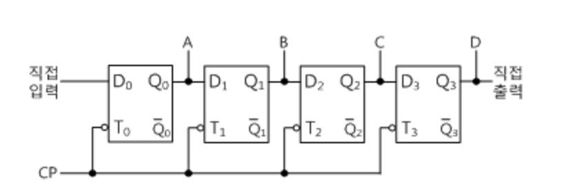
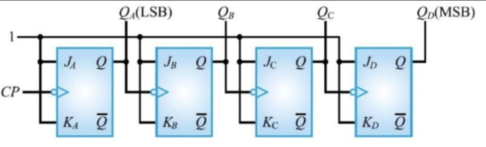
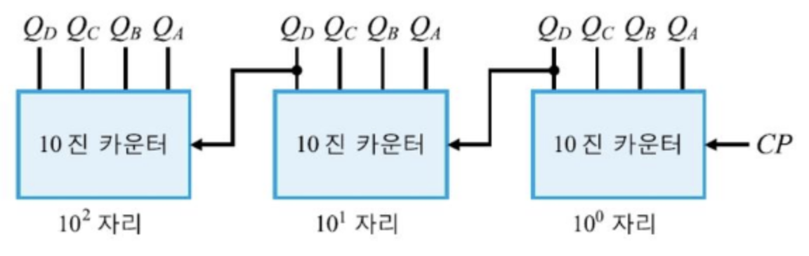

# Digital engineering

## Table of contents

[카운터(Counter)](#카운터counter)

[멀티바이브레이터(Multivibrator)](#멀티바이브레이터multivibrator)

[디지털 논리회로(Digital Logic Circuit)](#디지털-논리회로digital-logic-circuit)

[전자 회로(Electronic Circuit)](#전자-회로electronic-circuit)

---

## 카운터(Counter)

순서 논리회로(Sequential logic circuit)의 한 종류로, 클럭 펄스를 입력받아 미리 정해진 순서대로 상태가 변하는 회로.

### 비동기 카운터(Asynchronous counter)

앞 단의 출력이 다음 단의 클럭이 되는 카운터.

구조가 단순하지만 전파 지연이 발생함.

리플 카운터(Ripple counter)라고도 한다.

### 동기 카운터(Synchronous counter)

모든 플립플롭이 같은 클럭을 동시에 받는 카운터.

지연 문제가 없어 고속 동작에 적합하지만 회로가 복잡함.

### 업 카운터(Up counter)

클럭 펄스마다 상태가 0→1→2→... 순으로 증가하는 카운터.

### 다운 카운터(Down counter)

클럭 펄스마다 상태가 최댓값→...→1→0 순으로 감소하는 카운터.

### 업/다운 카운터(Up/Down counter)

제어 신호에 따라 증가 또는 감소 방향을 선택할 수 있는 카운터.

### MOD-N 카운터(Modulo-N counter)

N개의 상태(0 ~ N-1)를 순환하는 카운터.

예: MOD-10 카운터(십진 카운터)는 0~9를 반복하며, BCD 카운터라고도 불림.

N개의 상태를 표현하려면 플립플롭이 ⌈log₂N⌉개 필요함.

---

## 멀티바이브레이터(Multivibrator)

두 개의 능동소자(트랜지스터 등)를 교차 결합하여 펄스나 구형파를 생성하는 회로.

두 상태 사이를 오가면서 신호를 만들어내는 회로.

**`전통적 의미`**

전통적으로 멀티바이브레이터는 트랜지스터를 교차 결합한 아날로그 회로를 의미함.

현대에서는 더 넓은 의미로 사용됨.

- 트랜지스터뿐만 아니라 **OP-AMP(연산증폭기)**나 555 타이머 IC, 논리 게이트 등으로도 멀티바이브레이터를 구현 가능.

### 비안정 멀티바이브레이터(Astable)

안정 상태가 없이 두 상태를 계속 자동으로 반복함.

외부 트리거 없이 스스로 구형파(클럭 펄스)를 생성. 클럭 발생기, 타이머 등에 사용됨.

### 단안정 멀티바이브레이터(Monostable)

안정 상태가 하나인 바이브레이터.

외부 트리거가 들어오면 일시적으로 다른 상태로 갔다가 일정 시간 후 자동으로 원래 상태로 돌아온다. 타이머, 지연 회로 등에 사용됨.

### 쌍안정 멀티바이브레이터(Bistable)

안정 상태가 두 개인 바이브레이터.

외부 트리거가 있어야만 상태가 변하고, 한번 변하면 다음 트리거가 올 때까지 그 상태를 유지함. 플립플롭이 대표적인 예.

---

## 디지털 논리회로(Digital Logic Circuit)

### 조합 논리회로(Combinational Logic Circuit)

현재 입력만으로 출력이 결정되는 회로.

기억소자(플립플롭)이 없어서 이전 상태를 저장하지 않음.

**`가산기(Adder)`**

이진수 덧셈을 수행.

반가산기(Half Adder)는 캐리 입력이 없고, 전가산기(Full Adder)는 캐리 입력까지 처리.

감산기(Subtractor)

이진수 뺄셈을 수행. 반감산기와 전감산기가 있다.

**`디코더(Decoder)`**

n비트 입력을 받아 2n개 출력 중 하나를 활성화.

메모리 주소 해독 등에 사용됨.

**`인코더(Encoder)`**

2n개 입력 중 활성화된 하나를 n비트 코드로 변환.

키보드 입력 처리 등에 사용됨.

**`멀티플렉서(MUX, Multiplexer)`**

여러 입력 중 하나를 선택하여 출력.

선택 신호(셀렉터)에 따라 어떤 입력이 출력으로 나갈지 결정.

**`디멀티플렉서(DEMUX, Demultiplexer)`**

하나의 입력을 선택 신호에 따라 여러 출력 중 하나로 보냄.

**`비교기(Comparator)`**

두 이진수를 비교하여 크다, 같다, 작다를 판별.

**`코드 변환기`**

BCD를 그레이 코드로, 또는 그레이 코드를 BCD로 변환하는 등 코드 체계를 변환.

### 순서 논리회로(Sequential Logic Circuit)

현재 입력과 이전 상태(기억된 값)에 의해 출력이 결정되는 회로.

플립플롭과 같은 기억 소자가 있어서 이전 상태를 저장하고, 피드백 경로를 통해 그 상태가 다시 입력에 영향을 줌.

**`레지스터(Register)`**

여러 비트의 데이터를 저장하는 플립플롭의 묶음.

**`시프트 레지스터(Shift Register)`**

**`카운터(Counter)`**

클럭 펄스를 세는 회로. 비동기(리플) 카운터와 동기 카운터로 나뉨.

**`비동기식 카운터(리플 카운터, Ripple counter)`**

**`10진 카운터(Decimal counter)`**

**`순서 기계(State Machine)`**

미리 정의된 상태들 사이를 조건에 따라 전이하는 회로.

무어 머신(출력이 현재 상태에만 의존)과 밀리 머신(출력이 현재 상태와 입력 모두에 의존)으로 나뉨.

**`메모리`**

RAM, 레지스터 파일 등 데이터를 저장하는 회로.

## 전자 회로(Electronic Circuit)

### 신호 생성 회로(발진 회로)

특정 파형의 신호를 만들어주는 회로.

**`사인파 발진(Oscillation) 회로`**

사인파(정현파)를 생성.

LC 발진기(인덕터+커패시터), RC 발진기(저항+커패시터), 수정 발진기(크리스탈) 등이 있다.

수정 발진기는 매우 정확한 주파수를 만들어서 CPU 클럭 등에 사용됨.

**`구형파(Square wave) 발진 회로`**

구형파(사각파)를 생성.

비안정 멀티바이브레이터가 대표적이고, 555 타이머 IC로도 구현.

디지털 회로의 클럭 신호 생성에 사용됨.

**`톱니파 발생 회로`**

톱니 모양의 파형을 생성.

CRT 모니터의 수평/수직 주사 등에 사용됨.

### 신호 정형 회로

불규칙하거나 노이즈가 있는 신호를 깨끗하게 정리하는 회로.

**`슈미트 트리거(Schmitt Trigger)`**

**히스테리시스(Hysteresis)** 특성을 이용하여 노이즈가 섞인 아날로그 신호를 깨끗한 디지털 신호(0 또는 1)로 변환.

상한 임계값과 하한 임계값 두 개를 두어 노이즈에 의한 오동작을 방지함.

**`클리퍼(Clipper)`**

신호의 특정 레벨 이상 또는 이하를 잘라내는 회로.

과전압 보호 등에 사용됨.

리미터(Limiter)라고도 불림.

**`클램퍼(Clamper)`**

신호의 DC(Direct current) 레벨을 이동시키는 회로.

파형의 모양은 유지하면서 기준점만 변경.

DC 복원기(DC Restorer)라고도 불림.

### 기억 회로

데이터를 저장하고 유지하는 회로.

**`래치(Latch)`**

가장 기본적인 기억 소자.

외부 신호가 들어오기 전까지 현재 상태를 유지.

클럭 없이 입력 변화에 즉시 반응하는 **레벨 트리거** 방식을 사용.

**`플립플롭(Flip-Flop)`**

래치에 클럭을 추가한 회로.

일반적으로 클럭 엣지(상승 또는 하강)에서만 상태가 변하는 **엣지 트리거** 방식을 사용.

SR, JK, D, T 플립플롭이 있으며 레지스터, 카운터, 메모리의 기본 소자.

### [멀티바이브레이터](#멀티바이브레이터multivibrator)

### 증폭 회로

신호의 크기를 키우는 회로.

**`전압 증폭기`**

전압 신호를 증폭.

**`전력 증폭기`**

전력을 증폭하여 스피커, 모터 등을 구동함.

**`연산 증폭기(OP-AMP, Operational Amplifier)`**

매우 높은 이득을 가진 범용 증폭기.

증폭뿐 아니라 가산기, 비교기, 적분기, 미분기, 필터 등 다양한 회로를 구성할 수 있어서 아날로그 회로의 핵심 소자가 된다.

### 변환 회로

신호의 형태를 바꾸는 회로.

**`ADC(Analog to Digital Converter)`**

아날로그 신호를 디지털 신호로 변환.

센서 값을 마이크로컨트롤러가 읽을 수 있게 해주기 때문에 임베디드에서 매우 중요한 회로가 된다.

**`DAC(Digital to Analog Converter)`**

디지털 신호를 아날로그 신호로 변환.

디지털 오디오를 스피커로 출력할 때 등에 사용됨.

### 전원 회로

전력을 공급하고 관리하는 회로.

**`정류 회로`**

교류(AC, Alternating current)를 직류(DC, Direct current)로 변환.

반파 정류, 전파 정류가 있다.

**`레귤레이터(Regulator)`**

전압을 일정하게 유지하는 회로.

선형(linear) 레귤레이터와 스위칭(switching) 레귤레이터가 있다.
