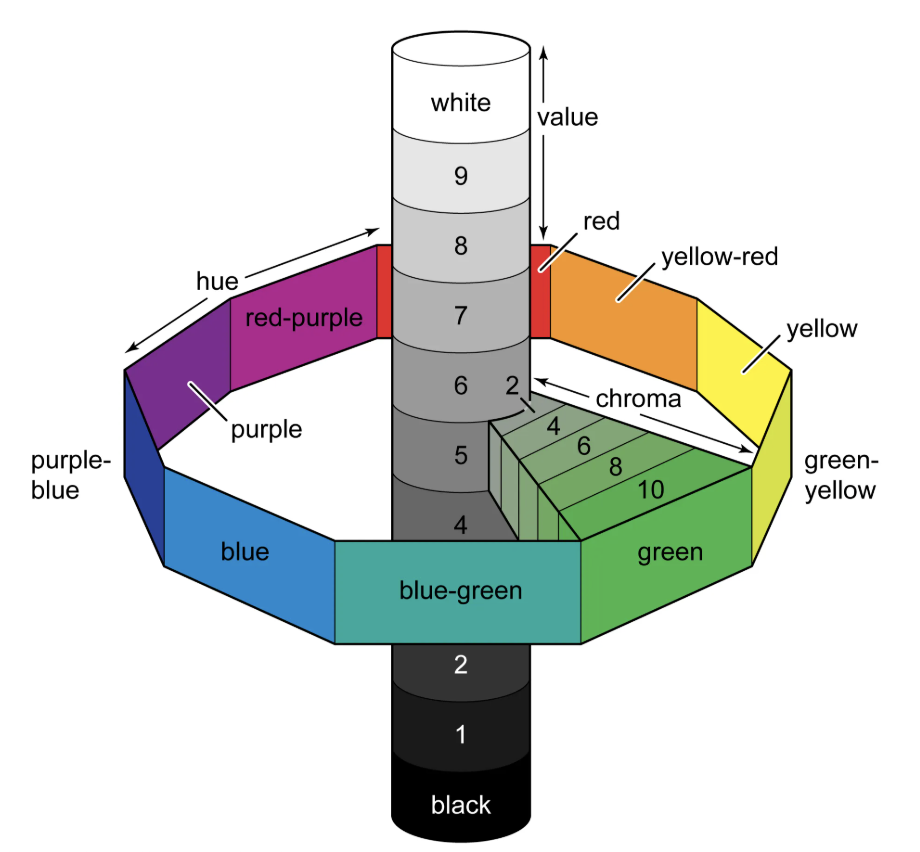

# 색채혼합과 조색

## Table of Contents

[색의 속성](#색의-속성)

[색채혼합 / 가산혼합 / 감산혼합](#색채혼합--가산혼합--감산혼합)

[색채표준의 조건과 역할](#색채표준의-조건과-역할)

---

## 색의 속성

### 색과 색채

색(Color)이란 빛의 스펙트럼에 의해 성질 차이가 생기는 시각적인 감각의 특성이다.

색채란 색이 눈을 통해 지각된 현상 또는 경험 효과를 의미하는 것으로, 물체의 지각을 수반한 심리적 성질을 가진다.

**`색 분류`**

| 분류   | 지각 세포           | 색 종류                               | 색의 속성                            |
| ------ | ------------------- | ------------------------------------- | ------------------------------------ |
| 유채색 | 원추세포(Cone Cell) | 빨강, 주황, 노랑, 초록, 파랑, 보라 등 | 색상(Hue), 명도(Value), 채도(Chroma) |
| 무채색 | 간상세포(Rod Cell)  | 흰색, 회색, 검정                      | 명도(Value)만 존재                   |

**`색의 종류`**

| 종류           | 설명                                                         |
| -------------- | ------------------------------------------------------------ |
| 표면색         | 물체의 표면에서 빛이 반사되어 보이는 색. 일반적인 물체의 색  |
| 투과색         | 빛이 유리, 물, 셀로판 등 반투명한 물체를 통과할 때 보이는 색 |
| 거울색(경영색) | 거울처럼 빛을 반사하는 표면에서 보이는 색                    |
| 금속색         | 금속 표면에서 나타나는 특유의 광택을 지닌 색                 |
| 공간색         | 공기, 안개, 유리컵 속 물 등 공간이나 부피 안에서 지각되는 색 |
| 광원색         | 태양, 전구, 모니터 등 빛을 직접 방출하는 광원에서 보이는 색  |

### 색의 지각과 효과

**`색 관련 지각 효과`**

| 종류                                        | 설명                                                                                        |
| ------------------------------------------- | ------------------------------------------------------------------------------------------- |
| 명암순응                                    | 밝은 환경과 어두운 환경 사이 이동 시 눈이 그 밝기에 적응하는 현상                           |
| 박명시(Mesopic / Twilight Vision)           | 빛의 밝기가 중간 수준일 때 원추세포와 간상세포가 함께 작동하는 상태                         |
| 푸르킨예 현상(Purkinje Phenomenon / Effect) | 어두운 환경에서 파장이 짧은 색(파랑·초록)이 더 밝게, 빨강은 상대적으로 어둡게 보이는 현상   |
| 항상성                                      | 조명 조건이 바뀌어도 물체의 색이 동일하게 지각되는 시지각 특성                              |
| 색순응                                      | 특정 색의 빛에 지속 노출되면 그 색에 대한 시감도가 변화하는 현상                            |
| 연색성                                      | 광원이 물체의 색을 얼마나 자연스럽게 보이게 하는지의 정도. Ra 지수로 나타냄                 |
| 조건등색                                    | 두 색이 특정 광원 아래에서는 같아 보이지만, 다른 광원에서는 다르게 보이는 현상 (메타머리즘) |
| 색음현상                                    | 무채색 물체가 주변 색의 보색으로 물들어 보이는 현상                                         |

**`밝기에 따른 시각 능력`**

| 종류                           | 설명                                                                             |
| ------------------------------ | -------------------------------------------------------------------------------- |
| 명소시(Photopic vision)        | 충분한 밝기의 환경에서 원추세포가 주로 활성화되어 색상과 세부를 지각하는 상태    |
| 간소시(박명시, Mesopic vision) | 빛의 밝기가 중간 수준일 때 원추세포와 간상세포가 함께 작동하는 상태              |
| 암소시(Scotopic vision)        | 매우 어두운 환경에서 간상세포만 활성화되어 명암만 지각하고 색 구별이 어려운 상태 |

**`색 지각설`**

| 종류     | 설명                                                                                                              |
| -------- | ----------------------------------------------------------------------------------------------------------------- |
| 3원색설  | 눈에는 빨강·초록·파랑 3종류의 원추세포가 있으며, 이들의 자극 조합으로 모든 색을 지각한다는 이론 (Young-Helmholtz) |
| 반대색설 | 빨강-초록, 노랑-파랑, 흰색-검정의 3쌍 반대색이 서로 대립하여 색 지각이 이루어진다는 이론 (Hering)                 |

### 색의 3속성

| 종류                      | 설명                                                     |
| ------------------------- | -------------------------------------------------------- |
| 색상(Hue)                 | 색을 구별하는 기본 속성. 빨강, 노랑, 파랑 등 색조의 종류 |
| 명도(Value / Lightness)   | 색의 밝고 어두운 정도. 흰색에 가까울수록 명도가 높음     |
| 채도(Saturation / Chroma) | 색의 선명하고 탁한 정도. 순색에 가까울수록 채도가 높음   |

**`채도의 구분`**

| 구분 | 설명                                                            |
| ---- | --------------------------------------------------------------- |
| 순색 | 어느 색도 혼합되지 않은 가장 선명한 상태의 색. 채도가 가장 높음 |
| 명색 | 순색에 흰색을 혼합하여 밝게 만든 색. 틴트(Tint)                 |
| 암색 | 순색에 검정을 혼합하여 어둡게 만든 색. 셰이드(Shade)            |
| 탁색 | 순색에 회색(또는 보색)을 혼합하여 탁하게 만든 색. 톤(Tone)      |

### 먼셀 표색계(Munsell Color System)

미국의 화가이자 색채 연구가인 Albert H. Munsell은 색의 표시를 위해 색을 삼속성으로 분류하고 이를 기호와 숫자로 체계화하였다.

색의 삼속성(Hue, Value, Chroma)을 HV/C로 축약해서 표시한다. 이를 먼셀기호라고 한다.

- 5R 5/10: 5레벨의 Red 색상, 5레벨의 명도, 10레벨의 채도를 의미한다

- Munsell은 먼셀기호(HV/C)로 표준 20색상을 정의한다.

**`Munsell 색의 3속성`**

| 종류   | 특징                                                                                                                                               |
| ------ | -------------------------------------------------------------------------------------------------------------------------------------------------- |
| Hue    | 색상을 빨강(R), 노랑(Y), 초록(G), 파랑(B), 보라(P)를 기준으로 하여 중간 색을 추가해 10개의 주요 색으로 나누고, 각각을 10단계로 세분화 (총 100단계) |
| Value  | 명도. 완전 흑색(0)부터 완전 백색(10)까지 11단계로 나타냄                                                                                           |
| Chroma | 채도. 무채색 축으로부터의 거리로 표시. 0부터 16까지를 범위로 하며, 멀어질수록 채도 높음                                                            |

**`색상환(Color circle) 색`**

| 종류      | 설명                                                                                              |
| --------- | ------------------------------------------------------------------------------------------------- |
| 유사색    | 색상환에서 서로 인접해 있는 색. 자연스럽고 조화로운 느낌을 줌                                     |
| 보색      | 색상환에서 정반대에 위치한 색. 서로를 가장 선명하게 보이게 하며 강한 대비를 형성                  |
| 근접 보색 | 어떤 색의 보색과 인접한 두 색. 보색보다 부드러운 대비를 형성. 반대색(Antagonistic Color)라고도 함 |

---

## 색채혼합 / 가산혼합 / 감산혼합

### 색채혼합 및 조색

색채혼합은 서로 다른 속성을 가진 색광 또는 색료를 혼합하여 다른 색을 만드는 것을 의미한다.

조색은 특정 목적을 위해 여러 색상을 정확한 비율로 혼합하는 과정으로, 색상의 일관성과 정확성을 유지하는 데 중점을 둔다.

웹디자인 관련 색채 혼합은 가산혼합, 감산혼합, 중간혼합으로 구분된다.

**`가산혼합(가색혼합, 가법혼색)`**

혼합할 수록 밝아지는 색광의 혼합 방식을 의미한다.

| 종류     | 설명                                                                                                 |
| -------- | ---------------------------------------------------------------------------------------------------- |
| 동시가법 | 서로 다른 색광을 같은 시간에 같은 위치에 겹쳐 비추어 혼합하는 방식 (예: 무대 조명, 모니터 RGB)       |
| 병치가법 | 서로 다른 색의 작은 점들을 나란히 배치하여 눈에서 혼합되어 보이게 하는 방식 (예: 모니터 픽셀)        |
| 계시가법 | 서로 다른 색광을 짧은 시간 간격으로 빠르게 교대로 제시하여 혼합되어 보이게 하는 방식 (예: 회전 원판) |

**`감산혼합(감색혼합, 감법혼색)`**

혼합할 수록 어두워지는 색료의 혼합을 의미한다.

일반적으로 Brewster의 삼원색을 혼합하는 방법을 사용하며, 이는 Cyan, Magenta, Yellow색을 기반으로 한다.

CMY색상을 모두 합해도 완벽한 검정색을 표현하지 못하므로 Key를 의미하는 검정색을 추가해서 CMYK색을 사용한다.

**`중간혼합(중간혼색)`**

실제적인 혼합이 아닌, 주변 환경으로부터 착시를 기반한 혼색효과를 말한다.

| 종류     | 설명                                                                                                           |
| -------- | -------------------------------------------------------------------------------------------------------------- |
| 병치혼합 | 서로 다른 색의 작은 점들을 나란히 배치하여 멀리서 볼 때 혼합된 색으로 보이는 방식 (예: 점묘파 회화, 컬러 인쇄) |
| 회전혼합 | 두 가지 이상의 색을 칠한 원판을 빠르게 회전시켜 혼합된 색으로 보이는 방식 (예: 맥스웰 원판)                    |

### 색차 보정

색차(Color Difference)란 두 색 사이의 차이를 수치로 나타낸 것이다. 일반적으로 CIE에서 정의한 **ΔE(Delta E)** 값으로 표현한다.

색차 보정은 색의 3속성(색상·명도·채도)을 기준으로 오차를 확인하고 조정하여, 다양한 환경에서 의도한 색이 일관되게 재현되도록 만드는 과정이다.

**`ΔE(색차) 기준`**

| ΔE 범위  | 의미                                               |
| -------- | -------------------------------------------------- |
| 0 ~ 1    | 사람 눈으로 거의 구분 불가능한 수준                |
| 1 ~ 2    | 매우 민감한 사람만 인식 가능한 차이                |
| 2 ~ 3.5  | 인식 가능한 차이. 일반적으로 허용 가능한 색차 범위 |
| 3.5 이상 | 누구나 명확히 다른 색으로 인식하는 수준            |

**`색차 보정 방법`**

| 보정 대상        | 방법             | 설명                                                               |
| ---------------- | ---------------- | ------------------------------------------------------------------ |
| 색상(Hue)        | 색상환 위치 조정 | 색조가 의도와 다를 경우, 색상환에서 가까운 색을 추가·혼합하여 보정 |
| 명도(Value)      | 밝기 조정        | 흰색 또는 검정을 혼합하여 명도를 높이거나 낮춤                     |
| 채도(Saturation) | 선명도 조정      | 회색·보색을 혼합하여 채도를 낮추거나, 순색을 추가하여 채도를 높임  |

**`색차 보정 과정`**

| 단계            | 내용                                                    |
| --------------- | ------------------------------------------------------- |
| 1. 기준색 설정  | 재현하고자 하는 목표 색(Target Color)을 정의            |
| 2. 현재 색 측정 | 색차계(Colorimeter) 또는 분광광도계로 현재 색을 수치화  |
| 3. 색차 계산    | ΔE 값으로 기준색과 현재 색의 차이를 수치로 확인         |
| 4. 조색 보정    | 색상·명도·채도를 조정하여 ΔE 허용 범위 이내로 맞춤      |
| 5. 재측정·확인  | 보정 후 다시 측정하여 색차가 허용 범위 내에 있는지 확인 |

---

## 색채표준의 조건과 역할

### 색채표준(Color Standard)

색상은 제품 품질, 안전 및 비용에 영향을 미치기 때문에 일관성이 중요하다.

색채표준은 색을 정확하게 계측하고, 재현, 선택, 관리하기 위해 필요하다.

**`색채표준의 조건`**

| 조건           | 설명                                                           |
| -------------- | -------------------------------------------------------------- |
| 실용성         | 실제 산업과 생활 현장에서 쉽게 활용할 수 있어야 함             |
| 재현성         | 동일한 조건에서 언제나 동일한 색을 재현할 수 있어야 함         |
| 국제성         | 국제적으로 통용될 수 있는 공통된 기준을 가져야 함              |
| 규칙성         | 색의 배열과 분류가 일정한 규칙에 따라 체계적으로 구성되어야 함 |
| 기호화         | 색을 숫자나 기호로 명확하게 표현할 수 있어야 함                |
| 과학성         | 색의 측정과 분류가 과학적 원리에 근거해야 함                   |
| 균형성(등보성) | 색 간의 시각적 간격이 균등하게 느껴지도록 배열되어야 함        |

### 색채 표준의 종류

**`현색계(Color Appearance System)`**

현색계란 시각적 감각을 통해 색을 측정하고, 색을 정량적 및 정성적으로 분류하여 정의하는 방법이다.

| 종류                                    | 설명                                                                                                   | 기본 색                                   |
| --------------------------------------- | ------------------------------------------------------------------------------------------------------ | ----------------------------------------- |
| 오스트발트 표색계(Ostwald Color System) | 독일 화학자 Wilhelm Ostwald가 개발. 색상·백색량·흑색량의 3요소로 색을 표현                             | 24색상환 (빨강·노랑·파랑·초록 4원색 기반) |
| NCS 표색계                              | 스웨덴 색채연구소가 개발한 자연색체계(Natural Color System). 인간의 시각적 색지각을 기반으로 색을 표현 | 6색 (White·Black·Yellow·Red·Blue·Green)   |

**`혼색계(Color Mixing System)`**

혼색계란 색체계에서 심리적, 물리적 빛의 혼색 실험 결과를 기초로 색을 정하는 방법이다.

| 종류           | 설명                                                                                                           |
| -------------- | -------------------------------------------------------------------------------------------------------------- |
| CIE 표색계     | 국제조명위원회(CIE)가 정의한 색 체계. 빛의 혼색 실험을 기반으로 모든 색을 XYZ 세 자극값으로 수치화             |
| L\*a\*b 표색계 | CIE에서 정의한 균등 색 공간. L*(명도), a*(적-녹 축), b\*(황-청 축)으로 색을 수치화하며 인간 시각에 가장 가까움 |

- CIE(Commission internationale de l'eclairage): 국제조명위원회
