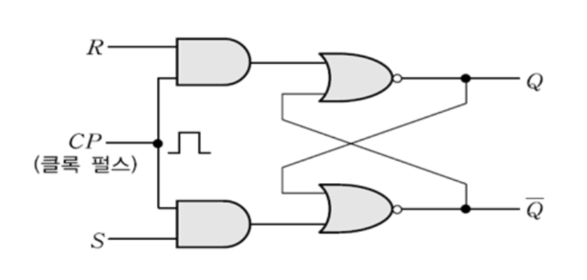
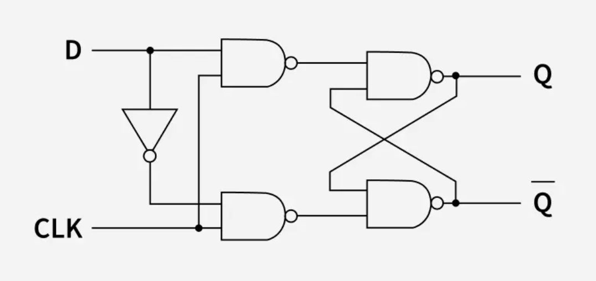
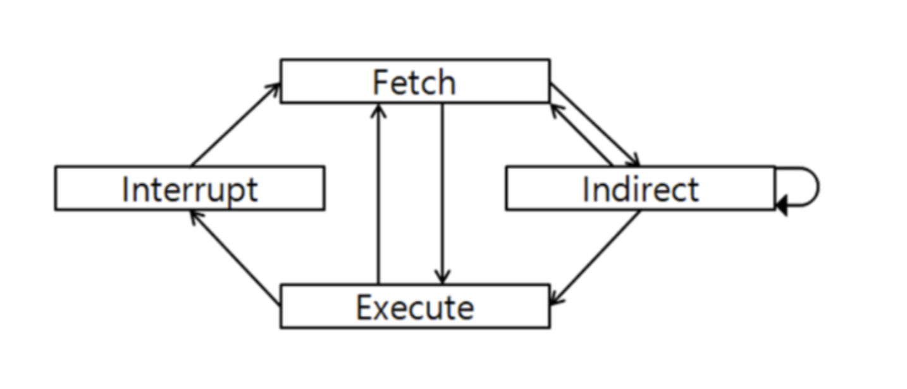
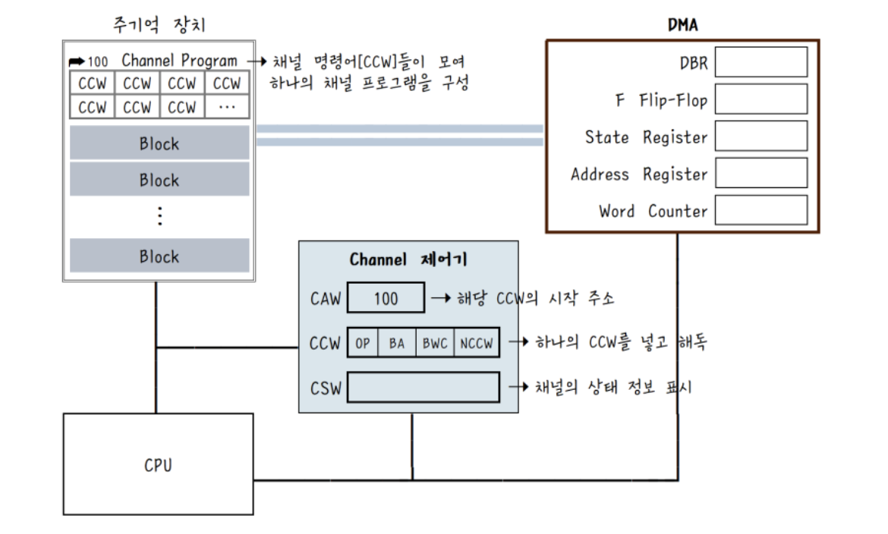

# 임베디드 기능사 필기

## 전기전자공학

### 펄스파형(Pulse waveform)

이상적인 디지털 펄스에서는 High상태와 Low 상태 사이 변화 포인트가 직각 형태로 이루어져 있지만, 실제 파형에서는 High와 Low 상태 사이의 변화가 순간적으로 이루어지지 않는다.

#### 펄스파형 구성 요소(Pulse waveform Components)

상단(Top)

- 펄스가 높은 상태를 유지하는 구간.

하단(Base)

- 펄스가 낮은 상태를 유지하는 구간.

상승 에지(Rising edge)

- 펄스가 하단에서 상단으로 전환되는 부분.

하강 에지(Falling edge)

- 펄스가 상단에서 하단으로 전환되는 부분.

상승 시간(Rise time)

- 펄스 진폭이 10%에서 90%까지 도달하는 데 걸리는 시간.

하강 시간(Fall time)

- 펄스 진폭이 90%에서 10%까지 내려가는 데 걸리는 시간.

오버슈트(Overshoot)

- 펄스가 상승하여 목표값에 도달한 후 목표값을 초과하여 더 높이 올라갔다가 돌아오는 현상.

링잉(Ringing)

- 에지 전환(상승/하강) 이후 목표값 주위로 펄스가 작게 진동하는 현상.

펄스 폭(Pulse width)

- 펄스가 높은 상태를 유지하는 구간의 시간 길이.

- 보통 상승 펄스 단계에서 최대 진폭의 50%에 도달할 때부터 하강 펄스 단계에서 최대 진폭의 50%에 도달할 때까지의 시간을 의미.

언더슈트(Undershoot)

- 펄스 하강시 목표 최저값 도달 후 전압이 밑으로 튀어 목표 최저값보다 일시적으로 낮아지는 현상.

주기(Period)

- High와 Low를 포함한 하나의 완전한 사이클의 시간 길이.

듀티 사이클(Duty cycle)

- 펄스 주기(Period)에서 상승 상태의 비율.

- 펄스 주기가 10ms이고 High 구간이 3ms이면, Duty cycle은 30%.

새그(Sag)

- 펄스 상승 후 출력 전압 레벨이 서서히 낮아지는 현상.

- 일반적으로 축전기(Capacitor)의 축전(충전)으로 인해 양단에 전압차가 생겨서 출력 전압 레벨을 유지하지 못하고 천천히 전압이 낮아짐.

백슈트(Backswing)

- **포스트슈트(Postshoot)** 라고도 불림.

- 펄스 하강 이후, 축전기(Capacitor)에 저장된 전기 에너지로 인한 양단 전압차로 인해 일시적으로 출력 전압이 기준 레벨보다 낮아지는 현상.

- 축전기에 저장된 전압이 모두 소진될 때까지 유지되었다 서서히 정상 레벨로 돌아온다.

## 전자 계산기 구조

### 주소 명령어(Address Instruction)

주소 명령어는 주소를 몇 개 포함하느냐에 따라 구분됨.

주소 명령어는 컴퓨터 구조에서 **레지스터 및 메모리** 연산을 위해 사용됨.

#### 0-주소 명령어(Zero-address Instruction)

주소가 포함되지 않은 명령어.

**스택(stack)** 메모리와 관련된 역할을 수행할 때 사용됨.

```text
Expression: X = (A+B)*(C+D)
Postfixed : X = AB+CD+*
TOP means top of stack
M[X] is any memory location

---------------------------

PUSH A   ->   TOP = A
PUSH B   ->   TOP = B
ADD      ->   TOP = A+B
PUSH C   ->   TOP = C
PUSH D   ->   TOP = D
ADD      ->   TOP = C+D
MUL      ->   TOP = (C+D)*(A+B)
POP X    ->   M[X] = TOP
```

#### 1-주소 명령어(One-address Instruction)

**누산기(Accumulator)** 를 묵시적 피연산자로 사용하고, 나머지 하나의 피연산자 주소만 명령어에 명시하는 방식.

명시된 피연산자의 주소를 참조하여 누산기의 데이터와 함께 연산을 수행.

구조

| 조작부호 (Opcode) |  모드 (Mode)   | 오퍼랜드 / 오퍼랜드 주소 (Operand / Address of Operand) |
| :---------------: | :------------: | :-----------------------------------------------------: |
|    연산 명령어    | 주소 지정 모드 |             피연산자 값 또는 피연산자 주소              |

```text
Expression: X = (A+B)*(C+D)
AC is accumulator
M[] is any memory location
M[T] is temporary location

---------------------------

LOAD A    ->    AC = M[A]
ADD B     ->    AC = AC + M[B]
STORE T   ->    M[T] = AC
LOAD C    ->    AC = M[C]
ADD D     ->    AC = AC + M[D]
MUL T     ->    AC = AC * M[T]
STORE X   ->    M[X] = AC
```

#### 2-주소 명령어(Two-address Instruction)

상용 컴퓨터에서 주로 사용되는 명령어.

목적지 주소(Destination)와 소스 주소(Source) 총 2개를 포함하여 연산을 수행. 연산 결과는 목적지 주소에 저장됨.

구조

| 조작부호 (Opcode) |  모드 (Mode)   |                목적 주소 (Destination address)                 |   소스 주소 (Source address)   |
| :---------------: | :------------: | :------------------------------------------------------------: | :----------------------------: |
|    연산 명령어    | 주소 지정 모드 | 피연산자 주소면서 연산 결과가 저장될 레지스터 또는 메모리 주소 | 피연산자 값 또는 피연산자 주소 |

```text
Expression: X = (A+B)*(C+D)
R1, R2 are registers
M[] is any memory location

---------------------------

MOV R1, A    ->    R1 = M[A]
ADD R1, B    ->    R1 = R1 + M[B]
MOV R2, C    ->    R2 = M[C]
ADD R2, D    ->    R2 = R2 + M[D]
MUL R1, R2   ->    R1 = R1 * R2
MOV X, R1    ->    M[X] = R1
```

#### 3-주소 명령어(Three-address Instruction)

목적지 주소와 피연산자 주소 2개를 포함하여 총 3개의 주소를 포함한 명령어.

하나의 명령어로 두 피연산자와 결과 주소를 모두 지정할 수 있어 프로그램의 명령어 수가 줄어들지만, 명령어 자체의 길이가 길어져 명령 수행 속도가 빨라지지는 않음.

구조

| 조작부호 (Opcode) |  모드 (Mode)   |       목적 주소 (Destination address)        |   소스 주소 (Source address)   |   소스 주소 (Source address)   |
| :---------------: | :------------: | :------------------------------------------: | :----------------------------: | :----------------------------: |
|    연산 명령어    | 주소 지정 모드 | 연산 결과가 저장될 레지스터 또는 메모리 주소 | 피연산자 값 또는 피연산자 주소 | 피연산자 값 또는 피연산자 주소 |

```text
Expression: X = (A+B)*(C+D)
R1, R2 are registers
M[] is any memory location

---------------------------

ADD R1, A, B    ->    R1 = M[A] + M[B]
ADD R2, C, D    ->    R2 = M[C] + M[D]
MUL X, R1, R2   ->    M[X] = R1 * R2
```

---

### 플립플롭(Flip-flop)

1비트를 저장할 수 있는 가장 기본적인 기억 소자.

상태를 기억하는 개념을 하드웨어로 구현한 소자.

레지스터, CPU 내부(AC, PC 등), 캐시, 카운터, 상태 머신 등 장치에 포함되어 쓰인다.

실제로 **D-플립플롭** 이 가장 많이 쓰인다.

---

#### SR 플립플롭(Set-reset Flip-flop)



S(set)와 R(reset) 두 개의 입력으로 상태를 제어하는 가장 기본적인 플립플롭.

**`구조`**

NOR 게이트 2개로 구성(입력 부분 제외)

입력부(R, S), 래치부(NOR)로 구성

**`동작 흐름`**

|  S  |  R  |        Q(t+1)        |
| :-: | :-: | :------------------: |
|  0  |  0  |          Q           |
|  1  |  0  |          1           |
|  0  |  1  |          0           |
|  1  |  1  | undefined(예측 불가) |

**`문제점`**

금지 상태(S=R=1)

- S=R=1 상태를 금지 상태라고 한다.

- 금지 상태 이후 출력 결과는 예측 불가능하다.

---

#### JK 플립플롭(JK Flip-flop)


SR 플립플롭의 금지 상태(S=R=1) 문제를 해결하기 위해 만들어진 플립플롭.

JK의 정확한 의미는 파악되지 않았다.

- 그냥 알파벳 순서로 JK를 붙였다는 설이 가장 유력하다.

**`구조`**

J는 S(set)에 대응하고 K는 R(reset)에 대응한다.

J=K=1 상태에서 기존 출력값을 반전(토글)한다.

입력부(J, K), 래치부(NOR) 외에 **피드백부(Q, Q')** 가 존재하여 입력부로 들어감.

**`동작 흐름(진리표)`**

|  J  |  K  |   Q(t+1)   |
| :-: | :-: | :--------: |
|  0  |  0  |     Q      |
|  1  |  0  |     1      |
|  0  |  1  |     0      |
|  1  |  1  | !Q(toggle) |

**`문제점`**

레이싱(Racing)문제

- J=K=1 상태에서 클럭이 1인 동안 계속 토글이 반복될 수 있다.

- 문제를 해결하기 위해 트리거 방식을 기존 **레벨 트리거(Level trigger)** 방식에서 **엣지 트리거(Edge trigger)** 방식으로 변경할 수 있다. (클럭의 상승/하강 순간에만 반응)

---

#### 주종 JK 플립플롭(Master-slave JK Flip-flop)


기존 JK 플립플롭의 레이싱 문제를 해결하기 위해 만들어짐.

**`구조`**

JK 플립플롭 2개를 직렬로 연결하여, 입력과 연결된 앞 부분을 마스터(master) 플립플롭으로 구분하고, 피드백 부와 연결된 뒷 부분을 종(slave) 플립플롭으로 구분함.

**`동작 방식`**

CLK = 1

- 클럭(clk)이 1인 경우 마스터 플립플롭이 활성화되어 입력값(JK)을 받아들임.

- 종 플립플롭은 비활성화되어 출력 상태(피드백 부)는 변화가 없음.

- 클럭이 1상태를 유지하는 경우 토글이 반복되어 레이싱 문제가 발생했었는데, 피드백과 연결된 종 플립플롭이 입력값을 받아들이지 않으므로 레이싱이 발생하지 않음.

CLK = 0

- 클럭이 0인 경우 마스터 플립플롭이 비활성화되어 입력(JK)을 차단함.

- 종 플립플롭은 활성화되어 마스터 플립플롭의 출력값을 전달함.

**`문제점`**

1s catching 문제

```text
원래 J = 0 이어야 하는데

      J=0 정상        J=0 정상
        ↓               ↓
0V ─────────/\──────────────
            ↑
      순간적으로 5V 튀어오름
      = 회로가 J=1로 인식!
      = 1s catching 발생!
```

- CLK=1 구간에 J에 순간적인 노이즈가 들어와도 마스터가 받아들여버린다.
  - 여기서 노이즈란, J(또는 K) 입력선에 의도치 않게 끼어드는 전기적 잡신호로 인하여 입력값이 1로 오인되는 현상을 말한다.

- 이 문제도 엣지 트리거 방식으로 완전히 해결 가능.

---

#### 엣지 트리거 JK 플립플롭(Edge triggered JK Flip-flop)


1s catching 문제를 해결하기 위해 JK 플립플롭에서 클럭펄스에 **엣지 디텍터(Edge Detector)**를 추가한 플립플롭

**`엣지(펄스) 디텍터(Edge/Pulse Detector)`**


상승(Positive) 엣지 디텍터와, 하강(Negative) 엣지 디텍터로 구분된다.

현재 사진에 표현된 디텍터는 펄스가 상승에서 하강시 딜레이된 출력에 의해 아웃풋이 순간적으로 펄스를 방출하기 때문에 하강 엣지 디텍터다.

**`구조`**

- JK 플립플롭에서 엣지 디텍터가 추가된 구조다.

- 피드백 부에 출력값이 입력부로 연결되는 선이 포함되어 있지만, **클럭 펄스가 순간적으로 발생하기 때문에 피드백 부의 출력값이 입력값에 영향을 줄 시간이 부족하여** 선을 생략하여 표현한다.

---

#### D 플립플롭(Delay/Data Flip-flop)



JK 플립플롭에서 입력값(JK)를 D(Delay/Data)로 통합한 플립플롭.

구조가 간단하고 안정성, 범용성이 높아 현재 실무 표준으로 사용됨.

**`D의 유래`**

D의 의미는 두 가지 설이 있으며, Delay가 원래 의미이고 Data는 확장된 해석이다.

- Delay
  - 입력 D가 클럭 한 박자 늦게 출력 된다는 의미.

- Data
  - 데이터를 저장한다는 의미.

**`구조`**

D 플립플롭은 토글 기능이 필요 없기 때문에 JK 플립플롭의 피드백 선(출력이 입력으로 연결되는 선)이 필요 없다.

기존 구분된 SR입력을 D로 통일하여 한쪽은 NOT 게이트를 통과하여 부정값을 주어서 S=R=1 상태를 완전히 회피.

**`동작 흐름(진리표)`**

|  D  | Q(t+1) | Q'(t+1) |
| :-: | :----: | :-----: |
|  0  |   0    |    1    |
|  1  |   1    |    0    |

---

#### T 플립플롭(Toggle Flip-flop)


JK 플립플롭의 JK 입력을 T(toggle)로 통합하여, T 입력값에 따라 출력을 유지하거나 반전시키는 플립플롭.

**`구조`**

피드백 선

- T 플립플롭의 핵심 동작은 현재 출력을 반전시키는 것이다. 따라서 피드백 선과 입력부의 연결이 필요하다.

T 입력

- JK의 입력을 하나로 묶어서 1개의 동일한 입력 상태로 표현.

**`동작 흐름(진리표)`**

|  T  | Q(t+1) | Q'(t+1) |
| :-: | :----: | :-----: |
|  0  |   Q    |   Q'    |
|  1  |   !Q   |   !Q'   |

---

### 다이오드(Diode)

#### 다이오드 구조


다이오드는 전류를 한쪽 방향으로 흐르게 하는 반도체 부품이다.

이 성질을 이용하여 **교류를 직류로 변환** 하는 정류 회로에 주로 활용된다.

**`Anode / Cathode`**

PN접합을 통해 Anode를 +극 으로 하고, cathode를 -극으로 하여 전류가 흐르게 하는 것을 순방향 특성(순방향 바이어스)이라 한다.

반대로 Anode를 -극으로 하고, cathode를 +극으로 하는 것을 역방향 특성(역방향 바이어스)라고 하며, 이 경우 **전류가 차단** 된다.

**`다이오드 특성 곡선`**


(a) 문턱 전압(Barrier potential)

- 문턱 전압 이하에서는 순방향의 전압이 인가되어도 전류가 흐르지 않고, 문턱 전압 이상의 전압이 걸려야 전류가 흐르게 된다.

- 반도체 물질이 Ge(게르마늄)일 때는 0.2V ~ 0.3V 정도이며, Si(규소 / 실리콘)일 때는 0.5V ~ 0.7V 정도다.

- 오프셋 전압(Offset potential)이라고도 한다.

(b) 벌크 저항(Bulk resistance)

- 다이오드 반도체 자체가 가지고 있는 저항값.

- 문턱 전압 이상의 전압이 인가될 때 이상적으로 저항 없이 같은 크기의 전류가 흘러야 하지만, 반도체 자체의 저항(bulk resistance)으로 인하여 전류 손실이 발생한다.

- 전압 대비 전류의 기울기를 통하여 벌크 저항을 유추할 수 있다.

(c) 역방향 전류(Reverse current)

- 이상적인 다이오드에서는 역방향 전압이 인가될 때 전류가 흐르지 않지만, 실제로는 미세한 역방향 전류가 흐르게 된다.

(d) 항복 전압(Breakdown voltage)

- 실제 다이오드는 역방향으로 차단할 수 있는 전압이 한계가 있으며, 그 기준 전압을 항복 전압이라고 한다.

- 항복 전압을 넘어선 역방향 전압이 인가되면 더 이상 전류를 차단시키지 못하고 역방향으로 전류가 흐르게 된다.

#### 다이오드 논리 게이트(Diode logic gate)


**`(a) OR 게이트`**

(a) 게이트에서 입력 V<sub>A</sub>, V<sub>B</sub>, V<sub>C</sub> 중 하나라도 5V가 걸리면 순방향 바이어스가 걸려서 출력 V<sub>Y</sub>에 이상적으로는 5V, 실제로는 문턱 전압 강하만큼 낮은 전압이 출력된다.

**`(b) AND 게이트`**

(b) 게이트에서 입력 V<sub>A</sub>, V<sub>B</sub>, V<sub>C</sub> 중 하나라도 입력이 0V라면 출력 V<sub>Y</sub>에는 이상적인 결과로 0V가 걸린다.

모든 다이오드 입력에 전압을 주면 다이오드는 역방향 바이어스가 걸려서 전류가 흐르지 않는 상태(opened)가 된다. 따라서 +[Vcc](/embedded/abbreviation.md#vccvoltage-at-the-common-collector)로부터 들어온 전압이 온전하게 출력 V<sub>Y</sub>로 흐를 수 있게 된다.

다이오드에 입력이 하나라도 없으면 +Vcc로부터 들어온 전압이 다이오드에 순방향 바이어스로 걸리게 되어 **전압 강하** 가 발생한다. 따라서 출력 V<sub>Y</sub>에 걸리는 전압은 실제로 5V미만이 걸려 사실상 무의미한 전압이 걸린다.

_실무적으로 다이오드를 이용해서 논리게이트를 표현하는 것은 전력이 비효율적으로 많이 소모되기 때문에 잘 사용하지는 않는다._

---

### 메이저 상태(Major state)

메이저 상태는 현재 CPU가 무엇을 하고 있는가를 나타내는 상태를 말한다.

메이저 상태는 메이저 스테이트 레지스터를 통해서 알 수 있다.

CPU가 메모리에 접근하는 방식에 따라 Fetch, Indirect, Execute, Interrupt 상태로 구분된다.

_`메이저 스테이트 레지스터(Major State Register)는 특정 상용 CPU 모델(예: Intel Core i9, Apple M3 등)에 이름 그대로 들어있는 부품이라기보다, 컴퓨터 구조(Computer Architecture)의 교육적 모델이나 전통적인 논리 설계 방식의 CPU에서 상태를 관리하기 위해 사용하는 개념적인 장치에 가깝다.`_

- 실무와 현대 컴퓨터 구조에서는 [명령 사이클(Instruction Cycle)](https://en.wikipedia.org/wiki/Instruction_cycle)이 더욱 보편적이고 핵심적인 개념이다.

#### 사이클 제어

메이저 스테이트 레지스터의 값은 F, R플립플롭 상태에 따라 결정된다.

|  F  |  R  | 신호 |   상태    |
| :-: | :-: | :--: | :-------: |
|  0  |  0  |  C0  |   Fetch   |
|  0  |  1  |  C0  | Indirect  |
|  1  |  0  |  C0  |  Execute  |
|  1  |  1  |  C0  | Interrupt |

#### 메이저 상태 과정



인출 사이클(Fetch cycle)

- 명령어를 주기억장치에서 중앙처리장치의 명령 레지스터로 가져와 해석하는 단계.

- 가져온 명령어 종류에 따라 indirect 또는 execute 단계로 변천한다.

간접 사이클(Indirect cycle)

- Fetch 단계에서 해석된 명령의 주소부가 간접 주소인 경우 수행된다.

- 명령 주소가 간접 주소이면, 유효 주소를 계산하기 위해 다시 indirect 단계를 수행한다.

- 간접 주소가 아닌 경우에는 명령어 종류에 따라서 Execute 단계 또는 Fetch 단계로 이동할지를 판단한다.

실행 사이클(Execute cycle)

- fetch 단계에서 인출하여 해석한 명령을 실행하는 단계.

- 메이저 상태 레지스터 상태 변화를 감지하여 interrupt 단계로 변천할 것인지를 판단한다.

인터럽트 사이클(Interrupt cycle)

- 인터럽트 발생 시 복귀 주소(PC)를 저장시키고, 제어 순서를 인터럽트 처리 프로그램의 첫 번째 명령으로 옮기는 단계.

- 인터럽트 사이클을 마친 후에는 항상 fetch 단계로 변천한다.

---

### 채널 제어기(Channel controller)

#### 채널(Channel)

주기억 장치와 입출력 장치 사이에서 입출력을 제어하는 입출력 전용 프로세서(IOP).

채널은 **프로세서** 이므로 필요에 따라 자체적으로 질의 수정 또는 코드 변환 등의 기능을 수행할 수 있다.

입출력 수행 중 어떤 에러 조건이 발생하면 CPU에 인터럽트를 걸 수 있다.

**`맥락에 따른 의미`**

컴퓨터 구조에서 I/O 채널은 데이터 전송을 관리하는 별도의 프로세서, 즉 하드웨어 장치를 의미한다.

- **I/O 채널** 은 I/O처리를 전달하는 개념 자체를 말하며, **채널 제어기** 는 I/O채널 개념을 구현한 하드웨어 장치를 강조하는 표현이다.

통신에서의 채널은 데이터가 지나가는 통로, 회선을 의미한다.

#### 구성 요소



Channel Program

- 채널 명령어(CCW)들이 연결 리스트로 연결되어 있는 집합. 주기억 장치에서 프로그램으로 형성됨.

- 채널 제어기에 의해 명령어들이 수행됨.

CAW(Channel Address Word - 채널 주소 단어)

- CCW의 시작 주소를 기억하는 레지스터

CCW(Channel Command Word - 채널 명령어)

- 주기억 장치에 있는 하나의 Block을 입출력하기 위한 정보를 가지고 있는 명령어.

- 채널 제어기에 의해 인출(Fetch)되어 수행된다.

- 구조

  | operation Code | Block Address | Word Count | Next CCW Address |
  | :------------: | :-----------: | :--------: | :--------------: |

  Operation Code
  - 입출력 여부, 분기, 입출력 장치 제어, 채널 동작에 대한 정보를 나타냄

  Block Address
  - Block의 첫 번째 주소

  Block Word Count
  - 입출력하고자 하는 Block의 word 개수

  Next CCW Address
  - 다음 채널 명령어 주소

CSW(Channel Status Word - 채널 상태 단어)

- 입출력 완료 후 채널이 CPU에게 결과를 보고하기 위한 상태 정보를 기억하는 레지스터.

- 입출력 정상 완료 여부, 잔여 word count, 에러 조건 등의 정보를 포함한다.

#### 입출력 장치에 따른 채널의 종류

셀렉터 채널(Selector channel)

- 채널을 하나의 입출력 장치가 독점해서 전용으로 처리하는 방식.

- 고속 전송에 적합한 방식. Disk 장치에 적합.

바이트 멀티플렉서 채널(Byte Multiplexer channel)

- 한 개의 채널에 여러 개의 입출력 장치를 연결해서 시분할 공유(Time share) 방식으로 입출력하는 방식.

- 저속 입출력 방식이다.

- 속도가 느린 장치들을 여러 개 관리할 수 있다. 키보드, 프린터와 같은 느린 장치들을 한 채널에 연결할 때 사용.

블록 멀티플렉서 채널(Block multiplexer channel)

- 하나의 데이터 경로를 공유한다는 점과 고속 I/O 장치를 취급한다는 점에서 셀렉터 채널과 바이트 멀티플렉서 채널 방식을 결합한 형태.

---

### 레지스터(Register)

#### 범용 레지스터(General purpose register)

데이터 레지스터(Data Register)

- 연산에 사용할 데이터를 임시로 저장.

- 누산기(AC)가 대표적으로 DR로 사용됨.

인덱스 레지스터(Index Register)

- 배열이나 반복문에서 인덱스 값을 저장.

- 기준 주솟값에 인덱스 레지스터에 저장된 값을 더해서 배열 요소의 유효 주소를 계산.

베이스 레지스터(Base Register)

- 프로그램이 메모리에 적재된 시작 주소(기준 주소)를 저장.

- 논리 주소에 베이스 레지스터에 저장된 값을 더해서 물리 주소로 **변환** 하는데 사용됨.

#### 특수 목적 레지스터(Special purpose register)

프로그램 카운터(PC, Program Counter)

- 다음에 실행할 ���령어의 메모리 주소를 저장.

- 명령어를 인출할 때마다 자동으로 증가하고, 분기(branch) 명령시 해당 주소로 변경.

명령어 레지스터(IR, Instruction Register)

- 현재 실행중인 명령어를 저장.

- 메모리에서 인출(Fetch)한 명령어가 IR로 들어오고 제어장치가 해독(decode)함.

메모리 주소 레지스터(MAR, Memory Address Register)

- CPU가 접근하려는 메모리 주소를 저장함.

- 메모리에 I/O 요청을 보낼 때 MAR 값이 주소 버스로 나감.

메모리 버퍼 레지스터(MBR, Memory Buffer Register)

- 메모리에서 읽어온 데이터 또는 메모리에 쓸 데이터를 임시 저장.

- MDR(Memory Data Register)라고도 불림.

스택 포인터(SP, Stack Pointer)

- 현재 스택의 최상위(top) 주소를 가리킴.

- 함수 호출, 복귀, interrupt 처리시 데이터를 push/pop할 때 사용됨.

상태 레지스터(PSR/Flag Register)

- ALU(Arithmetic Logic Unit) 연산 결과의 상태를 비트별로 저장함.

- 대표적인 플래그로는 Zero(결과가 0), Carry(자리 올림 발생), Overflow, Sign(부호) 등이 있다.

시퀀스 카운터(SC, Sequence Counter)

- 제어장치에서 마이크로 연산의 순서를 제어하는데 사용됨.

- 각 명령어의 실행 단계를 순차적으로 진행할 때 사용됨.

---

### 명령어(Instruction)

#### 데이터 전송 명령어

데이터를 이동시키는 명령어

| 명령어 | 설명                                  |
| :----: | :------------------------------------ |
|  load  | 메모리에서 레지스터로 데이터를 읽어옴 |
| store  | 레지스터의 데이터를 메모리에 씀       |
|  move  | 레지스터 간 데이터를 복사             |
|  push  | 스택에 데이터를 쌓음 (SP 감소)        |
|  pop   | 스택에서 데이터를 꺼냄 (SP 증가)      |

#### 연산 명령어

산술/논리 연산을 수행하는 명령어

| 명령어 | 설명                   |
| :----: | :--------------------- |
|  add   | 두 값을 더함           |
|  sub   | 두 값을 뺌             |
|  and   | 비트 AND 연산          |
|   or   | 비트 OR 연산           |
|  set   | 지정한 비트를 1로 설정 |

#### 제어 명령어

프로그램의 실행 흐름을 변경하는 명령어

| 명령어 | 설명                                       |
| :----: | :----------------------------------------- |
|  jump  | 지정한 주소로 **무조건** 이동              |
| branch | 조건에 따라 지정한 주소로 이동 (조건 분기) |
|  call  | 현재 PC를 저장하고 서브루틴으로 이동       |
| return | 저장된 PC로 복귀                           |

#### 입출력 명령어

CPU와 외부 입출력 장치 사이에서 데이터를 전송하는 명령어

| 명령어 | 설명                                          |
| :----: | :-------------------------------------------- |
|   IN   | 입출력 장치에서 데이터를 읽어 레지스터에 저장 |
|  OUT   | 레지스터의 데이터를 입출력 장치로 전송        |

#### 주소 지정 방식(Addressing mode)

명령어에서 피연산자(operand)의 실제 위치(유효 주소)를 결정하는 방식.

간접 사이클(Indirect cycle)은 이 중 간접 주소 방식일 때만 수행된다.

즉시 주소 지정(Immediate addressing)

- 명령어 자체에 피연산자 값이 포함되어 있음.

- 메모리 접근 없이 빠르게 처리되지만, 표현 가능한 값의 범위가 명령어 길이에 제한됨.

- 예: `LOAD #5` → 레지스터에 값 5를 바로 적재.

직접 주소 지정(Direct addressing)

- 명령어의 주소부가 피연산자가 저장된 메모리 주소를 직접 나타냄.

- 예: `LOAD 100` → 메모리 100번지의 값을 읽어옴.

간접 주소 지정(Indirect addressing)

- 명령어의 주소부가 피연산자의 주소를 담고 있는 메모리 주소를 가리킴. 즉, 주소의 주소.

- 메모리를 두 번 접근해야 하므로 속도가 느리지만, 넓은 주소 공간을 표현할 수 있음.

- 이 방식일 때 간접 사이클(Indirect cycle)이 수행됨.

레지스터 주소 지정(Register addressing)

- 피연산자가 메모리가 아닌 레지스터에 있음.

- 메모리 접근이 없어 가장 빠름.

- 예: `LOAD R1` → 레지스터 R1의 값을 읽어옴

레지스터 간접 주소 지정(Register indirect addressing)

- 레지스터에 저장된 값을 메모리 주소로 사용함.

- 예: `LOAD (R1)` → R1이 가리키는 메모리 주소의 값을 읽어옴

변위 주소 지정(Displacement addressing)

- 기준 주소(레지스터 값)에 명령어의 변위(offset)를 더해 유효 주소를 계산함.

- 베이스 레지스터 방식, 인덱스 레지스터 방식, 상대 주소 방식이 이에 해당함.

|      방식       |      기준       | 설명                                                    |
| :-------------: | :-------------: | :------------------------------------------------------ |
| 베이스 레지스터 | 베이스 레지스터 | 프로그램의 메모리 적재 시작 주소 기준. 재배치에 사용    |
| 인덱스 레지스터 | 인덱스 레지스터 | 배열 순회 등 반복 접근에 사용                           |
|    상대 주소    |       PC        | PC 기준으로 분기 목적지를 표현. branch 명령에 주로 사용 |

---

## 프로그래밍 일반

### 운영체제 성능 평가 기준

처리량(Throughput)

- 단위시간당 처리하는 작업의 양.

반환 시간(Turn Around Time)

- 작업 요청으로부터 완료까지 걸리는 시간.

응답 시간(Response Time)

- 요청 후 **첫 번째 응답** 이 올 때까지의 시간.

신뢰도(Reliability)

- 시스템이 오류 없이 정상 동작하는 정도.

가용성(Availability)

- 시스템을 사용할 수 있는 시간의 비율.

- `가용성 = 가동 시간 / (가동 시간 + 비가동 시간)`

---

### 프로그램 실행 장치

#### 컴파일러(Compiler)

고급 언어로 작성된 소스 코드를 저급 언어(어셈블리어 또는 오브젝트 코드)로 번역.

소스 코드 전체를 한꺼번에 번역한 후 실행하는 방식입니다.

**`처리 과정`**

어휘 분석 → 구문 분석 → 의미 분석 → 중간 코드 생성 → 코드 최적화 → 목적 코드 생성

**`관련 개념`**

인터프리터(Interpreter)

- 소스 코드를 한 줄씩 번역하면서 바로 실행.

- 컴파일러와 달리 목적 파일을 생성하지 않고, 실행 속도는 느리지만 즉시 실행. Python, JavaScript 등이 대표적.

크로스 컴파일러(Cross Compiler)

- 현재 사용하는 컴퓨터와 다른 플랫폼에서 실행될 코드를 생성하는 컴파일러. 임베디드 개발에서 자주 사용됨.

- PC에서 컴파일해서 ARM 보드에서 실행하는 경우가 대표적입니다.

프리프로세서(Preprocessor)

- 컴파일 전에 매크로 치환, 헤더 파일 포함 등의 전처리를 수행.

- C언어의 #include, #define 처리가 이에 해당.

#### 어셈블러(Assembler)

어셈블리어를 기계어(object code)로 변환.

어셈블리 명령어와 기계어가 거의 1:1 대응되기 때문에 컴파일러보다 변환이 단순함.

**`어셈블러 종류`**

단일 패스 어셈블러(One-pass Assembler)

- 소스 코드를 한 번만 읽어서 번역.

- 속도가 빠르지만 전방 참조 문제(forward reference problem)가 있어 처리에 제한이 있다.

2패스 어셈블러(Two-pass Assembler)

- 소스 코드를 두 번 읽어 번역.

- 1패스에서 심볼 테이블을 만들고, 2패스에서 실제 기계어로 번역.

- 전방 참조 문제를 해결할 수 있어 가장 일반적으로 사용됩니다.

크로스 어셈블러(Cross Assembler)

- 크로스 컴파일러와 같은 개념으로, 다른 플랫폼용 기계어를 생성.

#### 링커(Linker)

여러 개의 오브젝트 파일과 라이브러리를 하나의 실행 파일로 결합.

각 모듈에서 참조하는 외부 함수나 변수의 주소를 연결해주는 역할을 수행

**`링킹 방식`**

정적 링킹(Static Linking)

- 컴파일 시점에 라이브러리 코드를 실행 파일에 직접 포함시키는 방식.

- 실행 파일 크기가 커지지만 독립적으로 실행 가능.

동적 링킹(Dynamic Linking)

- 프로그램 실행 시점에 라이브러리를 연결하는 방식.

- 실행 파일 크기가 작고 메모리를 절약할 수 있지만, 실행 시 해당 라이브러리가 있어야 함.

- Windows의 DLL, Linux의 .so 파일이 대표적.

#### 로더(Loader)

실행 파일을 메모리에 적재하여 실행 가능한 상태로 만듭니다.

**`기본 기능`**

Allocation(할당)

- 프로그램을 올릴 메모리 공간 확보.

Linking(링킹)

- 여러 오브젝트 모듈 간의 외부 심볼 참조를 연결. 링커가 이미 수행했더라도 로더 단계에서 최종 주소 기반으로 재연결이 필요할 수 있음.

Loading(적재)

- 실제로 메모리에 올림

**`로더 종류`**

절대 로더(Absolute Loader)

- 프로그래머가 지정한 절대 주소에 프로그램을 적재.

- Loading만 수행하고, Allocation과 Linking은 프로그래머가 직접 해야 함. 가장 단순하지만 유연성이 떨어짐.

재배치 로더(Relocating Loader)

- 프로그램을 메모리의 어느 위치에든 적재할 수 있는 방식.

- 상대 주소를 사용하여 적재 시점에 실제 주소로 변환.

- Allocation과 Loading을 수행.

직접 연결 로더(Direct Linking Loader)

- Allocation, Linking, Loading을 모두 수행하는 가장 일반적인 로더.

- 여러 모듈을 연결하면서 메모리에 적재할 수 있습니다.

동적 적재 로더(Dynamic Loading Loader)

- 프로그램 전체를 한꺼번에 올리지 않고, 실행 중에 필요한 부분만 메모리에 적재.

- 메모리를 효율적으로 사용할 수 있습니다.

## 디지털 공학

### 카운터(Counter)

순서 논리회로(Sequential logic circuit)의 한 종류로, 클럭 펄스를 입력받아 미리 정해진 순서대로 상태가 변하는 회로.

**`카운터 종류`**

비동기 카운터(Asynchronous counter)

- 앞 단의 출력이 다음 단의 클럭이 되는 카운터.

- 구조가 단순하지만 전파 지연이 발생함.

- 리플 카운터(Ripple counter)라고도 한다.

동기 카운터(Synchronous counter)

- 모든 플립플롭이 같은 클럭을 동시에 받는 카운터.

- 지연 문제가 없어 고속 동작에 적합하지만 회로가 복잡함.

업 카운터(Up counter)

- 클럭 펄스마다 상태가 0→1→2→... 순으로 증가하는 카운터.

다운 카운터(Down counter)

- 클럭 펄스마다 상태가 최댓값→...→1→0 순으로 감소하는 카운터.

업/다운 카운터(Up/Down counter)

- 제어 신호에 따라 증가 또는 감소 방향을 선택할 수 있는 카운터.

MOD-N 카운터(Modulo-N counter)

- N개의 상태(0 ~ N-1)를 순환하는 카운터.

- 예: MOD-10 카운터(십진 카운터)는 0~9를 반복하며, BCD 카운터라고도 불림.

- N개의 상태를 표현하려면 플립플롭이 ⌈log₂N⌉개 필요함.

---

### 멀티바이브레이터(Multivibrator)

두 개의 능동소자(트랜지스터 등)를 교차 결합하여 펄스나 구형파를 생성하는 회로.

두 상태 사이를 오가면서 신호를 만들어내는 회로.

**`전통적 의미`**

전통적으로 멀티바이브레이터는 트랜지스터를 교차 결합한 아날로그 회로를 의미함.

현대에서는 더 넓은 의미로 사용됨.

- 트랜지스터뿐만 아니라 **OP-AMP(연산증폭기)**나 555 타이머 IC, 논리 게이트 등으로도 멀티바이브레이터를 구현 가능.

**`종류`**

비안정 멀티바이브레이터(Astable)

- 안정 상태가 없이 두 상태를 계속 자동으로 반복함.

- 외부 트리거 없이 스스로 구형파(클럭 펄스)를 생성. 클럭 발생기, 타이머 등에 사용됨.

단안정 멀티바이브레이터(Monostable)

- 안정 상태가 하나인 바이브레이터.

- 외부 트리거가 들어오면 일시적으로 다른 상태로 갔다가 일정 시간 후 자동으로 원래 상태로 돌아옵니다. 타이머, 지연 회로 등에 사용됨.

쌍안정 멀티바이브레이터(Bistable)

- 안정 상태가 두 개인 바이브레이터.

- 외부 트리거가 있어야만 상태가 변하고, 한번 변하면 다음 트리거가 올 때까지 그 상태를 유지합니다. 플립플롭이 대표적인 예.

---

### 디지털 논리회로(Digital Logic Circuit)

#### 조합 논리회로(Combinational Logic Circuit)

현재 입력만으로 출력이 결정되는 회로.

기억소자(플립플롭)이 없어서 이전 상태를 저장하지 않음.

**`종류`**

가산기(Adder)

- 이진수 덧셈을 수행.

- 반가산기(Half Adder)는 캐리 입력이 없고, 전가산기(Full Adder)는 캐리 입력까지 처리.

감산기(Subtractor)

- 이진수 뺄셈을 수행. 반감산기와 전감산기가 있다.

디코더(Decoder)

- n비트 입력을 받아 2<sup>n</sup>개 출력 중 하나를 활성화.

- 메모리 주소 해독 등에 사용됨.

인코더(Encoder)

- 2<sup>n</sup>개 입력 중 활성화된 하나를 n비트 코드로 변환.

- 키보드 입력 처리 등에 사용됨.

멀티플렉서(MUX, Multiplexer)

- 여러 입력 중 하나를 선택하여 출력.

- 선택 신호(셀렉터)에 따라 어떤 입력이 출력으로 나갈지 결정.

디멀티플렉서(DEMUX, Demultiplexer)

- 하나의 입력을 선택 신호에 따라 여러 출력 중 하나로 보냄.

비교기(Comparator)

- 두 이진수를 비교하여 크다, 같다, 작다를 판별.

코드 변환기

- BCD를 그레이 코드로, 또는 그레이 코드를 BCD로 변환하는 등 코드 체계를 변환합니다.

#### 순서 논리회로(Sequential Logic Circuit)

현재 입력과 이전 상태(기억된 값)에 의해 출력이 결정되는 회로.

플립플롭과 같은 기억 소자가 있어서 이전 상태를 저장하고, 피드백 경로를 통해 그 상태가 다시 입력에 영향을 줌.

**`종류`**

레지스터(Register)

- 여러 비트의 데이터를 저장하는 플립플롭의 묶음.

카운터(Counter)

- 클럭 펄스를 세는 회로. 비동기(리플) 카운터와 동기 카운터로 나뉨.

순서 기계(State Machine)

- 미리 정의된 상태들 사이를 조건에 따라 전이하는 회로.

- 무어 머신(출력이 현재 상태에만 의존)과 밀리 머신(출력이 현재 상태와 입력 모두에 의존)으로 나뉨.

메모리

- RAM, 레지스터 파일 등 데이터를 저장하는 회로.

### 전자 회로(Electronic Circuit)

#### 신호 생성 회로(발진 회로)

특정 파형의 신호를 만들어내는 회로.

**`종류`**

사인파 발진(Oscillation) 회로

- 사인파(정현파)를 생성.

- LC 발진기(인덕터+커패시터), RC 발진기(저항+커패시터), 수정 발진기(크리스탈) 등이 있다.

- 수정 발진기는 매우 정확한 주파수를 만들어서 CPU 클럭 등에 사용됩니다.

구형파(Square wave) 발진 회로

- 구형파(사각파)를 생성.

- 비안정 멀티바이브레이터가 대표적이고, 555 타이머 IC로도 구현.

- 디지털 회로의 클럭 신호 생성에 사용됩니다.

톱니파 발생 회로

- 톱니 모양의 파형을 생성합니다.

- CRT 모니터의 수평/수직 주사 등에 사용됨.

#### 신호 정형 회로

불규칙하거나 노이즈가 있는 신호를 깨끗하게 정리하는 회로.

**`종류`**

슈미트 트리거(Schmitt Trigger)

- **히스테리시스(Hysteresis)** 특성을 이용하여 노이즈가 섞인 아날로그 신호를 깨끗한 디지털 신호(0 또는 1)로 변환.

- 상한 임계값과 하한 임계값 두 개를 두어 노이즈에 의한 오동작을 방지합니다.

클리퍼(Clipper)

- 신호의 특정 레벨 이상 또는 이하를 잘라내는 회로.

- 과전압 보호 등에 사용됩니다.

- 리미터(Limiter)라고도 불림

클램퍼(Clamper)

- 신호의 DC(Direct current) 레벨을 이동시키는 회로.

- 파형의 모양은 유지하면서 기준점만 바꿉니다.

- DC 복원기(DC Restorer)라고도 불림

#### 기억 회로

데이터를 저장하고 유지하는 회로입니다.

**`종류`**

래치(Latch)

- 가장 기본적인 기억 소자.

- 외부 신호가 들어오기 전까지 현재 상태를 유지.

- 클럭 없이 입력 변화에 즉시 반응하는 **레벨 트리거** 방식입니다.

플립플롭(Flip-Flop)

- 래치에 클럭을 추가한 회로.

- 일반적으로 클럭 엣지(상승 또는 하강)에서만 상태가 변하는 **엣지 트리거** 방식을 사용.

- SR, JK, D, T 플립플롭이 있으며 레지스터, 카운터, 메모리의 기본 소자입니다.

#### [멀티바이브레이터](#멀티바이브레이터multivibrator)

#### 증폭 회로

신호의 크기를 키우는 회로.

**`종류`**

전압 증폭기

- 전압 신호를 증폭.

전력 증폭기

- 전력을 증폭하여 스피커, 모터 등을 구동합니다.

연산 증폭기(OP-AMP, Operational Amplifier)

- 매우 높은 이득을 가진 범용 증폭기.

- 증폭뿐 아니라 가산기, 비교기, 적분기, 미분기, 필터 등 다양한 회로를 구성할 수 있어서 아날로그 회로의 핵심 소자가 된다.

#### 변환 회로

신호의 형태를 바꾸는 회로입니다.

**`종류`**

ADC(Analog to Digital Converter)

- 아날로그 신호를 디지털 신호로 변환.

- 센서 값을 마이크로컨트롤러가 읽을 수 있게 해주기 때문에 임베디드에서 매우 중요한 회로가 된다.

DAC(Digital to Analog Converter)

- 디지털 신호를 아날로그 신호로 변환.

- 디지털 오디오를 스피커로 출력할 때 등에 사용됩니다.

#### 전원 회로

전력을 공급하고 관리하는 회로입니다.

**`종류`**

정류 회로

- 교류(AC, Alternating current)를 직류(DC, Direct current)로 변환.

- 반파 정류, 전파 정류가 있다.

레귤레이터(Regulator)

- 전압을 일정하게 유지.

- 선형(linear) 레귤레이터와 스위칭(switching) 레귤레이터가 있다.
